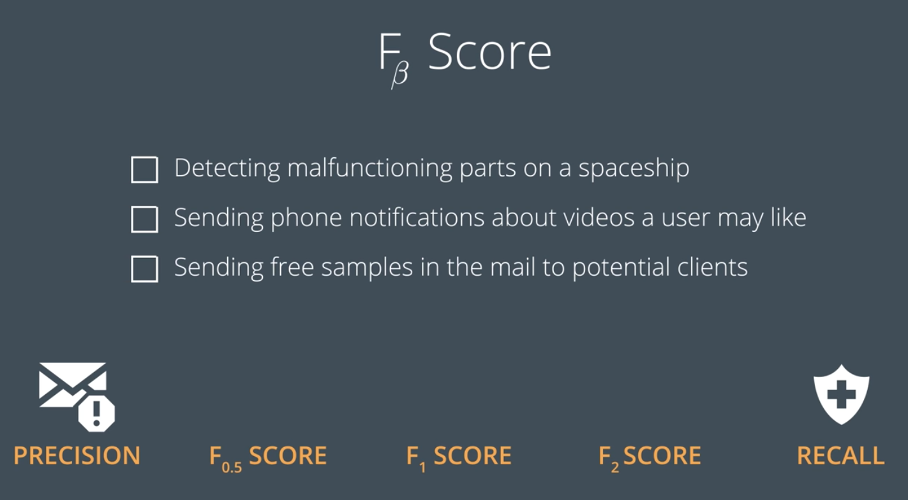

* 目录
 {:toc  }
# 机器学习基础

## 一、训练与测试基础

### 1.简介

#### 视频

<video id="video" controls="" preload="none" style="width:100%; height:100%; object-fit: fill">
    <source id="mp4" src="/assets/media/uda-ml/trainandtest/1-1-intro.mp4" type="video/mp4">
    <track label="both" kind="subtitles" chapters metadata srclang="both" src="/assets/media/uda-ml/trainandtest/1-1-both.vtt">
    <track label="中文字幕" kind="subtitles" chapters metadata srclang="zh" src="/assets/media/uda-ml/trainandtest/1-1-intro.vtt" default>
    <track label="en" kind="subtitles" chapters metadata srclang="de" src="/assets/media/uda-ml/trainandtest/1-1-lang_en.vtt">
</video>


#### 笔记

- 简单介绍了机器学习相关的一些知识


### 2.概述

#### 视频

<video id="video" controls="" preload="none" style="width:100%; height:100%">
    <source id="mp4" src="/assets/media/uda-ml/trainandtest/2-1.mp4" type="video/mp4">
    <track label="both" kind="subtitles" chapters metadata srclang="both" src="/assets/media/uda-ml/trainandtest/2-1-both.vtt">
    <track label="中文字幕" kind="subtitles" chapters metadata srclang="zh" src="/assets/media/uda-ml/trainandtest/2-1-zh.vtt" default>
    <track label="en" kind="subtitles" chapters metadata srclang="de" src="/assets/media/uda-ml/trainandtest/2-1-en.vtt">
</video>


#### 笔记

- 这个视频讲解了，什么是机器学习。给定一个问题和解决这个问题的一些工具（机器的学习模型），并给解决这个问题使用的方法的效果的评分标准（度量工具）。

### 3.统计学知识复习

​	在这节课，我们将假设你熟悉以下统计学概念，例如**均值**、**中值**、**方差**等。如果你觉得学习这些知识已经有一段时间了，需要复习下，建议你查看课外部分的一些视频和练习。

1. 居中趋势测量：均值、中值、众数。

2. 数据的离散性：四分位距法、异常值、标准偏差、贝塞尔修正。

- 均值：
- 中值：
- 众数：
- 四分位距法：
- 异常值：
- 标准偏差：
- 贝塞尔修正：

### 4.在Pandas中加载数据

```python
import pandas
# TODO: Use pandas to read the '2_class_data.csv' file, and store it in a variable called 'data'.
data = pandas.read_csv("2_class_data.csv")

```

### 5.Numpy数组

​	我们已经在 Pandas 中加载数据，现在需要将输入和输出拆分为 numpy 数组，以便在 scikit-learn 中应用分类器。方法如下：假设有个 pandas 数据框 `df`，如下所示，有四个列，分别标为 `A`、`B`、`C`、`D`：


如果我们想要提取列"A",则执行以下操作：

```
>> df['A']
    0    1
    1    5
    2    9
    Name: A, dtype: int64
```

现在，如果我们希望获取跟多的列，则执行以下操作：

```
df[['B','D']]
```


- 下面的索引是联系代码：

- ```python
  import pandas as pd
  import numpy as np
  
  data = pd.read_csv("data.csv")
  
  # TODO: Separate the features and the labels into arrays called X and y
  
  X = np.array(data[['x1', 'x2']])
  y = np.array(data['y'])
  ```

- [ipynb](../assets/media/uda-ml/code/numpy/numpy.ipynb)


### 6. 在sklearn中训练模型

```
# import statements for the classification algorithms
from sklearn.linear_model import LogisticRegression
from sklearn.tree import DecisionTreeClassifier
from sklearn.svm import SVC

# Logistic Regression Classifier
classifier = LogisticRegression()
classifier.fit(X,y)

# Decision Tree Classifier
classifier = DecisionTreeClassifier()
classifier.fit(X,y)

# Support Vector Machine Classifier
classifier = SVC()
classifier.fit(X,y)
```


[sklearn](../assets/media/uda-ml/code/sklearn/sklearn.html)

### 7. 手动调整参数

- SVC 的有如下参数：

- > - Kernal: `linear`线性，`poly`多项式，`rbf`高斯核
  > - degree：多项式核的次数（如果选择了多项式）
  > - gamma:`r`参数
  > - C：`c`参数

具体的参考代码如下：[sklearn](../assets/media/uda-ml/code/sklearn1/sklearn.html)

### 8. 自动调整参数

#### 视频

<video id="video" controls="" preload="none" style="width:100%; height:100%">
    <source id="mp4" src="/assets/media/uda-ml/trainandtest/3-1.mp4" type="video/mp4">
    <track label="both" kind="subtitles" chapters metadata srclang="both" src="/assets/media/uda-ml/trainandtest/3-1-both.vtt">
    <track label="中文字幕" kind="subtitles" chapters metadata srclang="zh" src="/assets/media/uda-ml/trainandtest/3-1-zh.vtt" default>
    <track label="en" kind="subtitles" chapters metadata srclang="de" src="/assets/media/uda-ml/trainandtest/3-1-en.vtt">
</video>


### 9. 测试你的模型

#### 视频

<video id="video" controls="" preload="none" style="width:100%; height:100%">
    <source id="mp4" src="/assets/media/uda-ml/trainandtest/4-1.mp4" type="video/mp4">
    <track label="both" kind="subtitles" chapters metadata srclang="both" src="/assets/media/uda-ml/trainandtest/4-1-both.vtt">
    <track label="中文字幕" kind="subtitles" chapters metadata srclang="zh" src="/assets/media/uda-ml/trainandtest/4-1-zh.vtt" default>
    <track label="en" kind="subtitles" chapters metadata srclang="de" src="/assets/media/uda-ml/trainandtest/4-1-en.vtt">
</video>


### 10 练习：在sklearn中进行测试

- 在sklearn中使用`train_test_split`命令。该函数获得输入`X`,`y`。然后返回四项内容：

- > - `X_train`:训练输入数据
  > - `X_test`:测试输入数据
  > - `y_train`:训练标签
  > - `y_test`:测试标签


```python
from sklearn.model_selection import train_test_split
X_train, X_test, y_train, y_test = train_test_split(X, y, test_size = 0.25)
```


## 二、评估指标

### 1、混淆矩阵

<video id="video" controls="" preload="none" style="width:100%; height:100%; object-fit: fill">
    <source id="mp4" src="/assets/media/uda-ml/evaluationindex/1-1.mp4" type="video/mp4">
    <track label="both" kind="subtitles" chapters metadata srclang="both" src="/assets/media/uda-ml/evaluationindex/1-1-both.vtt">
    <track label="中文字幕" kind="subtitles" chapters metadata srclang="zh" src="/assets/media/uda-ml/evaluationindex/1-1-zh.vtt" default>
    <track label="en" kind="subtitles" chapters metadata srclang="de" src="/assets/media/uda-ml/evaluationindex/1-1-en.vtt">
</video>


### 2、混淆矩阵答案

<video id="video" controls="" preload="none" style="width:100%; height:100%; object-fit: fill">
    <source id="mp4" src="/assets/media/uda-ml/evaluationindex/2-1.mp4" type="video/mp4">
    <track label="both" kind="subtitles" chapters metadata srclang="both" src="/assets/media/uda-ml/evaluationindex/2-1-both.vtt">
    <track label="中文字幕" kind="subtitles" chapters metadata srclang="zh" src="/assets/media/uda-ml/evaluationindex/2-1-zh.vtt" default>
    <track label="en" kind="subtitles" chapters metadata srclang="de" src="/assets/media/uda-ml/evaluationindex/2-1-en.vtt">
</video>


<video id="video" controls="" preload="none" style="width:100%; height:100%; object-fit: fill">
    <source id="mp4" src="/assets/media/uda-ml/evaluationindex/3-1.mp4" type="video/mp4">
    <track label="both" kind="subtitles" chapters metadata srclang="both" src="/assets/media/uda-ml/evaluationindex/3-1-both.vtt">
    <track label="中文字幕" kind="subtitles" chapters metadata srclang="zh" src="/assets/media/uda-ml/evaluationindex/3-1-zh.vtt" default>
    <track label="en" kind="subtitles" chapters metadata srclang="de" src="/assets/media/uda-ml/evaluationindex/3-1-en.vtt">
</video>

### 3、 准确率

<video id="video" controls="" preload="none" style="width:100%; height:100%; object-fit: fill">
    <source id="mp4" src="/assets/media/uda-ml/evaluationindex/4-1.mp4" type="video/mp4">
    <track label="both" kind="subtitles" chapters metadata srclang="both" src="/assets/media/uda-ml/evaluationindex/4-1-both.vtt">
    <track label="中文字幕" kind="subtitles" chapters metadata srclang="zh" src="/assets/media/uda-ml/evaluationindex/4-1-zh.vtt" default>
    <track label="en" kind="subtitles" chapters metadata srclang="de" src="/assets/media/uda-ml/evaluationindex/4-1-en.vtt">
</video>


### 4、 准确率答案

<video id="video" controls="" preload="none" style="width:100%; height:100%; object-fit: fill">
    <source id="mp4" src="/assets/media/uda-ml/evaluationindex/5-1.mp4" type="video/mp4">
    <track label="both" kind="subtitles" chapters metadata srclang="both" src="/assets/media/uda-ml/evaluationindex/5-1-both.vtt">
    <track label="中文字幕" kind="subtitles" chapters metadata srclang="zh" src="/assets/media/uda-ml/evaluationindex/5-1-zh.vtt" default>
    <track label="en" kind="subtitles" chapters metadata srclang="de" src="/assets/media/uda-ml/evaluationindex/5-1-en.vtt">
</video>


### 5、准确率不适用的情况

<video id="video" controls="" preload="none" style="width:100%; height:100%; object-fit: fill">
    <source id="mp4" src="/assets/media/uda-ml/evaluationindex/6-1.mp4" type="video/mp4">
    <track label="both" kind="subtitles" chapters metadata srclang="both" src="/assets/media/uda-ml/evaluationindex/6-1-both.vtt">
    <track label="中文字幕" kind="subtitles" chapters metadata srclang="zh" src="/assets/media/uda-ml/evaluationindex/6-1-zh.vtt" default>
    <track label="en" kind="subtitles" chapters metadata srclang="de" src="/assets/media/uda-ml/evaluationindex/6-1-en.vtt">
</video>


### 6、假阴性与假阳性

<video id="video" controls="" preload="none" style="width:100%; height:100%; object-fit: fill">
    <source id="mp4" src="/assets/media/uda-ml/evaluationindex/7-1.mp4" type="video/mp4">
    <track label="both" kind="subtitles" chapters metadata srclang="both" src="/assets/media/uda-ml/evaluationindex/7-1-both.vtt">
    <track label="中文字幕" kind="subtitles" chapters metadata srclang="zh" src="/assets/media/uda-ml/evaluationindex/7-1-zh.vtt" default>
    <track label="en" kind="subtitles" chapters metadata srclang="de" src="/assets/media/uda-ml/evaluationindex/7-1-en.vtt">
</video>


### 7、假阴性与假阳性答案

<video id="video" controls="" preload="none" style="width:100%; height:100%; object-fit: fill">
    <source id="mp4" src="/assets/media/uda-ml/evaluationindex/8-1.mp4" type="video/mp4">
    <track label="both" kind="subtitles" chapters metadata srclang="both" src="/assets/media/uda-ml/evaluationindex/8-1-both.vtt">
    <track label="中文字幕" kind="subtitles" chapters metadata srclang="zh" src="/assets/media/uda-ml/evaluationindex/8-1-zh.vtt" default>
    <track label="en" kind="subtitles" chapters metadata srclang="de" src="/assets/media/uda-ml/evaluationindex/8-1-en.vtt">
</video>

- 备注：视频00：11处讲师讲解有误，正确应该是“在这种情况下假阴性比假阳性更糟糕”


### 8、精度

<video id="video" controls="" preload="none" style="width:100%; height:100%; object-fit: fill">
    <source id="mp4" src="/assets/media/uda-ml/evaluationindex/9-1.mp4" type="video/mp4">
    <track label="both" kind="subtitles" chapters metadata srclang="both" src="/assets/media/uda-ml/evaluationindex/9-1-both.vtt">
    <track label="中文字幕" kind="subtitles" chapters metadata srclang="zh" src="/assets/media/uda-ml/evaluationindex/9-1-zh.vtt" default>
    <track label="en" kind="subtitles" chapters metadata srclang="de" src="/assets/media/uda-ml/evaluationindex/9-1-en.vtt">
</video>


### 9、 召回率

<video id="video" controls="" preload="none" style="width:100%; height:100%; object-fit: fill">
    <source id="mp4" src="/assets/media/uda-ml/evaluationindex/10-1.mp4" type="video/mp4">
    <track label="both" kind="subtitles" chapters metadata srclang="both" src="/assets/media/uda-ml/evaluationindex/10-1-both.vtt">
    <track label="中文字幕" kind="subtitles" chapters metadata srclang="zh" src="/assets/media/uda-ml/evaluationindex/10-1-zh.vtt" default>
    <track label="en" kind="subtitles" chapters metadata srclang="de" src="/assets/media/uda-ml/evaluationindex/10-1-en.vtt">
</video>


### 10、F1得分

<video id="video" controls="" preload="none" style="width:100%; height:100%; object-fit: fill">
    <source id="mp4" src="/assets/media/uda-ml/evaluationindex/11-1.mp4" type="video/mp4">
    <track label="both" kind="subtitles" chapters metadata srclang="both" src="/assets/media/uda-ml/evaluationindex/11-1-both.vtt">
    <track label="中文字幕" kind="subtitles" chapters metadata srclang="zh" src="/assets/media/uda-ml/evaluationindex/11-1-zh.vtt" default>
    <track label="en" kind="subtitles" chapters metadata srclang="de" src="/assets/media/uda-ml/evaluationindex/11-1-en.vtt">
</video>

**F1 得分练习**

接下来，请记住 F1 得分的公式为：

$$
\text{F1 Score} = 2 \cdot \frac{\text{Precision} * \text{Recall}}{\text{Precision} + \text{Recall}}
$$


### 11、F-β 得分

<video id="video" controls="" preload="none" style="width:100%; height:100%; object-fit: fill">
    <source id="mp4" src="/assets/media/uda-ml/evaluationindex/12-1.mp4" type="video/mp4">
    <track label="both" kind="subtitles" chapters metadata srclang="both" src="/assets/media/uda-ml/evaluationindex/12-1-both.vtt">
    <track label="中文字幕" kind="subtitles" chapters metadata srclang="zh" src="/assets/media/uda-ml/evaluationindex/12-1-zh.vtt" default>
    <track label="en" kind="subtitles" chapters metadata srclang="de" src="/assets/media/uda-ml/evaluationindex/12-1-en.vtt">
</video>



### 12、ROC曲线

<video id="video" controls="" preload="none" style="width:100%; height:100%; object-fit: fill">
    <source id="mp4" src="/assets/media/uda-ml/evaluationindex/13-1.mp4" type="video/mp4">
    <track label="both" kind="subtitles" chapters metadata srclang="both" src="/assets/media/uda-ml/evaluationindex/13-1-both.vtt">
    <track label="中文字幕" kind="subtitles" chapters metadata srclang="zh" src="/assets/media/uda-ml/evaluationindex/13-1-zh.vtt" default>
    <track label="en" kind="subtitles" chapters metadata srclang="de" src="/assets/media/uda-ml/evaluationindex/13-1-en.vtt">
</video>


### 13、回归指标

<video id="video" controls="" preload="none" style="width:100%; height:100%; object-fit: fill">
    <source id="mp4" src="/assets/media/uda-ml/evaluationindex/14-1.mp4" type="video/mp4">
    <track label="both" kind="subtitles" chapters metadata srclang="both" src="/assets/media/uda-ml/evaluationindex/14-1-both.vtt">
    <track label="中文字幕" kind="subtitles" chapters metadata srclang="zh" src="/assets/media/uda-ml/evaluationindex/14-1-zh.vtt" default>
    <track label="en" kind="subtitles" chapters metadata srclang="de" src="/assets/media/uda-ml/evaluationindex/14-1-en.vtt">
</video>


## 三、模型选择

### 1、错误类型

<video id="video" controls="" preload="none" style="width:100%; height:100%; object-fit: fill">
    <source id="mp4" src="/assets/media/uda-ml/modelselect/1-1.mp4" type="video/mp4">
    <track label="both" kind="subtitles" chapters metadata srclang="both" src="/assets/media/uda-ml/modelselect/1-1-both.vtt">
    <track label="中文字幕" kind="subtitles" chapters metadata srclang="zh" src="/assets/media/uda-ml/modelselect/1-1-zh.vtt" default>
    <track label="en" kind="subtitles" chapters metadata srclang="de" src="/assets/media/uda-ml/modelselect/1-1-en.vtt">
</video>

### 2、模型复杂度图表

<video id="video" controls="" preload="none" style="width:100%; height:100%; object-fit: fill">
    <source id="mp4" src="/assets/media/uda-ml/modelselect/2-1.mp4" type="video/mp4">
    <track label="both" kind="subtitles" chapters metadata srclang="both" src="/assets/media/uda-ml/modelselect/2-1-both.vtt">
    <track label="中文字幕" kind="subtitles" chapters metadata srclang="zh" src="/assets/media/uda-ml/modelselect/2-1-zh.vtt" default>
    <track label="en" kind="subtitles" chapters metadata srclang="de" src="/assets/media/uda-ml/modelselect/2-1-en.vtt">
</video>

### 3、交叉验证


### 4、K折交叉验证


### 5、学习曲线


### 6、通过学习曲线检测过拟合和欠拟合


### 7、解决方案：检测过拟合与欠拟合


### 8、网络搜索


### 9、在sklearn中的网络搜索


### 10、[workspace]网络搜索


### 11、[workspace]网络搜索解决方案


### 12、总结


### 13、回顾


