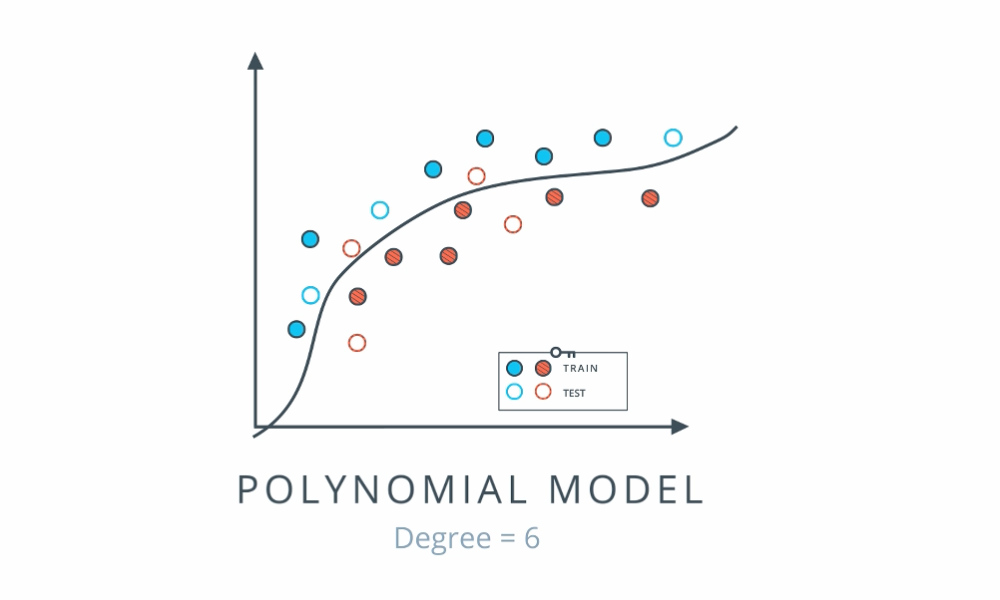
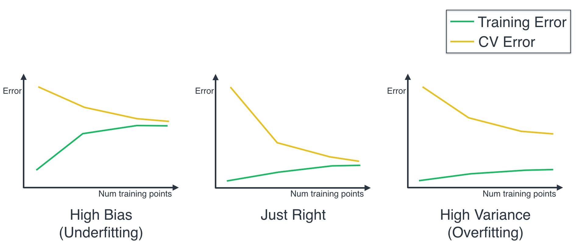
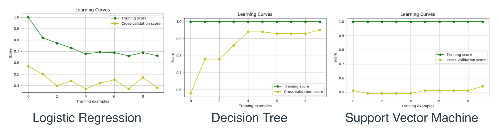
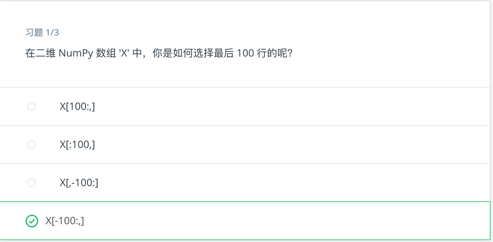
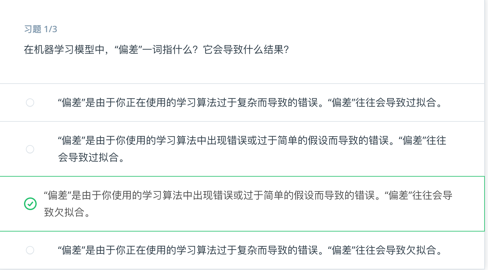
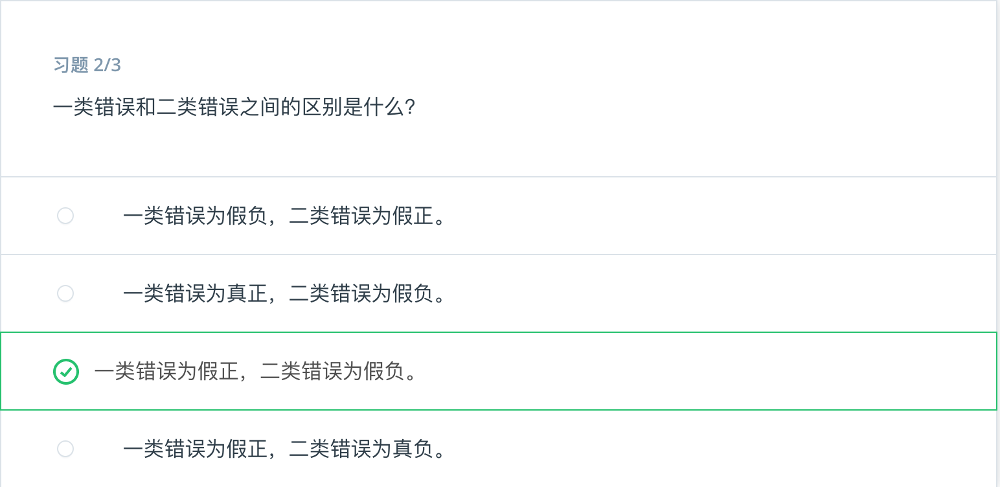
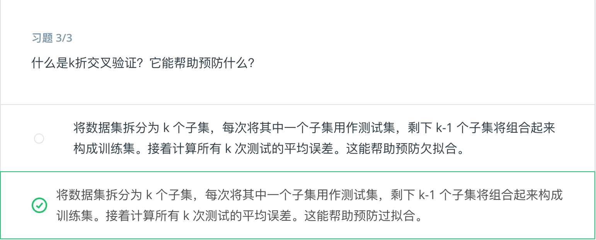

* 目录
 {:toc  }
# 机器学习基础

## 一、训练与测试基础

### 1.简介

#### 视频

<video id="video" controls="" preload="none" style="width:100%; height:100%; object-fit: fill">
    <source id="mp4" src="/assets/media/uda-ml/trainandtest/1-1-intro.mp4" type="video/mp4">
    <track label="both" kind="subtitles" chapters metadata srclang="both" src="/assets/media/uda-ml/trainandtest/1-1-both.vtt">
    <track label="中文字幕" kind="subtitles" chapters metadata srclang="zh" src="/assets/media/uda-ml/trainandtest/1-1-intro.vtt" default>
    <track label="en" kind="subtitles" chapters metadata srclang="de" src="/assets/media/uda-ml/trainandtest/1-1-lang_en.vtt">
</video>


#### 笔记

- 简单介绍了机器学习相关的一些知识


### 2.概述

#### 视频

<video id="video" controls="" preload="none" style="width:100%; height:100%">
    <source id="mp4" src="/assets/media/uda-ml/trainandtest/2-1.mp4" type="video/mp4">
    <track label="both" kind="subtitles" chapters metadata srclang="both" src="/assets/media/uda-ml/trainandtest/2-1-both.vtt">
    <track label="中文字幕" kind="subtitles" chapters metadata srclang="zh" src="/assets/media/uda-ml/trainandtest/2-1-zh.vtt" default>
    <track label="en" kind="subtitles" chapters metadata srclang="de" src="/assets/media/uda-ml/trainandtest/2-1-en.vtt">
</video>


#### 笔记

- 这个视频讲解了，什么是机器学习。给定一个问题和解决这个问题的一些工具（机器的学习模型），并给解决这个问题使用的方法的效果的评分标准（度量工具）。

### 3.统计学知识复习

​	在这节课，我们将假设你熟悉以下统计学概念，例如**均值**、**中值**、**方差**等。如果你觉得学习这些知识已经有一段时间了，需要复习下，建议你查看课外部分的一些视频和练习。

1. 居中趋势测量：均值、中值、众数。

2. 数据的离散性：四分位距法、异常值、标准偏差、贝塞尔修正。

- 均值：
- 中值：
- 众数：
- 四分位距法：
- 异常值：
- 标准偏差：
- 贝塞尔修正：

### 4.在Pandas中加载数据

```python
import pandas
# TODO: Use pandas to read the '2_class_data.csv' file, and store it in a variable called 'data'.
data = pandas.read_csv("2_class_data.csv")

```

### 5.Numpy数组

​	我们已经在 Pandas 中加载数据，现在需要将输入和输出拆分为 numpy 数组，以便在 scikit-learn 中应用分类器。方法如下：假设有个 pandas 数据框 `df`，如下所示，有四个列，分别标为 `A`、`B`、`C`、`D`：


如果我们想要提取列"A",则执行以下操作：

```
>> df['A']
    0    1
    1    5
    2    9
    Name: A, dtype: int64
```

现在，如果我们希望获取跟多的列，则执行以下操作：

```
df[['B','D']]
```


- 下面的索引是联系代码：

- ```python
  import pandas as pd
  import numpy as np
  
  data = pd.read_csv("data.csv")
  
  # TODO: Separate the features and the labels into arrays called X and y
  
  X = np.array(data[['x1', 'x2']])
  y = np.array(data['y'])
  ```

- [ipynb](../assets/media/uda-ml/code/numpy/numpy.ipynb)


### 6. 在sklearn中训练模型

```
# import statements for the classification algorithms
from sklearn.linear_model import LogisticRegression
from sklearn.tree import DecisionTreeClassifier
from sklearn.svm import SVC

# Logistic Regression Classifier
classifier = LogisticRegression()
classifier.fit(X,y)

# Decision Tree Classifier
classifier = DecisionTreeClassifier()
classifier.fit(X,y)

# Support Vector Machine Classifier
classifier = SVC()
classifier.fit(X,y)
```


[sklearn](../assets/media/uda-ml/code/sklearn/sklearn.html)

### 7. 手动调整参数

- SVC 的有如下参数：

- > - Kernal: `linear`线性，`poly`多项式，`rbf`高斯核
  > - degree：多项式核的次数（如果选择了多项式）
  > - gamma:`r`参数
  > - C：`c`参数

具体的参考代码如下：[sklearn](../assets/media/uda-ml/code/sklearn1/sklearn.html)

### 8. 自动调整参数

#### 视频

<video id="video" controls="" preload="none" style="width:100%; height:100%">
    <source id="mp4" src="/assets/media/uda-ml/trainandtest/3-1.mp4" type="video/mp4">
    <track label="both" kind="subtitles" chapters metadata srclang="both" src="/assets/media/uda-ml/trainandtest/3-1-both.vtt">
    <track label="中文字幕" kind="subtitles" chapters metadata srclang="zh" src="/assets/media/uda-ml/trainandtest/3-1-zh.vtt" default>
    <track label="en" kind="subtitles" chapters metadata srclang="de" src="/assets/media/uda-ml/trainandtest/3-1-en.vtt">
</video>


### 9. 测试你的模型

#### 视频

<video id="video" controls="" preload="none" style="width:100%; height:100%">
    <source id="mp4" src="/assets/media/uda-ml/trainandtest/4-1.mp4" type="video/mp4">
    <track label="both" kind="subtitles" chapters metadata srclang="both" src="/assets/media/uda-ml/trainandtest/4-1-both.vtt">
    <track label="中文字幕" kind="subtitles" chapters metadata srclang="zh" src="/assets/media/uda-ml/trainandtest/4-1-zh.vtt" default>
    <track label="en" kind="subtitles" chapters metadata srclang="de" src="/assets/media/uda-ml/trainandtest/4-1-en.vtt">
</video>


### 10 练习：在sklearn中进行测试

- 在sklearn中使用`train_test_split`命令。该函数获得输入`X`,`y`。然后返回四项内容：

- > - `X_train`:训练输入数据
  > - `X_test`:测试输入数据
  > - `y_train`:训练标签
  > - `y_test`:测试标签


```python
from sklearn.model_selection import train_test_split
X_train, X_test, y_train, y_test = train_test_split(X, y, test_size = 0.25)
```


## 二、评估指标

### 1、混淆矩阵

<video id="video" controls="" preload="none" style="width:100%; height:100%; object-fit: fill">
    <source id="mp4" src="/assets/media/uda-ml/evaluationindex/1-1.mp4" type="video/mp4">
    <track label="both" kind="subtitles" chapters metadata srclang="both" src="/assets/media/uda-ml/evaluationindex/1-1-both.vtt">
    <track label="中文字幕" kind="subtitles" chapters metadata srclang="zh" src="/assets/media/uda-ml/evaluationindex/1-1-zh.vtt" default>
    <track label="en" kind="subtitles" chapters metadata srclang="de" src="/assets/media/uda-ml/evaluationindex/1-1-en.vtt">
</video>


### 2、混淆矩阵答案

<video id="video" controls="" preload="none" style="width:100%; height:100%; object-fit: fill">
    <source id="mp4" src="/assets/media/uda-ml/evaluationindex/2-1.mp4" type="video/mp4">
    <track label="both" kind="subtitles" chapters metadata srclang="both" src="/assets/media/uda-ml/evaluationindex/2-1-both.vtt">
    <track label="中文字幕" kind="subtitles" chapters metadata srclang="zh" src="/assets/media/uda-ml/evaluationindex/2-1-zh.vtt" default>
    <track label="en" kind="subtitles" chapters metadata srclang="de" src="/assets/media/uda-ml/evaluationindex/2-1-en.vtt">
</video>


<video id="video" controls="" preload="none" style="width:100%; height:100%; object-fit: fill">
    <source id="mp4" src="/assets/media/uda-ml/evaluationindex/3-1.mp4" type="video/mp4">
    <track label="both" kind="subtitles" chapters metadata srclang="both" src="/assets/media/uda-ml/evaluationindex/3-1-both.vtt">
    <track label="中文字幕" kind="subtitles" chapters metadata srclang="zh" src="/assets/media/uda-ml/evaluationindex/3-1-zh.vtt" default>
    <track label="en" kind="subtitles" chapters metadata srclang="de" src="/assets/media/uda-ml/evaluationindex/3-1-en.vtt">
</video>

### 3、 准确率

<video id="video" controls="" preload="none" style="width:100%; height:100%; object-fit: fill">
    <source id="mp4" src="/assets/media/uda-ml/evaluationindex/4-1.mp4" type="video/mp4">
    <track label="both" kind="subtitles" chapters metadata srclang="both" src="/assets/media/uda-ml/evaluationindex/4-1-both.vtt">
    <track label="中文字幕" kind="subtitles" chapters metadata srclang="zh" src="/assets/media/uda-ml/evaluationindex/4-1-zh.vtt" default>
    <track label="en" kind="subtitles" chapters metadata srclang="de" src="/assets/media/uda-ml/evaluationindex/4-1-en.vtt">
</video>


### 4、 准确率答案

<video id="video" controls="" preload="none" style="width:100%; height:100%; object-fit: fill">
    <source id="mp4" src="/assets/media/uda-ml/evaluationindex/5-1.mp4" type="video/mp4">
    <track label="both" kind="subtitles" chapters metadata srclang="both" src="/assets/media/uda-ml/evaluationindex/5-1-both.vtt">
    <track label="中文字幕" kind="subtitles" chapters metadata srclang="zh" src="/assets/media/uda-ml/evaluationindex/5-1-zh.vtt" default>
    <track label="en" kind="subtitles" chapters metadata srclang="de" src="/assets/media/uda-ml/evaluationindex/5-1-en.vtt">
</video>


### 5、准确率不适用的情况

<video id="video" controls="" preload="none" style="width:100%; height:100%; object-fit: fill">
    <source id="mp4" src="/assets/media/uda-ml/evaluationindex/6-1.mp4" type="video/mp4">
    <track label="both" kind="subtitles" chapters metadata srclang="both" src="/assets/media/uda-ml/evaluationindex/6-1-both.vtt">
    <track label="中文字幕" kind="subtitles" chapters metadata srclang="zh" src="/assets/media/uda-ml/evaluationindex/6-1-zh.vtt" default>
    <track label="en" kind="subtitles" chapters metadata srclang="de" src="/assets/media/uda-ml/evaluationindex/6-1-en.vtt">
</video>


### 6、假阴性与假阳性

<video id="video" controls="" preload="none" style="width:100%; height:100%; object-fit: fill">
    <source id="mp4" src="/assets/media/uda-ml/evaluationindex/7-1.mp4" type="video/mp4">
    <track label="both" kind="subtitles" chapters metadata srclang="both" src="/assets/media/uda-ml/evaluationindex/7-1-both.vtt">
    <track label="中文字幕" kind="subtitles" chapters metadata srclang="zh" src="/assets/media/uda-ml/evaluationindex/7-1-zh.vtt" default>
    <track label="en" kind="subtitles" chapters metadata srclang="de" src="/assets/media/uda-ml/evaluationindex/7-1-en.vtt">
</video>


### 7、假阴性与假阳性答案

<video id="video" controls="" preload="none" style="width:100%; height:100%; object-fit: fill">
    <source id="mp4" src="/assets/media/uda-ml/evaluationindex/8-1.mp4" type="video/mp4">
    <track label="both" kind="subtitles" chapters metadata srclang="both" src="/assets/media/uda-ml/evaluationindex/8-1-both.vtt">
    <track label="中文字幕" kind="subtitles" chapters metadata srclang="zh" src="/assets/media/uda-ml/evaluationindex/8-1-zh.vtt" default>
    <track label="en" kind="subtitles" chapters metadata srclang="de" src="/assets/media/uda-ml/evaluationindex/8-1-en.vtt">
</video>

- 备注：视频00：11处讲师讲解有误，正确应该是“在这种情况下假阴性比假阳性更糟糕”


### 8、精度

<video id="video" controls="" preload="none" style="width:100%; height:100%; object-fit: fill">
    <source id="mp4" src="/assets/media/uda-ml/evaluationindex/9-1.mp4" type="video/mp4">
    <track label="both" kind="subtitles" chapters metadata srclang="both" src="/assets/media/uda-ml/evaluationindex/9-1-both.vtt">
    <track label="中文字幕" kind="subtitles" chapters metadata srclang="zh" src="/assets/media/uda-ml/evaluationindex/9-1-zh.vtt" default>
    <track label="en" kind="subtitles" chapters metadata srclang="de" src="/assets/media/uda-ml/evaluationindex/9-1-en.vtt">
</video>


### 9、 召回率

<video id="video" controls="" preload="none" style="width:100%; height:100%; object-fit: fill">
    <source id="mp4" src="/assets/media/uda-ml/evaluationindex/10-1.mp4" type="video/mp4">
    <track label="both" kind="subtitles" chapters metadata srclang="both" src="/assets/media/uda-ml/evaluationindex/10-1-both.vtt">
    <track label="中文字幕" kind="subtitles" chapters metadata srclang="zh" src="/assets/media/uda-ml/evaluationindex/10-1-zh.vtt" default>
    <track label="en" kind="subtitles" chapters metadata srclang="de" src="/assets/media/uda-ml/evaluationindex/10-1-en.vtt">
</video>


### 10、F1得分

<video id="video" controls="" preload="none" style="width:100%; height:100%; object-fit: fill">
    <source id="mp4" src="/assets/media/uda-ml/evaluationindex/11-1.mp4" type="video/mp4">
    <track label="both" kind="subtitles" chapters metadata srclang="both" src="/assets/media/uda-ml/evaluationindex/11-1-both.vtt">
    <track label="中文字幕" kind="subtitles" chapters metadata srclang="zh" src="/assets/media/uda-ml/evaluationindex/11-1-zh.vtt" default>
    <track label="en" kind="subtitles" chapters metadata srclang="de" src="/assets/media/uda-ml/evaluationindex/11-1-en.vtt">
</video>

**F1 得分练习**

接下来，请记住 F1 得分的公式为：

$$
\text{F1 Score} = 2 \cdot \frac{\text{Precision} * \text{Recall}}{\text{Precision} + \text{Recall}}
$$


### 11、F-β 得分

<video id="video" controls="" preload="none" style="width:100%; height:100%; object-fit: fill">
    <source id="mp4" src="/assets/media/uda-ml/evaluationindex/12-1.mp4" type="video/mp4">
    <track label="both" kind="subtitles" chapters metadata srclang="both" src="/assets/media/uda-ml/evaluationindex/12-1-both.vtt">
    <track label="中文字幕" kind="subtitles" chapters metadata srclang="zh" src="/assets/media/uda-ml/evaluationindex/12-1-zh.vtt" default>
    <track label="en" kind="subtitles" chapters metadata srclang="de" src="/assets/media/uda-ml/evaluationindex/12-1-en.vtt">
</video>


### 12、ROC曲线

<video id="video" controls="" preload="none" style="width:100%; height:100%; object-fit: fill">
    <source id="mp4" src="/assets/media/uda-ml/evaluationindex/13-1.mp4" type="video/mp4">
    <track label="both" kind="subtitles" chapters metadata srclang="both" src="/assets/media/uda-ml/evaluationindex/13-1-both.vtt">
    <track label="中文字幕" kind="subtitles" chapters metadata srclang="zh" src="/assets/media/uda-ml/evaluationindex/13-1-zh.vtt" default>
    <track label="en" kind="subtitles" chapters metadata srclang="de" src="/assets/media/uda-ml/evaluationindex/13-1-en.vtt">
</video>


### 13、回归指标

<video id="video" controls="" preload="none" style="width:100%; height:100%; object-fit: fill">
    <source id="mp4" src="/assets/media/uda-ml/evaluationindex/14-1.mp4" type="video/mp4">
    <track label="both" kind="subtitles" chapters metadata srclang="both" src="/assets/media/uda-ml/evaluationindex/14-1-both.vtt">
    <track label="中文字幕" kind="subtitles" chapters metadata srclang="zh" src="/assets/media/uda-ml/evaluationindex/14-1-zh.vtt" default>
    <track label="en" kind="subtitles" chapters metadata srclang="de" src="/assets/media/uda-ml/evaluationindex/14-1-en.vtt">
</video>


## 三、模型选择

### 1、错误类型

<video id="video" controls="" preload="none" style="width:100%; height:100%; object-fit: fill">
    <source id="mp4" src="/assets/media/uda-ml/modelselect/1-1.mp4" type="video/mp4">
    <track label="both" kind="subtitles" chapters metadata srclang="both" src="/assets/media/uda-ml/modelselect/1-1-both.vtt">
    <track label="中文字幕" kind="subtitles" chapters metadata srclang="zh" src="/assets/media/uda-ml/modelselect/1-1-zh.vtt" default>
    <track label="en" kind="subtitles" chapters metadata srclang="de" src="/assets/media/uda-ml/modelselect/1-1-en.vtt">
</video>

### 2、模型复杂度图表

<video id="video" controls="" preload="none" style="width:100%; height:100%; object-fit: fill">
    <source id="mp4" src="/assets/media/uda-ml/modelselect/2-1.mp4" type="video/mp4">
    <track label="both" kind="subtitles" chapters metadata srclang="both" src="/assets/media/uda-ml/modelselect/2-1-both.vtt">
    <track label="中文字幕" kind="subtitles" chapters metadata srclang="zh" src="/assets/media/uda-ml/modelselect/2-1-zh.vtt" default>
    <track label="en" kind="subtitles" chapters metadata srclang="de" src="/assets/media/uda-ml/modelselect/2-1-en.vtt">
</video>

<video id="video" controls="" preload="none" style="width:100%; height:100%; object-fit: fill">
    <source id="mp4" src="/assets/media/uda-ml/modelselect/3-1.mp4" type="video/mp4">
    <track label="both" kind="subtitles" chapters metadata srclang="both" src="/assets/media/uda-ml/modelselect/3-1-both.vtt">
    <track label="中文字幕" kind="subtitles" chapters metadata srclang="zh" src="/assets/media/uda-ml/modelselect/3-1-zh.vtt" default>
    <track label="en" kind="subtitles" chapters metadata srclang="de" src="/assets/media/uda-ml/modelselect/3-1-en.vtt">
</video>



### 3、交叉验证

<video id="video" controls="" preload="none" style="width:100%; height:100%; object-fit: fill">
    <source id="mp4" src="/assets/media/uda-ml/modelselect/3-1.mp4" type="video/mp4">
    <track label="both" kind="subtitles" chapters metadata srclang="both" src="/assets/media/uda-ml/modelselect/3-1-both.vtt">
    <track label="中文字幕" kind="subtitles" chapters metadata srclang="zh" src="/assets/media/uda-ml/modelselect/3-1-zh.vtt" default>
    <track label="en" kind="subtitles" chapters metadata srclang="de" src="/assets/media/uda-ml/modelselect/3-1-en.vtt">
</video>

### 4、K折交叉验证

<video id="video" controls="" preload="none" style="width:100%; height:100%; object-fit: fill">
    <source id="mp4" src="/assets/media/uda-ml/modelselect/4-1.mp4" type="video/mp4">
    <track label="both" kind="subtitles" chapters metadata srclang="both" src="/assets/media/uda-ml/modelselect/4-1-both.vtt">
    <track label="中文字幕" kind="subtitles" chapters metadata srclang="zh" src="/assets/media/uda-ml/modelselect/4-1-zh.vtt" default>
    <track label="en" kind="subtitles" chapters metadata srclang="de" src="/assets/media/uda-ml/modelselect/4-1-en.vtt">
</video>


### 5、学习曲线

<video id="video" controls="" preload="none" style="width:100%; height:100%; object-fit: fill">
    <source id="mp4" src="/assets/media/uda-ml/modelselect/5-1.mp4" type="video/mp4">
    <track label="both" kind="subtitles" chapters metadata srclang="both" src="/assets/media/uda-ml/modelselect/5-1-both.vtt">
    <track label="中文字幕" kind="subtitles" chapters metadata srclang="zh" src="/assets/media/uda-ml/modelselect/5-1-zh.vtt" default>
    <track label="en" kind="subtitles" chapters metadata srclang="de" src="/assets/media/uda-ml/modelselect/5-1-en.vtt">
</video>


### 6、通过学习曲线检测过拟合和欠拟合

对于这道测验，我们将使用三个模型来训练下面的圆形数据集。

- 决策树模型，
- 逻辑回归模型，以及
- 支持向量机模型。


 


- 其中一个模型会过拟合，一个欠拟合，还有一个正常。首先，我们将编写代码为每个模型绘制学习曲线，最后我们将查看这些学习曲线，判断每个模型对应哪个曲线。

- 首先，请记住三个模型的学习曲线外观如下所示：




对于这道测验的第一部分，你只需取消注释其中一个分类器，并点击'测试答案'以查看学习曲线的图表。但是如果你喜欢编程的话，以下是一些编程详情。我们将使用函数 `learning_curve`：

```python
train_sizes, train_scores, test_scores = learning_curve(
    estimator, X, y, cv=None, n_jobs=1, train_sizes=np.linspace(.1, 1.0, num_trainings))
```


不需要担心该函数的所有参数（你可以在[此处](http://scikit-learn.org/stable/auto_examples/model_selection/plot_learning_curve.html)了解详情），这里，我们将解释主要参数：

- `estimator`，是我们针对数据使用的实际分类器，例如 `LogisticRegression()` 或 `GradientBoostingClassifier()`。
- `X` 和 `y` 是我们的数据，分别表示特征和标签。
- `train_sizes` 是用来在曲线上绘制每个点的数据大小。
- `train_scores` 是针对每组数据进行训练后的算法训练得分。
- `test_scores` 是针对每组数据进行训练后的算法测试得分。

两个重要的现象：

- 训练和测试得分是一个包含 3 个值的列表，这是因为函数使用了 3 折交叉验证。
- **非常重要：**可以看出，我们使用训练和测试**误差**来定义我们的曲线，而这个函数使用训练和测试**得分**来定义曲线。二者是相反的，因此误差越高，得分就越低。因此，当你看到曲线时，你需要自己在脑中将它颠倒过来，以便与上面的曲线对比。

####  

#### 第 1 部分：绘制学习曲线

这里，我们将对比三个模型：

- **逻辑回归**模型。
- **决策树**模型。
- **支持向量机**模型，具有 RBF 内核，γ 参数为 1000（稍后我们将了解它们的含义）。

取消注释每个的代码，并检查所绘制的学习曲线。如果你对绘制学习曲线用到的代码感兴趣，请查看**utils.py**标签页。

#### 第 2 部分：分析学习曲线

对于该测验的第 2 部分，你可以查看你之前绘制的曲线并判断三个模型中哪个模型欠拟合，哪个过拟合，哪个正好。

### 7、解决方案：检测过拟合与欠拟合

 恭喜你！这道练习并不简单。以下是你应该获得的曲线：



我们可以根据这些曲线得出结论：

- **对数几率回归**模型的训练和测试得分很低。
- **决策树**模型的训练和测试得分很高。
- **支持向量机**模型的训练得分很高，测试得分很低。

由此可以判断，逻辑回归模型欠拟合，支持向量机模型过拟合，决策树正常。

同样，我们可以翻转这些曲线（因为它们测量的是得分，而原始曲线测量的是错误），并将它们与下面的三条曲线对比，可以看出它们与我们之前看到的三条曲线很像。（*注意：我们需要翻转曲线并不意味着错误是 1 减去得分。只是表示模型越来越好的话，错误会降低，得分会升高。*）


现在我们应该检测在实际模型中是否这样。当我们绘制每个模型的界限曲线时，结果如下所示：


当我们查看上述模型时，第一个模型欠拟合，第二个正常，第三个过拟合，这种现象合理吗？合理吧？我们看到数据由圆圈或方框正确地划分出来。我们的模型按以下形式划分数据：

- **逻辑回归**模型使用一条直线，这太简单了。在训练集上的效果不太好，因此**欠拟合**。
- **决策树**模型使用一个方形，拟合的很好，并能够泛化。因此，该模型**效果很好**。
- **支持向量机**模型实际上在每个点周围都画了一个小圆圈。它实际上是在记住训练集，无法泛化。因此 **过拟合**。

最好尽可能进行实际检查，确保模型的确具有指标所指示的行为。


### 8、网络搜索

<video id="video" controls="" preload="none" style="width:100%; height:100%; object-fit: fill">
    <source id="mp4" src="/assets/media/uda-ml/modelselect/6-1.mp4" type="video/mp4">
    <track label="both" kind="subtitles" chapters metadata srclang="both" src="/assets/media/uda-ml/modelselect/6-1-both.vtt">
    <track label="中文字幕" kind="subtitles" chapters metadata srclang="zh" src="/assets/media/uda-ml/modelselect/6-1-zh.vtt" default>
    <track label="en" kind="subtitles" chapters metadata srclang="de" src="/assets/media/uda-ml/modelselect/6-1-en.vtt">
</video>	


### 9、在sklearn中的网络搜索

在 sklearn 中的网格搜索非常简单。 我们将用一个例子来说明一下。 假设我们想要训练支持向量机，并且我们想在以下参数之间做出决定：

- kernel：`poly`或`rbf`。
- C：0.1,1 或 10。

（ **注：**这些参数对于你来说，现在可以简单了解一下，我们将在该纳米学位接下来的**监督学习部分**中详细了解它们。

具体步骤如下所示:

#### 1. 导入 GridSearchCV

```
from sklearn.model_selection import GridSearchCV
```

#### 2.选择参数：

现在我们来选择我们想要选择的参数，并形成一个字典。 在这本字典中，键 (keys) 将是参数的名称，值 （values) 将是每个参数可能值的列表。

```
parameters = {'kernel':['poly', 'rbf'],'C':[0.1, 1, 10]}
```

#### 3.创建一个评分机制 (scorer)

我们需要确认将使用什么指标来为每个候选模型评分。 这里，我们将使用 F1 分数。

```
from sklearn.metrics import make_scorer
from sklearn.metrics import f1_score
scorer = make_scorer(f1_score)
```

#### 4. 使用参数 (parameter) 和评分机制 (scorer) 创建一个 GridSearch 对象。 使用此对象与数据保持一致 （fit the data) 。

```
# Create the object.
grid_obj = GridSearchCV(clf, parameters, scoring=scorer)
# Fit the data
grid_fit = grid_obj.fit(X, y)
```

#### 5. 获得最佳估算器 (estimator)

```
best_clf = grid_fit.best_estimator_
```

现在你可以使用这一估算器`best_clf`来做出预测。

在下一页面中，你将进行练习，可以使用 GridSearchCV 来优化决策树模型。

### 10、[workspace]网络搜索


### 11、[workspace]网络搜索解决方案


### 12、总结


<video id="video" controls="" preload="none" style="width:100%; height:100%; object-fit: fill">
    <source id="mp4" src="/assets/media/uda-ml/modelselect/7-1.mp4" type="video/mp4">
    <track label="both" kind="subtitles" chapters metadata srclang="both" src="/assets/media/uda-ml/modelselect/7-1-both.vtt">
    <track label="中文字幕" kind="subtitles" chapters metadata srclang="zh" src="/assets/media/uda-ml/modelselect/7-1-zh.vtt" default>
    <track label="en" kind="subtitles" chapters metadata srclang="de" src="/assets/media/uda-ml/modelselect/7-1-en.vtt">
</video>

### 13、回顾

<video id="video" controls="" preload="none" style="width:100%; height:100%; object-fit: fill">
    <source id="mp4" src="/assets/media/uda-ml/modelselect/8-1.mp4" type="video/mp4">
    <track label="both" kind="subtitles" chapters metadata srclang="both" src="/assets/media/uda-ml/modelselect/8-1-both.vtt">
    <track label="中文字幕" kind="subtitles" chapters metadata srclang="zh" src="/assets/media/uda-ml/modelselect/8-1-zh.vtt" default>
    <track label="en" kind="subtitles" chapters metadata srclang="de" src="/assets/media/uda-ml/modelselect/8-1-en.vtt">
</video>


#  四、自我评估




# 五、 模型自我评估








# 六、波士顿房价

## 1、项目概述

波士顿房地产市场竞争激烈，你想成为该地区最好的房地产经纪人。 为了与同行竞争，你决定利用一些基本的机器学习概念来帮助你和客户为他们的家寻找最佳销售价格。 幸运的是，你现在拥有一个 Boston Housing 数据集，其中包含有关波士顿社区房屋的汇总数据，其中包括每个区域的房屋价格中位数的值。 你的任务是基于可用工具的统计分析来构建一个最佳模型。 这一模型将被用来预测你客户房屋的最佳销售价格。

###  项目要点

此项目旨在让你熟练地掌握 sklearn 中的多种技能，包括训练、测试、评估与优化模型。

通过完成此项目你将掌握以下知识：

- 如何探索数据并观察特征。
- 如何训练和测试模型。
- 如何发现潜在问题，如由于偏差或方差导致的误差。
- 如何应用技术来改进模型，如交叉验证和网格搜索。

## 2、开始项目

对于本项目，你可以在[机器学习项目 GitHub](https://github.com/udacity/cn-machine-learning)找到 `boston_housing` 文件夹，里面包含了本项目的必备文件。你可以从这个代码库中直接下载本纳米学位所有项目需要的文件。在完成项目时，请确保你使用了这些项目文件的最新版本！

本项目包含三个文件：

- `boston_housing.ipynb`: 这是主文件，你将在此完成你的项目。
- `housing.csv`: 这是项目数据集。你将在 notebook 中加载这些数据。
- `visuals.py`: 这是一个 Python 脚本，它提供了本项目的补充可视化内容，请勿修改此文件。

在终端或命令行提示符窗口中，转到包含项目文件的文件夹，然后使用命令 `jupyter notebook boston_housing.ipynb` 打开浏览器窗口或标签页来处理你的 notebook。此外，你可以使用命令 `jupyter notebook` 或 `ipython notebook` 在打开的浏览器窗口中转到该 notebook 文件。按照 notebook 中的说明操作，并回答其中的每个问题，这样才能成功完成项目。除了项目文件外，我们还提供了 **README** 文件，其中可能包含关于项目的其他必要信息或说明。