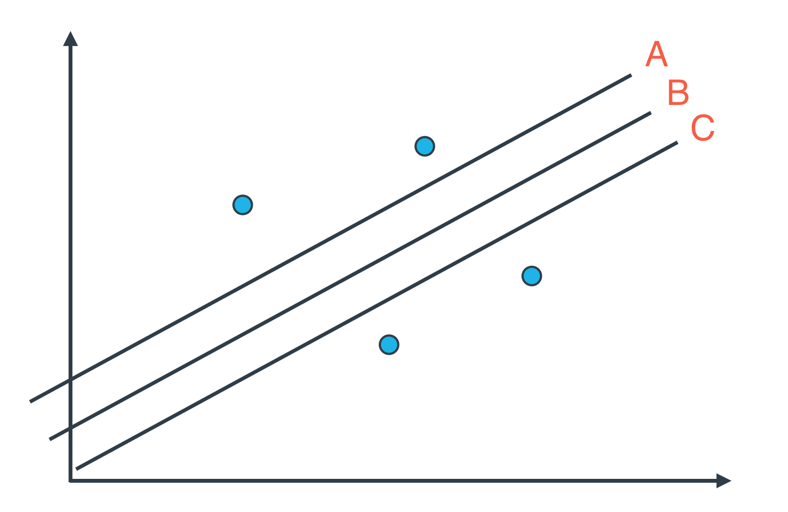
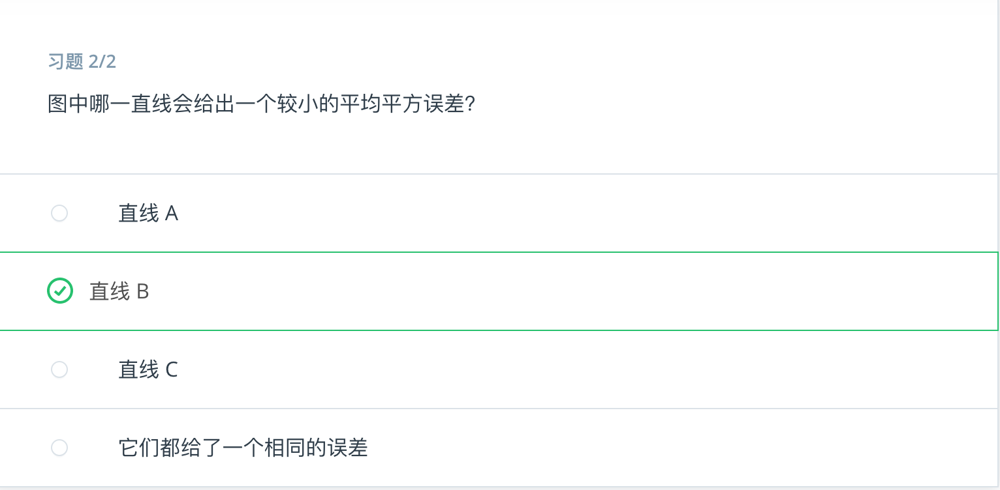
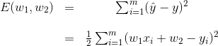
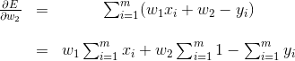
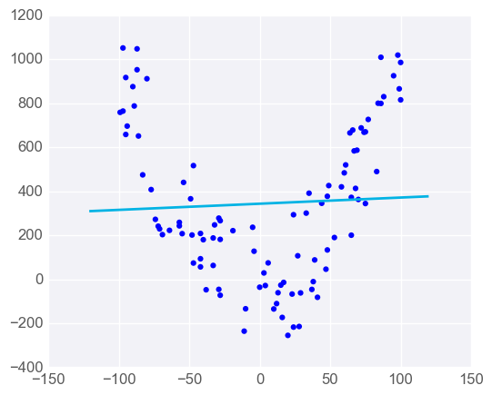
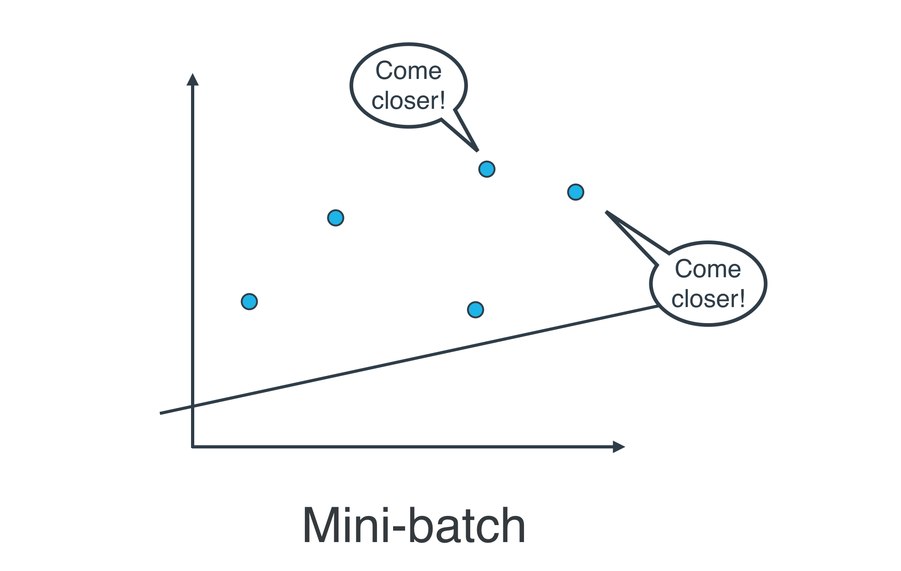

---


layout: post
title: 机器学习-监督学习-线性回归
description: 在这章，主要讲解了监督学习相关的技术。
Keywords: 机器学习、模型、评估指标
tagline: 
categories: [ML]
tags: [ML]

---


* 目录
 {:toc  }
# 一、线程回归

## 1、简介


​	Hi，我是 Luis ！在本节课中，我们将研究回归。 分类和回归的主要区别在于：在分类中，我们预测一个*状态*，在回归中，我们预测一个*值*。 我们将从线性回归开始，然后我们将学习一些处理非线性问题的方法。我们准备开始学习吧！


## 2、练习：房价

<video src="../assets/media/uda-ml/supervisedlearning/line/1-t.mp4"></video>


## 3、参考答案：房价

<video src="../assets/media/uda-ml/supervisedlearning/line/2-t.mp4"></video>


## 4、用数据拟合直线

<video src="../assets/media/uda-ml/supervisedlearning/line/4-t.mp4"></video>


## 5、调整一条直线

<video src="../assets/media/uda-ml/supervisedlearning/line/5-t.mp4"></video>


## 6、绝对值技巧

<video src="../assets/media/uda-ml/supervisedlearning/line/6-t.mp4"></video>


## 7、平方技巧

<video src="../assets/media/uda-ml/supervisedlearning/line/7-t.mp4"></video>


## 8、梯度下降

<video src="../assets/media/uda-ml/supervisedlearning/line/8-t.mp4"></video>

## 9、平均绝对误差

<div contenteditable="plaintext-only"><video src="../assets/media/uda-ml/supervisedlearning/line/8-t.mp4"></video></div>
<video src="../assets/media/uda-ml/supervisedlearning/line/8-t.mp4"></video>


## 9、平均绝对误差

<video src="../assets/media/uda-ml/supervisedlearning/line/9-t.mp4"></video>


## 10、平均平方误差

<video src="../assets/media/uda-ml/supervisedlearning/line/10-t.mp4"></video>


## 11、最小化误差函数

<video src="../assets/media/uda-ml/supervisedlearning/line/11-t.mp4"></video>


## 12、均方误差与总平均误差

一个潜在疑问是：如何判断应该使用均方误差还是总平方误差（或绝对误差）？

总平方误差是指每个点的误差之和，方程式为：


均方误差是指这些误差的平均值，方程式为：


其中 mm 是数据点的数量，

好消息是，选择哪个并不重要。可以看出，总平方误差是多个均方误差相加的结果，因为


因此，既然导数是线性方程， TT 的梯度也是 mm 乘以 MM 的梯度。

但是，梯度下降步骤包括减去误差的梯度乘以学习速率 \alphaα。因此，选择均方误差还是总平方误差只是选择不同的学习速率。

在现实中，我们可以借助算法判断什么样的学习速率比较合适。因此，如果我们使用均方误差或总平方误差，算法将只是选择不同的学习速率。


## 13、小批量梯度下降法

**批量梯度下降法与随机梯度下降法**

到目前为止，我们已经见过两种线性回归方法。

- **逐个地**在每个数据点应用平方（或绝对）误差，并重复这一流程很多次。
- **同时**在每个数据点应用平方（或绝对）误差，并重复这一流程很多次。

具体而言，向数据点应用平方（或绝对）误差时，就会获得可以与模型权重相加的值。我们可以加上这些值，更新权重，然后在下个数据点应用平方（或绝对）误差。或者同时对所有点计算这些值，加上它们，然后使用这些值的和更新权重。

后者第二种方法叫做**批量梯度下降法**。前者第一种方法叫做**随机梯度下降法**。


问题是，实际操作中使用哪种方法？

实际上，在大部分情况下，两种都不用。思考以下情形：如果你的数据十分庞大，两种方法的计算速度都将会很缓慢。线性回归的最佳方式是将数据拆分成很多小批次。每个批次都大概具有相同数量的数据点。然后使用每个批次更新权重。这种方法叫做*小批次梯度下降法*。


## 14、绝对值误差VS平方误差

<video src="../assets/media/uda-ml/supervisedlearning/line/11-t.mp4"></video>




<video src="../assets/media/uda-ml/supervisedlearning/line/12-t.mp4"></video>





<video src="../assets/media/uda-ml/supervisedlearning/line/13-t.mp4"></video>


## 15、scikit-learn中的线性回归


# 线性回归

在此部分，你将使用线性回归根据[体质指数 (BMI)](https://en.wikipedia.org/wiki/Body_mass_index) 预测预期寿命。在预测前，我们先了解一下构建此模型所需的工具。

对于你的线性回归模型，你将使用 scikit-learn 的 [`LinearRegression` 类。此类会提供函数 ](http://scikit-learn.org/stable/modules/generated/sklearn.linear_model.LinearRegression.html)[`fit()` 来将模型与数据进行拟合。](http://scikit-learn.org/stable/modules/generated/sklearn.linear_model.LinearRegression.html#sklearn.linear_model.LinearRegression.fit)

```
>>> from sklearn.linear_model import LinearRegression
>>> model = LinearRegression()
>>> model.fit(x_values, y_values)
```

[在上述示例中，`model` 变量是拟合到数据 `x_values` 和 `y_values` 的线性回归模型。拟合模型意味着寻找拟合训练数据的最佳线条。我们使用模型的 ](http://scikit-learn.org/stable/modules/generated/sklearn.linear_model.LinearRegression.html#sklearn.linear_model.LinearRegression.fit)[`predict()` 函数做出两个预测。](http://scikit-learn.org/stable/modules/generated/sklearn.linear_model.LinearRegression.html#sklearn.linear_model.LinearRegression.predict)

```
>>> print(model.predict([ [127], [248] ]))
[[ 438.94308857, 127.14839521]]
```

[该模型返回了一个预测数组，每个输入数组一个预测结果。第一个输入 `[127\]` 的预测结果是 `438.94308857`。第二个输入 `[248]` 的预测结果是 `127.14839521`。用 `[127]` 这样的数组（而不只是 `127`）进行预测的原因是模型可以使用多个特征进行预测。我们将在这节课的稍后部分讲解如何在线性回归中使用多个变量。暂时先继续使用一个值。](http://scikit-learn.org/stable/modules/generated/sklearn.linear_model.LinearRegression.html#sklearn.linear_model.LinearRegression.predict)

## [线性回归练习](http://scikit-learn.org/stable/modules/generated/sklearn.linear_model.LinearRegression.html#sklearn.linear_model.LinearRegression.predict)

[在这道练习中，你将使用关于全球男性平均出生预期寿命和平均 BMI 的数据。该数据来自 ](http://scikit-learn.org/stable/modules/generated/sklearn.linear_model.LinearRegression.html#sklearn.linear_model.LinearRegression.predict)[Gapminder](https://www.gapminder.org/)。

你可以在以下练习的 `bmi_and_life_expectancy.csv` 标签页中找到数据文件。它包含以下三列数据：

- **Country** – 样本的出生国家/地区。
- **Life expectancy** – 样本在该国家/地区的平均出生预期寿命。
- **BMI** – 该国家/地区的男性 BMI 均值。

### 你需要完成以下步骤：

**1. 加载数据**

- 数据位于文件 `bmi_and_life_expectancy.csv`中。
- 使用 pandas [`read_csv` 将数据加载到数据帧中（别忘了导入 pandas！）](http://pandas.pydata.org/pandas-docs/stable/generated/pandas.read_csv.html)
- [将数据帧赋值给变量 `bmi_life_data`。](http://pandas.pydata.org/pandas-docs/stable/generated/pandas.read_csv.html)

[**2. 构建线性回归模型**](http://pandas.pydata.org/pandas-docs/stable/generated/pandas.read_csv.html)

- [使用 scikit-learn 的 ](http://pandas.pydata.org/pandas-docs/stable/generated/pandas.read_csv.html)[`LinearRegression` 创建回归模型并将其赋值给 `bmi_life_model`。](http://scikit-learn.org/stable/modules/generated/sklearn.linear_model.LinearRegression.html)
- [将模型与数据进行拟合。](http://scikit-learn.org/stable/modules/generated/sklearn.linear_model.LinearRegression.html)

[**3. 使用模型进行预测**](http://scikit-learn.org/stable/modules/generated/sklearn.linear_model.LinearRegression.html)

- [使用值为 21.07931 的 BMI 进行预测，并将结果赋值给变量 `laos_life_exp`。](http://scikit-learn.org/stable/modules/generated/sklearn.linear_model.LinearRegression.html)


[**gapminder1**](http://scikit-learn.org/stable/modules/generated/sklearn.linear_model.LinearRegression.html)

```
# TODO: Add import statements


# Assign the dataframe to this variable.
# TODO: Load the data
bmi_life_data = None 

# Make and fit the linear regression model
#TODO: Fit the model and Assign it to bmi_life_model
bmi_life_model = None

# Make a prediction using the model
# TODO: Predict life expectancy for a BMI value of 21.07931
laos_life_exp = None


# TODO: Add import statements
import pandas as pd
from sklearn.linear_model import LinearRegression

# Assign the dataframe to this variable.
# TODO: Load the data
bmi_life_data = pd.read_csv("bmi_and_life_expectancy.csv")

# Make and fit the linear regression model
#TODO: Fit the model and Assign it to bmi_life_model
bmi_life_model = LinearRegression()
bmi_life_model.fit(bmi_life_data[['BMI']], bmi_life_data[['Life expectancy']])

# Mak a prediction using the model
# TODO: Predict life expectancy for a BMI value of 21.07931
laos_life_exp = bmi_life_model.predict(21.07931)
```

[**所需的数据**](http://scikit-learn.org/stable/modules/generated/sklearn.linear_model.LinearRegression.html)

[bmi_and_life_expectancy](../assets/media/uda-ml/supervisedlearning/line/bmi_and_life_expectancy.csv)


## 16、高纬度

<video src="../assets/media/uda-ml/supervisedlearning/line/14-t.mp4"></video>


## 17、多元线性回归


**多元线性回归**

在上一部分，你了解了如何使用 BMI 预测预期寿命。在此例中，BMI 是**预测器**，也称为自变量。预测器是你将查看的变量，以便对其他变量做出预测，你尝试预测的值称为因变量。在此示例中，预期寿命是因变量。

现在假设我们获得了每人的心率数据。我们可以同时使用 BMI 和心率预测寿命期限吗？

当然可以！正如在上个视频中看到的，我们可以使用多元线性回归进行预测。

如果你要预测的结果取决于多个变量，可以创建一个更复杂的模型来考虑多个变量。只要这些变量与要解决的问题相关，使用更多自变量/预测器变量就有助于做出更好的预测。

如果只有一个预测器，则线性回归模型是一条线，但是如果添加更多的预测器变量，就会增加更多的维度。


如果有一个预测器变量，线条的方程是

$$y = m x + by=mx+b$$

图形可能如下所示：


带有一个预测器变量的线性回归


添加一个预测器变量，变成两个预测器变量后，预测方程是

$$y = m_1 x_1 + m_2 x_2 + by=m1x1+m2x2+b$$

要用图形表示，我们需要三维图形，并将线性回归模型表示成一个平面：


你可以使用两个以上的预测器变量，实际上可以使用任意多个，只要有用即可！如果你使用 nn 个预测器变量，那么模型可以用以下方程表示：

$$y = m_{1} x_{1} + m_{2} x_{2} + m_{3} x_{3}+ ... +m_{n} x_{n} + by=m1x1+m2x2+m3x3+...+mnxn+b$$

如果模型有多个预测器变量，则很难用图形呈现，但幸运的是，关于线性回归的所有其他方面都保持不变。我们依然可以通过相同的方式拟合模型并作出预测，我们来试试吧！

# 编程练习：多元线性回归

在此练习中，你将使用 [波士顿房价数据集](https://archive.ics.uci.edu/ml/machine-learning-databases/housing/)。该数据集包含 506 座房子的 13 个特征，均值为 $1000's。你将用一个模型拟合这 13 个特征，以预测房价。

你需要完成以下步骤：

**1. 构建线性回归模型** *使用scikit-learn 的 [`LinearRegression`](http://scikit-learn.org/stable/modules/generated/sklearn.linear_model.LinearRegression.html) 创建回归模型并将其赋值给 `model`。

- 将模型与数据拟合。

**2. 使用该模型进行预测**

- 预测 `sample_house` 的值。


```python
from sklearn.linear_model import LinearRegression
from sklearn.datasets import load_boston

# Load the data from the boston house-prices dataset 
boston_data = load_boston()
x = boston_data['data']
y = boston_data['target']

# Make and fit the linear regression model
# TODO: Fit the model and Assign it to the model variable
model = LinearRegression()
model.fit(x, y)

# Make a prediction using the model
sample_house = [[2.29690000e-01, 0.00000000e+00, 1.05900000e+01, 0.00000000e+00, 4.89000000e-01,
                6.32600000e+00, 5.25000000e+01, 4.35490000e+00, 4.00000000e+00, 2.77000000e+02,
                1.86000000e+01, 3.94870000e+02, 1.09700000e+01]]
# TODO: Predict housing price for the sample_house
prediction = model.predict(sample_house)
```


## 18、解数学方程表组

<video src="../assets/media/uda-ml/supervisedlearning/line/15-t.mp4"></video>


## 19、参考答案：解数学方程组

在这一可选部分中，我们将开发在上一个视频中介绍的解数学方程表组。 首先，我们将讲解二维情况，然后讲解一般情况。

### 二维情况的答案

我们的数据将会是值 $$x_1, x_2, \ldots, x_m,x1,x2,…,xm$$, 而我们的标签将会是值 $$y_1,y_2, \ldots, y_n.y1,y2,…,yn.$$ 我们将权重记为$$ w_1,w1,$$ 和$$ w_2.w2$$. 因此，我们的预测是$$ \hat{y_i} = w_1x_i + w_2$$

$$yi^=w1xi+w2.$$ 平均平方误差是


我们需要最小化误差函数。因此， \frac{1}{m}m1 可以被忽略。现在替换 \hat{y},y^, 值，我们得到





修正：上方公式中第一行缺少一个1/2。


现在，为了最小化这一误差函数，我们需要将 w_1w1 和 w_1w1 的导数设置为 0.0.

使用链式规则，我们得到


和





将以上两则公式设置为 0 ，我们得到一下两则公式和两个变量 （这里变量是 w_1w1 和 w_2w2)。


修正：上方第二行公式中最后的x_i应更改为y_i。


我们可以用任何方法来求解 2 个方程和 2 个变量。 例如，如果我们将第二个方程乘以 \sum_{i=1}^m x_i∑i=1mxi, 第一个乘以 mm, 两者相减得到值 w_1w1, 然后在第一个方程中替换该值，我们得到如下结果：


这是我们理想的答案。

### n-维度情况下的答案

当我们的数据有n 个维度时，而不只是 2个，我们需要介绍一下的表示法。我们的矩阵 XX 包含的数据如接下来所示，每一行都是我们的 datapoint， 在此 x_0^{(i)} =1x0(i)=1 表示偏差。


我们的标签是向量


而我们的权重矩阵如下所示：


所以，平均平方误差的方程可写成如下矩阵乘积：

$$E(W) = \frac{1}{m} ((XW)^T - y^T) (XW - y)E(W)=m1((XW)T−yT)(XW−y).$$

因为我们需要最小化平均平方误差，我们可以先忘记 \frac{1}{m}m1, 展开公式，我们得到

$$E(W) = W^TX^TXW - (XW)^Ty - y^T(XW) + y^TyE(W)=WTXTXW−(XW)Ty−yT(XW)+yTy$$

注意在上面的总和中，第二和第三项是相同的，因为它是两个向量的内积，这意味着它是它的坐标乘积之和。 因此，

$$E(W) = W^TX^TXW - 2(XW)^Ty + y^TyE(W)=WTXTXW−2(XW)Ty+yTy.$$

为了最小化，我们需要对矩阵中的所有值采取导数 WW.使用上方我们使用的链式规则，我们得到以下结果：


为了将这个设置为0，我们需要

$$X^TXW - X^Ty = 0XTXW−XTy=0,$$

 或者等同于，

$$W = (X^TX)^{-1} X^T yW=(XTX)−1XTy.$$

这就是我们解数学方程表组答案 WW! 正如我们在视频中所述，这种方法在现实生活中将会很昂贵而不实用，因为要找到矩阵的倒数 X^TXXTX很难，如果是在 nn 很大的情况下。 这就是我们需要经历多次梯度下降的痛苦的原因。 但是，如果我们的数据稀疏，即如果矩阵的大部分条目 XX 是 0，就会有一些非常有趣的算法，能够迅速找到这个倒数，将使这种方法在现实生活中非常有用。


## 20、线性回归注意事项

# 线性回归注意事项

线性回归隐含一系列前提假设，并非适合所有情形，因此应当注意以下两个问题。

**最适用于线性数据**
线性回归会根据训练数据生成直线模型。如果训练数据包含非线性关系，你需要选择：调整数据（进行数据转换）、增加特征数量（参考下节内容）或改用其他模型。





**容易受到异常值影响**
线性回归的目标是求取对训练数据而言的 “最优拟合” 直线。如果数据集中存在不符合总体规律的异常值，最终结果将会存在不小偏差。

在第一个图表中，模型与数据相当拟合。


但若添加若干不符合规律的异常值，会明显改变模型的预测结果。


在大多数情况下，模型需要基本上能与大部分数据拟合，所以要小心异常值！


## 21、多项式回归

<video src="../assets/media/uda-ml/supervisedlearning/line/16-t.mp4"></video>


## 22、正则化

<video src="../assets/media/uda-ml/supervisedlearning/line/17-t.mp4"></video>


## 23、神经网络回归

<video src="../assets/media/uda-ml/supervisedlearning/line/18-t.mp4"></video>


## 24、尝试神经网络回归


# 神经网络基础知识的视觉和互动指南


我们的内容开发者之一 Jay Alammar 创建了这个神奇的神经网络 “游乐场”，在这里你可以看到很棒的可视化效果，并可以使用参数来解决线性回归问题，然后尝试一些神经网络回归。 预祝学习愉快！

[https://jalammar.github.io/visual-interactive-guide-basics-neural-networks/](http://jalammar.github.io/visual-interactive-guide-basics-neural-networks/)

## 25、小结


恭喜你！ 在本节中，你已经学会线性回归的原理，通过数据拟合一条线的几种方法，以及对非线性问题的一些泛化。 你将会在即将挑战的项目中广泛运用这些知识！


# 二、感知器算法

## 1、简介

## 2、分类问题

## 3、分类问题2

## 4、线性界限

## 5、更高维度的界限

## 6、感知器

## 7、用感知器实现简单逻辑运算

## 8、感知器技巧：计算机如何“学习”分类？

## 9、感知器算法

## 10、小结


# 三、决策树

## 1、简介

## 2、推荐应用

## 3、推荐应用2

## 4、推荐应用3

## 5、练习：学生录取资格

## 6、参考答案：学生录取资格

## 7、


## 10、平均平方误差


## 11、最小化误差函数


## 12、均方误差与总平均误差


# 均方误差与总平方误差（或绝对误差）

一个潜在疑问是：如何判断应该使用均方误差还是总平方误差（或绝对误差）？

总平方误差是指每个点的误差之和，方程式为：

$$M = \sum_{i=1}^m \frac{1}{2} (y - \hat{y})^2,M=∑i=1m21(y−y^)2,$$

均方误差是指这些误差的平均值，方程式为：

$$T = \sum_{i=1}^m \frac{1}{2m}(y - \hat{y})^2.T=∑i=1m2m1(y−y^)2.$$

其中 mm 是数据点的数量，

好消息是，选择哪个并不重要。可以看出，总平方误差是多个均方误差相加的结果，因为

$$M = mT.M=mT.$$

因此，既然导数是线性方程， TT 的梯度也是 mm 乘以 MM 的梯度。

但是，梯度下降步骤包括减去误差的梯度乘以学习速率 \alphaα。因此，选择均方误差还是总平方误差只是选择不同的学习速率。

在现实中，我们可以借助算法判断什么样的学习速率比较合适。因此，如果我们使用均方误差或总平方误差，算法将只是选择不同的学习速率。


## 13、小批量梯度下降法


# 批量梯度下降法与随机梯度下降法

到目前为止，我们已经见过两种线性回归方法。

- **逐个地**在每个数据点应用平方（或绝对）误差，并重复这一流程很多次。
- **同时**在每个数据点应用平方（或绝对）误差，并重复这一流程很多次。

具体而言，向数据点应用平方（或绝对）误差时，就会获得可以与模型权重相加的值。我们可以加上这些值，更新权重，然后在下个数据点应用平方（或绝对）误差。或者同时对所有点计算这些值，加上它们，然后使用这些值的和更新权重。

后者第二种方法叫做**批量梯度下降法**。前者第一种方法叫做**随机梯度下降法**。


问题是，实际操作中使用哪种方法？

实际上，在大部分情况下，两种都不用。思考以下情形：如果你的数据十分庞大，两种方法的计算速度都将会很缓慢。线性回归的最佳方式是将数据拆分成很多小批次。每个批次都大概具有相同数量的数据点。然后使用每个批次更新权重。这种方法叫做*小批次梯度下降法*。





## 14、绝对值误差VS平方误差

## 15、scikit-learn中的线性回归


# 线性回归

在此部分，你将使用线性回归根据[体质指数 (BMI)](https://en.wikipedia.org/wiki/Body_mass_index) 预测预期寿命。在预测前，我们先了解一下构建此模型所需的工具。

对于你的线性回归模型，你将使用 scikit-learn 的 [`LinearRegression`](http://scikit-learn.org/stable/modules/generated/sklearn.linear_model.LinearRegression.html) 类。此类会提供函数 [`fit()`](http://scikit-learn.org/stable/modules/generated/sklearn.linear_model.LinearRegression.html#sklearn.linear_model.LinearRegression.fit) 来将模型与数据进行拟合。

```python
>>> from sklearn.linear_model import LinearRegression
>>> model = LinearRegression()
>>> model.fit(x_values, y_values)
```

在上述示例中，`model` 变量是拟合到数据 `x_values` 和 `y_values` 的线性回归模型。拟合模型意味着寻找拟合训练数据的最佳线条。我们使用模型的 [`predict()`](http://scikit-learn.org/stable/modules/generated/sklearn.linear_model.LinearRegression.html#sklearn.linear_model.LinearRegression.predict) 函数做出两个预测。

```python
>>> print(model.predict([ [127], [248] ]))
[[ 438.94308857, 127.14839521]]
```

该模型返回了一个预测数组，每个输入数组一个预测结果。第一个输入 `[127]` 的预测结果是 `438.94308857`。第二个输入 `[248]` 的预测结果是 `127.14839521`。用 `[127]` 这样的数组（而不只是 `127`）进行预测的原因是模型可以使用多个特征进行预测。我们将在这节课的稍后部分讲解如何在线性回归中使用多个变量。暂时先继续使用一个值。

## 线性回归练习

在这道练习中，你将使用关于全球男性平均出生预期寿命和平均 BMI 的数据。该数据来自 [Gapminder](https://www.gapminder.org/)。

你可以在以下练习的 `bmi_and_life_expectancy.csv` 标签页中找到数据文件。它包含以下三列数据：

- **Country** – 样本的出生国家/地区。
- **Life expectancy** – 样本在该国家/地区的平均出生预期寿命。
- **BMI** – 该国家/地区的男性 BMI 均值。

### 你需要完成以下步骤：

**1. 加载数据**

- 数据位于文件 `bmi_and_life_expectancy.csv`中。
- 使用 pandas [`read_csv`](http://pandas.pydata.org/pandas-docs/stable/generated/pandas.read_csv.html) 将数据加载到数据帧中（别忘了导入 pandas！）
- 将数据帧赋值给变量 `bmi_life_data`。

**2. 构建线性回归模型**

- 使用 scikit-learn 的 [`LinearRegression`](http://scikit-learn.org/stable/modules/generated/sklearn.linear_model.LinearRegression.html) 创建回归模型并将其赋值给 `bmi_life_model`。
- 将模型与数据进行拟合。

**3. 使用模型进行预测**

- 使用值为 21.07931 的 BMI 进行预测，并将结果赋值给变量 `laos_life_exp`。


**gapminder1**

```python
# TODO: Add import statements


# Assign the dataframe to this variable.
# TODO: Load the data
bmi_life_data = None 

# Make and fit the linear regression model
#TODO: Fit the model and Assign it to bmi_life_model
bmi_life_model = None

# Make a prediction using the model
# TODO: Predict life expectancy for a BMI value of 21.07931
laos_life_exp = None

```

```python

# TODO: Add import statements
import pandas as pd
from sklearn.linear_model import LinearRegression

# Assign the dataframe to this variable.
# TODO: Load the data
bmi_life_data = pd.read_csv("bmi_and_life_expectancy.csv")

# Make and fit the linear regression model
#TODO: Fit the model and Assign it to bmi_life_model
bmi_life_model = LinearRegression()
bmi_life_model.fit(bmi_life_data[['BMI']], bmi_life_data[['Life expectancy']])

# Mak a prediction using the model
# TODO: Predict life expectancy for a BMI value of 21.07931
laos_life_exp = bmi_life_model.predict(21.07931)
```

**所需的数据**

[bmi_and_life_expectancy](../assets/media/uda-ml/supervisedlearning/line/bmi_and_life_expectancy.csv)


## 16、高纬度

## 17、多元线性回归

## 18、解数学方程表组

## 19、参考答案：解数学方程组

## 20、线性回归注意事项

## 21、多项式回归

## 22、正则化

## 23、神经网络回归

## 24、尝试神经网络回归

## 25、小结

# 二、感知器算法

## 1、简介

## 2、分类问题

## 3、分类问题2

## 4、线性界限

## 5、更高维度的界限

## 6、感知器

## 7、用感知器实现简单逻辑运算

## 8、感知器技巧：计算机如何“学习”分类？

## 9、感知器算法

## 10、小结


# 三、决策树

## 1、简介

## 2、推荐应用

## 3、推荐应用2

## 4、推荐应用3

## 5、练习：学生录取资格

## 6、参考答案：学生录取资格

## 7、


