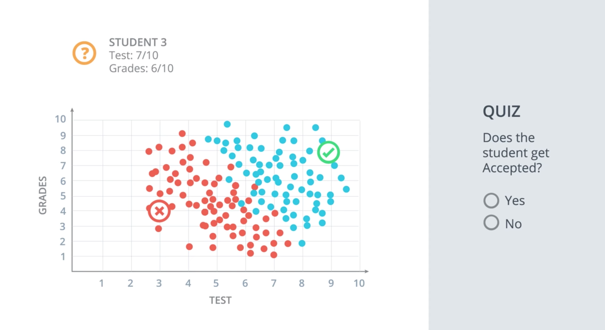

---


layout: post
title: 机器学习-监督学习-感知器算法
description: 在这章，主要讲解了监督学习相关的技术。
Keywords: 机器学习、模型、评估指标
tagline: 
categories: [ML]
tags: [ML]

---


* 目录
 {:toc  }


## 1、简介

<video controls="" preload="none" style="width:100%; height:100%; object-fit: fill"src="../assets/media/uda-ml/supervisedlearning/perceptron/1-t.mp4"></video>


## 2、分类问题

神经网络
神经网络是机器学习中的一个模型，可以用于两类问题的解答：

分类：把数据划分成不同的类别
回归：建立数据间的连续关系
首先，来解决神经网络的分类问题
我们开始吧！我们首先将解释什么是分类问题，并用一个简单的例子进行讲解。


<video controls="" preload="none" style="width:100%; height:100%; object-fit: fill"src="../assets/media/uda-ml/supervisedlearning/perceptron/2-t.mp4"></video>





### 练习题

学生被录取了吗？

- 是
- 否


## 3、分类问题2

<video controls="" preload="none" style="width:100%; height:100%; object-fit: fill"src="../assets/media/uda-ml/supervisedlearning/perceptron/3-t.mp4"></video>

## 4、线性界线

<video controls="" preload="none" style="width:100%; height:100%; object-fit: fill"src="../assets/media/uda-ml/supervisedlearning/perceptron/4-t.mp4"></video>

## 5、更高纬度的界线

<video controls="" preload="none" style="width:100%; height:100%; object-fit: fill"src="../assets/media/uda-ml/supervisedlearning/perceptron/5-t.mp4"></video>

## 6、感知器

<video controls="" preload="none" style="width:100%; height:100%; object-fit: fill"src="../assets/media/uda-ml/supervisedlearning/perceptron/6-t.mp4"></video>

## 7、用感知器实现简单的逻辑运算
逻辑运算感知器
在这节课，我们要用感知器实现简单的逻辑运算。你将会为最常见的逻辑运算符创建感知器：AND（与）、OR（或） 和 NOT （非）。然后，我们将看看如何处理比较难的 XOR（异或）运算符。我们开始吧！

用感知器实现逻辑运算 - AND （“与”）

<video controls="" preload="none" style="width:100%; height:100%; object-fit: fill"src="../assets/media/uda-ml/supervisedlearning/perceptron/7-t.mp4"></video>


**AND 感知器的权重和偏差是什么？**

将权重（`weight1`、`weight2`）和偏差 `bias` 设为正确的值，以便如上所示地计算 AND 运算。


```python
import pandas as pd

# TODO: Set weight1, weight2, and bias
weight1 = 0.0
weight2 = 0.0
bias = 0.0


# DON'T CHANGE ANYTHING BELOW
# Inputs and outputs
test_inputs = [(0, 0), (0, 1), (1, 0), (1, 1)]
correct_outputs = [False, False, False, True]
outputs = []

# Generate and check output
for test_input, correct_output in zip(test_inputs, correct_outputs):
    linear_combination = weight1 * test_input[0] + weight2 * test_input[1] + bias
    output = int(linear_combination >= 0)
    is_correct_string = 'Yes' if output == correct_output else 'No'
    outputs.append([test_input[0], test_input[1], linear_combination, output, is_correct_string])

# Print output
num_wrong = len([output[4] for output in outputs if output[4] == 'No'])
output_frame = pd.DataFrame(outputs, columns=['Input 1', '  Input 2', '  Linear Combination', '  Activation Output', '  Is Correct'])
if not num_wrong:
    print('Nice!  You got it all correct.\n')
else:
    print('You got {} wrong.  Keep trying!\n'.format(num_wrong))
print(output_frame.to_string(index=False))

```


**用感知器实现逻辑运算 - OR （“或”）**


OR 感知器和 AND 感知器很相似。在下图中，OR 感知器和 AND 感知器的直线一样，只是直线往下移动了。你可以如何处理权重和/或偏差以实现这一效果？请使用下面的 AND 感知器来创建一个 OR 感知器。


### 习题 2/4

从 AND 感知器变成 OR 感知器的两种方法是什么？

- 增大权重
- 减小权重
- 增大单个权重
- 减小单个权重
- 增大偏差大小
- 减小偏差大小


**用感知器实现逻辑运算 - NOT （"非”）**

和我们刚刚研究的其他感知器不一样，NOT 运算仅关心一个输入。如果输入是 `1`，则运算返回 `0`，如果输入是 `0`，则返回 `1`。感知器的其他输入被忽略了。

在此测验中，你将设置权重（`weight1`、`weight2`）和偏差 `bias`，以便对第二个输入进行 NOT 运算，并忽略第一个输入。

```python
import pandas as pd

# TODO: Set weight1, weight2, and bias
weight1 = 0.0
weight2 = 0.0
bias = 0.0


# DON'T CHANGE ANYTHING BELOW
# Inputs and outputs
test_inputs = [(0, 0), (0, 1), (1, 0), (1, 1)]
correct_outputs = [True, False, True, False]
outputs = []

# Generate and check output
for test_input, correct_output in zip(test_inputs, correct_outputs):
    linear_combination = weight1 * test_input[0] + weight2 * test_input[1] + bias
    output = int(linear_combination >= 0)
    is_correct_string = 'Yes' if output == correct_output else 'No'
    outputs.append([test_input[0], test_input[1], linear_combination, output, is_correct_string])

# Print output
num_wrong = len([output[4] for output in outputs if output[4] == 'No'])
output_frame = pd.DataFrame(outputs, columns=['Input 1', '  Input 2', '  Linear Combination', '  Activation Output', '  Is Correct'])
if not num_wrong:
    print('Nice!  You got it all correct.\n')
else:
    print('You got {} wrong.  Keep trying!\n'.format(num_wrong))
print(output_frame.to_string(index=False))

```


<video controls="" preload="none" style="width:100%; height:100%; object-fit: fill"src="../assets/media/uda-ml/supervisedlearning/perceptron/8-t.mp4"></video>


用感知器实现逻辑运算 - XOR （“异或”）


测验：构建一个 XOR 多层感知器

现在我们使用 AND、NOT 和 OR 感知器构建一个多层感知器，以便创建 XOR 逻辑！

下面的神经网络包含三个感知器：A、B 和 C。最后一个 (AND) 已经提供给你了。神经网络的输入来自第一个节点。输出来自最后一个节点。

上面的多层感知器计算出 XOR。每个感知器都是 AND、OR 和 NOT 的逻辑运算。但是，感知器 A、B、C 和 D 并不表明它们的运算。在下面的测验中，请为四个感知器设置正确的运算，以便计算 XOR。


### 习题 4/4

在 XOR 神经网络中为感知器设置运算。

*Checkmark* These are the correct matches.

感知器      运算符

​    A             AND

​    B              OR

​    C             NOT


## 8、感知器技巧 - 计算机如何“学习”分类


在上一部分，你使用你自己的逻辑和数学知识为某些最常见的逻辑运算符创建了感知器。 但是在现实生活中，除了这些非常简单的形式，我们人类是无法靠自己构建这些感知器函数，找到用于分类的曲线的。

下面的视频将告诉你，计算机如何根据我们人类给出的结果，来自己进行构建感知器函数。对于这一点，有一个非常棒的技巧能帮到我们。


<video controls="" preload="none" style="width:100%; height:100%; object-fit: fill"src="../assets/media/uda-ml/supervisedlearning/perceptron/9-t.mp4"></video>


### 练习题

被错误分类的点，希望斜线离自己更近，还是更远？

- 更近
- 更远


<video controls="" preload="none" style="width:100%; height:100%; object-fit: fill"src="../assets/media/uda-ml/supervisedlearning/perceptron/10-t.mp4"></video>

整个数据集中的每一个点都会把分类的结果提供给感知器（分类函数），并调整感知器。——这就是计算机在神经网络算法中，找寻最优感知器的原理。


<video controls="" preload="none" style="width:100%; height:100%; object-fit: fill"src="../assets/media/uda-ml/supervisedlearning/perceptron/11-t.mp4"></video>

<video controls="" preload="none" style="width:100%; height:100%; object-fit: fill"src="../assets/media/uda-ml/supervisedlearning/perceptron/12-t.mp4"></video>


## 9、感知器算法
掌握了感知器技巧后，我们就可以编写完整的感知器运算的算法了！

下面的视频将介绍感知器算法的伪代码，现在你还不需要担心什么是学习速率（learning rate），我们在之后的课程中会详细介绍为什么这里的伪代码中有学习率。

在视频下面的测验中，你将有机会用 Python 将其编成代码，并看看自己的感知器分类成果。加油！

<video controls="" preload="none" style="width:100%; height:100%; object-fit: fill"src="../assets/media/uda-ml/supervisedlearning/perceptron/13-t.mp4"></video>

## 10、小结
恭喜你完成这一节内容！你已经了解什么是感知器算法，并学习了如何利用它来解决分类问题。 接下来，我们将学习其他一些非常有用的分类算法。s


