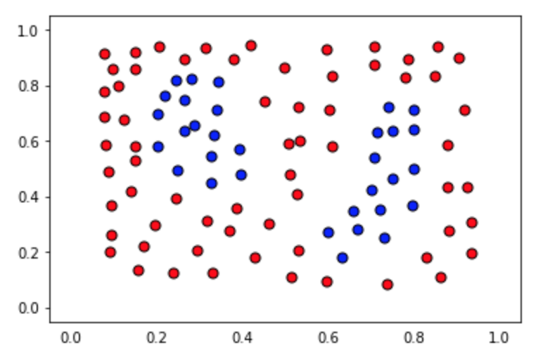

---


layout: post
title: 机器学习-监督学习-决策树
description: 在这章，主要讲解了监督学习相关的技术。
Keywords: 机器学习、模型、评估指标
tagline: 
categories: [ML]
tags: [ML]

---


* 目录
 {:toc  }
# 


## 1、简介

<video id="video" controls="" preload="none" style="width:100%; height:100%; object-fit: fill" src="../assets/media/uda-ml/supervisedlearning/decision/1-t.mp4"></video>

## 2、应用推荐 1 

<video id="video" controls="" preload="none" style="width:100%; height:100%; object-fit: fill" src="../assets/media/uda-ml/supervisedlearning/decision/2-t.mp4"></video>

以下练习是基于这张表格的数据：


### 习题 1/3

针对办公室的职业女性，我们推荐哪一个应用？

- Pokemon Go
- Whatsapp
- Snapchat


### 习题 2/3

针对在工厂工作的男性，我们推荐哪一个应用？

- Pokemon Go
- Whatsapp
- Snapchat


### 习题 3/3

针对高中生女孩，我们推荐哪一个应用？

- Pokemon Go
- Whatsapp
- Snapchat


## 3、应用推荐2
<video id="video" controls="" preload="none" style="width:100%; height:100%; object-fit: fill" src="../assets/media/uda-ml/supervisedlearning/decision/3-t.mp4"></video>


### 练习题

在性别与职业之间，哪一个对于预测用户下载什么应用程序似乎更具决策性？

- 性别
- 职业


## 4、应用推荐3

<video id="video" controls="" preload="none" style="width:100%; height:100%; object-fit: fill" src="../assets/media/uda-ml/supervisedlearning/decision/4-t.mp4"></video>

## 5、练习：学生录取资格

<video id="video" controls="" preload="none" style="width:100%; height:100%; object-fit: fill" src="../assets/media/uda-ml/supervisedlearning/decision/5-t.mp4"></video>

下方的练习将会基于如下数据。


### 练习题

在水平切割线和纵向切割线中，哪一项可以更好地分割开蓝点与红点？

- 水平切割线
- 纵向切割线


## 6、参考答案：学生录取资格
<video id="video" controls="" preload="none" style="width:100%; height:100%; object-fit: fill "src="../assets/media/uda-ml/supervisedlearning/decision/6-t.mp4"></video>

## 7、熵

<video id="video" controls="" preload="none" style="width:100%; height:100%; object-fit: fill "src="../assets/media/uda-ml/supervisedlearning/decision/7-t.mp4"></video>

## 8、熵公式1

<video id="video" controls="" preload="none" style="width:100%; height:100%; object-fit: fill "src="../assets/media/uda-ml/supervisedlearning/decision/8-t.mp4"></video>

### 练习题

将赢得游戏的概率与桶相匹配（最好 = 最有可能赢，最差 = 最低可能赢）

*Checkmark* These are the correct matches.

### 桶                           概率

4个红球                                   最好

3个红球，1个蓝球                  中等

2个红球，2个蓝球                  最差


## 9、熵公式2

<video id="video" controls="" preload="none" style="width:100%; height:100%; object-fit: fill "src="../assets/media/uda-ml/supervisedlearning/decision/9-t.mp4"></video>

### 练习题

以下哪一函数可以计算出总和？

- sin
- cos
- log（对）
- exp


## 10、熵公式3
<video id="video" controls="" preload="none" style="width:100%; height:100%; object-fit: fill" src="../assets/media/uda-ml/supervisedlearning/decision/10-t.mp4"></video>

修正：视频 1:33 处，视频中公式“m-n" 应该为"m+n"。


## 11、练习：信息增益

<video id="video" controls="" preload="none" style="width:100%; height:100%; object-fit: fill" src="../assets/media/uda-ml/supervisedlearning/decision/11-t.mp4"></video>


### 练习题

我们从哪里获得更多信息？ 我们在哪里获得较少信息？ 请匹配以下条目。

*Checkmark* These are the correct matches.

### 决策树

### 信息增益

1   最小

2   中等

3   最大


## 12、练习答案：信息增益
<video id="video" controls="" preload="none" style="width:100%; height:100%; object-fit: fill" src="../assets/media/uda-ml/supervisedlearning/decision/12-t.mp4"></video>


## 13、信息增益最大化
<video id="video" controls="" preload="none" style="width:100%; height:100%; object-fit: fill"src="../assets/media/uda-ml/supervisedlearning/decision/13-t.mp4"></video>

## 14、随机森林

<video id="video" controls="" preload="none" style="width:100%; height:100%; object-fit: fill" src="../assets/media/uda-ml/supervisedlearning/decision/14-t.mp4"></video>

## 15、超参数

# 决策树的超参数

在决策树中有一些相当重要的超参数：

### 最大深度

决策树的最大深度指树根和叶子之间的最大长度。当决策树的最大深度为 kk 时，它最多可以拥有 2^k2k 片叶子。


Maximum depth of a decision tree 决策树的最大深度


### 每片叶子的最小样本数

在分裂节点时，很有可能一片叶子上有 99 个样本，而另一片叶子上只有 1 个样本。这将使我们陷入困境，并造成资源和时间的浪费。如果想避免这种问题，我们可以设置每片叶子允许的最小样本数。


每片叶子的最小样本数


这个数字可以被指定为一个整数，也可以是一个浮点数。如果它是整数，它将表示这片叶子上的最小样本数。如果它是个浮点数，它将被视作每片叶子上的最小样本比例。比如，0.1 或 10% 表示如果一片叶子上的样本数量小于该节点中样本数量的 10%，这种分裂将不被允许。


### 每次分裂的最小样本数

这个参数与每片叶子上的最小样本树相同，只不过是应用在节点的分裂当中。


### 最大特征数

有时，我们会遇到特征数量过于庞大，而无法建立决策树的情况。在这种状况下，对于每一个分裂，我们都需要检查整个数据集中的每一个特征。这种过程极为繁琐。而解决方案之一是限制每个分裂中查找的特征数。如果这个数字足够庞大，我们很有可能在查找的特征中找到良好特征（尽管也许并不是完美特征）。然而，如果这个数字小于特征数，这将极大加快我们的计算速度。


### 练习题

让我们来测试一下。哪种特征与欠拟合相关，哪种又和过拟合相关？请将答案拖到对应的方框中。

*Checkmark* These are the correct matches.

### 特征

### 欠拟合/过拟合

较小的最大深度

欠拟合

较大的最大深度

过拟合

较小的每片叶子的最小样本数

过拟合

较大的每片叶子的最小样本数

欠拟合


## 16、sklearn中的决策树


在此部分，你将使用决策树拟合给定样本数据集。

在此之前，我们先了解下构建此模型所需的工具。

对于决策树模型，你将使用 scikit-learn 的 [`Decision Tree Classifier`](http://scikit-learn.org/stable/modules/generated/sklearn.tree.DecisionTreeClassifier.html) 类。该类提供了定义模型并将模型与数据进行拟合的函数。

```python
>>> from sklearn.tree import DecisionTreeClassifier
>>> model = DecisionTreeClassifier()
>>> model.fit(x_values, y_values)
```

在上述示例中，`model` 变量是一个拟合到数据 `x_values` 和 `y_values` 的决策树模型。拟合模型是指寻找拟合训练数据的最佳线条。我们使用模型的 `predict()` 函数进行两项预测。

```python
>>> print(model.predict([ [0.2, 0.8], [0.5, 0.4] ]))
[[ 0., 1.]]
```

该模型返回了一个预测结果数组，每个输入数组一个预测结果。第一个输入 `[0.2, 0.8]` 的预测结果为 `0.`。第二个输入 `[0.5, 0.4]` 的预测结果为 `1.`。

### 超参数

当我们定义模型时，可以指定超参数。在实践中，最常见的超参数包括：

- `max_depth`：树中的最大层级数量。
- `min_samples_leaf`：叶子允许的最低样本数量。
- `min_samples_split`：拆分内部节点所需的最低样本数量。
- `max_features`：寻找最佳拆分方法时要考虑的特征数量。

例如，在此例中，我们定义了一个模型：树的最大深度 `max_depth` 为7，每个叶子的最低元素数量 `min_samples_leaf` 是 10。

```python
>>> model = DecisionTreeClassifier(max_depth = 7, min_samples_leaf = 10)
```

## 决策树练习

在此练习中，你将处理以下样本数据集，目标是定义一个准确率达到 100% 的模型。





你可以在以下练习的“data.csv”标签页中找到数据文件。它包含三列，前两列由点的坐标组成，第三列为标签。

我们将为你加载数据并将数据拆分为特征 `X` 和标签 `y`。

### 你需要完成以下每步：

**1. 构建决策树模型** *使用 scikit-learn 的 [`DecisionTree`](http://scikit-learn.org/stable/modules/generated/sklearn.tree.DecisionTreeClassifier.html) 构建决策树分类模型，并将其赋值给变量 `model`。

**2. 将模型与数据进行拟合**

- 你不需要指定任何超参数，因为默认的超参数将以 100% 的准确率拟合数据。但是，建议你实验这些超参数，例如 `max_depth` 和 `min_samples_leaf`，并尝试找到最简单的潜在模型，即最不太可能过拟合的模型！

**3. 使用模型进行预测**

- 预测训练集的标签，并将此列表赋值给变量 `y_pred`。

**4. 计算模型的准确率**

- 为此，使用 sklearn 函数 [`accuracy_score`](http://scikit-learn.org/stable/modules/generated/sklearn.metrics.accuracy_score.html)。

点击 **测试答案 (Test Run)** 后，你将能够看到模型的边界区域，这些边界区域可以帮助你调整并获得正确的参数（如果需要的话）。

**注意：**这道练习要求在训练集上的准确率达到 100%。当然，要小心过拟合！如果参数选择非常大的值，你将很好地拟合训练集，但是可能并不是最好的模型。尝试寻找能够完成任务的最小可能参数，这样过拟合的几率就更小，虽然我们不会对此进行评分。


```python
# Import statements 
from sklearn.tree import DecisionTreeClassifier
from sklearn.metrics import accuracy_score
import pandas as pd
import numpy as np

# Read the data.
data = np.asarray(pd.read_csv('data.csv', header=None))
# Assign the features to the variable X, and the labels to the variable y. 
X = data[:,0:2]
y = data[:,2]

# TODO: Create the decision tree model and assign it to the variable model.
# You won't need to, but if you'd like, play with hyperparameters such
# as max_depth and min_samples_leaf and see what they do to the decision
# boundary.
model = None

# TODO: Fit the model.

# TODO: Make predictions. Store them in the variable y_pred.
y_pred = None

# TODO: Calculate the accuracy and assign it to the variable acc.
acc = None

```


[数据](../assets/media/uda-ml/supervisedlearning/decision/data.csv)


## 17、使用决策树探索谈谈尼克号

[数据](../assets/media/uda-ml/supervisedlearning/decision/17)


## 18、解决方案


## 19、结论


恭喜你！ 在本节中，你已经了解了有关决策树的所有信息，以及如何使用它们进行预测。 在下一节中见！