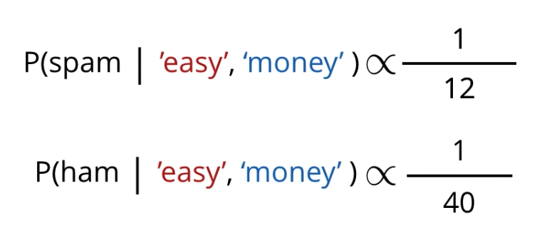

---

layout: post
title: 机器学习-监督学习-朴素贝叶斯
description: 在这章，主要讲解了监督学习相关的技术。
Keywords: 机器学习、模型、评估指标
tagline: 
categories: [ML]
tags: [ML]

---

* 目录
 {:toc  }
# 

## 1、简介

<video id="video" controls="" preload="none" style="width:100%; height:100%; object-fit: fill"src="../assets/media/uda-ml/supervisedlearning/bys/1-t.mp4"></video>

## 2、猜测人

<video id="video" controls="" preload="none" style="width:100%; height:100%; object-fit: fill"src="../assets/media/uda-ml/supervisedlearning/bys/2-t.mp4"></video>

## 3、已知与推断

<video id="video" controls="" preload="none" style="width:100%; height:100%; object-fit: fill"src="../assets/media/uda-ml/supervisedlearning/bys/3-t.mp4"></video>

## 4、再次猜测

<video id="video" controls="" preload="none" style="width:100%; height:100%; object-fit: fill"src="../assets/media/uda-ml/supervisedlearning/bys/4-t.mp4"></video>

## 5、贝叶斯定理

<video id="video" controls="" preload="none" style="width:100%; height:100%; object-fit: fill"src="../assets/media/uda-ml/supervisedlearning/bys/5-t.mp4"></video>

## 6、联系：误报

<video id="video" controls="" preload="none" style="width:100%; height:100%; object-fit: fill"src="../assets/media/uda-ml/supervisedlearning/bys/6-t.mp4"></video>

### 练习题

你认为生病的可能性是多少？

- 0%-20%
- 20%-40%
- 20%-60%
- 60%-80%
- 80%-100%

## 7、参考答案：误报

<video id="video" controls="" preload="none" style="width:100%; height:100%; object-fit: fill"src="../assets/media/uda-ml/supervisedlearning/bys/7-t.mp4"></video>

## 8、贝叶斯学习 1
<video id="video" controls="" preload="none" style="width:100%; height:100%; object-fit: fill"src="../assets/media/uda-ml/supervisedlearning/bys/8-t.mp4"></video>

### 习题 1/2

假设一封邮件是垃圾邮件，其中包含单词 'easy' 的概率是多少？

- 1/5
- 1/4
- 1/3
- 2/3
- 4/5

### 习题 2/2

假设一封邮件是垃圾邮件，其中包含单词 'money' 的概率是多少？

- 1/5
- 1/4
- 1/3
- 2/3
- 4/5

## 9、贝叶斯学习 2

<video id="video" controls="" preload="none" style="width:100%; height:100%; object-fit: fill"src="../assets/media/uda-ml/supervisedlearning/bys/9-t.mp4"></video>

## 10、贝叶斯学习 3
<video id="video" controls="" preload="none" style="width:100%; height:100%; object-fit: fill"src="../assets/media/uda-ml/supervisedlearning/bys/10-t.mp4"></video>

备注：视频1:49处右边概率从上到下依次应为 1/4，1/8，1/8，1/2。

## 11、朴素贝叶斯算法 1
<video id="video" controls="" preload="none" style="width:100%; height:100%; object-fit: fill"src="../assets/media/uda-ml/supervisedlearning/bys/11-t.mp4"></video>

### 练习题

Spam 和 ham 的正确概率是多少？ 换句话说，哪两个数字加起来是 1， 并且与 1/12 和1/40 成比例？

- 11/12 和 1/12
- 12/52 和 40/52
- 1/12 和 1/40
- 10/13 和 3/13

下一项

## 12、朴素贝叶斯算法 2

<video id="video" controls="" preload="none" style="width:100%; height:100%; object-fit: fill" src="../assets/media/uda-ml/supervisedlearning/bys/12-t.mp4"></video>

## 13、项目：构建垃圾邮件分类器

## 简介

**垃圾邮件检测**是现今网络中最重要的机器学习应用案例领。几乎所有的大型邮箱服务提供商都内置了垃圾邮件检测系统，并自动将此类邮件归类为“垃圾邮件”。

**在此项目中，我们将使用朴素贝叶斯算法来创建一个模型，并根据我们对模型展开的训练将数据集文本分类为是否为垃圾文本**。你需要直观地了解哪些文本信息属于垃圾信息。

## 垃圾邮件是什么？

通常包含字眼“免费（'free'）”、“赢取（'win'）”、“获奖者（'winner'）”、“现金（'cash'）”、“奖品（'prize）”等，因为这些字眼专门用于吸引你的注意，诱惑你打开邮件。此外，垃圾邮件喜欢让所有单词都大写，并使用大量的感叹号。对收件人来说，通常很容易就判断出是否为垃圾邮件，我们的目标是训练模型来帮助我们识别垃圾邮件！

**识别垃圾邮件是二元分类问题，因为邮件要么“是垃圾邮件（'Spam'）”，要么“不是垃圾邮件（'Not Spam'）”，不会再有第三种情况。此外，这是监督学习问题，因为我们知道要预测什么。我们将向模型提供带有标签的数据集，使其从中学习规律并作出未来预测。**

## 14、项目概述

此项目分为以下步骤：

- 第 0 步: 朴素贝叶斯定理简介
- 第 1.1 步: 了解我们的数据集
- 第 1.2 步: 数据预处理
- 第 2.1 步: Bag of Words(BoW)
- 第 2.2 步: 从头实现 BoW
- 第 2.3 步: 在 scikit-learn 中实现 Bag of Words
- 第 3.1 步: 训练和测试数据集
- 第 3.2 步: 向我们的数据集中应用 Bag of Words 处理流程
- 第 4.1 步: 从头实现贝叶斯定理
- 第 4.2 步: 从头实现朴素贝叶斯定理
- 第 5 步: 使用 scikit-learn 实现朴素贝叶斯定理
- 第 6 步: 评估模型
- 第 7 步: 结论

你可以通过转到此**链接**跟着我们一起操作。

## 15、构建垃圾邮件分类
[数据](../assets/media/uda-ml/supervisedlearning/bys/垃圾邮件分类)

<video id="video" controls="" preload="none" style="width:100%; height:100%; object-fit: fill"src="../assets/media/uda-ml/supervisedlearning/bys/13-t.mp4"></video>