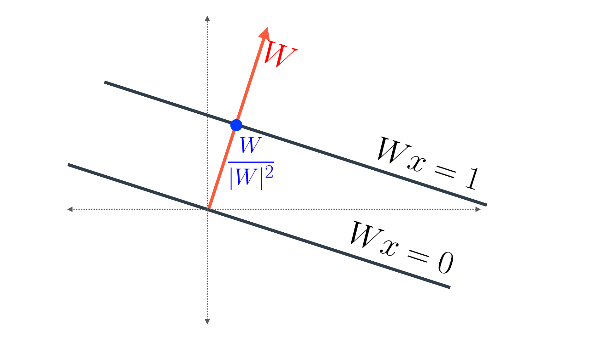

---


layout: post
title: 机器学习-监督学习-支持向量机
description: 在这章，主要讲解了监督学习相关的技术。
Keywords: 机器学习、模型、评估指标
tagline: 
categories: [ML]
tags: [ML]

---


* 目录
 {:toc  }
# 

## 1、简介

<video controls="" preload="none" style="width:100%; height:100%; object-fit: fill"   src="../assets/media/uda-ml/supervisedlearning/xlj/1-t.mp4"></video>

## 2、那条线更好

<video controls="" preload="none" style="width:100%; height:100%; object-fit: fill"   src="../assets/media/uda-ml/supervisedlearning/xlj/2-t.mp4"></video>

## 3、距离最小化

<video controls="" preload="none" style="width:100%; height:100%; object-fit: fill"   src="../assets/media/uda-ml/supervisedlearning/xlj/3-t.mp4"></video>

## 4、误差最小化

<video controls="" preload="none" style="width:100%; height:100%; object-fit: fill"   src="../assets/media/uda-ml/supervisedlearning/xlj/4-t.mp4"></video>

## 5、感知器算法

让我们回想一下我们之前学习的内容：感知器算法。 之前，我们把它看作是一个技巧，我们从一条随机线开始，然后在一个步骤上进行迭代，以便慢慢走向错误分类点，这样我们可以正确地对它们进行分类。 但是，我们也可以将此算法看作是最小化误差函数的算法。 以下是做到这一点的方法：

<video controls="" preload="none" style="width:100%; height:100%; object-fit: fill"   src="../assets/media/uda-ml/supervisedlearning/xlj/5-t.mp4"></video>

## 6、分类误差

<video controls="" preload="none" style="width:100%; height:100%; object-fit: fill"   src="../assets/media/uda-ml/supervisedlearning/xlj/6-t.mp4"></video>

## 7、边际误差


<video controls="" preload="none" style="width:100%; height:100%; object-fit: fill"   src="../assets/media/uda-ml/supervisedlearning/xlj/7-t.mp4"></video>

## 8、（选修）边际误差计算

在本选修部分，我们将会计算 SVM 中两个间隔之间的距离。

首先，W = (w_1, w_2)W=(w1,w2) ，x = (x_1,x_2)x=(x1,x2)，并且 Wx = w_1x_1 + w_2x_2Wx=w1x1+w2x2.

请注意，在这里我们有三条线，方程如下：

- Wx+b=1Wx+b=1
- Wx+b=0Wx+b=0
- Wx+b=-1Wx+b=−1

由于这三条线为等距平行线，要想确定第一条线和第三条线之间的距离，我们只需要计算前两条线之间的距离，接着将这个数字乘以二。这也就是说我们需要确定图 1 中前两条线之间的距离。


图 1


请注意，由于我们只需计算线条之间的距离，因此也可以将线条平移，直到其中一条线与原点相交（图 2）。这时得到的方程如下：

- Wx=0Wx=0
- Wx=1Wx=1


图 2


现在，第一条线的方程为 Wx=0Wx=0，这意味着它与标记为红色的向量（图 3） W = (w_1, w_2)W=(w1,w2) 垂直。


图 3


该向量与方程为 $$Wx=1Wx=1$$ 的线条相交于蓝点（图 4）。假设该点的坐标为 (p,q)(p,q)。那么我们可以得到下面两个结果：

- $$w_1p + w_2q = 1$$   $$w1p+w2q=1 $$（由于该点位于这条线上），并且
- 由于该点位于向量 $$W = (w_1, w_2)$$ $$W=(w1,w2)$$ 上，(p,q)(p,q) 是 $$(w_1, w_2)(w1,w2) $$的倍数。

我们可以这样求解这个方程：对于某个 k 值而言，有 $$(p,q) = k(w_1, w_2)(p,q)=k(w1,w2)$$。那么我们的第一个方程将被转换为 $$k(w_1^2 + w_2^2) = 1.k(w12+w22)=1.$$。因此，$$k = \frac{1}{w_1^2+w_2^2} = \frac{1}{|W|^2}k=w12+w221=∣W∣21$$。这也就是说，蓝点表示向量$$ \frac{W}{|W|^2}∣W∣2W $$，如图 4 所示。




图 4


现在，两条线之间的距离是蓝色向量的范数。由于分母是一个标量，向量 $$\frac{W}{|W|^2}∣W∣2W $$的范数正是 $$\frac{|W|}{|W|^2}∣W∣2∣W∣$$，与$$ \frac{1}{|W|}∣W∣1$$（图 5）相同。


图 5


最后，最终距离是这连续两条平行线（图 6）之间的距离之和。由于每两条线之间的距离为 \frac{1}{|W|}∣W∣1，那么总距离为$$ \frac{2}{|W|}∣W∣2 $$。


图 6


## 9、误差函数
<video controls="" preload="none" style="width:100%; height:100%; object-fit: fill"   src="../assets/media/uda-ml/supervisedlearning/xlj/8-t.mp4"></video>

## 10、C参数

<video controls="" preload="none" style="width:100%; height:100%; object-fit: fill"   src="../assets/media/uda-ml/supervisedlearning/xlj/9-t.mp4"></video>

## 11、多项式内核1


<video controls="" preload="none" style="width:100%; height:100%; object-fit: fill"   src="../assets/media/uda-ml/supervisedlearning/xlj/10-t.mp4"></video>

## 12、多项式内核2

<video controls="" preload="none" style="width:100%; height:100%; object-fit: fill"   src="../assets/media/uda-ml/supervisedlearning/xlj/11-t.mp4"></video>

## 13、多项式内核3

<video controls="" preload="none" style="width:100%; height:100%; object-fit: fill"   src="../assets/media/uda-ml/supervisedlearning/xlj/12-t.mp4"></video>

## 14、RBF核函数1

<video controls="" preload="none" style="width:100%; height:100%; object-fit: fill"   src="../assets/media/uda-ml/supervisedlearning/xlj/13-t.mp4"></video>

## 15、RBF核函数2

<video controls="" preload="none" style="width:100%; height:100%; object-fit: fill"   src="../assets/media/uda-ml/supervisedlearning/xlj/14-t.mp4"></video>

## 16、RBF核函数3

<video controls="" preload="none" style="width:100%; height:100%; object-fit: fill"   src="../assets/media/uda-ml/supervisedlearning/xlj/15-t.mp4"></video>

## 17、sklearn 中的支持向量机


在此部分，你将使用支持向量机拟合给定样本数据集。

在此之前，我们先了解下构建此模型所需的工具。

对于支持向量机模型，你将使用 scikit-learn 的 [`SVC`](http://scikit-learn.org/stable/modules/generated/sklearn.svm.SVC.html) 类。该类提供了定义模型并将模型与数据进行拟合的函数。

```python
>>> from sklearn.svm import SVC
>>> model = SVC()
>>> model.fit(x_values, y_values)
```

在上述示例中，`model` 变量是一个拟合到数据 `x_values` 和 `y_values` 的支持向量机模型。拟合模型是指寻找拟合训练数据的最佳界线。我们使用模型的 `predict()` 函数进行两项预测。

```python
>>> print(model.predict([ [0.2, 0.8], [0.5, 0.4] ]))
[[ 0., 1.]]
```

该模型返回了一个预测结果数组，每个输入数组一个预测结果。第一个输入 `[0.2, 0.8]` 的预测结果为 `0.`。第二个输入 `[0.5, 0.4]` 的预测结果为 `1.`。

**超参数**

当我们定义模型时，可以指定超参数。正如在此部分中看到的，最常见的超参数包括：

- `C`：C 参数。
- `kernel`：内核。最常见的内核为 'linear'、'poly' 和 'rbf'。
- `degree`：如果内核是多项式，则此参数为内核中的最大单项式次数。
- `gamma`：如果内核是径向基函数，则此参数为 γ 参数。

例如，下面我们定义了一个次数为4、C 参数为 0.1 的多项式内核模型。

```python
>>> model = SVC(kernel='poly', degree=4, C=0.1)
```

**支持向量机练习**

在这道练习中，你将处理以下样本数据集，目标是定义一个准确率达到 100% 的模型。


你可以在以下练习的“data.csv”标签页中找到数据文件。它包含三列，前两列由数据点的坐标组成，第三列为标签。

我们将为你加载数据并将数据拆分为特征 `X` 和标签 `y`。

### 你需要完成以下步骤：

**1. 构建支持向量机模型** *使用 scikit-learn 的 [`SVC`](http://scikit-learn.org/stable/modules/generated/sklearn.svm.SVC.html) 创建支持向量机分类模型并将其赋值给变量 `model`。

**2. 将模型与数据进行拟合**

- 如果有必要的话，指定一些超参数。目标是在数据集中获得 100% 的准确率。 *提示：并非所有内核都合适。*

**3. 使用模型进行预测**

- 预测训练集的标签，并将此列表赋值给变量 `y_pred`。

**4. 计算模型的准确率** *为此，使用 sklearn 函数 [`accuracy_score`](http://scikit-learn.org/stable/modules/generated/sklearn.metrics.accuracy_score.html)。

点击**测试答案 (Test Run)**后，你将能够看到模型的边界区域，这些边界区域可以帮助你调整并获得正确的参数（如果需要的话）。

**注意：**这道练习要求在训练集上的准确率达到 100%。当然，要小心过拟合！如果参数选择非常大的值，你将很好地拟合训练集，但是可能并不是最好的模型。尝试寻找能够完成任务的最小可能参数，这样过拟合的几率就更小，虽然我们不会对此进行评分。

```python
# Import statements 
from sklearn.svm import SVC
from sklearn.metrics import accuracy_score
import pandas as pd
import numpy as np

# Read the data.
data = np.asarray(pd.read_csv('data.csv', header=None))
# Assign the features to the variable X, and the labels to the variable y. 
X = data[:,0:2]
y = data[:,2]

# TODO: Create the model and assign it to the variable model.
# Find the right parameters for this model to achieve 100% accuracy on the dataset.
model = SVC(kernel='rbf', gamma=27)

# TODO: Fit the model.
model.fit(X,y)

# TODO: Make predictions. Store them in the variable y_pred.
y_pred = model.predict(X)

# TODO: Calculate the accuracy and assign it to the variable acc.
acc = accuracy_score(y, y_pred)

```

## 18、总结
恭喜你完成这一节的学习！你现在已经知道了什么是 SVM，也知道如何在 sklearn 中实现它们。 做得好棒！