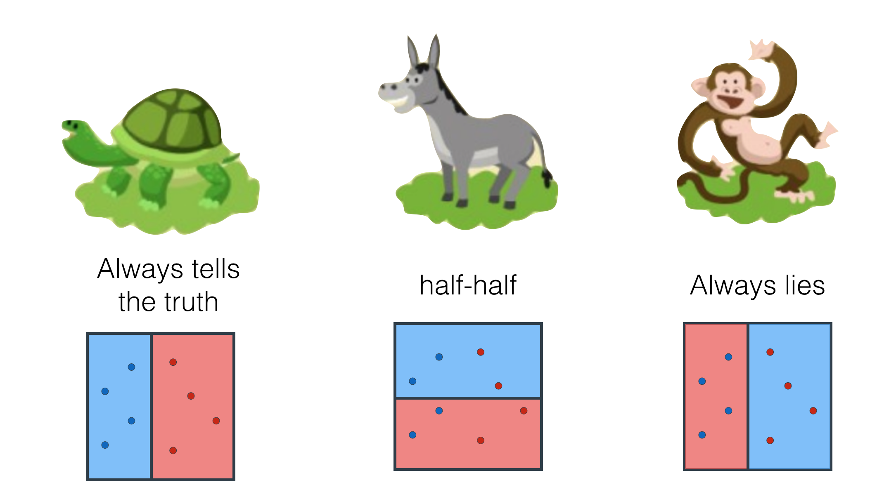
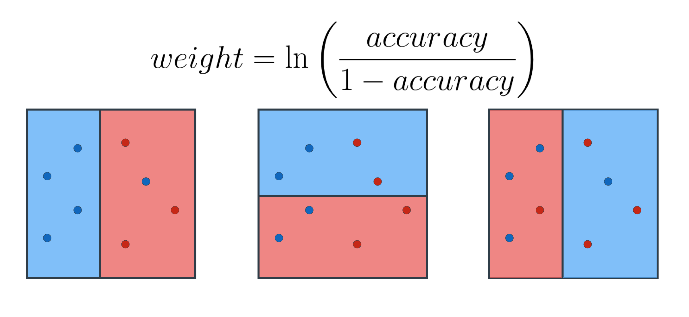

---


layout: post
title: 机器学习-监督学习-集合方法
description: 在这章，主要讲解了监督学习相关的技术。
Keywords: 机器学习、模型、评估指标
tagline: 
categories: [ML]
tags: [ML]

---


* 目录
 {:toc  }
# 

## 1、简介


<video controls="" preload="none" style="width:100%; height:100%; object-fit: fill"   src="../assets/media/uda-ml/supervisedlearning/jc/1-t.mp4"></video>

## 2、bagging

<video controls="" preload="none" style="width:100%; height:100%; object-fit: fill"   src="../assets/media/uda-ml/supervisedlearning/jc/2-t.mp4"></video>


## 3、AdaBoost

<video controls="" preload="none" style="width:100%; height:100%; object-fit: fill"   src="../assets/media/uda-ml/supervisedlearning/jc/3-t.mp4"></video>

## 4、数据权重

<video controls="" preload="none" style="width:100%; height:100%; object-fit: fill"   src="../assets/media/uda-ml/supervisedlearning/jc/4-t.mp4"></video>

## 5、为模型赋值1

<video controls="" preload="none" style="width:100%; height:100%; object-fit: fill"   src="../assets/media/uda-ml/supervisedlearning/jc/5-t.mp4"></video>

**哪个模型最糟糕？**




**练习题**

基于已有的信息，哪一个模型是最糟糕的？

- 总是讲真话的模型
- 一半是真话 一半是谎言的模型
- 总是说谎话的模型


## 6、为模型赋值2

<video controls="" preload="none" style="width:100%; height:100%; object-fit: fill"   src="../assets/media/uda-ml/supervisedlearning/jc/6-t.mp4"></video>

是的 答案显而易见

And yes, it's easy to think.





## 7、为模型赋值3

<video controls="" preload="none" style="width:100%; height:100%; object-fit: fill"   src="../assets/media/uda-ml/supervisedlearning/jc/7-t.mp4"></video>


## 8、集合模型
<video controls="" preload="none" style="width:100%; height:100%; object-fit: fill"   src="../assets/media/uda-ml/supervisedlearning/jc/8-t.mp4"></video>

## 9、sklearn 中的 AdaBoost

在 sklearn 中建立 AdaBoost 模型与建立其他模型相同。你可以使用 scikit-learn 的 [`AdaBoost Classifier`](http://scikit-learn.org/stable/modules/generated/sklearn.ensemble.AdaBoostClassifier.html) 类。该类提供函数来定义你的模型，并将模型与数据进行拟合。

```python
>>> from sklearn.ensemble import AdaBoostClassifier
>>> model = AdaBoostClassifier()
>>> model.fit(x_train, y_train)
>>> model.predict(x_test)
```

在上面的例子中，`model` 变量是一个决策树模型，它与数据 `x_values` 和 `y_values` 进行拟合。函数 `fit` 和 `predict` 的功能与之前相同。

### 超参数

当我们定义模型时，我们可以确定超参数。在实际操作中，最常见的超参数为：

- `base_estimator`: 弱学习器使用的模型（**切勿忘记导入该模型**）。
- `n_estimators`: 使用的弱学习器的最大数量。

比如在下面的例子中，我们定义了一个模型，它使用 max_depth 为 2 的决策树作为弱学习器，并且它允许的弱学习器的最大数量为 4。

```python
>>> from sklearn.tree import DecisionTreeClassifier
>>> model = AdaBoostClassifier(base_estimator = DecisionTreeClassifier(max_depth=2), n_estimators = 4)
```


## 10、相关学习资源

**AdaBoost 上的学习资源**

如果你学有余力，希望了解更多，这里有一些 AdaBoost 的优秀资源，推荐给你：

- 这是一篇由 Freund 和 Schapire 合著的原始[论文](https://cseweb.ucsd.edu/~yfreund/papers/IntroToBoosting.pdf)。
- 由 Freund 和 Schapire 合著的关于Adaboost几项实验的后续[论文](https://people.cs.pitt.edu/~milos/courses/cs2750/Readings/boosting.pdf)。
- 来自 Schapire 很棒的[教程](https://s3.cn-north-1.amazonaws.com.cn/static-documents/nd101/MLND+documents/schapire.pdf)。


## 11、小结

<video controls="" preload="none" style="width:100%; height:100%; object-fit: fill"   src="../assets/media/uda-ml/supervisedlearning/jc/9-t.mp4"></video>