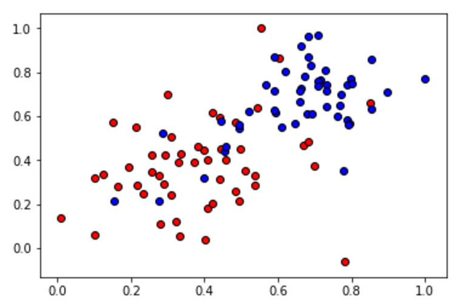

---
bg


layout: post
title: 机器学习-深度学习-神经网络
description: 在这章，主要讲解了监督学习相关的技术。
Keywords: 机器学习、模型、评估指标
tagline: 
categories: [ML]
tags: [ML]

---


* 目录
 {:toc  }
# 

<!--## 1、欢迎

你好！ 欢迎来到神经网络部分！ 本节将基于你先前在感知算法部分中开始的示例部分进行拓展。因此，你可能会看到一些你以前看过的视频。 如果你需要回顾，可以再学习一遍。如果你不需要回顾，可以直接跳过它们，继续学习新内容。

## 2、简介

<video controls="" preload="none" style="width:100%; height:100%; object-fit: fill"  src="../assets/media/uda-ml/deep/sd/1-t.mp4"></video>

## 3、分类问题

神经网络是机器学习中的一个模型，可以用于两类问题的解答：

分类：把数据划分成不同的类别
回归：建立数据间的连续关系
首先，来解决神经网络的分类问题
我们开始吧！我们首先将解释什么是分类问题，并用一个简单的例子进行讲解。


<video controls="" preload="none" style="width:100%; height:100%; object-fit: fill"  src="../assets/media/uda-ml/deep/sd/2-t.mp4"></video>


## 4、分类问题2

<video controls="" preload="none" style="width:100%; height:100%; object-fit: fill"  src="../assets/media/uda-ml/deep/sd/3-t.mp4"></video>


## 5、线性界面

<video controls="" preload="none" style="width:100%; height:100%; object-fit: fill"  src="../assets/media/uda-ml/deep/sd/4-t.mp4"></video>

## 6、更高维度的界线

<video controls="" preload="none" style="width:100%; height:100%; object-fit: fill"  src="../assets/media/uda-ml/deep/sd/5-t.mp4"></video>
修正：视频中表格下方的箭头囊括范围应不包含最后一列。

## 7、感知器

<video controls="" preload="none" style="width:100%; height:100%; object-fit: fill"  src="../assets/media/uda-ml/deep/sd/6-t.mp4"></video>
备注：视频 03:24 处的函数应改为 y = 0 if x < 0。

## 8、用感知器实现简单逻辑运算

在这节课，我们要用感知器实现简单的逻辑运算。你将会为最常见的逻辑运算符创建感知器：AND（与）、OR（或） 和 NOT （非）。然后，我们将看看如何处理比较难的 XOR（异或）运算符。我们开始吧！

用感知器实现逻辑运算 - AND （“与”）

<video controls="" preload="none" style="width:100%; height:100%; object-fit: fill"  src="../assets/media/uda-ml/deep/sd/7-t.mp4"></video>

AND 感知器的权重和偏差是什么？
将权重（weight1、weight2）和偏差 bias 设为正确的值，以便如上所示地计算 AND 运算。


```python
import pandas as pd

# TODO: Set weight1, weight2, and bias
weight1 = 0.0
weight2 = 0.0
bias = 0.0


# DON'T CHANGE ANYTHING BELOW
# Inputs and outputs
test_inputs = [(0, 0), (0, 1), (1, 0), (1, 1)]
correct_outputs = [False, False, False, True]
outputs = []

# Generate and check output
for test_input, correct_output in zip(test_inputs, correct_outputs):
    linear_combination = weight1 * test_input[0] + weight2 * test_input[1] + bias
    output = int(linear_combination >= 0)
    is_correct_string = 'Yes' if output == correct_output else 'No'
    outputs.append([test_input[0], test_input[1], linear_combination, output, is_correct_string])

# Print output
num_wrong = len([output[4] for output in outputs if output[4] == 'No'])
output_frame = pd.DataFrame(outputs, columns=['Input 1', '  Input 2', '  Linear Combination', '  Activation Output', '  Is Correct'])
if not num_wrong:
    print('Nice!  You got it all correct.\n')
else:
    print('You got {} wrong.  Keep trying!\n'.format(num_wrong))
print(output_frame.to_string(index=False))

```

**用感知器实现逻辑运算 - OR （“或”）**


OR 感知器和 AND 感知器很相似。在下图中，OR 感知器和 AND 感知器的直线一样，只是直线往下移动了。你可以如何处理权重和/或偏差以实现这一效果？请使用下面的 AND 感知器来创建一个 OR 感知器。


**习题 2/4**

从 AND 感知器变成 OR 感知器的两种方法是什么？

- 增大权重
- 减小权重
- 增大单个权重
- 减小单个权重
- 增大偏差大小
- 减小偏差大小

**用感知器实现逻辑运算 - NOT （"非”）**

和我们刚刚研究的其他感知器不一样，NOT 运算仅关心一个输入。如果输入是 `1`，则运算返回 `0`，如果输入是 `0`，则返回 `1`。感知器的其他输入被忽略了。

在此测验中，你将设置权重（`weight1`、`weight2`）和偏差 `bias`，以便对第二个输入进行 NOT 运算，并忽略第一个输入。


```python
import pandas as pd

# TODO: Set weight1, weight2, and bias
weight1 = 0.0
weight2 = 0.0
bias = 0.0


# DON'T CHANGE ANYTHING BELOW
# Inputs and outputs
test_inputs = [(0, 0), (0, 1), (1, 0), (1, 1)]
correct_outputs = [True, False, True, False]
outputs = []

# Generate and check output
for test_input, correct_output in zip(test_inputs, correct_outputs):
    linear_combination = weight1 * test_input[0] + weight2 * test_input[1] + bias
    output = int(linear_combination >= 0)
    is_correct_string = 'Yes' if output == correct_output else 'No'
    outputs.append([test_input[0], test_input[1], linear_combination, output, is_correct_string])

# Print output
num_wrong = len([output[4] for output in outputs if output[4] == 'No'])
output_frame = pd.DataFrame(outputs, columns=['Input 1', '  Input 2', '  Linear Combination', '  Activation Output', '  Is Correct'])
if not num_wrong:
    print('Nice!  You got it all correct.\n')
else:
    print('You got {} wrong.  Keep trying!\n'.format(num_wrong))
print(output_frame.to_string(index=False))

```


<video controls="" preload="none" style="width:100%; height:100%; object-fit: fill"  src="../assets/media/uda-ml/deep/sd/8-t.mp4"></video>

**用感知器实现逻辑运算 - XOR （“异或”）**


**测验：构建一个 XOR 多层感知器**

现在我们使用 AND、NOT 和 OR 感知器构建一个多层感知器，以便创建 XOR 逻辑！

下面的神经网络包含三个感知器：A、B 和 C。最后一个 (AND) 已经提供给你了。神经网络的输入来自第一个节点。输出来自最后一个节点。

上面的多层感知器计算出 XOR。每个感知器都是 AND、OR 和 NOT 的逻辑运算。但是，感知器 A、B、C 和 D 并不表明它们的运算。在下面的测验中，请为四个感知器设置正确的运算，以便计算 XOR。


**习题 4/4**

在 XOR 神经网络中为感知器设置运算。

*Checkmark* These are the correct matches.

**感知器           运算符**

A                        AND

B                       OR

C                      NOT


## 9、为何称为“神经网络”？

<video controls="" preload="none" style="width:100%; height:100%; object-fit: fill"  src="../assets/media/uda-ml/deep/sd/9-t.mp4"></video>

## 10、感知器技巧 - 计算机如何“学习”分类？
感知器技巧 - 计算机如何“学习”分类？
在上一部分，你使用你自己的逻辑和数学知识为某些最常见的逻辑运算符创建了感知器。 但是在现实生活中，除了这些非常简单的形式，我们人类是无法靠自己构建这些感知器函数，找到用于分类的曲线的。

下面的视频将告诉你，计算机如何根据我们人类给出的结果，来自己进行构建感知器函数。对于这一点，有一个非常棒的技巧能帮到我们。

<video controls="" preload="none" style="width:100%; height:100%; object-fit: fill"  src="../assets/media/uda-ml/deep/sd/10-t.mp4"></video>


### 练习题

被错误分类的点，希望斜线离自己更近，还是更远？

- 更近
- 更远


<video controls="" preload="none" style="width:100%; height:100%; object-fit: fill"  src="../assets/media/uda-ml/deep/sd/11-t.mp4"></video>

整个数据集中的每一个点都会把分类的结果提供给感知器（分类函数），并调整感知器。——这就是计算机在神经网络算法中，找寻最优感知器的原理。


## 11、感知器算法

掌握了感知器技巧后，我们就可以编写完整的感知器运算的算法了！

下面的视频将介绍感知器算法的伪代码，现在你还不需要担心什么是学习速率（learning rate），我们在之后的课程中会详细介绍为什么这里的伪代码中有学习率。

在视频下面的测验中，你将有机会用 Python 将其编成代码，并看看自己的感知器分类成果。加油！
<video controls="" preload="none" style="width:100%; height:100%; object-fit: fill"  src="../assets/media/uda-ml/deep/sd/12-t.mp4"></video>

**编写感知器算法**

该编写代码了！在此练习中，你将实现感知器算法以分类下面的数据（位于文件 data.csv 中）。


感知器步骤如下所示。对于坐标轴为 (p,q)(p,q) 的点，标签 y，以及等式 $$\hat{y} = step(w_1x_1 + w_2x_2 + b)y^=step(w1x1+w2x2+b) $$

给出的预测

- 如果点分类正确，则什么也不做。
- 如果点分类为正，但是标签为负，则分别减去 $$\alpha p, \alpha q,αp,αq, $$和 $$\alphaα$$ 至$$ w_1, w_2,w1,w2,$$ 和$$ bb$$
- 如果点分类为负，但是标签为正，则分别将 $$\alpha p, \alpha q,αp,αq,$$ 和 $$\alphaα $$加到$$ w_1, w_2,w1,w2, $$和 $$bb$$ 上。

然后点击`测试运行`绘出感知器算法给出的解决方案。它实际上会画出一组虚线，显示算法如何接近最佳解决方案（用黑色实线表示）。

请随意改动算法的参数（epoch 数量、学习速率，甚至随机化初始参数），看看初始条件对解决方案有何影响！


```python
import numpy as np
# Setting the random seed, feel free to change it and see different solutions.
np.random.seed(42)

def stepFunction(t):
    if t >= 0:
        return 1
    return 0

def prediction(X, W, b):
    return stepFunction((np.matmul(X,W)+b)[0])

# TODO: Fill in the code below to implement the perceptron trick.
# The function should receive as inputs the data X, the labels y,
# the weights W (as an array), and the bias b,
# update the weights and bias W, b, according to the perceptron algorithm,
# and return W and b.
def perceptronStep(X, y, W, b, learn_rate = 0.01):
    # Fill in code
    return W, b
    
# This function runs the perceptron algorithm repeatedly on the dataset,
# and returns a few of the boundary lines obtained in the iterations,
# for plotting purposes.
# Feel free to play with the learning rate and the num_epochs,
# and see your results plotted below.
def trainPerceptronAlgorithm(X, y, learn_rate = 0.01, num_epochs = 25):
    x_min, x_max = min(X.T[0]), max(X.T[0])
    y_min, y_max = min(X.T[1]), max(X.T[1])
    W = np.array(np.random.rand(2,1))
    b = np.random.rand(1)[0] + x_max
    # These are the solution lines that get plotted below.
    boundary_lines = []
    for i in range(num_epochs):
        # In each epoch, we apply the perceptron step.
        W, b = perceptronStep(X, y, W, b, learn_rate)
        boundary_lines.append((-W[0]/W[1], -b/W[1]))
    return boundary_lines

```


```python
def perceptronStep(X, y, W, b, learn_rate = 0.01):
    for i in range(len(X)):
        y_hat = prediction(X[i],W,b)
        if y[i]-y_hat == 1:
            W[0] += X[i][0]*learn_rate
            W[1] += X[i][1]*learn_rate
            b += learn_rate
        elif y[i]-y_hat == -1:
            W[0] -= X[i][0]*learn_rate
            W[1] -= X[i][1]*learn_rate
            b -= learn_rate
    return W, b

```

[需要的数据](../assets/media/uda-ml/deep/sd/11-1data.csv)


## 12、非线性界线

<video controls="" preload="none" style="width:100%; height:100%; object-fit: fill"  src="../assets/media/uda-ml/deep/sd/13-t.mp4"></video>-->

## 13、非线性界线


刚刚的感知器算法实现告诉我们，获取正确分类的方式，就是通过每一个错误分类的点，评估错误点位置与我们期望位置之间的差异，来慢慢的修正我们分类函数。

因为误差暗示了如何进行正确的分类，因此误差的定义就变得尤为重要，这也被称为**误差函数**。


<video controls="" preload="none" style="width:100%; height:100%; object-fit: fill"  src="../assets/media/uda-ml/deep/sd/14-t.mp4"></video>

## 14、误差函数与梯度下降


误差函数提供给我们的预测值与实际值之间的差异，但是这个差异如何指导我们权重的更新呢？我们的目标是找到**最小**的误差函数值来找到与实际值误差最小的预测值。

在简单的线性方程中，我们可以通过判断“预测值与实测值相比是大了还是小了”来决定权重是增加还是减少。但是在更为复杂的非线性环境中呢？复杂的数学问题，我们就直接来看看学者们的解决策略。

假设一维问题是一条直线，那么二维问题就是一个平面，而三维问题就是一个曲面。曲面可以理解为有山峰也有低谷的地面，误差最小的地方就是低谷处，我们希望计算机找到的就是这个低谷的值。为了找到这个低谷，学者们发明了**梯度下降**。


<video controls="" preload="none" style="width:100%; height:100%; object-fit: fill"  src="../assets/media/uda-ml/deep/sd/15-t.mp4"></video>

## 15、离散型与连续型 - 为什么使用sigmoid函数

**离散型与连续型预测**
在前几个视频中，我们了解到，对于优化而言，连续型误差函数比离散型函数更好。为此，我们需要从离散型预测变成连续型预测。下两个视频将指导我们完成这一操作。

<video controls="" preload="none" style="width:100%; height:100%; object-fit: fill"  src="../assets/media/uda-ml/deep/sd/16-t.mp4"></video>

<video controls="" preload="none" style="width:100%; height:100%; object-fit: fill"  src="../assets/media/uda-ml/deep/sd/17-t.mp4"></video>

## 16、多类别分类与Softmax 函数

<video controls="" preload="none" style="width:100%; height:100%; object-fit: fill"  src="../assets/media/uda-ml/deep/sd/18-t.mp4"></video>

Softmax 函数
在下个视频中，我们将学习激活函数的对等形式，它和 s 型函数是对等的，但是问题具有 3 个或更多个类别。

<video controls="" preload="none" style="width:100%; height:100%; object-fit: fill"  src="../assets/media/uda-ml/deep/sd/19-t.mp4"></video>


### 习题 1/2

哪个函数会将任何输入数字变成正数？

- sin
- cos
- log
- exp（正确）


**练习：编写 Softmax**

现在该你来操作了！我们用 Python 编写 Softmax 公式吧。

Softmax 公式：


```python
import numpy as np

def softmax(L):
    expL = np.exp(L)
    sumExpL = sum(expL)
    result = []
    for i in expL:
        result.append(i*1.0/sumExpL)
    return result
    
    # Note: The function np.divide can also be used here, as follows:
    # def softmax(L):
    #     expL = np.exp(L)
    #     return np.divide (expL, expL.sum())

```


## 17、One-Hot 编码


计算机在表示多结果的分类时，使用One-Hot编码是比较常见的处理方式。

<video controls="" preload="none" style="width:100%; height:100%; object-fit: fill"  src="../assets/media/uda-ml/deep/sd/20-t.mp4"></video>


## 18、最大似然率

在我们学习深度学习的过程中，将一直用到概率。在这节课，我们将学习如何使用概率来评估（并改善）我们的模型。

<video controls="" preload="none" style="width:100%; height:100%; object-fit: fill"  src="../assets/media/uda-ml/deep/sd/21-t.mp4"></video>

<video controls="" preload="none" style="width:100%; height:100%; object-fit: fill"  src="../assets/media/uda-ml/deep/sd/22-t.mp4"></video>

## 19、最大化概率
在这节课和这节课的练习中，我们将学习如何运用数学最大化概率。只会用到高中数学知识，准备回忆些以往的知识吧！
<video controls="" preload="none" style="width:100%; height:100%; object-fit: fill"  src="../assets/media/uda-ml/deep/sd/23-t.mp4"></video>

<video controls="" preload="none" style="width:100%; height:100%; object-fit: fill"  src="../assets/media/uda-ml/deep/sd/24-t.mp4"></video>

## 20、交叉熵 1-损失函数
<video controls="" preload="none" style="width:100%; height:100%; object-fit: fill"  src="../assets/media/uda-ml/deep/sd/25-t.mp4"></video>


## 21、交叉熵
我们遇到了某种规律，概率和误差函数之间肯定有一定的联系，这种联系叫做交叉熵。这个概念在很多领域都非常流行，包括机器学习领域。我们将详细了解该公式，并编写代码！

<video controls="" preload="none" style="width:100%; height:100%; object-fit: fill"  src="../assets/media/uda-ml/deep/sd/26-t.mp4"></video>

<video controls="" preload="none" style="width:100%; height:100%; object-fit: fill"  src="../assets/media/uda-ml/deep/sd/27-t.mp4"></video>

练习：编写交叉熵
现在该你来发挥作用了！我们用 Python 编写交叉熵公式。

```python
import numpy as np

def cross_entropy(Y, P):
    Y = np.float_(Y)
    P = np.float_(P)
    return -np.sum(Y * np.log(P) + (1 - Y) * np.log(1 - P))

```

## 22、多类别交叉熵

备注

视频中02‘37’‘ 这里的n表示类别数量 例如：n表示的 鸭子，海狸，海豹，则
 $$ Cross-Entropy = ∑ ∑ [ yij ln(Pij) ] ( i = 1, 2, 3 ... n ) ( j = 1, 2, 3 ...m ) = ∑ [ y1j ln(P1j) + y2j ln(P2j) + ..... yij ln(Pij) ] 且 ( P1j + P2j + P3j + ......Pij = 1 )$$

<video controls="" preload="none" style="width:100%; height:100%; object-fit: fill"  src="../assets/media/uda-ml/deep/sd/28-t.mp4"></video>


## 23、Logistic 回归
现在，我们终于要讲解机器学习中最热门和最有用的算法之一，它也是所有机器学习的基石——对数几率回归算法。基本上是这样的：

- 获得数据
- 选择一个随机模型
- 计算误差
- 最小化误差，获得更好的模型
- 完成！
**计算误差函数**
我们详细讲解下。下个视频将介绍如何计算误差函数。

<video controls="" preload="none" style="width:100%; height:100%; object-fit: fill"  src="../assets/media/uda-ml/deep/sd/29-t.mp4"></video>


备注：

视频中的 log 应为 ln

视频 13s 处视频中的左侧公式需改为$$ -ln(0.6) - (ln0.2) - ln(0.1) - ln(0.7) = 4.8，并非log(0.6) = - (log0.2) - log(0.1) - log(0.7) = 4.8。$$

视频 13s 处视频中的右侧公式需改为$$ ln(0.7) - (ln0.9) - ln(0.9) - ln(0.6) = 1.2，并非log(0.7)= - (log0.9) - log(0.9) - log(0.6) = 1.2。$$

**最小化误差函数**
该视频将介绍如何最小化误差函数。

<video controls="" preload="none" style="width:100%; height:100%; object-fit: fill"  src="../assets/media/uda-ml/deep/sd/30-t.mp4"></video>


## 24、梯度下降

在这节课，我们将学习梯度下降算法背后的准则和数学原理。
<video controls="" preload="none" style="width:100%; height:100%; object-fit: fill"  src="../assets/media/uda-ml/deep/sd/31-t.mp4"></video>

**梯度计算**

在上几个视频中，我们了解到为了最小化误差函数，我们需要获得一些导数。我们开始计算误差函数的导数吧。首先要注意的是 s 型函数具有很完美的导数。即

$$\sigma'(x) = \sigma(x) (1-\sigma(x))σ′(x)=σ(x)(1−σ(x))$$

原因是，我们可以使用商式计算它：


现在，如果有 mm 个样本点，标为$$ x^{(1)}, x^{(2)}, \ldots, x^{(m)},x(1),x(2),…,x(m), $$误差公式是：

$$E = -\frac{1}{m} \sum_{i=1}^m \left( y^{(i)} \ln(\hat{y^{(i)}}) + (1-y^{(i)}) \ln (1-\hat{y^{(i)}}) \right)E=−m1∑i=1m(y(i)ln(y(i)^)+(1−y(i))ln(1−y(i)^))$$

预测是 $$\hat{y^{(i)}} = \sigma(Wx^{(i)} + b).y(i)^=σ(Wx(i)+b).$$

我们的目标是计算 E,E, 在单个样本点 x 时的梯度（偏导数），其中 x 包含 n 个特征，即$$x = (x_1, \ldots, x_n),x=(x1,…,xn),$$。

$$\nabla E =\left(\frac{\partial}{\partial w_1}E, \cdots, \frac{\partial}{\partial w_n}E, \frac{\partial}{\partial b}E \right)∇E=(∂w1∂E,⋯,∂wn∂E,∂b∂E)$$

为此，首先我们要计算 $$ \frac{\partial}{\partial w_j} \hat{y}.∂wj∂y^.$$

$$\hat{y} = \sigma(Wx+b),y^=σ(Wx+b),$$ 因此：


最后一个等式是因为和中的唯一非常量项相对于 w_jwj 正好是 w_j x_j,wjxj, 明显具有导数 x_j.xj.

现在可以计算 \frac {\partial} {\partial w_j} E∂wj∂E


类似的计算将得出：（备注：下图公式缺少一个负号，且其为 m 个样本点时的公式）

【针对单个样本点时，E 对 b 求偏导的公式为：$$\frac {\partial} {\partial b} E=-(y -\hat{y})∂b∂E=−(y−y^)$$


这个实际上告诉了我们很重要的规则。对于具有坐标$$ (x_1, \ldots, x_n),(x1,…,xn),$$ 的点，标签 y,y, 预测 \hat{y},y^, 该点的误差函数梯度是 $$\left(-(y - \hat{y})x_1, \cdots, -(y - \hat{y})x_n, -(y - \hat{y}) \right).(−(y−y^)x1,⋯,−(y−y^)xn,−(y−y^)).$$

总之

$$\nabla E(W,b) = -(y - \hat{y}) (x_1, \ldots, x_n, 1).∇E(W,b)=−(y−y^)(x1,…,xn,1).$$

如果思考下，会发现很神奇。梯度实际上是标量乘以点的坐标！什么是标量？也就是标签和预测直接的差别。这意味着，如果标签与预测接近（表示点分类正确），该梯度将很小，如果标签与预测差别很大（表示点分类错误），那么此梯度将很大。请记下：小的梯度表示我们将稍微修改下坐标，大的梯度表示我们将大幅度修改坐标。

如果觉得这听起来像感知器算法，其实并非偶然性！稍后我们将详细了解。

## 25、梯度下降算法推导与实现

<video controls="" preload="none" style="width:100%; height:100%; object-fit: fill"  src="../assets/media/uda-ml/deep/sd/32-t.mp4"></video>

视频 01:13 处，公式解释：$$wi + (- ( y - y^{hat} ) x_i ) = w_i - ( y - y^{hat} ) x_iwi+(−(y−yhat)xi)=wi−(y−yhat)xi$$

或者：$$wi + (- ( y - y^{hat} ) x_i ) = w_i + ( y^{hat} - y) x_iwi+(−(y−yhat)xi)=wi+(yhat−y)xi$$

视频00:03s处字幕”编写伪代码的工具，步骤是这样的“，改为：”梯度下降的算法是这样运行的“


## 26、[lab]梯度下降

在下面的 lab 中，你将能够在以下两个类的示例数据集上执行梯度下降算法。




**工作区**

要打开这个 notebook，你有两个选择：

- 转到教室的下一页（推荐）
- 从[Github](https://github.com/udacity/deep-learning) 克隆，并在 **gradient_descent** 文件夹中打开 notebook **GradientDescent.ipynb** 。

在这个notebook中，你将实现构建梯度下降算法的功能，即：

- `sigmoid`: sigmoid激活函数。
- `output_formula`: 输出（预测）公式
- `error_formula`: 误差函数。
- `update_weights`: 更新权重的函数。

当你执行它们时，运行 `train` 函数，这将绘制连续梯度下降步骤中的几条直线。 它还会绘制误差函数，随着 epoch 数量的增加，你可以看到它正在降低。

如果你需要任何帮助，请随时在相同的文件夹中查看解决方案 notebook。

## 27、 [Lab] 梯度下降


[梯度下降](../assets/media/uda-ml/deep/sd/)


按左上角的 Jupyter 可以回到上层路径，查看一层神经网络实现梯度下降的解决策略。


## 28、感知器和梯度下降


<video controls="" preload="none" style="width:100%; height:100%; object-fit: fill"  src="../assets/media/uda-ml/deep/sd/33-t.mp4"></video>

<video controls="" preload="none" style="width:100%; height:100%; object-fit: fill"  src="../assets/media/uda-ml/deep/sd/34-t.mp4"></video>

<video controls="" preload="none" style="width:100%; height:100%; object-fit: fill"  src="../assets/media/uda-ml/deep/sd/35-t.mp4"></video>