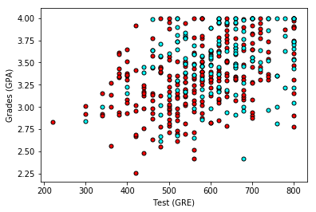

---


layout: post
title: 机器学习-深度学习-深度神经网络
description: 在这章，主要讲解了监督学习相关的技术。
Keywords: 机器学习、模型、评估指标
tagline: 
categories: [ML]
tags: [ML]

---


* 目录
 {:toc  }
# 


## 1、连续性感知器

<video controls="" preload="none" style="width:100%; height:100%; object-fit: fill"   src="../assets/media/uda-ml/deep/shensd/2-t.mp4"></video>
## 2、非线性数据

<video controls="" preload="none" style="width:100%; height:100%; object-fit: fill"   src="../assets/media/uda-ml/deep/shensd/3-t.mp4"></video>
## 3、非线性模型

<video controls="" preload="none" style="width:100%; height:100%; object-fit: fill"   src="../assets/media/uda-ml/deep/shensd/4-t.mp4"></video>
## 4、神经网络架构
现在可以将这些构建基石组合到一起了，并构建出色的神经网络！（或者你愿意，也可以叫做多层级感知器。）

第一个视频将演示如何将两个感知器组合成第三个更复杂的感知器。
<video controls="" preload="none" style="width:100%; height:100%; object-fit: fill"   src="../assets/media/uda-ml/deep/shensd/5-t.mp4"></video>
<video controls="" preload="none" style="width:100%; height:100%; object-fit: fill"   src="../assets/media/uda-ml/deep/shensd/6-t.mp4"></video>
**修正**：

视频 00:43 处，视频右侧的 -8 应对应 8。

视频 00:49 处，视频右侧的 1 应对应 -1。

视频 1:12 处 \begin{matrix} x_1\end{matrix}*x*1 应该对应 7；\begin{matrix} x_2\end{matrix}*x*2 应该对应 -2 。

**多层级**

并非所有神经网络都看起像上面的那样。可能会复杂的多！尤其是，我们可以执行以下操作：

- 向输入、隐藏和输出层添加更多节点。
- 添加更多层级。

我们将在下个视频中看看这些变化的效果。

<video controls="" preload="none" style="width:100%; height:100%; object-fit: fill"   src="../assets/media/uda-ml/deep/shensd/7-t.mp4"></video>
<video controls="" preload="none" style="width:100%; height:100%; object-fit: fill"   src="../assets/media/uda-ml/deep/shensd/8-t.mp4"></video>
## 5、前向反馈

前向反馈是神经网络用来将输入变成输出的流程。我们仔细研究下这一概念，然后详细了解如何训练网络。

<video controls="" preload="none" style="width:100%; height:100%; object-fit: fill"   src="../assets/media/uda-ml/deep/shensd/9-t.mp4"></video>
修正：3:37的字幕运算公式为\hat y = \sigma(w2\sigma(w1*x))*y*^=*σ*(*w*2*σ*(*w*1∗*x*))


关于矩阵乘法部分，W1是一个 3x2 的矩阵，x是 3x1 矩阵，无法直接相乘。w1.T*x. 这里.T表示转置。


**误差函数**

和之前一样，神经网络将产生误差函数，最终我们需要最小化该误差函数。下面的视频演示了神经网络的误差函数。

<video controls="" preload="none" style="width:100%; height:100%; object-fit: fill"   src="../assets/media/uda-ml/deep/shensd/10-t.mp4"></video>
### 6、反向传播
现在，我们准备好训练神经网络了。为此，我们将使用一种方法，叫做**反向传播**。简而言之，反向传播将包括：

- 进行前向反馈运算。
- 将模型的输出与期望的输出进行比较。
- 计算误差。
- 向后运行前向反馈运算（反向传播），将误差分散到每个权重上。
- 更新权重，并获得更好的模型。
- 继续此流程，直到获得很好的模型。

听起来比较复杂，实际上要简单些。我们看看后续几个视频。第一个视频将从概念上解释什么是反向传播。

<video controls="" preload="none" style="width:100%; height:100%; object-fit: fill"   src="../assets/media/uda-ml/deep/shensd/11-t.mp4"></video>
反向传播数学
后面的几个视频将深入讲解数学知识。如果不想听也没有关系，现有的很多代码库和深度学习框架比如 Keras，能够很好并且很简单地完成这个任务。如果你想立即开始训练网络，请转到下个部分。但是如果你喜欢计算各种导数，那么我们深入了解下吧！


<video controls="" preload="none" style="width:100%; height:100%; object-fit: fill"   src="../assets/media/uda-ml/deep/shensd/12-t.mp4"></video>
链式法则
我们需要复习下链式法则，以便计算导数。

<video controls="" preload="none" style="width:100%; height:100%; object-fit: fill"   src="../assets/media/uda-ml/deep/shensd/13-t.mp4"></video>
## 7、keras

幸运的是，每次我们需要使用神经网络时，都不需要编写激活函数、梯度下降等。有很多包可以帮助我们，建议你了解这些包，包括以下包：

- [Keras](https://keras.io/)
- [TensorFlow](https://www.tensorflow.org/)
- [Caffe](http://caffe.berkeleyvision.org/)
- [Theano](http://deeplearning.net/software/theano/)
- [Scikit-learn](http://scikit-learn.org/)
- 以及很多其他包！

在这门课程中，我们将学习 [Keras](https://keras.io/)。Keras 使神经网络的编写过程更简单。为了展示有多简单，你将用几行代码构建一个完全连接的简单网络。

我们会将在前几课学习的概念与 Keras 提供的方法关联起来。

该示例的一般流程是首先加载数据，然后定义网络，最后训练网络。

**用 Keras 构建神经网络**

要使用 Keras，你需要知道以下几个核心概念。

**序列模型**

```python
    from keras.models import Sequential

    #Create the Sequential model
    model = Sequential()
```

[keras.models.Sequential](https://keras.io/models/sequential/) 类是神经网络模型的封装容器。它会提供常见的函数，例如 `fit()`、`evaluate()` 和 `compile()`。我们将介绍这些函数（在碰到这些函数的时候）。我们开始研究模型的层吧。

**层**

Keras 层就像神经网络层。有全连接层、最大池化层和激活层。你可以使用模型的 `add()` 函数添加层。例如，简单的模型可以如下所示：

```python
    from keras.models import Sequential
    from keras.layers.core import Dense, Activation, Flatten

    #创建序列模型
    model = Sequential()

    #第一层 - 添加有128个节点的全连接层以及32个节点的输入层
    model.add(Dense(128, input_dim=32))

    #第二层 - 添加 softmax 激活层
    model.add(Activation('softmax'))

    #第三层 - 添加全连接层
    model.add(Dense(10))

    #第四层 - 添加 Sigmoid 激活层
    model.add(Activation('sigmoid'))
```

Keras 将根据第一层自动推断后续所有层的形状。这意味着，你只需为第一层设置输入维度。

上面的第一层 `model.add(Dense(input_dim=32))` 将维度设为 32（表示数据来自 32 维空间）。第二层级获取第一层级的输出，并将输出维度设为 128 个节点。这种将输出传递给下一层级的链继续下去，直到最后一个层级（即模型的输出）。可以看出输出维度是 10。

构建好模型后，我们就可以用以下命令对其进行编译。我们将损失函数指定为我们一直处理的 `categorical_crossentropy`。我们还可以指定优化程序，稍后我们将了解这一概念，暂时将使用 `adam`。最后，我们可以指定评估模型用到的指标。我们将使用准确率。

```python
model.compile(loss="categorical_crossentropy", optimizer="adam", metrics = ['accuracy'])
```

我们可以使用以下命令来查看模型架构：

```python
model.summary()
```

然后使用以下命令对其进行拟合，指定 epoch 次数和我们希望在屏幕上显示的信息详细程度。

然后使用fit命令训练模型并通过 epoch 参数来指定训练轮数（周期），每 epoch 完成对整数据集的一次遍历。 verbose 参数可以指定显示训练过程信息类型，这里定义为 0 表示不显示信息。

```python
model.fit(X, y, nb_epoch=1000, verbose=0)
```

*注意：在 Keras 1 中，`nb_epoch` 会设置 epoch 次数，但是在 Keras 2 中，变成了 `epochs`。*

最后，我们可以使用以下命令来评估模型：

```python
model.evaluate()
```

很简单，对吧？我们实践操作下。


**练习**

我们从最简单的示例开始。在此测验中，你将构建一个简单的多层前向反馈神经网络以解决 XOR 问题。

1. 将第一层设为 `Dense()` 层，并将节点数设为8，且 `input_dim` 设为 2。
2. 在第二层之后使用 softmax 激活函数。
3. 将输出层节点设为 2，因为输出只有 2 个类别。
4. 在输出层之后使用 softmax 激活函数。
5. 对模型运行 10 个 epoch。

准确度应该为 50%。可以接受，当然肯定不是太理想！在 4 个点中，只有 2 个点分类正确？**我们试着修改某些参数，以改变这一状况。例如，你可以增加 epoch 次数以及改变激活函数的类型。**如果准确率达到 75%，你将通过这道测验。能尝试达到 100% 吗？

首先，查看关于模型和层级的 Keras 文档。 Keras [多层感知器](https://github.com/fchollet/keras/blob/master/examples/mnist_mlp.py)网络示例和你要构建的类似。请将该示例当做指南，但是注意有很多不同之处。

该 编程练习 不再允许访问。因为该纳米学位学期已结束，不过你仍然可以下载代码与所有文件。

```python
import numpy as np
from keras.utils import np_utils
import tensorflow as tf
tf.python.control_flow_ops = tf

# Set random seed
np.random.seed(42)

# Our data
X = np.array([[0,0],[0,1],[1,0],[1,1]]).astype('float32')
y = np.array([[0],[1],[1],[0]]).astype('float32')

# Initial Setup for Keras
from keras.models import Sequential
from keras.layers.core import Dense, Activation, Flatten

# One-hot encoding the output
y = np_utils.to_categorical(y)

# Building the model
xor = Sequential()
xor.add(Dense(32, input_dim=2))
xor.add(Activation("tanh"))
xor.add(Dense(2))
xor.add(Activation("sigmoid"))

xor.compile(loss="categorical_crossentropy", optimizer="adam", metrics = ['accuracy'])

# Uncomment this line to print the model architecture
# xor.summary()

# Fitting the model
history = xor.fit(X, y, nb_epoch=1000, verbose=0)

# Scoring the model
score = xor.evaluate(X, y)
print("\nAccuracy: ", score[-1])

# Checking the predictions
print("\nPredictions:")
print(xor.predict_proba(X))

```

**新技巧**

我们的准确率达到了 75%，甚至会达到 100%，但是并不轻松！

这也暗示了在现实生活中，神经网络训练起来有点难。解决有 4 个数据点的简单 XOR 问题就需要一个庞大的架构！并且我们知道（理论上）具有 2 个隐藏节点的 2 层网络可以做到。

现在我们尝试一项任务。回到测验，并执行以下步骤：

- 将架构中第一个层，节点数改为64
- 加一个节点数为8的全链接层
- 第一个激活函数设为 `relu`（我们稍后将学习这一概念）
- 将 epoch 次数设为 100。

现在点击`测试运行`。准确率是多少？像我一样达到 100% 了吗？很神奇，对吧？似乎 relu 很有用。

在下面的几个部分，我们将学习几个类似的训练优化技巧。


## 8、迷你项目之 Keras Lab 准备: 录取学生

现在我们准备分析 Keras 上的整个数据集。我们将分析以下加州大学洛杉矶分校的学生录取数据集： 'http://www.ats.ucla.edu/stat/data/binary.csv'

在本课的学习过程中，我们鼓励你在页面末尾参考 Jupyter Notebook。我们将为你提供一个解决方案，但请尝试创建自己的深度学习模型！这种体验的价值很大程度上在于，用你自己的方式玩转代码。

### 克隆 repo 并打开 Notebook（可选）

Notebook 将在教室内打开。但是，如果你想单独打开它，可以通过在终端中执行以下命令，从[GitHub存储库](https://github.com/udacity/aind2-dl.git)中克隆这些资料：

`git clone https://github.com/udacity/aind2-dl.git`.

按照[仓库](https://github.com/udacity/aind2-dl)中的说明设置 Conda 环境并安装必要的依赖项。 (注：如果配置后，打开jupyter notebook运行ipy文件时，kernel启动不起来，并出现以下错误 KernelRestarter: restarting kernel (2/5) /Users/LeiWang/.pyenv/versions/anaconda3-5.0.1/envs/aind-dl/bin/python: No module named ipykernel_launcher

如果出现这个错误：terminal中再输入ipython3 kernel install 方可正常运行)

在本实验中，导航到主分支，然后打开 **Student_Admissions.ipynb** 。

### 研究数据

数据集包含以下列：

- 学生 GPA（成绩）
- GRE 考试成绩（考试）
- 级别（1-4）

首先，我们来看看数据。为此，我们将在 pandas 中使用 read_csv 函数。

```
import pandas as pd
data = pd.read_csv('http://www.ats.ucla.edu/stat/data/binary.csv')
print(data)
```


在这里我们可以看到第一列是标签 `y`，它对应于接受/拒绝。 即标签 `1` 表示学生被录取，标签 `0` 表示学生不被录取。

当我们绘制数据时，会得到如下图表，不幸的是，数据并不像我们希望的那么整洁得一目了然：





接下来，我们可以做的一件事就是为每等级制作一张图，共四张图。 在这种情况下，我们得到这个：


### 预处理数据

从这里，我们看到更多的希望。 因为看起来的情况是学生的考试成绩越好，他们越有可能被录取。 等级与此有关。 所以我们要做的是，对排名等级进行一次性编码，我们的6个输入变量是：

- 考试 (GPA)
- 成绩 (GRE)
- 等级 1
- 等级 2
- 等级 3
- 等级 4.

最后4个输入将是二进制变量，如果学生具有该等级，则其值为1，否则为0。

首先要注意的是，考试分数的范围是800，而成绩范围是4，这是一个巨大的差异，这会影响我们的训练。 通常情况下，最好的办法是将分数归一化，使其在0和1之间。我们可以这样做：

```
 data["gre"] = data["gre"]/800
 data["gpa"] = data["gpa"]/4
```

现在，我们将数据输入分成 X和标签 y，并对输出进行 one-hot 编码，因此它显示为两类（录取和不录取）。

```
 X = np.array(data)[:,1:]
 y = np_utils.to_categorical(np.array(data["admit"]))
```

### 构建模型架构

最后，我们定义模型架构。 我们可以使用不同的架构，不过这里有一个例子：

```
 model = Sequential()
 model.add(Dense(128, input_dim=6))
 model.add(Activation('sigmoid'))
 model.add(Dense(32))
 model.add(Activation('sigmoid'))
 model.add(Dense(2))
 model.add(Activation('sigmoid'))
 model.compile(loss = 'categorical_crossentropy', optimizer='adam', metrics=['accuracy'])
 model.summary()
```

`categorical_crossentropy` 会给出错误函数，我们一直在使用，但还有其他选项。 有几个优化器可供你选择，以改善你的训练。 在这里我们会使用*adam*，但像`rmsprop`也很有用。 它们使用了我们在下面的课程中即将介绍的各种技巧。

模型总结将告诉我们以下内容：


### 训练模型

现在，我们用 1000 个 epho 训练模型。 不用担心遇到batch_size，我们很快就会学到它。

```
 model.fit（X_train，y_train，epochs = 1000，batch_size = 100，verbose = 0）
```

### 评估模型

最后，我们可以评估我们的模型。

```
  score = model.evaluate（X_train，y_train）
```

结果可能会有所不同，但你应该可以获得超过70％的准确度。

现在，你已经训练了你的第一个神经网络来分析一个数据集。 在接下来的节点中，你将学习许多技巧来改进训练过程。


## 9、keras lab 录取学生


[keras lab](../assets/media/uda-ml/deep/shensd/keraslab录取学生)


## 10、训练优化


<video controls="" preload="none" style="width:100%; height:100%; object-fit: fill"   src="../assets/media/uda-ml/deep/shensd/14-t.mp4"></video>

## 11 、早期停止

<video controls="" preload="none" style="width:100%; height:100%; object-fit: fill"   src="../assets/media/uda-ml/deep/shensd/15-t.mp4"></video>

## 12 、正则化

<video controls="" preload="none" style="width:100%; height:100%; object-fit: fill"   src="../assets/media/uda-ml/deep/shensd/16-t.mp4"></video>

## 13 、正则化2
<video controls="" preload="none" style="width:100%; height:100%; object-fit: fill"   src="../assets/media/uda-ml/deep/shensd/17-t.mp4"></video>

## 14、Dropout
<video controls="" preload="none" style="width:100%; height:100%; object-fit: fill"   src="../assets/media/uda-ml/deep/shensd/18-t.mp4"></video>

## 15、局部最低点
<video controls="" preload="none" style="width:100%; height:100%; object-fit: fill"   src="../assets/media/uda-ml/deep/shensd/19-t.mp4"></video>

## 16、梯度消失

<video controls="" preload="none" style="width:100%; height:100%; object-fit: fill"   src="../assets/media/uda-ml/deep/shensd/20-t.mp4"></video>
## 17、其他激活函数

<video controls="" preload="none" style="width:100%; height:100%; object-fit: fill"   src="../assets/media/uda-ml/deep/shensd/21-t.mp4"></video>

## 18、批次与随机梯度下降

<video controls="" preload="none" style="width:100%; height:100%; object-fit: fill"   src="../assets/media/uda-ml/deep/shensd/22-t.mp4"></video>

## 19、学习速率衰退

<video controls="" preload="none" style="width:100%; height:100%; object-fit: fill"   src="../assets/media/uda-ml/deep/shensd/23-t.mp4"></video>

## 20、随机重新开始

<video controls="" preload="none" style="width:100%; height:100%; object-fit: fill"   src="../assets/media/uda-ml/deep/shensd/24-t.mp4"></video>

## 21、动量

<video controls="" preload="none" style="width:100%; height:100%; object-fit: fill"   src="../assets/media/uda-ml/deep/shensd/25-t.mp4"></video>

## 22、Keras 中的优化程序
Keras 中有很多优化程序，建议你访问此链接或这篇精彩博文（此链接来自外网，国内网络可能打不开），详细了解这些优化程序。这些优化程序结合使用了上述技巧，以及其他一些技巧。最常见的包括：

**SGD**
这是随机梯度下降。它使用了以下参数：

- 学习速率。
- 动量（获取前几步的加权平均值，以便获得动量而不至于陷在局部最低点）。
- Nesterov 动量（当最接近解决方案时，它会减缓梯度）。
**Adam**
Adam (Adaptive Moment Estimation) 使用更复杂的指数衰减，不仅仅会考虑平均值（第一个动量），并且会考虑前几步的方差（第二个动量）。

**RMSProp**
RMSProp (RMS 表示均方根误差）通过除以按指数衰减的平方梯度均值来减小学习速率。

## 23、世界各地的误差函数

<video controls="" preload="none" style="width:100%; height:100%; object-fit: fill"   src="../assets/media/uda-ml/deep/shensd/26-t.mp4"></video>

## 24、神经网络回归

<video controls="" preload="none" style="width:100%; height:100%; object-fit: fill"   src="../assets/media/uda-ml/deep/shensd/27-t.mp4"></video>

## 25、神经网络回归

神经网络基础知识的视觉和互动指南


我们的内容开发者之一 Jay Alammar 创建了这个神奇的神经网络 “游乐场”，在这里你可以看到很棒的可视化效果，并可以使用参数来解决线性回归问题，然后尝试一些神经网络回归。 预祝学习愉快！

https://jalammar.github.io/visual-interactive-guide-basics-neural-networks/

## 26、迷你项目简介


<video controls="" preload="none" style="width:100%; height:100%; object-fit: fill"   src="../assets/media/uda-ml/deep/shensd/28-t.mp4"></video>


## 27、 迷你项目：使用 Keras 分析 IMDB 电影数据

现在，你已经准备就绪了！ 在这一项目中，我们将分析一个来自 IMDB 的数据集，并用它来预测评论的情感分析。

### 工作区

你可以在教室中打 Notebook，然后转到下一个节点。 但是如果你想单独打开它，你可以从[GitHub仓库](https://github.com/udacity/aind2-dl.git)克隆材料，在其中打开 **IMDB_in_Keras.ipynb** 。

### 数据集

本实验使用一个包含 25,000 条 [IMDB](http://www.imdb.com/)评论的数据集。 每个评论都附带一个标签。 负面评论的标签为 0，正面评论的标签为 1。 这个实验的目标是创建一个模型，根据它的话来预测评论的情感。 你可以在[Keras](https://keras.io/datasets)网站上看到关于这个数据集的更多信息。

现在，输入已经帮助我们很方便地进行预处理。 每个评论被编码为一系列索引，对应于评论中的单词。 词按频率排序，所以整数 1 对应于最频繁的词（“the”），整数 2 对应于第二频繁的词。按照惯例，整数0对应于未知词。

然后，你通过简单地连接这些整数，将句子变成一个向量。 比如，如果句子是“是或不是”。 这些词的索引如下：

- "to": 5
- "be": 8
- "or": 21
- "not": 3

那么，这个句子就会被编码为矢量`[5,8,21,3,5,8]`。

### 加载数据

在 Keras中数据得到预先加载，这意味着我们不需要手动打开或读取任何文件。 加载它的命令如下，实际上可以将单词分成训练、测试集和标签：

```python
from keras.datasets import imdb
(x_train, y_train), (x_test, y_test) = imdb.load_data(path="imdb.npz",
                                                     num_words=None,
                                                     skip_top=0,
                                                     maxlen=None,
                                                     seed=113,
                                                     start_char=1,
                                                     oov_char=2,
                                                     index_from=3)
```

所有这些参数说明可以在[这里](https://keras.io/datasets)查看。总而言之，最重要的是：

- **num_words** ：要考虑的最常见的单词。如果你不想考虑一些很晦涩的词汇，比如“Ultracrepidarian”，这会很有用。
- **skip_top** ：忽略的热门词汇。如果你不想考虑最常见的词，这会很有用。比如，单词“the”将不会在评论中添加任何信息，所以我们可以通过将`skip_top` 设置为 2 或更高来跳过它。

### 预处理数据

在 notebook中，我们首先将数据编码为 (0,1) - 向量，编码如下：例如，如果我们的词汇量为10个词，向量为(4,1,8) ，我们将它变成矢量 (1,0,0,1,0,0,0,1,0,0)。

### 建立模型

现在轮到你使用所有你学到的东西了！你可以使用 Keras 建立一个神经网络，对它进行训练并评估！你需要使用诸如丢弃或正则化的方法，并且使用好的 Keras 优化器来实现这一点。准确度可以达到 85％。你的模型能实现这个吗？

如果你需要帮助，你可以在 **IMDB_in_Keras_Solutions** notebook中查看我们的解决方案。有许多解决方案都有用，可以随时创造性地发挥作用！


## 28、IMDB数据

[IMDB数据](../assets/media/uda-ml/deep/shensd/IMDB数据)

## 29、总结

<video controls="" preload="none" style="width:100%; height:100%; object-fit: fill"   src="../assets/media/uda-ml/deep/shensd/29-t.mp4"></video>

<video controls="" preload="none" style="width:100%; height:100%; object-fit: fill"   src="../assets/media/uda-ml/deep/shensd/30-t.mp4"></video>