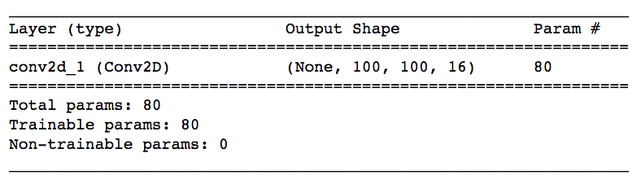
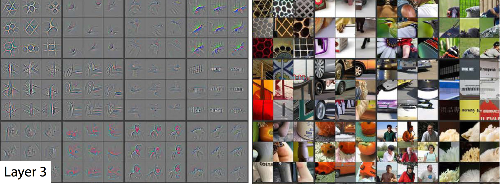

---


layout: post
title: 机器学习-深度学习-卷积神经网络
description: 在这章，主要讲解了监督学习相关的技术。
Keywords: 机器学习、模型、评估指标
tagline: 
categories: [ML]
tags: [ML]

---


* 目录
 {:toc  }
# 


## 1、介绍Alexis


<video controls="" preload="none" style="width:100%; height:100%; object-fit: fill"   src="../assets/media/uda-ml/deep/JJWL/1-t.mp4"></video>
## 2、CNN 的应用

<video controls="" preload="none" style="width:100%; height:100%; object-fit: fill"   src="../assets/media/uda-ml/deep/JJWL/2-t.mp4"></video>
### 课外资料

注：部分资料来自国外 youtube 与 google research.

- 了解 [WaveNet](https://deepmind.com/blog/wavenet-generative-model-raw-audio/) 模型。
  - 如果你能训练人工智能机器人唱歌，干嘛还训练它聊天？在 2017 年 4 月，研究人员使用 WaveNet 模型的变体生成了歌曲。原始论文和演示可以在[此处](http://www.creativeai.net/posts/W2C3baXvf2yJSLbY6/a-neural-parametric-singing-synthesizer)找到。
- 了解[文本分类 CNN](http://www.wildml.com/2015/12/implementing-a-cnn-for-text-classification-in-tensorflow/)。
  - 你或许想注册作者的[深度学习简讯](https://www.getrevue.co/profile/wildml)！
- 了解 Facebook 的[创新 CNN 方法](https://code.facebook.com/posts/1978007565818999/a-novel-approach-to-neural-machine-translation/)(Facebook)，该方法专门用于解决语言翻译任务，准确率达到了前沿性水平，并且速度是 RNN 模型的 9 倍。

- 利用 CNN 和强化学习玩 [Atari 游戏](https://deepmind.com/research/dqn/)。你可以[下载](https://sites.google.com/a/deepmind.com/dqn/)此论文附带的代码。
  - 如果你想研究一些（深度强化学习）初学者代码，建议你参阅 Andrej Karpathy 的[帖子](http://karpathy.github.io/2016/05/31/rl/)。
- 利用 CNN 玩[看图说词游戏](https://quickdraw.withgoogle.com/#)！
  - 此外，还可以参阅 [A.I.Experiments](https://aiexperiments.withgoogle.com/) 网站上的所有其他很酷的实现。别忘了 [AutoDraw](https://www.autodraw.com/)！
- 详细了解 [AlphaGo](https://deepmind.com/research/alphago/)。
  - 阅读[这篇文章](https://www.technologyreview.com/s/604273/finding-solace-in-defeat-by-artificial-intelligence/?set=604287)，其中提出了一个问题：如果掌控 Go“需要人类直觉”，那么人性受到挑战是什么感觉？_
- 观看这些非常酷的视频，其中的无人机都受到 CNN 的支持。
  - 这是初创企业 [Intelligent Flying Machines (IFM)](https://www.youtube.com/watch?v=AMDiR61f86Y) (Youtube)的访谈。
  - 户外自主导航通常都要借助[全球定位系统 (GPS)](http://www.droneomega.com/gps-drone-navigation-works/)，但是下面的演示展示的是由 CNN 提供技术支持的[自主无人机](https://www.youtube.com/watch?v=wSFYOw4VIYY)(Youtube)。
- 如果你对无人驾驶汽车使用的 CNN 感兴趣，请参阅：
  - 我们的[无人驾驶汽车工程师纳米学位课程](https://www.udacity.com/course/self-driving-car-engineer-nanodegree--nd013)，我们在[此项目](https://github.com/udacity/CarND-Traffic-Sign-Classifier-Project)中对[德国交通标志](http://benchmark.ini.rub.de/?section=gtsrb&subsection=dataset)数据集中的标志进行分类。
  - 我们的[机器学习工程师纳米学位课程](https://www.udacity.com/course/machine-learning-engineer-nanodegree--nd009)，我们在[此项目](https://github.com/udacity/machine-learning/tree/master/projects/digit_recognition)中对[街景门牌号](http://ufldl.stanford.edu/housenumbers/)数据集中的门牌号进行分类。
  - 这些[系列博客](https://pythonprogramming.net/game-frames-open-cv-python-plays-gta-v/)，其中详细讲述了如何训练用 Python 编写的 CNN，以便生成能够玩“侠盗猎车手”的无人驾驶 AI。
- 参阅视频中没有提到的其他应用情形。
  - 一些全球最著名的画作被[转换成了三维形式](http://www.businessinsider.com/3d-printed-works-of-art-for-the-blind-2016-1)，以便视力受损人士也能欣赏。虽然这篇文章没有提到是怎么做到的，我们注意到可以使用 CNN [预测单个图片的深度](https://www.cs.nyu.edu/~deigen/depth/)。
  - 参阅这篇关于使用 CNN 确定乳腺癌位置的[研究论文](https://research.googleblog.com/2017/03/assisting-pathologists-in-detecting.html)(google research)。
  - CNN 被用来[拯救濒危物种](https://blogs.nvidia.com/blog/2016/11/04/saving-endangered-species/?adbsc=social_20170303_70517416)！
  - 一款叫做 [FaceApp](http://www.digitaltrends.com/photography/faceapp-neural-net-image-editing/) 的应用使用 CNN 让你在照片中是微笑状态或改变性别。


## 3、计算机是如何解析图片的


<video controls="" preload="none" style="width:100%; height:100%; object-fit: fill"   src="../assets/media/uda-ml/deep/JJWL/3-t.mp4"></video>
在学习这节课的过程中，建议你打开参考 Jupyter 记事本。我们将会提供解决方案，但是请尝试自己创建深度学习模型！这段学习体验的价值在很大程度上来自于自己去研究代码。

要开始操作，请克隆[该 GitHub 资源库](https://github.com/udacity/aind2-cnn.git) 中的资料，方法是在终端里输入以下命令：`git clone https://github.com/udacity/aind2-cnn.git`。按照 该[资源库](https://github.com/udacity/aind2-cnn)中的说明操作，设置 Conda 环境并安装必要的依赖项。

要打开视频中提到的记事本，请转到 **mnist-mlp/** 文件夹并打开 **mnist_mlp.ipynb**。

### 其他注意事项

MNIST 数据库可以说是深度学习领域最著名的数据库！请参阅此[图表](https://www.kaggle.com/benhamner/d/benhamner/nips-papers/popular-datasets-over-time/code)，其中展示了一直以来在 [NIPS](https://nips.cc/) 论文中引用的数据集。


## 4、图片分类 MLP


<video controls="" preload="none" style="width:100%; height:100%; object-fit: fill"   src="../assets/media/uda-ml/deep/JJWL/4-t.mp4"></video>
### 课外资料

- 参阅首篇建议将 dropout 用作避免过拟合技巧的[研究论文](https://www.cs.toronto.edu/~hinton/absps/JMLRdropout.pdf)。
- 这是关于扁平化层级的 Keras [文档](https://keras.io/layers/core/#flatten)。
- 如果你想详细了解激活函数，请访问此[网站](http://cs231n.github.io/neural-networks-1/#actfun)。


## 5、分类交叉熵


<video controls="" preload="none" style="width:100%; height:100%; object-fit: fill"   src="../assets/media/uda-ml/deep/JJWL/5-t.mp4"></video>
### 课外资料

- **损失函数**是用来估量模型中预测值y与真实值Y之间的差异，即不一致程度

- 如果你想详细了解 Keras 中的完全连接层，请阅读这篇关于密集层的[文档](https://keras.io/layers/core/)。你可以通过为 `kernel_initializer` 和 `bias_initializer` 参数提供值更改权重的初始化方法。注意默认值分别为 `'glorot_uniform'` 和 `'zeros'`。你可以在相应的 Keras [文档](https://keras.io/initializers/)中详细了解每种初始化程序的工作方法。

- Keras 中有很多不同的[损失函数](https://keras.io/losses/)。对于这节课来说，我们将仅使用 `categorical_crossentropy`。

- 参阅 Keras 中

  可用的优化程序列表

  。当你编译模型（在记事本的第 7 步）时就会指定优化程序。

  - `'sgd'` : SGD
  - `'rmsprop'` : RMSprop
  - `'adagrad'` : Adagrad
  - `'adadelta'` : Adadelta
  - `'adam'` : Adam
  - `'adamax'` : Adamax
  - `'nadam'` : Nadam
  - `'tfoptimizer'` : TFOptimizer

- 


## 6、Keras 中的模型验证


<video controls="" preload="none" style="width:100%; height:100%; object-fit: fill"   src="../assets/media/uda-ml/deep/JJWL/6-t.mp4"></video>
### 课外资料

- 在训练过程中，你可以使用很多回调（例如 ModelCheckpoint）来监控你的模型。你可以参阅此处的[详情内容](https://keras.io/callbacks/#modelcheckpoint)。建议你先详细了解 EarlyStopping 回调。如果你想查看另一个 ModelCheckpoint 代码示例，请参阅[这篇博文](http://machinelearningmastery.com/check-point-deep-learning-models-keras/)。


## 7、MLP 何时效果不错？

<video controls="" preload="none" style="width:100%; height:100%; object-fit: fill"   src="../assets/media/uda-ml/deep/JJWL/7-t.mp4"></video>
2分钟处，‘与MLP不同CNN知道’，改为‘与MLP不同，CNN知道’


### 课外资料

- 参阅[其他分类器](http://yann.lecun.com/exdb/mnist/)的效果。


## 8、局部连接性


<video controls="" preload="none" style="width:100%; height:100%; object-fit: fill"   src="../assets/media/uda-ml/deep/JJWL/8-t.mp4"></video>
1分12秒，“可以想象即使是稍微大点的图片”应该该为“可以想象即使是中等大小的图片”；


## 9、卷积层（第 1 部分）


<video controls="" preload="none" style="width:100%; height:100%; object-fit: fill"   src="../assets/media/uda-ml/deep/JJWL/9-t.mp4"></video>
## 10、卷积层（第 2 部分）

<video controls="" preload="none" style="width:100%; height:100%; object-fit: fill"   src="../assets/media/uda-ml/deep/JJWL/10-t.mp4"></video>
## 11、Stride 和填充

<video controls="" preload="none" style="width:100%; height:100%; object-fit: fill"   src="../assets/media/uda-ml/deep/JJWL/11-t.mp4"></video>
## 12、Keras 中的卷积层


[**窗口为 3x3、stride 为 1 的卷积层**](https://classroom.udacity.com/nanodegrees/nd009-cn-advanced/parts/bfc08027-d9e2-4483-839c-e6ec1e2ada4c/modules/10b781e7-357b-4e54-8180-4a55a1daf6dc/lessons/52fc79a7-13ff-4065-b3c6-8203ec9ef60c/concepts/5e62ce5f-26bb-4f84-91c1-4791b9d3aa53#)

[图片来源：](https://classroom.udacity.com/nanodegrees/nd009-cn-advanced/parts/bfc08027-d9e2-4483-839c-e6ec1e2ada4c/modules/10b781e7-357b-4e54-8180-4a55a1daf6dc/lessons/52fc79a7-13ff-4065-b3c6-8203ec9ef60c/concepts/5e62ce5f-26bb-4f84-91c1-4791b9d3aa53#)http://iamaaditya.github.io/2016/03/one-by-one-convolution/

**Keras 中的卷积层**

要在 Keras 中创建卷积层，你首先必须导入必要的模块：

```python
from keras.layers import Conv2D
```

然后，你可以通过使用以下格式创建卷积层：

```python
Conv2D(filters, kernel_size, strides, padding, activation='relu', input_shape)
```

**参数**

必须传递以下参数：

- `filters` - 过滤器数量。
- `kernel_size` - 指定（方形）卷积窗口的高和宽的数字。

你可能还需要调整其他可选参数：

- `strides` - 卷积 stride。如果不指定任何值，则 `strides` 设为 `1`。
- `padding` - 选项包括 `'valid'` 和 `'same'`。如果不指定任何值，则 `padding` 设为 `'valid'`。
- `activation` - 通常为 `'relu'`。如果未指定任何值，则不应用任何激活函数。**强烈建议**你向网络中的每个卷积层添加一个 ReLU 激活函数。

**注意**：可以将 `kernel_size` 和 `strides` 表示为数字或元组。

在模型中将卷积层当做第一层级（出现在输入层之后）时，必须提供另一个 `input_shape` 参数：

- `input_shape` - 指定输入的高度、宽度和深度（按此顺序）的元组。

**注意**：如果卷积层*不是*网络的第一个层级，***请勿***包含 `input_shape` 参数。

你还可以设置很多其他元组参数，以便更改卷积层的行为。要详细了解这些参数，建议参阅官方[文档](https://keras.io/layers/convolutional/)。

**示例1**

假设我要构建一个 CNN，输入层接受的是 200 x 200 像素（对应于高 200、宽 200、深 1 的三维数组）的灰度图片。然后，假设我希望下一层级是卷积层，具有 16 个过滤器，每个宽和高分别为 2。在进行卷积操作时，我希望过滤器每次跳转 2 个像素。并且，我不希望过滤器超出图片界限之外；也就是说，我不想用 0 填充图片。要构建该卷积层，我将使用下面的代码：

```python
Conv2D(filters=16, kernel_size=2, strides=2, activation='relu', input_shape=(200, 200, 1))
```

**示例 2**

假设我希望 CNN 的下一层级是卷积层，并将示例 1 中构建的层级作为输入。假设新层级是 32 个过滤器，每个的宽和高都是 3。在进行卷积操作时，我希望过滤器每次移动 1 个像素。我希望卷积层查看上一层级的所有区域，因此不介意过滤器在进行卷积操作时是否超过上一层级的边缘。然后，要构建此层级，我将使用以下代码：

```python
Conv2D(filters=32, kernel_size=3, padding='same', activation='relu')
```

**示例 3**

如果在线查看代码，经常会在 Keras 中见到以下格式的卷积层：

```python
Conv2D(64, (2,2), activation='relu')
```

在这种情况下，有 64 个过滤器，每个的大小是 2x2，层级具有 ReLU 激活函数。层级中的其他参数使用默认值，因此卷积的 stride 为 1，填充设为 'valid'。


## 13、练习：维度


[**窗口为 3x3、stride 为 1 的卷积**](https://classroom.udacity.com/nanodegrees/nd009-cn-advanced/parts/bfc08027-d9e2-4483-839c-e6ec1e2ada4c/modules/10b781e7-357b-4e54-8180-4a55a1daf6dc/lessons/52fc79a7-13ff-4065-b3c6-8203ec9ef60c/concepts/a044de29-c60f-47d8-a82d-aae7b8f24732#)


**维度**

和神经网络一样，我们按以下步骤在 Keras 中创建 CNN：首先创建一个`序列`模型。

使用 `.add()` 方法向该网络中添加层级。

将以下代码复制粘贴到叫做 `conv-dims.py` 的 Python 可执行文件中：

```python
from keras.models import Sequential
from keras.layers import Conv2D

model = Sequential()
model.add(Conv2D(filters=16, kernel_size=2, strides=2, padding='valid', 
    activation='relu', input_shape=(200, 200, 1)))
model.summary()
```

我们不会训练该 CNN；相反，我们将使用该可执行文件根据所提供的参数研究卷积层的维度如何变化。

运行 `python path/to/conv-dims.py` 并查看输出。应该如下所示：


]


卷积层的维度符合你的期望吗？

你可以随意更改在 `conv-dims.py` 文件中为参数（`filters`、`kernel_size` 等）分配的值。

注意卷积层中的**参数数量**是如何变化的。对应的是输出内容中的 `Param #` 下的值。在上图中，卷积层具有 `80` 个参数。

同时注意卷积层的**形状**是如何变化的。对应的是输出内容中的 `Output Shape` 下的值。在上图中，`None` 对应的是批次大小，卷积层的高度为 `100`，宽度为 `100`，深度为 `16`。

**公式：卷积层中的参数数量**

卷积层中的参数数量取决于 `filters`、`kernel_size` 和 `input_shape` 的值。我们定义几个变量：

- `K` - 卷积层中的过滤器数量
- `F` - 卷积过滤器的高度和宽度
- `D_in` - 上一层级的深度

注意：`K` = `filters`，`F` = `kernel_size`。类似地，`D_in` 是 `input_shape` 元组中的最后一个值。

因为每个过滤器有 `F*F*D_in` 个权重，卷积层由 `K` 个过滤器组成，因此卷积层中的权重总数是 `K*F*F*D_in`。因为每个过滤器有 1 个偏差项，卷积层有 `K` 个偏差。因此，卷积层中的**参数数量**是 `K*F*F*D_in + K`。

**公式：卷积层的形状**

卷积层的形状取决于 `kernel_size`、`input_shape`、`padding` 和 `stride` 的值。我们定义几个变量：

- `K` - 卷积层中的过滤器数量
- `F` - 卷积过滤器的高度和宽度
- `H_in` - 上一层级的高度
- `W_in` - 上一层级的宽度

注意：`K` = `filters`、`F` = `kernel_size`，以及`S` = `stride`。类似地，`H_in` 和 `W_in` 分别是 `input_shape` 元组的第一个和第二个值。

卷积层的**深度**始终为过滤器数量 `K`。

如果 `padding = 'same'`，那么卷积层的空间维度如下：

- **height** = ceil(float(`H_in`) / float(`S`))
- **width** = ceil(float(`W_in`) / float(`S`))

如果 `padding = 'valid'`，那么卷积层的空间维度如下:

- **height** = ceil(float(`H_in` - `F` + 1) / float(`S`))
- **width** = ceil(float(`W_in` - `F` + 1) / float(`S`))

**练习**

请更改 `conv-dims.py` 文件，使其如下所示：

```python
from keras.models import Sequential
from keras.layers import Conv2D

model = Sequential()
model.add(Conv2D(filters=32, kernel_size=3, strides=2, padding='same', 
    activation='relu', input_shape=(128, 128, 3)))
model.summary()
```

运行 `python path/to/conv-dims.py`，并使用输出回答以下问题。

**习题 1/3**

卷积层有多少个参数？

- 902
- 306
- 896
- 1034

**习题 2/3**

卷积层的深度是多少？

- 3
- 16
- 32
- 64


**习题 3/3**

卷积层的宽度是多少？

- 3
- 16
- 32
- 64


## 14、池化层

<video controls="" preload="none" style="width:100%; height:100%; object-fit: fill"   src="../assets/media/uda-ml/deep/JJWL/12-t.mp4"></video>
## 15、Keras 中的最大池化层


[**窗口为 2x2、stride 为 2 的最大池化层**](https://classroom.udacity.com/nanodegrees/nd009-cn-advanced/parts/bfc08027-d9e2-4483-839c-e6ec1e2ada4c/modules/10b781e7-357b-4e54-8180-4a55a1daf6dc/lessons/52fc79a7-13ff-4065-b3c6-8203ec9ef60c/concepts/6e12c61e-7a45-4f64-b255-84e464bf8633#)

[图片来源：](https://classroom.udacity.com/nanodegrees/nd009-cn-advanced/parts/bfc08027-d9e2-4483-839c-e6ec1e2ada4c/modules/10b781e7-357b-4e54-8180-4a55a1daf6dc/lessons/52fc79a7-13ff-4065-b3c6-8203ec9ef60c/concepts/6e12c61e-7a45-4f64-b255-84e464bf8633#)http://cs231n.github.io/convolutional-networks/

**Keras 中的最大池化层**

要在 Keras 中创建最大池化层，你必须首先导入必要的模块：

```
from keras.layers import MaxPooling2D
```

然后使用以下格式创建卷积层：

```
MaxPooling2D(pool_size, strides, padding)
```

**参数**

你必须包含以下参数：

- `pool_size` - 指定池化窗口高度和宽度的数字。

你可能还需要调整其他可选参数：

- `strides` - 垂直和水平 stride。如果不指定任何值，则 `strides` 默认为 `pool_size`。
- `padding` - 选项包括 `'valid'` 和 `'same'`。如果不指定任何值，则 `padding` 设为 `'valid'`。

**注意**：可以将 `pool_size` 和 `strides` 表示为数字或元组。

此外，建议阅读官方[文档](https://keras.io/layers/pooling/#maxpooling2d)。

**示例**

假设我要构建一个 CNN，并且我想通过在卷积层后面添加最大池化层，降低卷积层的维度。假设卷积层的大小是 `(100, 100, 15)`，我希望最大池化层的大小为 `(50, 50, 15)`。要实现这一点，我可以在最大池化层中使用 2x2 窗口，stride 设为 2，代码如下：

```
    MaxPooling2D(pool_size=2, strides=2)
```

如果你想将 stride 设为 1，但是窗口大小依然保留为 2x2，则使用以下代码：

```
    MaxPooling2D(pool_size=2, strides=1)
```


**检查最大池化层的维度**

将以下代码复制粘贴到叫做 `pool-dims.py` 的 Python 可执行文件中：

```python
from keras.models import Sequential
from keras.layers import MaxPooling2D

model = Sequential()
model.add(MaxPooling2D(pool_size=2, strides=2, input_shape=(100, 100, 15)))
model.summary()
```

运行 `python path/to/pool-dims.py` 并查看输出。应该如下所示：


你可以随便修改 `pool-dims.py` 文件中的参数，并看看最大池化层的形状如何变化。


## 16、图片分类 CNN

<video controls="" preload="none" style="width:100%; height:100%; object-fit: fill"   src="../assets/media/uda-ml/deep/JJWL/13-t.mp4"></video>
和神经网络一样，我们通过首先创建一个`序列`模型来创建一个 CNN。

```python
from keras.models import Sequential
```

导入几个层，包括熟悉的神经网络层，以及在这节课学习的新的层。

```python
from keras.layers import Conv2D, MaxPooling2D, Flatten, Dense
```

和神经网络一样，通过使用 `.add()` 方法向网络中添加层级：

```python
model = Sequential()
model.add(Conv2D(filters=16, kernel_size=2, padding='same', activation='relu', input_shape=(32, 32, 3)))
model.add(MaxPooling2D(pool_size=2))
model.add(Conv2D(filters=32, kernel_size=2, padding='same', activation='relu'))
model.add(MaxPooling2D(pool_size=2))
model.add(Conv2D(filters=64, kernel_size=2, padding='same', activation='relu'))
model.add(MaxPooling2D(pool_size=2))
model.add(Flatten())
model.add(Dense(500, activation='relu'))
model.add(Dense(10, activation='softmax'))
```

该网络以三个卷积层（后面跟着最大池化层）序列开始。前 6 个层级旨在将图片像素数组输入转换为所有空间信息都丢失、仅保留图片内容信息的数组 。然后在 CNN 的第七个层级将该数组扁平化为向量。后面跟着两个密集层，旨在进一步说明图片中的内容。最后一层针对数据集中的每个对象类别都有一个条目，并具有一个 softmax 激活函数，使其返回概率。

**注意**：在该视频中，你可能注意到卷积层表示为 `Convolution2D`，而不是 `Conv2D`。对于 Keras 2.0 来说，二者都可以，但是最好使用 `Conv2D`。

**注意事项**

- 始终向 CNN 中的 `Conv2D` 层添加 ReLU 激活函数。但是网络的最后层级除外，`密集`层也应该具有 ReLU 激活函数。
- 在构建分类网络时，网络中的最后层级应该是具有 softmax 激活函数的 `密集`层。最后层级的节点数量应该等于数据集中的类别总数。
- 要开心！如果你觉得有点泄气，建议参阅 [Andrej Karpathy 的 tumblr](https://lossfunctions.tumblr.com/)（来自外网，可能打不开），其中包含了用户提交的损失函数，对应的是本身有问题的模型。损失函数在训练期间应该是减小的，但是这些图表显示的却是非常不同的行为 :)。


## 17、AWS GPU 实例 搭建


在这部分，你将学习如何启动具有 GPU 的服务器，并在上面训练你的神经网络！

*在这节课的早些时段，你根据下面的第 1 到第 4 步设置了用于深度学习的 AWS 帐号。如果尚未设置，请现在完成这些步骤。*


**1. 创建 AWS 帐号**

访问 [aws.amazon.com](https://aws.amazon.com/) 并点击“创建 AWS 帐号 (Create an AWS Account)”按钮。


如果你已经拥有 AWS 帐号，则直接登录。

如果你没有 AWS 帐号，请注册一个。

注册时，你需要提供信用卡。但是别担心，暂时系统不会扣除任何费用。

此外，在注册期间，你还需要选择一个支持计划。你可以选择免费的 Basic Support Plan。

完成注册后，等待几分钟就能收到 AWS 帐号确认电子邮件。然后，返回 [aws.amazon.com](https://aws.amazon.com/) 并登录。


**2. 查看你的上限**

在以下网页上查看你的 EC2 Service Limit 报告：https://console.aws.amazon.com/ec2/v2/home?#Limits

查找你的 p2.xlarge 实例类型的”Current Limit“。

注意：并非所有 AWS 地区都支持 GPU 实例。如果你所选的地区不支持 GPU 示例，但是你又想使用 GPU 实例，那么更改你的 AWS 地区。


Amazon Web Services 有一种叫做 [Elastic Compute Cloud (EC2)](https://aws.amazon.com/ec2) 的服务，该服务使你能够启动虚拟服务器（即“实例”），包括具有 GPU 的实例。本教程需要启动的 GPU 类型叫做“p2.xlarge”。

但是默认情况下，用户可以运行的 p2.xlarge 实例数量是 0，这就导致你无法启动该实例。


**3. 提交增加上限请求**

在 EC2 Service Limits 页面点击“p2.xlarge”旁边的“请求增加上限 (Request limit increase)”。

请求增加上限不需要支付费用。只有在你实际启动实例时才会收费。


在服务请求表格中，需要填写几个字段。

对于“Region”字段，选择离你最近的地区。

对于“New limit value”字段，输入值 1（也可以是更高的值）。

对于“Use Case Description”，可以直接填写“我想将 GPU 实例用于深度学习”


注意：如果你从未在 AWS 上启动过任何类型的实例，那么可能会收到一封 AWS 支持团队发来的电子邮件，要求你通过创建一个实例来初始化你的帐号，然后他们才会批准增加上限请求。


**4. 等待批准**

你必须等待 AWS 批准你的增加上限请求。AWS 通常会在 48 小时内批准这些请求。


**5. 启动实例**

AWS 批准你的增加上限请求后，你就可以开始启动你的实例了。

访问 EC2 管理控制台：https://console.aws.amazon.com/ec2/v2/home

点击“启动实例 (Launch Instance)”按钮。


在启动实例之前，首先必须选择一个 AMI（Amazon 机器映像），它为你的实例定义了操作系统以及任何配置和预安装的软件。

我们已经为你创建了一个 AMI！

点击”Community AMIs”，并搜索“udacity-aind2” AMI。


点击“选择”按钮。


**6. 选择实例类型**

接着，必须选择实例类型，即 AMI 将在其上运行的硬件。

过滤实例列表，仅显示“GPU compute”：


选择 p2.xlarge 实例类型：


最后，点击“查看并启动”按钮：


**7. 配置安全组**

实例现已配置好，可以启动了，但是从 AWS 运行并访问 Jupyter Notebook 需要特殊配置。

大部分配置已经在 `udacity-aind2` AMI 上进行设置。但是，在启动实例时，你必须还要正确配置安全组。

默认情况下，AWS 限制访问 EC2 实例上的大多数端口。要访问 Jupyter Notebook，你必须配置 AWS 安全组，以便访问端口 8888。

点击“编辑安全组”。


在”配置安全组”页面上：

1. 选择 “创建**新的**安全组"
2. 将”安全组名称”设为"Jupyter"
3. 将 “说明”设为"Jupyter"
4. 点击“添加规则”
5. 设置”自定义 TCP 规则”
   1. 将“端口范围”设为"8888"
   2. 将“来源”设为“任何地方”
6. 再次点击“查看并启动"


**8. 启动实例**

点击“启动”按钮以启动你的 GPU 实例！


**9. 在没有密钥对的情况下继续**

糟糕，在启动前，AWS 将询问你是否要指定身份验证密钥对。


在这种情况下，AMI 具有预先配置好的用户帐号和密码，因此你可以选择“在没有密钥对的情况下继续”并点击“启动实例”按钮（这次真的启动了！）。

接着，点击“查看实例”按钮，转到 EC2 管理控制台并观看你的实例启动。


**10. 谨慎操作！**

从现在开始，如果你运行 EC2 实例，AWS 将会向你收费。你可以在 [EC2 按需定价页面](https://aws.amazon.com/ec2/pricing/on-demand/)查看详情。

最重要的是，不使用实例时，一定要“停止”（即关闭）实例。否则，你的实例可能在你不记得的情况下运行一天、一周或一个月，结果需要缴纳一大笔费用！

AWS 主要对运行实例收费，所以一旦你停止实例，大部分费用就停止了。但是，还有一小部分存储费用会继续累积，直到你“终止”（即删除）实例。


我们无法对 AWS 设定预算上限，并在达到阈值时让其自动关闭。但是，你可以设置[AWS 结算警报](http://docs.aws.amazon.com/awsaccountbilling/latest/aboutv2/free-tier-alarms.html)。


**11. 登录**

启动后，你的实例可能需要几分钟时间才能初始化。

在 EC2 管理控制台上看到“2/2 检查已通过”后，则你的实例可以登录了。


注意 EC2 信息中心上的"IPv4 Public IP”地址（格式为“X.X.X.X”）。

在终端里，以用户“aind2”的身份 SSH 到该地址：

```
ssh aind2@X.X.X.X
```

你可能会收到一条消息询问“确定要继续连接吗（是/否）”。输入`是`，并按下 Enter 键。

使用密码 **aind2** 进行身份验证


**12. 启动 Jupyter**

恭喜你！现在你已经有了可以在上面训练神经网络的 GPU 服务器了。

在 EC2 实例上：

1. 克隆 aind2-cnn 资源库：`git clone https://github.com/udacity/aind2-cnn.git`

2. 进入资源库目录：`cd aind2-cnn`

3. 激活新环境：`source activate aind2`

4. 启动 Jupyter：`jupyter notebook --ip=0.0.0.0 --no-browser`

5. 查看窗口中的输出，并找到类似于以下代码的代码行：

   ```text
   第一次连接时，将此 URL 复制粘贴到你的浏览器中并使用以下令牌进行登录： 
   http://0.0.0.0:8888/?token=3156e...
   ```

6. 将**完整 URL**复制粘贴到网络浏览器（Firefox、Safari、Chrome 等）的地址栏中。在转到该网址前，将 `0.0.0.0` 替换为 EC2 信息中心显示的"IPv4 Public IP”地址，按下 Enter 键。


**13. 运行 Jupyter Notebook**

浏览器应该显示一个[资源库](https://github.com/udacity/aind2-cnn)下的文件夹列表。


你可以通过验证实例是否能运行 [Jupyter Notebook](https://github.com/udacity/aind2-cnn/blob/master/cifar10-classification/cifar10_mlp.ipynb)，检查一切是否能正常运转。

首先点击 **cifar10-classification**。


然后点击 **cifar10_mlp.ipynb**。运行 Notebook 中的所有单元格，确保一切能正常运转。


## 18、Keras 中的 CNN：实例


<video controls="" preload="none" style="width:100%; height:100%; object-fit: fill"   src="../assets/media/uda-ml/deep/JJWL/14-t.mp4"></video>
3分27秒处，“对模型训练100个epoch批次大小为32”，意义为“对模型训练100个epoch批次，每个批次大小为32”


如果你尚未通过 AWS 启动 GPU 服务器，强烈建议你先启动，然后再运行此视频中的 notebook。虽然可以在 CPU 上训练 notebook，但是 AWS GPU 实例训练起来将快很多。

你可以在 `aind2-cnn` GitHub [资源库](https://github.com/udacity/aind2-cnn)中访问视频中描述的 Jupyter Notebook。转到 **cifar10-classification/** 文件夹并打开 **cifar10_mlp.ipynb** 和 **cifar10_cnn.ipynb**。

### 验证集注意事项

[在这节课的早些时候](https://github.com/udacity/aind2-cnn/blob/master/mnist-mlp/mnist_mlp.ipynb)，我们通过验证方式训练了一个神经网络，方法是将 `model.fit` 中的 `validation_split` 参数设为 0.2。这样会将训练数据的最后 20% 数据变成验证数据。在此视频的 notebook 中，我们自己硬编码了拆分比例，而不是让 Keras 为我们拆分验证集。

### 课外资料

- 这是用于在 Keras 中指定神经网络（包括 CNN）的[备忘单](https://s3.amazonaws.com/assets.datacamp.com/blog_assets/Keras_Cheat_Sheet_Python.pdf)。
- 参阅 CIFAR-10 竞赛的[获胜架构](http://blog.kaggle.com/2015/01/02/cifar-10-competition-winners-interviews-with-dr-ben-graham-phil-culliton-zygmunt-zajac/)！

## 19、Keras 中的图片增强功能

<video controls="" preload="none" style="width:100%; height:100%; object-fit: fill"   src="../assets/media/uda-ml/deep/JJWL/15-t.mp4"></video>
如果你尚未通过 AWS 启动 GPU 服务器，强烈建议你先启动，然后再运行此视频中的记事本。虽然可以在 CPU 上训练记事本，但是 AWS GPU 实例训练起来将快很多。（该服务目前已有项目中 Workspace GPU来替代，可以通过项目中的 Enable GPU，直接设置）

你可以在 `aind2-cnn` GitHub [资源库](https://github.com/udacity/aind2-cnn)中访问视频中描述的 Jupyter 记事本。转到 **cifar10-augmentation/** 文件夹并打开 **cifar10_augmentation.ipynb**。

### 关于 `steps_per_epoch` 的注意事项

`fit_generator` 具有很多参数，包括

```python
steps_per_epoch = x_train.shape[0] / batch_size
```

其中 `x_train.shape[0]` 对应的是训练数据集 `x_train` 中的独特样本数量。通过将 `steps_per_epoch` 设为此值，我们确保模型在每个 epoch 中看到 `x_train.shape[0]` 个增强图片。

### 课外资料

- 阅读这篇对 MNIST 数据集进行可视化的[精彩博文](http://machinelearningmastery.com/image-augmentation-deep-learning-keras/)。
- 参阅此[详细实现](https://blog.keras.io/building-powerful-image-classification-models-using-very-little-data.html)，了解如何使用增强功能提高 Kaggle 数据集的效果。
- 阅读关于 ImageDataGenerator 类的 Keras [文档](https://keras.io/preprocessing/image/)。


## 20、突破性的 CNN 架构


<video controls="" preload="none" style="width:100%; height:100%; object-fit: fill"   src="../assets/media/uda-ml/deep/JJWL/16-t.mp4"></video>
### 课外资料

- 参阅 [AlexNet](http://papers.nips.cc/paper/4824-imagenet-classification-with-deep-convolutional-neural-networks.pdf) 论文！
- 在此处详细了解 [VGGNet](https://arxiv.org/pdf/1409.1556.pdf)。
- 此处是 [ResNet](https://arxiv.org/pdf/1512.03385v1.pdf) 论文。
- 这是用于访问一些著名 CNN 架构的 Keras [文档](https://keras.io/applications/)。
- 阅读这一关于梯度消失问题的[详细处理方案](http://neuralnetworksanddeeplearning.com/chap5.html)。
- 这是包含不同 CNN 架构的基准的 GitHub [资源库](https://github.com/jcjohnson/cnn-benchmarks)。
- 访问 [ImageNet Large Scale Visual Recognition Competition (ILSVRC)](http://www.image-net.org/challenges/LSVRC/) 网站。


## 21、可视化 CNN（第 1 部分）

<video controls="" preload="none" style="width:100%; height:100%; object-fit: fill"   src="../assets/media/uda-ml/deep/JJWL/17-t.mp4"></video>
### （非常棒的）课外资料 ！

- 注：由于以下部分链接来自于外网，国内网络可能打不开

如果你想详细了解如何解读 CNN（尤其是卷积层），建议查看以下资料：

- 这是摘自斯坦福大学的 CS231n 课程中的一个a [章节](http://cs231n.github.io/understanding-cnn/)，其中对 CNN 学习的内容进行了可视化。
- 参阅这个关于很酷的 [OpenFrameworks](http://openframeworks.cc/) 应用的[演示](https://aiexperiments.withgoogle.com/what-neural-nets-see)，该应用可以根据用户提供的视频实时可视化 CNN！
- 这是另一个 CNN 可视化工具的[演示](https://www.youtube.com/watch?v=AgkfIQ4IGaM&t=78s)。如果你想详细了解这些可视化图表是如何制作的，请观看此[视频](https://www.youtube.com/watch?v=ghEmQSxT6tw&t=5s)。
- 这是另一个可与 Keras 和 Tensorflow 中的 CNN 无缝合作的[可视化工具](https://medium.com/merantix/picasso-a-free-open-source-visualizer-for-cnns-d8ed3a35cfc5)。
- 阅读这篇可视化 CNN 如何看待这个世界的 [Keras 博文](https://blog.keras.io/how-convolutional-neural-networks-see-the-world.html)。在此博文中，你会找到 Deep Dreams 的简单介绍，以及在 Keras 中自己编写 Deep Dreams 的代码。阅读了这篇博文后：
  - 再观看这个利用 Deep Dreams 的[音乐视频](https://www.youtube.com/watch?v=XatXy6ZhKZw)（注意 3:15-3:40 部分）！
  - 使用这个[网站](https://deepdreamgenerator.com/)创建自己的 Deep Dreams（不用编写任何代码！）。
- 如果你想详细了解 CNN 的解释
  - 这篇[文章](https://blog.openai.com/adversarial-example-research/)详细讲解了在现实生活中使用深度学习模型（暂时无法解释）的一些危险性。
  - 这一领域有很多热点研究。[这些作者](https://arxiv.org/abs/1611.03530)最近朝着正确的方向迈出了一步。


## 22、可视化 CNN（第 2 部分）

我们看一个 CNN 示例，了解具体运行过程。

我们要查看的 CNN 在 ImageNet 上进行了训练（请参阅这篇来自 Zeiler 和 Fergus 的[论文](http://www.matthewzeiler.com/pubs/arxive2013/eccv2014.pdf)）。在下面的图片中（摘自上述同一论文），我们将看到该网络中的每个层级会检测到*什么*，并查看每个层级*如何*检测到越来越复杂的规律。


导致网络的第一层级被激活的示例规律，从简单的对角线（从左上角开始）到绿色块（底部中间部分）。


上述图片来自 Matthew Zeiler 和 Rob Fergus 的[深度可视化工具箱](https://www.youtube.com/watch?v=ghEmQSxT6tw)（YOUTUBE链接，国内网络可能打不开），使我们能够可视化 CNN 中的每个层级侧重的是什么。

上述网格中的每个图片代表的是第一层级的神经元被激活的规律，换句话说，它们是第一层级能够识别的规律。左上角的图片显示的是 -45 度线条，顶部中间的图片显示的是 +45 度的线条。下面的这些方框再次供参考。


正如此处图表所显示的，该 CNN 的第一层级可以识别 -45 度的线条


该 CNN 的第一层级还能够识别 +45 度的线条，例如上方的图片。


我们查看一些导致此类激活的示例图片。下面的图片网格均激活了 -45 度的线条。注意它们均被选中了，但是具有不同的颜色、渐变和规律。


激活第一层级的 -45 度线条检测器的示例图片。


因此，该 CNN 的第一层级清晰地选出了非常简单的形状和规律，例如线条和色块。


### 第 2 层级


该 CNN 的第二层级的可视化图表。注意我们选出了更加复杂的规律（例如圆圈和条纹）。左侧的灰色网格表示该 CNN 的这一层级如何根据右侧网格中的图片被激活（即所看到的内容）。


该 CNN 的第二层级发现了复杂的规律。

正如在上述图片中所看到的，该 CNN 的第二层级识别出圆圈（第二行第二列）、长条（第一行第二列）以及长方形（右下角）。

**CNN 自己学会发现这些规律。**没有任何特殊说明指导该 CNN 侧重于更深层级中的更复杂对象。当你向 CNN 提供训练数据时，它通常都会这么做。


### 第 3 层级


该 CNN 中第三层级的可视化图表。左侧的灰色网格表示该 CNN 的这一层级如何根据右侧网格中的相应图片被激活（即所看到的内容）。


第 3 层级从第 2 层级中选出复杂的特征组合。包括网格和蜂窝（左上角）、轮子（第二行第二列），甚至面孔（第三行第三列）。

我们将跳过第 4 层级（继续这一模式），并直接跳到第 5 层级，即该 CNN 的最后一个层级。


### 第 5 层级


该 CNN 的第 5 层级（即最后一个层级）的可视化图表。左侧的灰色网格表示该 CNN 的这一层级如何根据右侧网格中的相应图片被激活（即所看到的内容）。


最后一个层级选出我们关心的最高级分类规律，例如狗的脸部、鸟类脸部和自行车。


## 23、迁移学习

<video controls="" preload="none" style="width:100%; height:100%; object-fit: fill"   src="../assets/media/uda-ml/deep/JJWL/18-t.mp4"></video>
**迁移学习**

迁移学习是指对提前训练过的神经网络进行调整，以用于新的不同数据集。

取决于以下两个条件：

- 新数据集的大小，以及
- 新数据集与原始数据集的相似程度

使用迁移学习的方法将各不相同。有以下四大主要情形：

1. 新数据集很小，新数据与原始数据相似
2. 新数据集很小，新数据不同于原始训练数据
3. 新数据集很大，新数据与原始训练数据相似
4. 新数据集很大，新数据不同于原始训练数据


使用迁移学习的四大情形](https://classroom.udacity.com/nanodegrees/nd009-cn-advanced/parts/bfc08027-d9e2-4483-839c-e6ec1e2ada4c/modules/10b781e7-357b-4e54-8180-4a55a1daf6dc/lessons/52fc79a7-13ff-4065-b3c6-8203ec9ef60c/concepts/8c202ff3-aab5-46c3-8ed1-0154fa7b566b#)


大型数据集可能具有 100 万张图片。小型数据集可能有 2000 张图片。大型数据集与小型数据集之间的界限比较主观。对小型数据集使用迁移学习需要考虑过拟合现象。

狗的图片和狼的图片可以视为相似的图片；这些图片具有共同的特征。鲜花图片数据集不同于狗类图片数据集。

四个迁移学习情形均具有自己的方法。在下面的几节内容中，我们将分别查看每个情形。


### 演示网络

为了解释每个情形的工作原理，我们将以一个普通的预先训练过的卷积神经网络开始，并解释如何针对每种情形调整该网络。我们的示例网络包含三个卷积层和三个完全连接层：


神经网络的一般概述](https://classroom.udacity.com/nanodegrees/nd009-cn-advanced/parts/bfc08027-d9e2-4483-839c-e6ec1e2ada4c/modules/10b781e7-357b-4e54-8180-4a55a1daf6dc/lessons/52fc79a7-13ff-4065-b3c6-8203ec9ef60c/concepts/8c202ff3-aab5-46c3-8ed1-0154fa7b566b#)


下面是卷积神经网络的作用一般概述：

- 第一层级将检测图片中的边缘
- 第二层级将检测形状
- 第三个卷积层将检测更高级的特征

每个迁移学习情形将以不同的方式使用预先训练过的神经网络。


### 情形 1：小数据集，相似数据


情形 1：具有相似数据的小数据集](https://classroom.udacity.com/nanodegrees/nd009-cn-advanced/parts/bfc08027-d9e2-4483-839c-e6ec1e2ada4c/modules/10b781e7-357b-4e54-8180-4a55a1daf6dc/lessons/52fc79a7-13ff-4065-b3c6-8203ec9ef60c/concepts/8c202ff3-aab5-46c3-8ed1-0154fa7b566b#)


如果新数据集很小，并且与原始训练数据相似：

- 删除神经网络的最后层级
- 添加一个新的完全连接层，与新数据集中的类别数量相匹配
- 随机化设置新的完全连接层的权重；冻结预先训练过的网络中的所有权重
- 训练该网络以更新新连接层的权重

为了避免小数据集出现过拟合现象，原始网络的权重将保持不变，而不是重新训练这些权重。

因为数据集比较相似，每个数据集的图片将具有相似的更高级别特征。因此，大部分或所有预先训练过的神经网络层级已经包含关于新数据集的相关信息，应该保持不变。

以下是如何可视化此方法的方式：


具有小型数据集和相似数据的神经网络](https://classroom.udacity.com/nanodegrees/nd009-cn-advanced/parts/bfc08027-d9e2-4483-839c-e6ec1e2ada4c/modules/10b781e7-357b-4e54-8180-4a55a1daf6dc/lessons/52fc79a7-13ff-4065-b3c6-8203ec9ef60c/concepts/8c202ff3-aab5-46c3-8ed1-0154fa7b566b#)


### 情形 2：小型数据集、不同的数据


情形 2：小型数据集、不同的数据](https://classroom.udacity.com/nanodegrees/nd009-cn-advanced/parts/bfc08027-d9e2-4483-839c-e6ec1e2ada4c/modules/10b781e7-357b-4e54-8180-4a55a1daf6dc/lessons/52fc79a7-13ff-4065-b3c6-8203ec9ef60c/concepts/8c202ff3-aab5-46c3-8ed1-0154fa7b566b#)


如果新数据集很小，并且与原始训练数据不同：

- 将靠近网络开头的大部分预先训练过的层级删掉
- 向剩下的预先训练过的层级添加新的完全连接层，并与新数据集的类别数量相匹配
- 随机化设置新的完全连接层的权重；冻结预先训练过的网络中的所有权重
- 训练该网络以更新新连接层的权重

因为数据集很小，因此依然需要注意过拟合问题。要解决过拟合问题，原始神经网络的权重应该保持不变，就像第一种情况那样。

但是原始训练集和新的数据集并不具有相同的更高级特征。在这种情况下，新的网络仅使用包含更低级特征的层级。

以下是如何可视化此方法的方式：


具有小型数据集、不同数据的神经网络](https://classroom.udacity.com/nanodegrees/nd009-cn-advanced/parts/bfc08027-d9e2-4483-839c-e6ec1e2ada4c/modules/10b781e7-357b-4e54-8180-4a55a1daf6dc/lessons/52fc79a7-13ff-4065-b3c6-8203ec9ef60c/concepts/8c202ff3-aab5-46c3-8ed1-0154fa7b566b#)


### 情形 3：大型数据集、相似数据


情形 3：大型数据集、相似数据](https://classroom.udacity.com/nanodegrees/nd009-cn-advanced/parts/bfc08027-d9e2-4483-839c-e6ec1e2ada4c/modules/10b781e7-357b-4e54-8180-4a55a1daf6dc/lessons/52fc79a7-13ff-4065-b3c6-8203ec9ef60c/concepts/8c202ff3-aab5-46c3-8ed1-0154fa7b566b#)


如果新数据集比较大型，并且与原始训练数据相似：

- 删掉最后的完全连接层，并替换成与新数据集中的类别数量相匹配的层级
- 随机地初始化新的完全连接层的权重
- 使用预先训练过的权重初始化剩下的权重
- 重新训练整个神经网络

训练大型数据集时，过拟合问题不严重；因此，你可以重新训练所有权重。

因为原始训练集和新的数据集具有相同的更高级特征，因此使用整个神经网络。

以下是如何可视化此方法的方式：


具有大型数据集、相似数据的神经网络](https://classroom.udacity.com/nanodegrees/nd009-cn-advanced/parts/bfc08027-d9e2-4483-839c-e6ec1e2ada4c/modules/10b781e7-357b-4e54-8180-4a55a1daf6dc/lessons/52fc79a7-13ff-4065-b3c6-8203ec9ef60c/concepts/8c202ff3-aab5-46c3-8ed1-0154fa7b566b#)


### 情形 4：大型数据集、不同的数据


情形 4：大型数据集、不同的数据](https://classroom.udacity.com/nanodegrees/nd009-cn-advanced/parts/bfc08027-d9e2-4483-839c-e6ec1e2ada4c/modules/10b781e7-357b-4e54-8180-4a55a1daf6dc/lessons/52fc79a7-13ff-4065-b3c6-8203ec9ef60c/concepts/8c202ff3-aab5-46c3-8ed1-0154fa7b566b#)


如果新数据集很大型，并且与原始训练数据不同：

- 删掉最后的完全连接层，并替换成与新数据集中的类别数量相匹配的层级
- 使用随机初始化的权重重新训练网络
- 或者，你可以采用和“大型相似数据”情形的同一策略

虽然数据集与训练数据不同，但是利用预先训练过的网络中的权重进行初始化可能使训练速度更快。因此这种情形与大型相似数据集这一情形完全相同。

如果使用预先训练过的网络作为起点不能生成成功的模型，另一种选择是随机地初始化卷积神经网络权重，并从头训练网络。

以下是如何可视化此方法的方式：


具有大型数据集、不同数据的网络](https://classroom.udacity.com/nanodegrees/nd009-cn-advanced/parts/bfc08027-d9e2-4483-839c-e6ec1e2ada4c/modules/10b781e7-357b-4e54-8180-4a55a1daf6dc/lessons/52fc79a7-13ff-4065-b3c6-8203ec9ef60c/concepts/8c202ff3-aab5-46c3-8ed1-0154fa7b566b#)


### 课外资料

- 参阅这篇 [研究论文](https://arxiv.org/pdf/1411.1792.pdf)，该论文系统地分析了预先训练过的 CNN 中的特征的可迁移性。
- 阅读这篇详细介绍 Sebastian Thrun 的癌症检测 CNN 的[《自然》论文](http://www.nature.com/articles/nature21056.epdf?referrer_access_token=_snzJ5POVSgpHutcNN4lEtRgN0jAjWel9jnR3ZoTv0NXpMHRAJy8Qn10ys2O4tuP9jVts1q2g1KBbk3Pd3AelZ36FalmvJLxw1ypYW0UxU7iShiMp86DmQ5Sh3wOBhXDm9idRXzicpVoBBhnUsXHzVUdYCPiVV0Slqf-Q25Ntb1SX_HAv3aFVSRgPbogozIHYQE3zSkyIghcAppAjrIkw1HtSwMvZ1PXrt6fVYXt-dvwXKEtdCN8qEHg0vbfl4_m&tracking_referrer=edition.cnn.com)！


## 24、Keras 中的迁移学习

<video controls="" preload="none" style="width:100%; height:100%; object-fit: fill"   src="../assets/media/uda-ml/deep/JJWL/19-t.mp4"></video>
可以在[此处](https://github.com/udacity/machine-learning/tree/master/projects/practice_projects/cnn)链接的 GitHub 资源库中访问视频中提到的 Jupyter Notebook。转到 **transfer-learning/** 文件夹并打开 **transfer_learning.ipynb**。如果你想了解如何计算自己的瓶颈特征，请查看 **bottleneck_features.ipynb**（你可能无法在 AWS GPU 实例上运行 **bottleneck_features.ipynb**，如果是这种情况，你可以在本地 CPU/GPU 上使用 notebook！）

### 课外资料

- 这是提议将 GAP 层级用于对象定位的[首篇研究论文](http://cnnlocalization.csail.mit.edu/Zhou_Learning_Deep_Features_CVPR_2016_paper.pdf)。
- 参阅这个使用 CNN 进行对象定位的[资源库](https://github.com/alexisbcook/ResNetCAM-keras)。
- 观看这个关于使用 CNN 进行对象定位的[视频演示](https://www.youtube.com/watch?v=fZvOy0VXWAI)(Youtube链接，国内网络可能打不开)。
- 参阅这个使用可视化机器更好地理解瓶颈特征的[资源库](https://github.com/alexisbcook/keras_transfer_cifar10)。