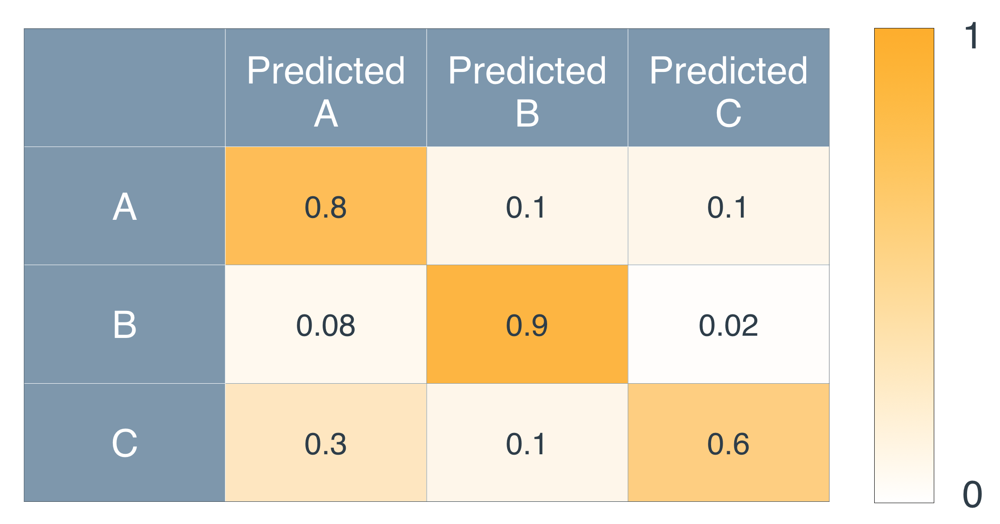
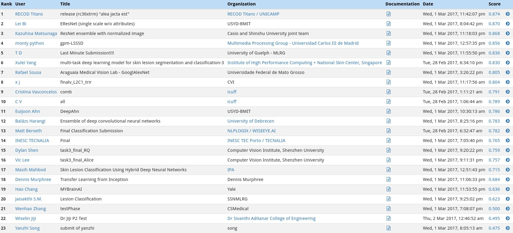
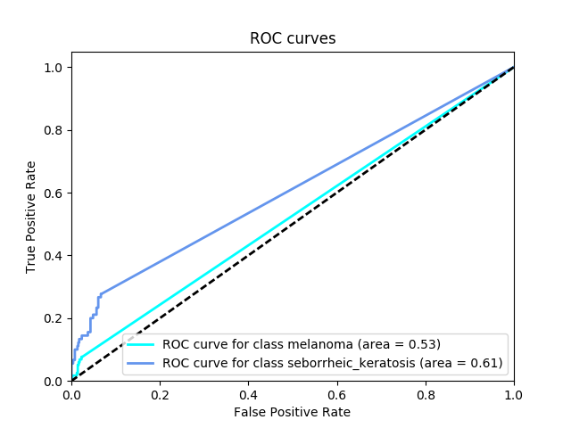

---


layout: post
title: 机器学习-深度学习-癌症检测深度学习
description: 在这章，主要讲解了监督学习相关的技术。
Keywords: 机器学习、模型、评估指标
tagline: 
categories: [ML]
tags: [ML]

---


* 目录
 {:toc  }
# 


## 1、介绍

<video controls="" preload="none" style="width:100%; height:100%; object-fit: fill"   src="../assets/media/uda-ml/deep/azjc/1-t.mp4"></video>
## 2、皮肤癌

<video controls="" preload="none" style="width:100%; height:100%; object-fit: fill"   src="../assets/media/uda-ml/deep/azjc/2-t.mp4"></video>
## 3、皮肤癌生存概率


<video controls="" preload="none" style="width:100%; height:100%; object-fit: fill"   src="../assets/media/uda-ml/deep/azjc/3-t.mp4"></video>
## 4、医学分类

<video controls="" preload="none" style="width:100%; height:100%; object-fit: fill"   src="../assets/media/uda-ml/deep/azjc/4-t.mp4"></video>
## 5、数据


<video controls="" preload="none" style="width:100%; height:100%; object-fit: fill"   src="../assets/media/uda-ml/deep/azjc/5-t.mp4"></video>
## 6、图像挑战

<video controls="" preload="none" style="width:100%; height:100%; object-fit: fill"   src="../assets/media/uda-ml/deep/azjc/6-t.mp4"></video>
**挑战**

根据以下图像，你能说出决定病变是良性（上方）还是恶性（下方）病变的特征吗？


## 7、练习：数据挑战

<video controls="" preload="none" style="width:100%; height:100%; object-fit: fill"   src="../assets/media/uda-ml/deep/azjc/7-t.mp4"></video>
## 8、参考答案：数据挑战

<video controls="" preload="none" style="width:100%; height:100%; object-fit: fill"   src="../assets/media/uda-ml/deep/azjc/8-t.mp4"></video>
## 9、训练神经网络

<video controls="" preload="none" style="width:100%; height:100%; object-fit: fill"   src="../assets/media/uda-ml/deep/azjc/9-t.mp4"></video>
## 10、练习：随机权重与预初始化权重

<video controls="" preload="none" style="width:100%; height:100%; object-fit: fill"   src="../assets/media/uda-ml/deep/azjc/10-t.mp4"></video>
## 11、参考答案：随机权重与预初始化权重

<video controls="" preload="none" style="width:100%; height:100%; object-fit: fill"   src="../assets/media/uda-ml/deep/azjc/11-t.mp4"></video>
## 12、训练验证

<video controls="" preload="none" style="width:100%; height:100%; object-fit: fill"   src="../assets/media/uda-ml/deep/azjc/12-t.mp4"></video>
## 13、练习：敏感性与特异性

<video controls="" preload="none" style="width:100%; height:100%; object-fit: fill"   src="../assets/media/uda-ml/deep/azjc/13-t.mp4"></video>
## 14、参考答案：敏感性与特异性

<video controls="" preload="none" style="width:100%; height:100%; object-fit: fill"   src="../assets/media/uda-ml/deep/azjc/14-t.mp4"></video>
## 15、敏感性与特异性进一步介绍

*敏感性*和*特异性*虽然与*查准率*和*查全率*相似，但并不相同。其定义如下：

在癌症示例中，敏感性和特异性指：

- 敏感性：在**患有**癌症的所有人中，诊断正确的人有多少？
- 特异性：在**未患**癌症的所有人中，诊断正确的人有多少？

查准率和查全率的定义如下：

- 查准率：在**被诊断**患有癌症的所有人中，多少人确实**得了癌症**？
- 查全率：在**患有癌症**的所有人中，多少人**被诊断**患有癌症？

从这里可以看出，敏感性就是查全率，但特异性并不是查准率。


敏感性和特异性是这个矩阵中的行。更具体地说，如果我们做以下标记

- TP：（真阳性）被**正确**诊断为患病的病人。
- TN：（真阴性）被**正确**诊断为健康的健康人。
- FP：（假阳性）被**错误**诊断为患病的健康人。
- FN：（假阴性）被**错误**诊断为健康的病人。

那么：

敏感性 = $$\frac{TP}{TP + FN}=*T**P*+*F**N**T**P$$*

且

特异性 = $$\frac{TN}{TN + FP}=*T**N*+*F**P**T**N*。$$


敏感性和特异性


查准率和查全率是矩阵的第一行和第一列：

查全率 = $$\frac{TP}{TP + FN}=*T**P*+*F**N**T**P$$*


且

查准率 =$$ \frac{TP}{TP + FP}=*T**P*+*F**P**T**P$$*。


查准率和查全率


## 16、练习：癌症诊断


<video controls="" preload="none" style="width:100%; height:100%; object-fit: fill"   src="../assets/media/uda-ml/deep/azjc/15-t.mp4"></video>
## 17、参考答案：癌症诊断

<video controls="" preload="none" style="width:100%; height:100%; object-fit: fill"   src="../assets/media/uda-ml/deep/azjc/16-t.mp4"></video>
下图是我们的模型对一组病变图像所做的预测直方图，如下所述：

- 水平轴上的每个点是从 0 到 1 的值 p*p*。
- 在所有值 p*p* 中，我们定位了被分类器预测概率 p 为恶性的所有病变。


](https://classroom.udacity.com/nanodegrees/nd009-cn-advanced/parts/bfc08027-d9e2-4483-839c-e6ec1e2ada4c/modules/10b781e7-357b-4e54-8180-4a55a1daf6dc/lessons/54e18898-2666-445d-ba5c-ecab62a61d00/concepts/addce202-903a-4bbc-a803-da9e3a14123b#)


在图中，我们将 0.2、0.5 和 0.8 作为阈值。请注意：

- 在 0.2 下，我们正确分类了每个恶性病变，但也对许多良性病变进行了进一步检查。
- 在 0.5 下，我们未诊断出一些恶性病变（严重），对少许良性病变进行了进一步检查。
- 在 0.8 下，我们对大部分良性病变进行了正确分类，但未诊断出许多恶性病变（非常严重）。

因此，在这种情况下，0.2 是否更好还存在争议。

但是，在该模型中，可能会有更好的阈值。这个阈值是多少？


### 练习题

在该模型中，哪个值是最佳阈值？

- 0.1
- 0.4
- 0.6
- 0.7
- 

## 18 、ROC 曲线


我们将真阳性率作为水平轴，将假阳性率作为垂直轴。


](https://classroom.udacity.com/nanodegrees/nd009-cn-advanced/parts/bfc08027-d9e2-4483-839c-e6ec1e2ada4c/modules/10b781e7-357b-4e54-8180-4a55a1daf6dc/lessons/54e18898-2666-445d-ba5c-ecab62a61d00/concepts/536af98c-9002-4fe3-b6a1-4b02ce171a5a#)


但是，在这一节课，我将使用不同的 ROC 曲线。我使用的曲线好像是把这个曲线侧翻了一样，如图所示：


](https://classroom.udacity.com/nanodegrees/nd009-cn-advanced/parts/bfc08027-d9e2-4483-839c-e6ec1e2ada4c/modules/10b781e7-357b-4e54-8180-4a55a1daf6dc/lessons/54e18898-2666-445d-ba5c-ecab62a61d00/concepts/536af98c-9002-4fe3-b6a1-4b02ce171a5a#)


我使用这个曲线的原因非常有意思。我们把敏感性作为水平轴、特异性作为垂直轴，就得到了这个曲线！

我再具体一点（一语双关）。我们使用与上一部分相同的直方图。


](https://classroom.udacity.com/nanodegrees/nd009-cn-advanced/parts/bfc08027-d9e2-4483-839c-e6ec1e2ada4c/modules/10b781e7-357b-4e54-8180-4a55a1daf6dc/lessons/54e18898-2666-445d-ba5c-ecab62a61d00/concepts/536af98c-9002-4fe3-b6a1-4b02ce171a5a#)


回想一下，水平轴上的值都是可能阈值。对于 0 和 1 之间的任何阈值 p*p*，模型的结论如下：*“该阈值左边的所有病变都被视为良性，其右边的所有病变都被视为恶性，并会接受进一步检查。”*

对于这个模型，我们对敏感性和特异性进行以下计算：

- 敏感性：在所有恶性病变中，位于阈值右侧的病变（正确分类）的百分比是多少？
- 特异性：在所有良性病变中，位于阈值左侧的病变（正确分类）的百分比是多少？

我们将（敏感性，特异性）作为坐标系，绘制出这个点。如果绘制出与 0% 和 100% 之间的每个可能阈值对应的所有点，则会得到我在上面绘制的 ROC 曲线。因此，也可以将 ROC 曲线称为*敏感性-特异性曲线*。

最后是在阈值从 0 向 1 变化时绘制 ROC 曲线的一段动画。


Replay

Mute

Loaded: 100.00%

Remaining Time -0:00

Playback Rate

1x

Picture-in-PictureFullscreen


## 19、练习：ROC 曲线

<video controls="" preload="none" style="width:100%; height:100%; object-fit: fill"   src="../assets/media/uda-ml/deep/azjc/18-t.mp4"></video>
](https://classroom.udacity.com/nanodegrees/nd009-cn-advanced/parts/bfc08027-d9e2-4483-839c-e6ec1e2ada4c/modules/10b781e7-357b-4e54-8180-4a55a1daf6dc/lessons/54e18898-2666-445d-ba5c-ecab62a61d00/concepts/ed2ffa85-b161-4e17-8a1f-e201ced9a385#)


## 20、参考答案：ROC 曲线

<video controls="" preload="none" style="width:100%; height:100%; object-fit: fill"   src="../assets/media/uda-ml/deep/azjc/19-t.mp4"></video>
## 21、将我们的结果与医生诊断结果相比较

<video controls="" preload="none" style="width:100%; height:100%; object-fit: fill"   src="../assets/media/uda-ml/deep/azjc/20-t.mp4"></video>
## 22、可视化

<video controls="" preload="none" style="width:100%; height:100%; object-fit: fill"   src="../assets/media/uda-ml/deep/azjc/21-t.mp4"></video>
## 23、神经网络关注的是什么

<video controls="" preload="none" style="width:100%; height:100%; object-fit: fill"   src="../assets/media/uda-ml/deep/azjc/22-t.mp4"></video>
## 24、混淆矩阵回顾

我们在评价指标课程中学习了混淆矩阵。

但是，混淆矩阵可以比 2 \times 22×2 大得多。以下是一个大混淆矩阵的示例。假设有三种疾病，分别称为 A、B 和 C。该混淆矩阵如下所示：


三种类型疾病（A、B 和 C）的混淆矩阵](https://classroom.udacity.com/nanodegrees/nd009-cn-advanced/parts/bfc08027-d9e2-4483-839c-e6ec1e2ada4c/modules/10b781e7-357b-4e54-8180-4a55a1daf6dc/lessons/54e18898-2666-445d-ba5c-ecab62a61d00/concepts/30493758-5ce5-4239-b206-309997c61932#)


可以看出， 第 i*i* 行和 第 j*j* 列的每个条目会告诉你病人患有疾病 i*i*、以及被诊断出疾病 j*j* 的概率。

例如，根据第二行、第一列的条目，可以确定如果病人患有疾病 B，被诊断出疾病 A 的概率是 0.08。

我们现在用几个测试题测试一下你学到的知识。

**习题 1/5**

如果你患有疾病 A，被诊断出疾病 C 的概率是多少？

- 0.1
- 0.3
- 0.6

**习题 2/5**

如果你患有疾病 C，被诊断出疾病 C 的概率是多少？

- 0.2
- 0.4
- 0.6

**习题 3/5**

如果有一个完美分类器，混淆矩阵会是什么样？

- 矩阵中的每个条目都是 1
- 单位矩阵
- 矩阵中的每个条目都是 1 除以疾病数量

**习题 4/5**

如果你的医生是一只猴子，它无论在什么情况下都会指向字母 B，混淆矩阵会是什么样?


- 第二行都是 1，其他地方都是零
- 第二列都是 1，其他地方都是零
- 一组随机数字


### 习题 5/5

将混淆矩阵必须满足的所有属性打勾。

- 每个条目都在 0 和 1 之间。
- 对角线上的条目需要大于其他地方的条目。
- 每一列的条目相加必须等于 1。
- 每一行的条目相加必须等于 1。


## 25、混淆矩阵

<video controls="" preload="none" style="width:100%; height:100%; object-fit: fill"   src="../assets/media/uda-ml/deep/azjc/23-t.mp4"></video>
## 26、总结


<video controls="" preload="none" style="width:100%; height:100%; object-fit: fill"   src="../assets/media/uda-ml/deep/azjc/24-t.mp4"></video>
## 27、有用资源


这是我们在[《自然》](https://www.nature.com/articles/nature21056.epdf?author_access_token=8oxIcYWf5UNrNpHsUHd2StRgN0jAjWel9jnR3ZoTv0NXpMHRAJy8Qn10ys2O4tuPakXos4UhQAFZ750CsBNMMsISFHIKinKDMKjShCpHIlYPYUHhNzkn6pSnOCt0Ftf6)杂志中发表的文章。

与我们的研究相关的其他文章：

- [《财富》杂志](http://fortune.com/2017/01/26/stanford-ai-skin-cancer/)
- [《彭博商业周刊》](https://www.bloomberg.com/news/articles/2017-06-29/diagnosing-skin-cancer-with-google-images)
- [BBC](http://www.bbc.com/news/health-38717928)
- [《华尔街日报》](https://www.wsj.com/articles/computers-turn-medical-sleuths-and-identify-skin-cancer-1486740634?emailToken=JRrzcPt+aXiegNA9bcw301gwc7UFEfTMWk7NKjXPN0TNv3XR5Pmlyrgph8DyqGWjAEd26tYY7mAuACbSgWwvV8aXkLNl1A74KycC8smailE=)
- [《福布斯》](https://www.forbes.com/sites/forbestechcouncil/2017/09/27/what-can-computer-vision-do-in-the-palm-of-your-hand/#4d2c686847a7)
- [《科学美国人》](https://www.scientificamerican.com/article/deep-learning-networks-rival-human-vision1/)

注：以上链接中部分为外网链接，国内网络可能无法打开。


## 28、小项目介绍

<video controls="" preload="none" style="width:100%; height:100%; object-fit: fill"   src="../assets/media/uda-ml/deep/azjc/25-t.mp4"></video>
## 29、小项目：皮肤科医生的人工智能

**介绍**

在这个小项目中，你要设计一个算法，使其能对最致命的皮肤癌——[黑色素瘤](http://www.skincancer.org/skin-cancer-information/melanoma)进行视觉诊断。你的算法应特别能将这种恶性皮肤肿瘤与两种良性病变（[黑色素痣](http://missinglink.ucsf.edu/lm/dermatologyglossary/nevus.html)和[脂溢性角化病](https://www.aad.org/public/diseases/bumps-and-growths/seborrheic-keratoses)）区分开来。

数据和目标来自[国际皮肤影像协作组织 2017 年黑色素瘤检测的皮肤病变分析挑战](https://challenge.kitware.com/#challenge/583f126bcad3a51cc66c8d9a)。作为挑战的一部分，参与者需要设计一个算法，用于诊断三种不同皮肤病的其中之一（黑色素瘤、黑色素痣或脂溢性角化病）的皮肤病变图像。在该项目中，你要创建一个模型，用于生成你自己的预测结果。


## 开始

1. 克隆

   资源库

   并创建

    

   ```
   data/
   ```

    

   文件夹，用于保存皮肤图像的数据集。

   ```text
   git clone https://github.com/udacity/dermatologist-ai.git
   mkdir data; cd data
   ```

2. 创建用于保存训练、验证和测试图像的文件夹。

   ```text
   mkdir train; mkdir valid; mkdir test
   ```

3. 下载并解压[训练数据](https://s3.cn-north-1.amazonaws.com.cn/static-documents/nd101/v4-dataset/train.zip) (5.3 GB)。

4. 下载并解压[验证数据](https://s3.cn-north-1.amazonaws.com.cn/static-documents/nd101/v4-dataset/valid.zip) (824.5 MB)。

5. 下载并解压[测试数据](https://s3.cn-north-1.amazonaws.com.cn/static-documents/nd101/v4-dataset/test.zip) (5.1 GB)。

6. 将训练、验证和测试图像分别保存在 `data/` 文件夹下的 `data/train/`、`data/valid/` 和 `data/test/` 文件夹中。每个文件夹应包含三个子文件夹（`melanoma/`、`nevus/`、`seborrheic_keratosis/`），每个子文件夹分别用于保存这三个图像类的代表性图像。

你可以自行选用任何编码环境完成这个小项目！为了对你的成果进行评分，你最后只需要将预测测试结果保存为 CSV 文件。

**创建模型**

使用训练和验证数据对模型进行训练，使其可以区分三种不同的图像类。（*训练之后，你要用测试图像检测模型的性能。*）

如需了解该竞赛中获胜的一些算法，请阅读[这篇文章](https://arxiv.org/pdf/1710.05006.pdf)，它对某些最佳方法进行了讨论。几篇相关研究论文如下所述。

- Matsunaga K、Hamada A、Minagawa A、Koga H。[“用深度神经网络集成对黑色素瘤、黑色素痣和脂溢性角化病进行图像分类”](https://arxiv.org/ftp/arxiv/papers/1703/1703.03108.pdf)。国际皮肤影像协作组织 (ISIC) 2017 年国际生物医学成像研讨会 (ISBI) 挑战。
- Daz IG。[“皮肤科医生知识在诊断皮肤病变的卷积神经网络中的运用”](https://arxiv.org/pdf/1703.01976.pdf)。国际皮肤影像协作组织 (ISIC) 2017 年国际生物医学成像研讨会 (ISBI) 挑战。([**github**](https://github.com/igondia/matconvnet-dermoscopy))
- Menegola A、Tavares J、Fornaciali M、Li LT、Avila S、Valle E。[“ISIC 2017 年挑战 RECOD Titans”](https://arxiv.org/abs/1703.04819)。国际皮肤影像协作组织 (ISIC) 2017 年国际生物医学成像研讨会 (ISBI) 挑战。([**github**](https://github.com/learningtitans/isbi2017-part3))

最初的挑战提供附加数据（如患者性别和年龄），但我们仅为你提供图像数据。如需下载患者的附加数据，可在竞赛[网站](https://challenge.kitware.com/#phase/5840f53ccad3a51cc66c8dab)下载。

以上三个团队都使用了附加数据来源，增加了训练集中的图像数量。如需扩展你的训练集，可访问[国际皮肤影像协作组织档案](https://isic-archive.com/#images)。

## 评价

受国际皮肤影像协作组织挑战的启发，我们将按照三个类别对你的算法进行评分。

#### 类别 1：黑色素瘤分类的 ROC AUC

在第一个类别中，我们将计算与该二元分类任务对应的受试者工作特征曲线 ([ROC AUC](http://scikit-learn.org/stable/modules/generated/sklearn.metrics.roc_auc_score.html)) 下方的面积，检测你的卷积神经网络能否区分恶性黑色素瘤与良性皮肤病变（黑色素痣、脂溢性角化病）。

如果你不熟悉 ROC（受试者工作特征）曲线，想要进一步学习，可以阅读 [scikit-learn](http://scikit-learn.org/stable/auto_examples/model_selection/plot_roc.html#sphx-glr-auto-examples-model-selection-plot-roc-py) 中的文件或者阅读[这篇 Wikipedia 文章](https://en.wikipedia.org/wiki/Receiver_operating_characteristic)。

ISIC 竞赛中该类别得分最高的如下图所示。


](https://classroom.udacity.com/nanodegrees/nd009-cn-advanced/parts/bfc08027-d9e2-4483-839c-e6ec1e2ada4c/modules/10b781e7-357b-4e54-8180-4a55a1daf6dc/lessons/54e18898-2666-445d-ba5c-ecab62a61d00/concepts/6d13a6cb-b783-49e2-b67c-b65e53da0a67#)


#### 类别 2: 黑色素痣分类的 ROC AUC

我们将要检查的所有皮肤病变是[黑色素细胞](https://en.wikipedia.org/wiki/Melanocyte)或[角化细胞](https://en.wikipedia.org/wiki/Keratinocyte)（两种不同类型的表皮皮肤细胞）的异常生长造成的。黑色素瘤和黑色素痣是黑色素细胞产生的，而脂溢性角化病是角化细胞产生的。

在第二个类别中，我们将计算与该二元分类任务对应的受试者工作特征曲线 ([ROC AUC](http://scikit-learn.org/stable/modules/generated/sklearn.metrics.roc_auc_score.html)) 下方的面积，检测你的卷积神经网络能否区分黑色素细胞和角化细胞的皮肤病变。

ISIC 竞赛中该类别得分最高的如下图所示。


](https://classroom.udacity.com/nanodegrees/nd009-cn-advanced/parts/bfc08027-d9e2-4483-839c-e6ec1e2ada4c/modules/10b781e7-357b-4e54-8180-4a55a1daf6dc/lessons/54e18898-2666-445d-ba5c-ecab62a61d00/concepts/6d13a6cb-b783-49e2-b67c-b65e53da0a67#)


#### 类别 3：平均 ROC AUC

在第三个类别中，我们将取前两个类别中 ROC AUC 值的平均值。

ISIC 竞赛中该类别得分最高的如下图所示。


](https://classroom.udacity.com/nanodegrees/nd009-cn-advanced/parts/bfc08027-d9e2-4483-839c-e6ec1e2ada4c/modules/10b781e7-357b-4e54-8180-4a55a1daf6dc/lessons/54e18898-2666-445d-ba5c-ecab62a61d00/concepts/6d13a6cb-b783-49e2-b67c-b65e53da0a67#)

**提交你的成果**

训练模型之后，创建一个 CSV 文件，用于保存你的预测测试结果。该文件应有 600 行，每行与不同的测试图像对应，**外加**一个标题行。可以在资源库中查看提交文件样本 (`sample_submission.csv`)。

你的文件应有 3 列：

- `Id` - 测试图像的文件名（顺序与提交文件样本中的**相同**）
- `task_1` - 模型对图像（路径在 `Id` 下）显示黑色素瘤的预测概率
- `task_2` - 模型对图像（路径在 `Id` 下）显示脂溢性角化病的预测概率

提交 CSV 文件之后，使用 `get_results.py` 文件对你提交的文件进行评分。如需建立运行该文件的环境，需要用 Python 3.5 和可安装 pip 的几个包进行创建（并激活）：

```text
conda create --name derm-ai python=3.5
source activate derm-ai
pip install -r requirements.txt
```

建立环境之后，运行以下命令，查看提交文件样本的效果：

```text
python get_results.py sample_predictions.csv
```

对获得的三个类别的得分的终端输出进行检查：

```text
Category 1 Score: 0.526
Category 2 Score: 0.606
Category 3 Score: 0.566
```

对应的 **ROC 曲线**以及与黑色素瘤分类对应的**混淆矩阵**，都会出现在弹出窗口中。


](https://classroom.udacity.com/nanodegrees/nd009-cn-advanced/parts/bfc08027-d9e2-4483-839c-e6ec1e2ada4c/modules/10b781e7-357b-4e54-8180-4a55a1daf6dc/lessons/54e18898-2666-445d-ba5c-ecab62a61d00/concepts/6d13a6cb-b783-49e2-b67c-b65e53da0a67#)


](https://classroom.udacity.com/nanodegrees/nd009-cn-advanced/parts/bfc08027-d9e2-4483-839c-e6ec1e2ada4c/modules/10b781e7-357b-4e54-8180-4a55a1daf6dc/lessons/54e18898-2666-445d-ba5c-ecab62a61d00/concepts/6d13a6cb-b783-49e2-b67c-b65e53da0a67#)


从混淆矩阵中可以看出，提交文件样本当前预测的是，测试数据集中的大多数图像与良性病变对应。我们将会检验你的模型能否改进这个结果，从而更好地检测癌症！

用于生成混淆矩阵的代码假设黑色素瘤的分类阈值为 0.5。如需改变该阈值，只需在调用 `get_results.py` 文件时提供一个额外的命令行参数。例如，如需将阈值设为 0.4，只需运行：

```text
python get_results.py sample_predictions.csv 0.4
```

如需测试**你自己**提交的文件，请更改代码，将**你的** CSV 文件路径包含在其中。


## 30 、分享你的成果！


如果满意你的成果，请将包含你的代码的 GitHub 资源库分享到 nd101 slack 的 **#cnns** 频道！在 GitHub 资源库中更新你的成果，是与他人分享你的知识、吸引潜在雇主的绝佳方式。

你还可以访问 slack 频道提问问题、获得实现过程的提示、分享观点，或者找到合作者！（*我们欢迎（并鼓励！）你与其他学员合作。*）