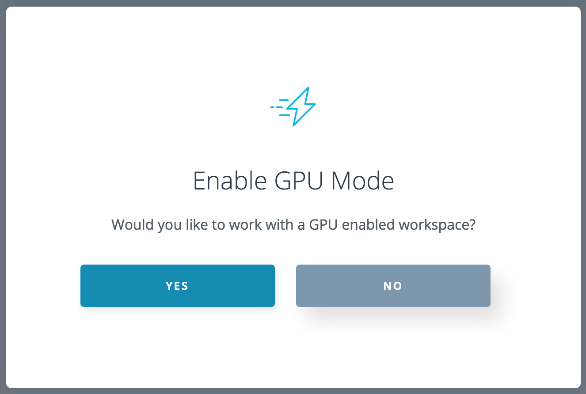

---

layout: post
title: 机器学习-强化学习-深度 Q 学习简介
description: 在这章，主要讲解了监督学习相关的技术。
Keywords: 机器学习、模型、评估指标
tagline: 
categories: [ML]
tags: [ML]

---

* 目录
 {:toc  }
# 

## 1、深度 Q 学习简介

<video controls="" preload="none" style="width:100%; height:100%; object-fit: fill"   src="../assets/media/uda-ml/qinghua/shenduQ/1-t.mp4"></video>
## 2、神经网络作为值函数

<video controls="" preload="none" style="width:100%; height:100%; object-fit: fill"   src="../assets/media/uda-ml/qinghua/shenduQ/2-t.mp4"></video>
## 3、蒙特卡洛学习

<video controls="" preload="none" style="width:100%; height:100%; object-fit: fill"   src="../assets/media/uda-ml/qinghua/shenduQ/3-t.mp4"></video>
## 4、时间差分学习

<video controls="" preload="none" style="width:100%; height:100%; object-fit: fill"   src="../assets/media/uda-ml/qinghua/shenduQ/4-t.mp4"></video>
## 5、Q 学习

<video controls="" preload="none" style="width:100%; height:100%; object-fit: fill"   src="../assets/media/uda-ml/qinghua/shenduQ/5-t.mp4"></video>
## 6、深度 Q 网络

<video controls="" preload="none" style="width:100%; height:100%; object-fit: fill"   src="../assets/media/uda-ml/qinghua/shenduQ/6-t.mp4"></video>
## 7、经验回放

<video controls="" preload="none" style="width:100%; height:100%; object-fit: fill"   src="../assets/media/uda-ml/qinghua/shenduQ/7-t.mp4"></video>
**阅读延伸**

- Long-Ji Lin，1993 年，[《使用神经网络的机器人强化学习》](https://s3.cn-north-1.amazonaws.com.cn/static-documents/nd101/a261434.pdf)。

## 8、固定 Q 目标

<video controls="" preload="none" style="width:100%; height:100%; object-fit: fill"   src="../assets/media/uda-ml/qinghua/shenduQ/8-t.mp4"></video>
## 9、深度 Q 学习算法

<video controls="" preload="none" style="width:100%; height:100%; object-fit: fill"   src="../assets/media/uda-ml/qinghua/shenduQ/9-t.mp4"></video>
**阅读延伸**

- Mnih et al.，2015 年，[《通过深度强化学习实现人类级别的控制》](https://storage.googleapis.com/deepmind-media/dqn/DQNNaturePaper.pdf)（DQN 论文）
- He et al. ，2015 年，[《深入研究纠正器：在 ImageNet 分类方面超过人类水平》](https://arxiv.org/abs/1502.01852)（权重初始化）

## 10、DQN 改进

<video controls="" preload="none" style="width:100%; height:100%; object-fit: fill"   src="../assets/media/uda-ml/qinghua/shenduQ/10-t.mp4"></video>
**阅读延伸**

- Thrun 和 Schwartz，1993 年，[《使用函数逼近进行强化学习存在的问题》](http://citeseerx.ist.psu.edu/viewdoc/summary?doi=10.1.1.73.3097)（ 高估 Q 值）
- van Hasselt et al.，2015 年，[《双 Q 学习的深度强化学习》](https://arxiv.org/abs/1509.06461)
- Schaul et al.，2016 年，[《优先经验回放》](https://arxiv.org/abs/1511.05952)
- Wang et al.，2015 年。[《深度强化学习的对抗网络架构》](https://arxiv.org/abs/1511.06581)。
- Hausknecht 和 Stone，2015 年，[《部分可观察 MDP 的深度递归 Q 学习》](https://arxiv.org/abs/1507.06527)

## 11、实现深度Q学习

# 实现深度 Q 学习

在**下个部分**，你将探索一个深度 Q 学习算法 TensorFlow 实现的 Jupyter notebook。

要在 GPU 上运行代码，请在弹出式窗口中选择**“YES”**。这样就可以在 GPU 上运行 notebook。

如果你想了解如何在其他 Python 框架中编写实现，请参阅：

- (Keras) https://keon.io/deep-q-learning/
- (PyTorch) http://pytorch.org/tutorials/intermediate/reinforcement_q_learning.html

## 12、备注：

系统默认打开的会首先是英文 “Q-learning-cart.ipynb“ 文件。 如需要中文版本，请直接点击左上角 ”Jupter“， 选择 “ Q-learning-cart-zh.ipynb” 即可加载出中文文件。如未出现，请点击Workspace左下角的Menu上的红色三角，选择‘reset data’即能更新到最新的directory，但是该更新会还原所有的文件内容，请预先保存，谢谢。

## 13、总结

<video controls="" preload="none" style="width:100%; height:100%; object-fit: fill"   src="../assets/media/uda-ml/qinghua/shenduQ/11-t.mp4"></video>