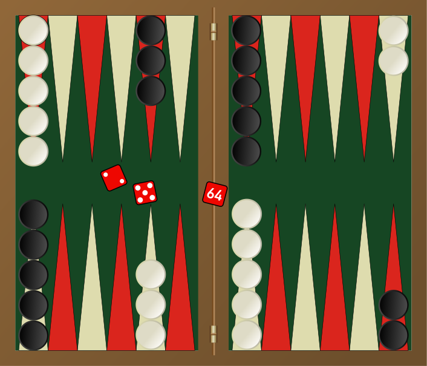

---

layout: post
title: 机器学习-强化学习-强化学习框架：问题
description: 在这章，主要讲解了监督学习相关的技术。
Keywords: 机器学习、模型、评估指标
tagline: 
categories: [ML]
tags: [ML]

---

* 目录
 {:toc  }
# 

## 1、 简介

<video controls="" preload="none" style="width:100%; height:100%; object-fit: fill"   src="../assets/media/uda-ml/qinghua/wenti/1-t.mp4"></video>
## 2、设置 - 回顾

<video controls="" preload="none" style="width:100%; height:100%; object-fit: fill"   src="../assets/media/uda-ml/qinghua/wenti/2-t.mp4"></video>
## 3、阶段性任务与连续性任务

<video controls="" preload="none" style="width:100%; height:100%; object-fit: fill"   src="../assets/media/uda-ml/qinghua/wenti/3-t.mp4"></video>
## 4、练习：知识测验

](https://classroom.udacity.com/nanodegrees/nd009-cn-advanced/parts/a2386085-8101-47b6-84e0-7b61a76c2b82/modules/dffda80a-0d5b-460d-afbc-3e0ce20e867f/lessons/86acfc34-0551-4cc6-8de4-a1ab2e66b5af/concepts/e7e0fd83-096a-4f35-be33-3af2e2d77696#)

## 玩象棋

假设你是一个智能体，你的目标是玩象棋。在每个时间步，你都从游戏中的一组可能的走法中选择任何一个**动作**。你的对手是环境的一部分；你以自己的走法做出回应，你在下个时间步收到的**状态**是当你选择下个走法时棋盘的布局。**奖励**仅在游戏结束时获得，假设如果你获胜了，奖励为 1，失败了，奖励为 -1。

这是一个**阶段性任务**，当游戏结束时，一个阶段结束。原理是通过玩该游戏很多次，或通过与该环境互动很多个阶段，你越来越善于玩象棋。

需要注意的是，这个问题非常难，因为只有游戏结束时才会获得反馈。如果你失败了（并在阶段结束时获得奖励 -1），不清楚你到底何时出错了：或许你玩的很差，每步都出错了，或者你大部分时间都玩的很好，只是在结束时犯了一个小小的错误。

在这种情形下，奖励提供的信息非常少，我们称这种任务存在*稀疏奖励*问题。这是一个专门的研究领域，如果感兴趣的话，建议你详细了解一下。

### 习题 1/4

在象棋中，智能体可以采取什么样的示例动作？

- 移动棋子
- 预测对手的走法
- 计算给定走法的代价

### 习题 2/4

该游戏有什么样的示例状态？

- 是否让该对手来移动棋子
- 棋盘布局
- 棋子的颜色

### 习题 3/4

‘假设你刚开始与对手一起玩象棋，似乎进展的不错，你已经走了 20 步，并且从对手那拿走了 5 个棋子。游戏还没结束，因此你不能完全确定你将获胜，但是可能性很大。你到目前为止获得了多少累积奖励？'

- 5
- 1
- 0
- -1
- -5

](https://classroom.udacity.com/nanodegrees/nd009-cn-advanced/parts/a2386085-8101-47b6-84e0-7b61a76c2b82/modules/dffda80a-0d5b-460d-afbc-3e0ce20e867f/lessons/86acfc34-0551-4cc6-8de4-a1ab2e66b5af/concepts/e7e0fd83-096a-4f35-be33-3af2e2d77696#)

## 逃脱迷宫

假设有这样一款游戏：智能体位于一个迷宫中，尝试找到抵达目的地的最快路径。如果智能体只能随机地探索迷宫，在至少抵达目的地一次之前，它将学不到任何规律。

### 习题 4/4

在迷宫中，智能体可以采取什么样的示例动作？

- 在迷宫中向北移动
- 发现迷宫中最快的道路

下一项

## 5、练习：阶段性或连续性？

# 练习：阶段性或连续性？

注意：

- **任务**是一种强化学习问题。
- **连续性任务**是一直持续下去、没有结束点的任务。
- **阶段性任务**是起始点和结束点明确的任务。
- 在这种情况下，我们将一个完整的互动系列（从开始到结束）称为一个**阶段**。
- 每当智能体抵达**最终状态**，阶段性任务都会结束。

了解以上这些信息后，请在下面的练习中将这些任务划分为连续性任务或阶段性任务。

来源：维基百科](https://classroom.udacity.com/nanodegrees/nd009-cn-advanced/parts/a2386085-8101-47b6-84e0-7b61a76c2b82/modules/dffda80a-0d5b-460d-afbc-3e0ce20e867f/lessons/86acfc34-0551-4cc6-8de4-a1ab2e66b5af/concepts/cbceaeb4-62a8-4df1-abc4-0a6bf21875c5#)

### 习题 1/2

假设有一个强化学习智能体想要[玩围棋](https://en.wikipedia.org/wiki/AlphaGo)。这是连续性任务还是阶段性任务？

- 连续性任务
- 阶段性任务

‘来源：维基百科'](https://classroom.udacity.com/nanodegrees/nd009-cn-advanced/parts/a2386085-8101-47b6-84e0-7b61a76c2b82/modules/dffda80a-0d5b-460d-afbc-3e0ce20e867f/lessons/86acfc34-0551-4cc6-8de4-a1ab2e66b5af/concepts/cbceaeb4-62a8-4df1-abc4-0a6bf21875c5#)

### 习题 2/2

假设有一个永生的小狗智能体，它想要从（永生的）主人那获得很多的奖赏。这是连续性任务还是阶段性任务？

- 连续性任务
- 阶段性任务

## 6、奖励假设

<video controls="" preload="none" style="width:100%; height:100%; object-fit: fill"   src="../assets/media/uda-ml/qinghua/wenti/4-t.mp4"></video>
## 7、目标和奖励（第 1 部分）

<video controls="" preload="none" style="width:100%; height:100%; object-fit: fill"   src="../assets/media/uda-ml/qinghua/wenti/5-t.mp4"></video>
## 8、目标和奖励（第 2 部分）

<video controls="" preload="none" style="width:100%; height:100%; object-fit: fill"   src="../assets/media/uda-ml/qinghua/wenti/6-t.mp4"></video>
## 9、练习：目标和奖励

# 练习：目标和奖励

到目前为止，你已经见过一个如何将智能体的目标构建为最大化预期累积奖励的示例。在这道练习中，你将研究另外几个示例。

来源：维基百科](https://classroom.udacity.com/nanodegrees/nd009-cn-advanced/parts/a2386085-8101-47b6-84e0-7b61a76c2b82/modules/dffda80a-0d5b-460d-afbc-3e0ce20e867f/lessons/86acfc34-0551-4cc6-8de4-a1ab2e66b5af/concepts/8a69064b-825b-4e16-b21f-01bfabeb416b#)

### 习题 1/3

假设有一个智能体想要学会逃脱迷宫。哪些奖励信号将鼓励智能体尽快逃脱迷宫？请选中所有适用项。

- 智能体待在迷宫中的每个时间步，奖励都是 -1。智能体逃脱后，这个阶段结束。
- 智能体待在迷宫中的每个时间步，奖励都是 +1。智能体逃脱后，这个阶段结束。
- 智能体待在迷宫中的每个时间步，奖励都是 -1。智能体逃脱后，获得奖励 +10，并且这个阶段结束。
- 智能体待在迷宫中的每个时间步，奖励都是 0。智能体逃脱后，获得奖励 +1，并且这个阶段结束。

来源：维基百科](https://classroom.udacity.com/nanodegrees/nd009-cn-advanced/parts/a2386085-8101-47b6-84e0-7b61a76c2b82/modules/dffda80a-0d5b-460d-afbc-3e0ce20e867f/lessons/86acfc34-0551-4cc6-8de4-a1ab2e66b5af/concepts/8a69064b-825b-4e16-b21f-01bfabeb416b#)

### 习题 2/3

‘假设有一个智能体想要玩棋类游戏（例如双陆棋、象棋或跳棋）。哪些奖励信号将鼓励智能体赢得游戏？请选中所有适用项。'

- 智能体仅在游戏结束时获得奖励；如果获胜，则获得奖励 +1，如果失败了，则获得奖励 -1，如果持平，则获得奖励 0。
- 在依然玩游戏的每个时间步，智能体获得奖励 -1；游戏结束后，这一阶段结束。
- 智能体仅在游戏结束时获得奖励，如果获胜，获得奖励 -1，如果失败，获得奖励 +1，如果持平，获得奖励 0。
- 智能体仅在游戏结束时获得奖励，如果获胜，获得奖励 +10，如果失败，获得奖励 -10，如果持平，获得奖励 0。

](https://classroom.udacity.com/nanodegrees/nd009-cn-advanced/parts/a2386085-8101-47b6-84e0-7b61a76c2b82/modules/dffda80a-0d5b-460d-afbc-3e0ce20e867f/lessons/86acfc34-0551-4cc6-8de4-a1ab2e66b5af/concepts/8a69064b-825b-4e16-b21f-01bfabeb416b#)

[来源: ](https://classroom.udacity.com/nanodegrees/nd009-cn-advanced/parts/a2386085-8101-47b6-84e0-7b61a76c2b82/modules/dffda80a-0d5b-460d-afbc-3e0ce20e867f/lessons/86acfc34-0551-4cc6-8de4-a1ab2e66b5af/concepts/8a69064b-825b-4e16-b21f-01bfabeb416b#)http://i.dailymail.co.uk/i/pix/2013/02/14/article-2278590-1792E332000005DC-394_634x615.jpg

### 习题 3/3

假设有一个智能体想要使她头上的碟子保持平衡。哪些奖励信号将鼓励智能体尽量使碟子保持平衡？请选中所有适用项。

- 在每个时间步，当智能体使头上的碟子保持平衡时，奖励是 -1。如果碟子掉下来了，这一阶段结束。
- 在每个时间步，当智能体使头上的碟子保持平衡时，奖励是 +1。如果碟子掉下来了，这一阶段结束。
- 仅当碟子掉下来时，智能体会获得奖励。如果碟子没有摔碎，智能体获得奖励 +1。

下一项

## 10、累积奖励

<video controls="" preload="none" style="width:100%; height:100%; object-fit: fill"   src="../assets/media/uda-ml/qinghua/wenti/7-t.mp4"></video>
## 11、折扣回报

<video controls="" preload="none" style="width:100%; height:100%; object-fit: fill"   src="../assets/media/uda-ml/qinghua/wenti/8-t.mp4"></video>
**注意**:在这门课程中，我们将随意使用“回报”和“折扣回报”。在随机时间步 t*t*, 都称之为$$ G_t \doteq R_{t+1} + \gamma R_{t+2} + \gamma^2 R_{t+3} + \ldots = \sum_{k=0}^\infty \gamma^k R_{t+k+1}*G**t*≐*R**t*+1+*γ**R**t*+2+*γ*2*R**t*+3+…=∑*k*=0∞*γ**k**R**t*+*k*+1, 其中 \gamma \in [0,1]*γ*∈[0,1]$$。尤其，当我们指代“回报”时，并不一定就是$$\gamma = 1*γ*=1$$，当我们指代“折扣回报”时，并不一定就是$$\gamma < 1*γ*<1$$。 (*推荐的教科书中的数据也是这样。*)

## 12、练习：杆平衡

](https://classroom.udacity.com/nanodegrees/nd009-cn-advanced/parts/a2386085-8101-47b6-84e0-7b61a76c2b82/modules/dffda80a-0d5b-460d-afbc-3e0ce20e867f/lessons/86acfc34-0551-4cc6-8de4-a1ab2e66b5af/concepts/e80e4570-62e2-4caf-a7df-02ea59e38874#)

[来源：](https://classroom.udacity.com/nanodegrees/nd009-cn-advanced/parts/a2386085-8101-47b6-84e0-7b61a76c2b82/modules/dffda80a-0d5b-460d-afbc-3e0ce20e867f/lessons/86acfc34-0551-4cc6-8de4-a1ab2e66b5af/concepts/e80e4570-62e2-4caf-a7df-02ea59e38874#)https://medium.com/@tuzzer/cart-pole-balancing-with-q-learning-b54c6068d947

在这个经典的强化学习任务中，在光滑的道路上有一辆购物车，购物车的顶部插着一根杆子。目标是通过使购物车向左或向右移动，防止杆子掉下来，并且购物车不会脱离轨道。

在 [OpenAI Gym 实现](https://gym.openai.com/envs/CartPole-v0/)中，智能体在每个时间步都向购物车应用 +1 或 -1 的力。它是一个阶段性任务，在以下情况下这一阶段会结束：(1) 杆子与垂直方向的夹角超过 20.9 度，(2) 购物车离道路中心的距离超过 2.4 个单位，或者 (3) 时间步超过了 200 步。对于每个时间步，购物车都获得奖励 +1，包括最终时间步。你可以在 [OpenAI 的 github](https://github.com/openai/gym/wiki/CartPole-v0) 中详细了解该环境。该任务还出现在了教科书的第 3.4 个示例中。

### 习题 1/3

智能体在每个时间步都获得奖励 +1，包括最终时间步。哪些折扣率会鼓励智能体尽量使杆子保持平衡？（请选中所有适用项。）

- 折扣率为 1。
- 折扣率为 0.9。
- 折扣率为 0.5。

### 习题 2/3

‘假设我们对奖励信号进行了修改，仅在阶段结束时向智能体提供奖励。因此在每个时间步，奖励都是 0，但是最终时间步除外。当阶段结束时，智能体获得奖励 **-1**。哪些折扣率会鼓励智能体尽量使杆子保持平衡？（请选中所有适用项。）'

- 折扣率是 1。
- 折扣率是 0.9。
- 折扣率是 0.5。
- 所有这些折扣率都无法帮助智能体，因为没有奖励信号。

### 习题 3/3

假设我们对奖励信号进行了修改，仅在阶段结束时向智能体提供奖励。因此在每个时间步，奖励都是 0，但是最终时间步除外。当阶段结束时，智能体获得奖励 **+1**。哪些折扣率会鼓励智能体尽量使杆子保持平衡？（请选中所有适用项。）

- 折扣率是 1。
- 折扣率是 0.9。
- 折扣率是 0.5。
- 所有这些折扣率都无法帮助智能体，因为没有奖励信号。

## 13、MDP（第 1 部分）

<video controls="" preload="none" style="width:100%; height:100%; object-fit: fill"   src="../assets/media/uda-ml/qinghua/wenti/9-t.mp4"></video>
通常，状态空间 \mathcal{S}S 是指所有非终止状态集合。

在连续性任务（例如在视频中介绍的回收任务）中，就相当于所有状态集合。

在阶段性任务中，我们使用 \mathcal{S}^+S 
+
  表示所有状态（包括终止状态）集合

动作空间 \mathcal{A}A 是指智能体可以采取的动作集合。

如果在某些状态下，只能采取部分动作，我们还可以使用 \mathcal{A}(s)A(s) 表示在状态 s\in\mathcal{S}s∈S 下可以采取的动作集合。

## 14、MDP（第 2 部分）
<video controls="" preload="none" style="width:100%; height:100%; object-fit: fill"   src="../assets/media/uda-ml/qinghua/wenti/10-t.mp4"></video>
4m19s处，字幕中“电量很高”，需改为“电量很低”

## 15、练习：一步动态特性（第 1 部分）

回顾下回收机器人示例。在上一部分，我们讨论了环境可以在任何时间步确定状态和奖励的一种方法。

](https://classroom.udacity.com/nanodegrees/nd009-cn-advanced/parts/a2386085-8101-47b6-84e0-7b61a76c2b82/modules/dffda80a-0d5b-460d-afbc-3e0ce20e867f/lessons/86acfc34-0551-4cc6-8de4-a1ab2e66b5af/concepts/ae3f662e-faee-470b-bc74-cb6c2db0cf90#)

假设在随机时间步 t*t*，机器人的电量状态是很高 (S_t = \text{high}*S**t*=high)。然后，智能体做出搜索响应 (A_t = \text{search}*A**t*=search)。你在上一部分了解到，在这种情况下，环境对智能体做出以下响应：抛掷一个虚拟硬币后，正面朝上的概率是 70%。

- 如果硬币正面朝上，环境判断下个状态是电量很高 (S_{t+1} = \text{high}*S**t*+1=high)，奖励为 4 (R_{t+1} = 4*R**t*+1=4)。
- 如果硬币背面朝上，环境判断下个状态是电量很低 (S_{t+1} = \text{low}*S**t*+1=low)，奖励是 4 (R_{t+1} = 4*R**t*+1=4)。

如下图所示。

](https://classroom.udacity.com/nanodegrees/nd009-cn-advanced/parts/a2386085-8101-47b6-84e0-7b61a76c2b82/modules/dffda80a-0d5b-460d-afbc-3e0ce20e867f/lessons/86acfc34-0551-4cc6-8de4-a1ab2e66b5af/concepts/ae3f662e-faee-470b-bc74-cb6c2db0cf90#)

实际上，在任何状态 S_{t}*S**t* 和动作 A_{t}*A**t*，都可以使用该图判断智能体将如何确定下个状态 S_{t+1}*S**t*+1 和奖励 R_{t+1}*R**t*+1。

### 习题 1/2

假设当前状态是电量很高，智能体决定等待。环境如何确定下个状态和奖励？

- 下个状态电量很高的概率为 80%，奖励是 -3。下个状态电量很低的概率为 20%，奖励是 4。
- 下个状态电量很高，奖励为 1。
- 下个状态电量很低，奖励为 1。
- 下个状态电量很高，奖励为 0。

### 习题 2/2

假设当前状态是电量很低，智能体决定充电。环境如何确定下个状态和奖励？

- 下个状态电量很高的概率为 80%，奖励是 -3。下个状态电量很低的概率为 20%，奖励是 4。
- 下个状态电量很高，奖励为 1。
- 下个状态电量很低，奖励为 1。
- 下个状态电量很高，奖励为 0。

## 16、练习：一步动态特性（第 2 部分）

# 练习：一步动态特性

使用数学记法表示环境动态比较方便。在此部分，我们将介绍这一记法（可以用于任何强化学习任务），并使用回收机器人作为讲解示例。

](https://classroom.udacity.com/nanodegrees/nd009-cn-advanced/parts/a2386085-8101-47b6-84e0-7b61a76c2b82/modules/dffda80a-0d5b-460d-afbc-3e0ce20e867f/lessons/86acfc34-0551-4cc6-8de4-a1ab2e66b5af/concepts/55ed22d2-2bfc-4a31-91ab-a812d7d02467#)

在随机时间步 t*t*，智能体环境互动变成一系列的状态、动作和奖励。

$$(S_0, A_0, R_1, S_1, A_1, \ldots, R_{t-1}, S_{t-1}, A_{t-1}, R_t, S_t, A_t)(*S*0,*A*0,*R*1,*S*1,*A*1,…,*R**t*−1,*S**t*−1,*A**t*−1,*R**t*,*S**t*,*A**t*)$$

当环境在时间步 t+1*t*+1 对智能体做出响应时，它只考虑上一个时间步$$ (S_t, A_t*S**t*,*A**t*) $$的状态和动作。

尤其是，它不关心再上一个时间步呈现给智能体的状态。（*换句话说*，环境不考虑任何$$ \{ S_0, \ldots, S_{t-1} \}{*S*0,…,*S**t*−1}$$。）

并且，它不考虑智能体在上个时间步之前采取的动作。（*换句话说*，环境不考虑任何 $$\{ A_0, \ldots, A_{t-1} \}{*A*0,…,*A**t*−1}。$$

此外，智能体的表现如何，或收集了多少奖励，对环境选择如何对智能体做出响应没有影响。（*换句话说*，环境不考虑任何 $$\{ R_0, \ldots, R_t \}{*R*0,…,*R**t*}。）$$

因此，我们可以通过指定以下设置完全定义环境如何决定状态和奖励

$$p(s',r|s,a) \doteq \mathbb{P}(S_{t+1}=s', R_{t+1}=r|S_t = s, A_t=a)*p*(*s*′,*r*∣*s*,*a*)≐P(*S**t*+1=*s*′,*R**t*+1=*r*∣*S**t*=*s*,*A**t*=*a*)$$

对于每个可能的 s', r, s, \text{and } a*s*′,*r*,*s*,and *a*。这些条件概率用于指定环境的**一步动态特性**。

## 一个示例

我们回顾下$$ S_t = \text{high}*S**t*=high、A_t = \text{search}*A**t*=search $$的情况。

](https://classroom.udacity.com/nanodegrees/nd009-cn-advanced/parts/a2386085-8101-47b6-84e0-7b61a76c2b82/modules/dffda80a-0d5b-460d-afbc-3e0ce20e867f/lessons/86acfc34-0551-4cc6-8de4-a1ab2e66b5af/concepts/55ed22d2-2bfc-4a31-91ab-a812d7d02467#)

然后，当环境在下个时间步对智能体做出响应时

- 下个时间步是电量很高的概率为 70%，奖励为 4。换句话说，p(\text{high}, 4|\text{high},\text{search}) = \mathbb{P}(S_{t+1}=\text{high}, R_{t+1}=4|S_{t} = \text{high}, A_{t}=\text{search}) = 0.7*p*(high,4∣high,search)=P(*S**t*+1=high,*R**t*+1=4∣*S**t*=high,*A**t*=search)=0.7。
- 下个时间步是电量很低的概率为 30%，奖励为 4。换句话说，p(\text{low}, 4|\text{high},\text{search}) = \mathbb{P}(S_{t+1}=\text{low}, R_{t+1}=4|S_{t} = \text{high}, A_{t}=\text{search}) = 0.3*p*(low,4∣high,search)=P(*S**t*+1=low,*R**t*+1=4∣*S**t*=high,*A**t*=search)=0.3。

## 问题 1

p(\text{high}, -3|\text{low},\text{search})*p*(high,−3∣low,search) 是多少？

## *Unavailable*该 练习 不再允许访问

This 练习 is unavailable because the Nanodegree program term has come to an end.

## 问题 2

p(\text{high}, 0|\text{low},\text{recharge})*p*(high,0∣low,recharge) 是多少？

## *Unavailable*该 练习 不再允许访问

This 练习 is unavailable because the Nanodegree program term has come to an end.

## 问题 3 和 4

考虑以下概率：

- (1) p(\text{low}, 1|\text{low},\text{search})*p*(low,1∣low,search)
- (2) p(\text{high}, 0|\text{low},\text{recharge})*p*(high,0∣low,recharge)
- (3) p(\text{high}, 1|\text{low},\text{wait})*p*(high,1∣low,wait)
- (4) p(\text{high}, 1|\text{high},\text{wait})*p*(high,1∣high,wait)
- (5) p(\text{high}, 1|\text{high},\text{search})*p*(high,1∣high,search)

### 习题 3/4

以上哪些概率等于 0（请选中所有适用项。）

- (1)
- (2)
- (3)
- (4)
- (5)

### 习题 4/4

以上哪些概率等于 1？（请选中所有适用项。）

- (1)
- (2)
- (3)
- (4)
- (5)

下一项

## 17、MDP（第 3 部分）

<video controls="" preload="none" style="width:100%; height:100%; object-fit: fill"   src="../assets/media/uda-ml/qinghua/wenti/11-t.mp4"></video>

## 18、有限 MDP

请使用[此链接](https://github.com/openai/gym/wiki/Table-of-environments)获取 OpenAI Gym 中的可用环境。

](https://classroom.udacity.com/nanodegrees/nd009-cn-advanced/parts/a2386085-8101-47b6-84e0-7b61a76c2b82/modules/dffda80a-0d5b-460d-afbc-3e0ce20e867f/lessons/86acfc34-0551-4cc6-8de4-a1ab2e66b5af/concepts/ded16999-b166-4fe7-aa98-02cbfea07ba8#)

环境索引为**环境 ID**，每个环境都有对应的**观察空间**、**动作空间**、**奖励范围**、**tStepL**、**Trials** 和 **rThresh**。

## CartPole-v0

在表格中查找对应于 **CartPole-v0** 环境的行。请记下相应的**观察空间** (`Box(4,)`) 和**动作空间** (`Discrete(2)`)。

](https://classroom.udacity.com/nanodegrees/nd009-cn-advanced/parts/a2386085-8101-47b6-84e0-7b61a76c2b82/modules/dffda80a-0d5b-460d-afbc-3e0ce20e867f/lessons/86acfc34-0551-4cc6-8de4-a1ab2e66b5af/concepts/ded16999-b166-4fe7-aa98-02cbfea07ba8#)

正如在 [OpenAI Gym 文档](https://gym.openai.com/docs/)中所描述的情况：

> 每个环境都有第一类 `Space` 对象，描述了有效的动作和观察结果。
>
> - `Discrete` 空间允许存在固定范围的非负数。
> - `Box` 空间表示 n 维方框，因此有效动作或观察结果将是一个有 n 个数字的数组。

## 观察空间

CartPole-v0 环境的观察空间有一个笔误：`Box(4,)`。因此，在每个时间点的观察结果（或状态）是有 4 个数字的数组。你可以在[此文档](https://github.com/openai/gym/wiki/CartPole-v0)中查看每个数字表示的含义。打开该页面后，向下滚动到观察空间的说明部分。

](https://classroom.udacity.com/nanodegrees/nd009-cn-advanced/parts/a2386085-8101-47b6-84e0-7b61a76c2b82/modules/dffda80a-0d5b-460d-afbc-3e0ce20e867f/lessons/86acfc34-0551-4cc6-8de4-a1ab2e66b5af/concepts/ded16999-b166-4fe7-aa98-02cbfea07ba8#)

注意**购物车速度**和**杆子顶端速度**的最小值 (-Inf) 和最大值 (Inf)。

因为数组中的条目对应的每个索引可以是任何实数，所以状态空间 \mathcal{S}^+S+ 是无限的！

## 动作空间

CartPole-v0 环境的动作空间类型为 `Discrete(2)`。因此，在任何时间点，智能体只能采取两个动作。你可以在[此文档](https://github.com/openai/gym/wiki/CartPole-v0)（注意，和查找观察空间使用的文档一样！）中查看每个数字表示的含义。打开该页面后，向下滚动到动作空间的说明部分。

](https://classroom.udacity.com/nanodegrees/nd009-cn-advanced/parts/a2386085-8101-47b6-84e0-7b61a76c2b82/modules/dffda80a-0d5b-460d-afbc-3e0ce20e867f/lessons/86acfc34-0551-4cc6-8de4-a1ab2e66b5af/concepts/ded16999-b166-4fe7-aa98-02cbfea07ba8#)

在这种情况下，动作空间 \mathcal{A}A 是一组有限的集合，仅包含两个元素。

## 有限 MDP

记得在上个部分，我们提到：在有限的 MDP 中，状态空间 \mathcal{S}S（或在阶段性任务中为 \mathcal{S}^+S+）和动作空间 \mathcal{A}A 必须都是有限的。

因此，虽然 CartPole-v0 环境的确指定了 MDP，它没有指定**有限的** MDP。在这门课程中，我们将重点讲解有限 MDP 的解决方法。

你在这门课程中将解决的环境为：

- [FrozenLake-v0](https://github.com/openai/gym/blob/master/gym/envs/toy_text/frozen_lake.py)
- [Blackjack-v0](https://github.com/openai/gym/blob/master/gym/envs/toy_text/blackjack.py)
- [CliffWalking-v0](https://github.com/openai/gym/blob/master/gym/envs/toy_text/cliffwalking.py)（*注意：此环境可能没有列在环境表格中*）
- [Taxi-v2](https://github.com/openai/gym/blob/master/gym/envs/toy_text/taxi.py)

如果你愿意的话，可以现在花时间详细了解这些环境。检查确保每个环境都指定**有限的** MDP。

## 19、 总结

# 总结

强化学习中的智能体环境互动。（来源：Sutton 和 Barto，2017 年）](https://classroom.udacity.com/nanodegrees/nd009-cn-advanced/parts/a2386085-8101-47b6-84e0-7b61a76c2b82/modules/dffda80a-0d5b-460d-afbc-3e0ce20e867f/lessons/86acfc34-0551-4cc6-8de4-a1ab2e66b5af/concepts/ee28399b-f809-4e2b-936b-5a88d7297899#)

### 设置，重新经历

- 强化学习 (RL) 框架包含学习与其**环境**互动的**智能体**。
- 在每个时间步，智能体都收到环境的**状态**（*环境向智能体呈现一种情况）*，智能体必须选择相应的响应**动作**。一个时间步后，智能体获得一个**奖励**（*环境表示智能体是否对该状态做出了正确的响应*）和新的**状态**。
- 所有智能体的目标都是最大化预期**累积奖励**，或在所有时间步获得的预期奖励之和。

### 阶段性任务与连续性任务

- **任务**是一种强化学习问题。
- **连续性任务**是一直持续下去、没有结束点的任务。
- **阶段性任务**是起始点和结束点明确的任务。
  - 在这种情况下，我们将一个完整的互动系列（从开始到结束）称为一个**阶段**。
  - 每当智能体抵达**最终状态**，阶段性任务都会结束。

### 奖励假设

- **奖励假设**：所有目标都可以构建为最大化（预期）累积奖励。

### 目标和奖励

- （请参阅**第 1 部分**和**第 2 部分**，以查看在现实问题中如何指定奖励信号的示例。）

### 累积奖励

- **在时间步 t\*t\*** 的回报是 G_t := R_{t+1} + R_{t+2} + R_{t+3} + \ldots*G**t*:=*R**t*+1+*R**t*+2+*R**t*+3+…
- 智能体选择动作的目标是最大化预期（折扣）回报。（*注意：折扣将在下部分讲解。*）

### 折扣回报

- **在时间步 t\*t\*** 的折扣回报是 G_t := R_{t+1} + \gamma R_{t+2} + \gamma^2 R_{t+3} + \ldots*G**t*:=*R**t*+1+*γ**R**t*+2+*γ*2*R**t*+3+…。

- 折扣回报 \gamma*γ*

   

  是你设置的值，以便进一步优化智能体的目标。

  - 它必须指定 0 \leq \gamma \leq 10≤*γ*≤1。
  - 如果 \gamma=0*γ*=0，智能体只关心最即时的奖励。
  - 如果 \gamma=1*γ*=1，回报没有折扣。
  - \gamma*γ* 的值越大，智能体越关心遥远的未来。\gamma*γ* 的值越小，折扣程度越大，在最极端的情况下，智能体只关心最即时的奖励。

### MDPs和一步动态特性

- 状态空间\mathcal{S}S

  是所有（

  非终止

  ）状态的集合。

  - 在阶段性任务中，我们使用\mathcal{S}^+S+表示所有状态集合，包括终止状态。

- **动作空间 \mathcal{A}A**是潜在动作的集合。 (此外， \mathcal{A}(s)A(*s*)是指在状态s \in \mathcal{S}*s*∈S的潜在动作集合。)

- (请参阅**第 2 部分**，了解如何在回收机器人示例中指定奖励信号。)

- 环境的**一步动态特性**会判断环境在每个时间步如何决定状态和奖励。可以通过指定每个潜在 s', r, s, \text{and } a*s*′,*r*,*s*,and *a* 的 p(s',r|s,a) \doteq \mathbb{P}(S_{t+1}=s', R_{t+1}=r|S_{t} = s, A_{t}=a)*p*(*s*′,*r*∣*s*,*a*)≐P(*S**t*+1=*s*′,*R**t*+1=*r*∣*S**t*=*s*,*A**t*=*a*) 定义动态特性。

- 一个

  （有限）马尔可夫决策过程 (MDP)

   

  由以下各项定义：

  - 一组（有限的）状态 \mathcal{S}S（对于阶段性任务，则是 \mathcal{S}^+S+）
  - 一组（有限的）动作 \mathcal{A}A
  - 一组奖励 \mathcal{R}R
  - 环境的一步动态特性
  - 折扣率 \gamma \in [0,1]*γ*∈[0,1]

下一项