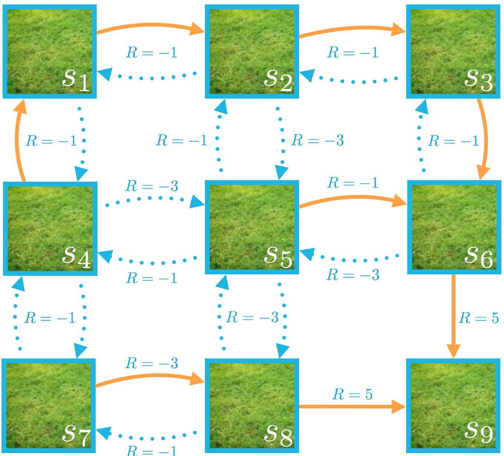
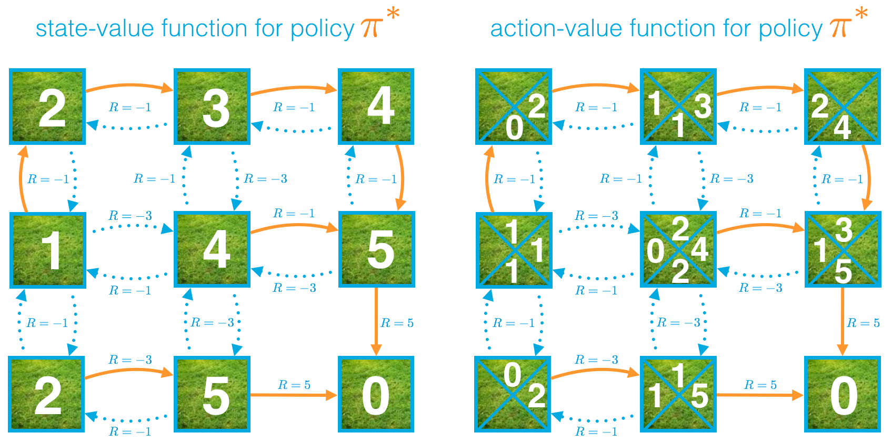
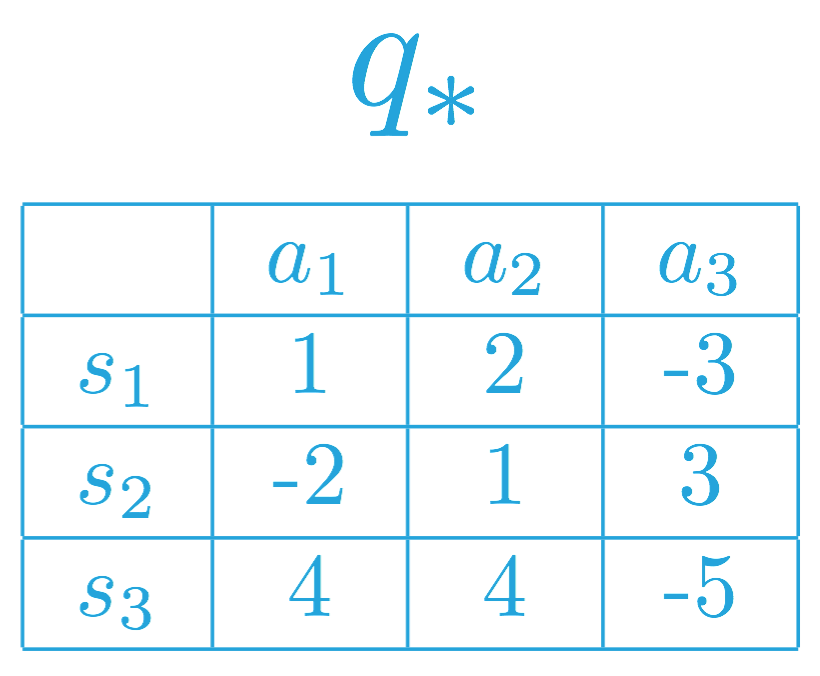
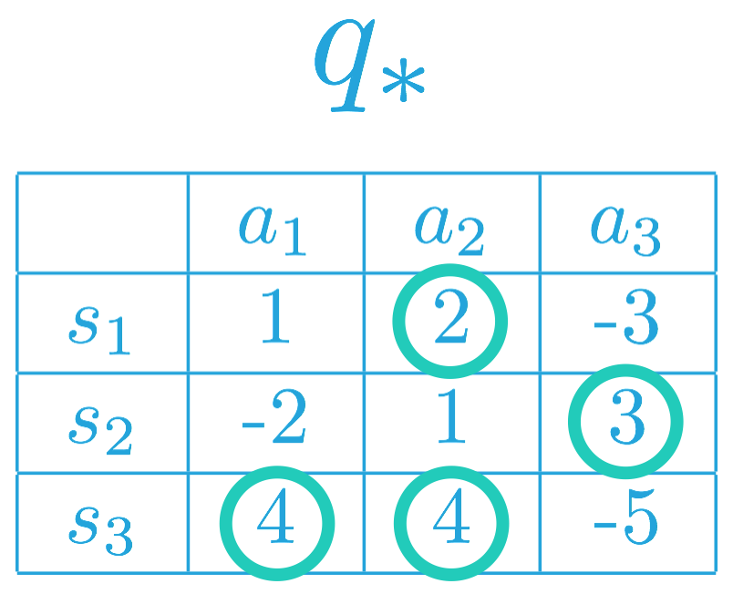
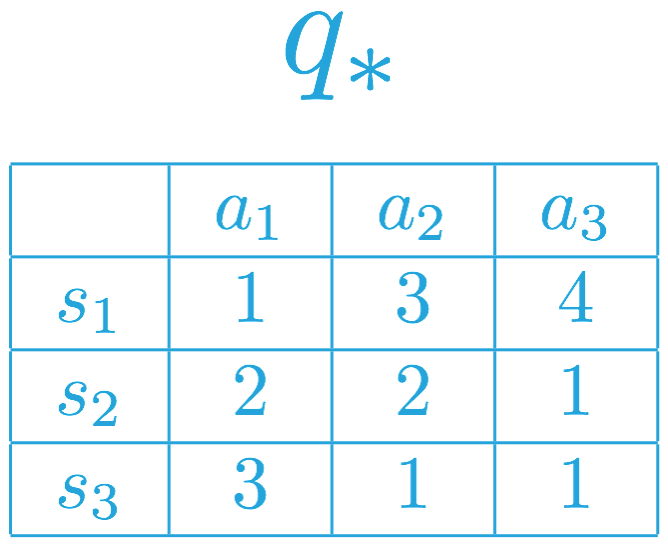
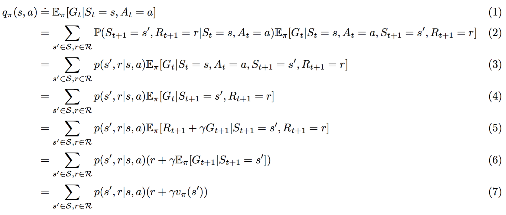

---

layout: post
title: 机器学习-强化学习-强化学习框架：解决方案
description: 在这章，主要讲解了强化学习框架：解决方案。
Keywords: 机器学习、模型、评估指标
tagline: 
categories: [ML]
tags: [ML]

---

* 目录
 {:toc  }
# 

## 1、简介

<video controls="" preload="none" style="width:100%; height:100%; object-fit: fill"  src="../assets/media/uda-ml/qinghua/fangan/1-t.mp4"></video>
## 2、策略

<video controls="" preload="none" style="width:100%; height:100%; object-fit: fill"  src="../assets/media/uda-ml/qinghua/fangan/2-t.mp4"></video>
## 3、练习：解析策略

策略决定了智能体如何根据当前状态选择动作。换句话说，它指定了智能体如何对环境提供的情形做出响应。

思考下上节课的回收机器人 MDP。

](https://classroom.udacity.com/nanodegrees/nd009-cn-advanced/parts/a2386085-8101-47b6-84e0-7b61a76c2b82/modules/dffda80a-0d5b-460d-afbc-3e0ce20e867f/lessons/ce8d7dbc-3320-4440-bdd3-556b8ca3fda2/concepts/d09cd02f-cc41-4035-a0dd-f8949e082ffb#)

## 确定性策略：示例

示例确定性策略$$ \pi: \mathcal{S}\to\mathcal{A}*π*:S→A $$可以指定为：

> $$\pi(\text{low}) = \text{recharge}*π*(low)=recharge$$

> $$\pi(\text{high}) = \text{search}*π*(high)=search$$

在这种情况下，

- 如果电池电量_很低*，智能体选择*充电_。
- 如果电池电量_很高*，智能体选择*搜索_易拉罐。

## 问题 1

思考另一个确定性策略 \pi: \mathcal{S}\to\mathcal{A}*π*:S→A，其中：

> $$\pi(\text{low}) = \text{search}*π*(low)=search$$

> $$\pi(\text{high}) = \text{search}*π*(high)=search$$

### 习题 1/2

如果智能体遵守策略的话，以下哪些陈述正确（请选中所有适用项。）

- 如果状态是*电量很低*，智能体选择动作_搜索_。
- 如果动作是*电量很低*，智能体选择状态_搜索_。
- 智能体将在每个时间步都_搜索*易拉罐（无论电量是*很低_ 还是 _很高_）。
- 如果状态是*电量很高*，智能体选择_等待_易拉罐。

## 随机性策略：示例

示例随机性策略$$ \pi: \mathcal{S}\times\mathcal{A}\to [0,1]*π*:S×A→[0,1] $$可以指定为：

> $$\pi(\text{recharge}|\text{low}) = 0.5*π*(recharge∣low)=0.5$$

> $$\pi(\text{wait}|\text{low}) = 0.4*π*(wait∣low)=0.4$$

> $$\pi(\text{search}|\text{low}) = 0.1*π*(search∣low)=0.1$$

> $$\pi(\text{search}|\text{high}) = 0.9*π*(search∣high)=0.9$$

> $$\pi(\text{wait}|\text{high}) = 0.1*π*(wait∣high)=0.1$$

在这种情况下，

- 如果电池电量_很低*，智能体*充电*的概率是 50%，*等待*易拉罐的概率是 40%，*搜索_易拉罐的概率是 10%。
- 如果电池电量_很高*，智能体*搜索*易拉罐的概率是 90%，*等待_易拉罐的概率是 10%。

## 问题 2

思考另一个不同的随机性策略 \pi: \mathcal{S}\times\mathcal{A}\to [0,1]*π*:S×A→[0,1]，其中：

> $$\pi(\text{recharge}|\text{low}) = 0.3*π*(recharge∣low)=0.3$$

> $$\pi(\text{wait}|\text{low}) = 0.5*π*(wait∣low)=0.5$$

> $$\pi(\text{search}|\text{low}) = 0.2*π*(search∣low)=0.2$$

> $$\pi(\text{search}|\text{high}) = 0.6*π*(search∣high)=0.6$$

> $$\pi(\text{wait}|\text{high}) = 0.4*π*(wait∣high)=0.4$$

### 习题 2/2

如果智能体遵守策略的话，以下哪些陈述正确（请选中所有适用项。）

- 如果电池电量_很低*，智能体将始终决定*等待_易拉罐。
- 如果智能体_搜索*易拉罐，则在下个时间步电池状态为*电量很高_的概率是 60%。
- 如果电池电量_很低*，智能体最有可能决定*等待_易拉罐。

## 4、网格世界示例

<video controls="" preload="none" style="width:100%; height:100%; object-fit: fill"  src="../assets/media/uda-ml/qinghua/fangan/3-t.mp4"></video>
## 5、状态值函数

<video controls="" preload="none" style="width:100%; height:100%; object-fit: fill"  src="../assets/media/uda-ml/qinghua/fangan/4-t.mp4"></video>
**第 1 条注释**：记法 $$\mathbb{E}_\pi[\cdot]E*π*[⋅] $$来自推荐[教科书](http://go.udacity.com/rl-textbook)。$$\mathbb{E}_\pi[\cdot]E*π*[⋅] 定义为随机变量的期望值（假如智能体遵守策略 \pi*π*。）$$

**第 2 条注释**：在这门课程中，我们将不加区分地使用“回报”和“折扣回报”。对于任意时间步 t*t*，这两个术语都指代 $$G_t \doteq R_{t+1} + \gamma R_{t+2} + \gamma^2 R_{t+3} + \ldots = \sum_{k=0}^\infty \gamma^k $$ R_{t+k+1}*G**t*≐*R**t*+1+*γ**R**t*+2+*γ*2*R**t*+3+…=∑*k*=0∞*γ**k**R**t*+*k*+1，其中 $$\gamma \in [0,1]*γ*∈[0,1]。$$尤其是，当我们提到“回报”时，并不一定是指 \gamma = 1*γ*=1，当我们提到“折扣回报”时，并不一定就是$$ \gamma < 1*γ*<1$$。（*推荐[教科书](http://go.udacity.com/rl-textbook)也是这种情况。*）

## 6、贝尔曼方程（第 1 部分）

<video controls="" preload="none" style="width:100%; height:100%; object-fit: fill"  src="../assets/media/uda-ml/qinghua/fangan/5-t.mp4"></video>
# 贝尔曼方程

在这个网格世界示例中，一旦智能体选择一个动作，

- 它始终沿着所选方向移动（而一般 MDP 则不同，智能体并非始终能够完全控制下个状态将是什么）
- 可以确切地预测奖励（而一般 MDP 则不同，奖励是从概率分布中随机抽取的）。

在这个简单示例中，我们发现任何状态的值可以计算为即时奖励和下个状态（折扣）值的和。

Alexis 提到，对于一般 MDP，我们需要使用*期望值*，因为通常即时奖励和下个状态无法准确地预测。的确，我们在之前的课程中发现，奖励和下个状态是根据 MDP 的一步动态特性选择的。在这种情况下，奖励 r*r* 和下个状态 s'*s*′ 是从（条件性）概率分布$$ p(s',r|s,a)*p*(*s*′,*r*∣*s*,*a*) 中抽取的，**贝尔曼预期方程（对于 v_\pi\*v\**π\*）**表示了任何状态 s*s* 对于_预期*即时奖励和下个状态的*预期_值的值：

$$v_\pi(s) = \text{} \mathbb{E}_\pi[R_{t+1} + \gamma v_\pi(S_{t+1})|S_t =s].*v**π*(*s*)=E*π*[*R**t*+1+*γ**v**π*(*S**t*+1)∣*S**t*=*s*].$$

### 计算预期值

如果智能体的策略 \pi*π* 是**确定性策略**，智能体在状态 s*s* 选择动作 \pi(s)*π*(*s*)，贝尔曼预期方程可以重写为两个变量 (s'*s*′ 和 r*r*) 的和：

$$v_\pi(s) = \text{} \sum_{s'\in\mathcal{S}^+, r\in\mathcal{R}}p(s',r|s,\pi(s))(r+\gamma v_\pi(s'))*v**π*(*s*)=∑*s*′∈S+,*r*∈R*p*(*s*′,*r*∣*s*,*π*(*s*))(*r*+*γ**v**π*(*s*′))$$

在这种情况下，我们将奖励和下个状态的折扣值之和 (r+\gamma v_\pi(s'))(*r*+*γ**v**π*(*s*′)) 与相应的概率 p(s',r|s,\pi(s))*p*(*s*′,*r*∣*s*,*π*(*s*)) 相乘，并将所有概率相加得出预期值。

如果智能体的策略 \pi*π* 是**随机性策略**，智能体在状态 s*s* 选择动作 a*a* 的概率是 \pi(a|s)*π*(*a*∣*s*)，贝尔曼预期方程可以重写为三个变量（s'*s*′、r*r* 和 a*a*）的和：

$$v_\pi(s) = \text{} \sum_{s'\in\mathcal{S}^+, r\in\mathcal{R},a\in\mathcal{A}(s)}\pi(a|s)p(s',r|s,a)(r+\gamma v_\pi(s'))*v**π*(*s*)=∑*s*′∈S+,*r*∈R,*a*∈A(*s*)*π*(*a*∣*s*)*p*(*s*′,*r*∣*s*,*a*)(*r*+*γ**v**π*(*s*′))$$

在这种情况下，我们将奖励和下个状态的折扣值之和$$ (r+\gamma v_\pi(s'))(*r*+*γ**v**π*(*s*′)) $$与相应的概率$$ \pi(a|s)p(s',r|s,a)*π*(*a*∣*s*)*p*(*s*′,*r*∣*s*,*a*) $$相乘，并将所有概率相加得出预期值。

## 7、练习：状态值函数

在这道练习中，你将计算特定策略对应的值函数。

MDP 中的每个状态（共九个）都用 \mathcal{S}^+ = \{s_1, s_2, \ldots, s_9 \}S+={*s*1,*s*2,…,*s*9} 之一标记，其中 s_9*s*9 是终止状态。

思考下下图表示的（确定性）策略（角色部分）。

](https://classroom.udacity.com/nanodegrees/nd009-cn-advanced/parts/a2386085-8101-47b6-84e0-7b61a76c2b82/modules/dffda80a-0d5b-460d-afbc-3e0ce20e867f/lessons/ce8d7dbc-3320-4440-bdd3-556b8ca3fda2/concepts/f958d2bf-ff9e-410e-ac18-c2c0add455af#)

策略 \pi*π* 由以下方程确定：

> $$\pi(s_1) = \text{right}*π*(*s*1)=right$$

> $$\pi(s_2) = \text{right}*π*(*s*2)=right$$

> $$\pi(s_3) = \text{down}*π*(*s*3)=down$$

> $$\pi(s_4) = \text{up}*π*(*s*4)=up$$

> $$\pi(s_5) = \text{right}*π*(*s*5)=right$$

> $$\pi(s_6) = \text{down}*π*(*s*6)=down$$

> $$\pi(s_7) = \text{right}*π*(*s*7)=right$$

> $$\pi(s_8) = \text{right}*π*(*s*8)=right$$

注意，因为 s_9*s*9 是一个终止状态，如果智能体从该状态开始，则该阶段立即结束。因此，智能体不需要选择动作（因此我们不会在策略中包含 s_9*s*9），并且 $$v_\pi(s_9) = 0*v**π*(*s*9)=0$$。

现在花时间计算该策略对应的状态值函数 $$v_\pi*v**π*$$。（*你会发现贝尔曼预期方程可以为你节省大量工作！*）

**假设 \gamma = 1\*γ\*=1。**

完成后，使用 $$v_\pi*v**π* $$回答以下问题。

## 问题 1

$$v_\pi(s_4)*v**π*(*s*4)$$ 是多少？

### 习题 1/3

请选择相应的数字值。

- -2
- -1
- 0
- 1
- 2

## 问题 2

$$v_\pi(s_1)*v**π*(*s*1) $$是多少？

### 习题 2/3

请选择相应的数字值。

- -2
- -1
- 0
- 1
- 2

## 问题 3

对于以下语句：

- (1) $$v_\pi(s_6) = -1 + v_\pi(s_5)*v**π*(*s*6)=−1+*v**π*(*s*5)$$
- (2)$$ v_\pi(s_7) = -3 + v_\pi(s_8)*v**π*(*s*7)=−3+*v**π*(*s*8)$$
- (3)$$ v_\pi(s_1) = -1 + v_\pi(s_2)*v**π*(*s*1)=−1+*v**π*(*s*2)$$
- (4) $$v_\pi(s_4) = -3 + v_\pi(s_7)*v**π*(*s*4)=−3+*v**π*(*s*7)$$
- (5)$$ v_\pi(s_8) = -3 + v_\pi(s_5)*v**π*(*s*8)=−3+*v**π*(*s*5)$$

### 习题 3/3

请选择（上文）表述正确的语句。（请选中所有适用项。）

- (1)
- (2)
- (3)
- (4)
- (5)

## 8、最优性

<video controls="" preload="none" style="width:100%; height:100%; object-fit: fill"  src="../assets/media/uda-ml/qinghua/fangan/6-t.mp4"></video>
## 9、动作值函数

<video controls="" preload="none" style="width:100%; height:100%; object-fit: fill"  src="../assets/media/uda-ml/qinghua/fangan/7-t.mp4"></video>
**注意**：在这门课程中，我们将不加区分地使用“回报”和“折扣回报”。对于任意时间步 t*t*，这两个术语都指代 $$G_t \doteq R_{t+1} + \gamma R_{t+2} + \gamma^2 R_{t+3} + \ldots = \sum_{k=0}^\infty \gamma^k R_{t+k+1}*G**t*≐*R**t*+1+*γ**R**t*+2+*γ*2*R**t*+3+…=∑*k*=0∞*γ**k**R**t*+*k*+1$$，其中 $$\gamma \in [0,1]*γ*∈[0,1]$$。尤其是，当我们提到“回报”时，并不一定是指$$ \gamma = 1*γ*=1$$，当我们提到“折扣回报”时，并不一定就是 $$\gamma < 1*γ*<1$$。（*推荐[教科书](http://go.udacity.com/rl-textbook)也是这种情况。*）

## 10、练习：动作值函数

](https://classroom.udacity.com/nanodegrees/nd009-cn-advanced/parts/a2386085-8101-47b6-84e0-7b61a76c2b82/modules/dffda80a-0d5b-460d-afbc-3e0ce20e867f/lessons/ce8d7dbc-3320-4440-bdd3-556b8ca3fda2/concepts/264f6ce5-e60e-4bcb-9bb2-d92079c34a37#)

**正确或错误？**：对于确定性策略 \pi*π*，

v_\pi(s) = q_\pi(s, \pi(s))*v**π*(*s*)=*q**π*(*s*,*π*(*s*))

适用于所有 s \in \mathcal{S}*s*∈S。

在回答这个问题时，可以使用上述状态值函数和动作值函数作为确定性策略示例。

### 练习题

上述语句正确与否？

- 正确
- 错误

下一项

## 11、最优策略

<video controls="" preload="none" style="width:100%; height:100%; object-fit: fill"  src="../assets/media/uda-ml/qinghua/fangan/8-t.mp4"></video>

## 12、练习：最优策略

如果状态空间 \mathcal{S}S 和动作空间 \mathcal{A}A 是有限的，我们可以用表格表示最优动作值函数 q_**q*∗，每个可能的环境状态 s \in \mathcal{S}*s*∈S 和动作 a\in\mathcal{A}*a*∈A 对应一个策略。

特定状态动作对 s,a*s*,*a* 的值是智能体从状态 s*s* 开始并采取动作 a*a*，然后遵守最优策略 \pi_**π*∗ 所获得的预期回报。

我们在下方为虚拟马尔可夫决策流程 (MDP) (where \mathcal{S}=\{ s_1, s_2, s_3 \}S={*s*1,*s*2,*s*3} 和 \mathcal{A}=\{a_1, a_2, a_3\}A={*a*1,*a*2,*a*3}) 填充了一些值。

](https://classroom.udacity.com/nanodegrees/nd009-cn-advanced/parts/a2386085-8101-47b6-84e0-7b61a76c2b82/modules/dffda80a-0d5b-460d-afbc-3e0ce20e867f/lessons/ce8d7dbc-3320-4440-bdd3-556b8ca3fda2/concepts/7c1e4c72-9c0a-4e47-b74b-7352d2739682#)

你在上一部分了解到，智能体确定最优动作值函数 q_**q*∗ 后，它可以为所有 s\in\mathcal{S}*s*∈S 设置 \pi_*(s) = \arg\max_{a\in\mathcal{A}(s)} q_*(s,a)*π*∗(*s*)=argmax*a*∈A(*s*)*q*∗(*s*,*a*) 快速获得最优策略 \pi_**π*∗。

要了解*为何*是这种情况，注意，必须确保 v_*(s) = \max_{a\in\mathcal{A}(s)} q_*(s,a)*v*∗(*s*)=max*a*∈A(*s*)*q*∗(*s*,*a*)。

如果在某个状态 s\in\mathcal{S}*s*∈S 中，有多个动作 a\in\mathcal{A}(s)*a*∈A(*s*) 可以最大化最优动作值函数，你可以通过向任何（最大化）状态分配任意大小的概率构建一个最优策略。只需确保根据该策略给不会最大化动作值函数的动作（对于特定状态）分配的概率是 0% 即可。

为了构建最优策略，我们可以先在每行（或每个状态）中选择最大化动作值函数的项。

](https://classroom.udacity.com/nanodegrees/nd009-cn-advanced/parts/a2386085-8101-47b6-84e0-7b61a76c2b82/modules/dffda80a-0d5b-460d-afbc-3e0ce20e867f/lessons/ce8d7dbc-3320-4440-bdd3-556b8ca3fda2/concepts/7c1e4c72-9c0a-4e47-b74b-7352d2739682#)

因此，相应 MDP 的最优策略 \pi_**π*∗ 必须满足：

- \pi_*(s_1) = a_2*π*∗(*s*1)=*a*2 (or, equivalently, \pi_*(a_2| s_1) = 1*π*∗(*a*2∣*s*1)=1)，以及
- \pi_*(s_2) = a_3*π*∗(*s*2)=*a*3 (or, equivalently, \pi_*(a_3| s_2) = 1*π*∗(*a*3∣*s*2)=1)。

这是因为 a_2 = \arg\max_{a\in\mathcal{A}(s_1)}q_*(s,a)*a*2=argmax*a*∈A(*s*1)*q*∗(*s*,*a*)，以及 a_3 = \arg\max_{a\in\mathcal{A}(s_2)}q_*(s,a)*a*3=argmax*a*∈A(*s*2)*q*∗(*s*,*a*)。

换句话说，在最优策略下，智能体在状态 s_1*s*1 下必须选择动作 a_2*a*2，在状态 s_2*s*2 下将选择动作 a_3*a*3。

对于状态 s_3*s*3，注意 a_1, a_2 \in \arg\max_{a\in\mathcal{A}(s_3)}q_*(s,a)*a*1,*a*2∈argmax*a*∈A(*s*3)*q*∗(*s*,*a*)。因此，智能体可以根据最优策略选择动作 a_1*a*1 或 a_2*a*2，但是始终不能选择动作 a_3*a*3。即最优策略 \pi_**π*∗ 必须满足：

- \pi_*(a_1| s_3) = p*π*∗(*a*1∣*s*3)=*p*，
- \pi_*(a_2| s_3) = q*π*∗(*a*2∣*s*3)=*q*，以及
- \pi_*(a_3| s_3) = 0*π*∗(*a*3∣*s*3)=0，

其中 p,q\geq 0*p*,*q*≥0 以及 p + q = 1*p*+*q*=1。

## 问题

思考另一个对应不同的最优动作值函数的不同 MDP。请使用该动作值函数回答以下问题。

](https://classroom.udacity.com/nanodegrees/nd009-cn-advanced/parts/a2386085-8101-47b6-84e0-7b61a76c2b82/modules/dffda80a-0d5b-460d-afbc-3e0ce20e867f/lessons/ce8d7dbc-3320-4440-bdd3-556b8ca3fda2/concepts/7c1e4c72-9c0a-4e47-b74b-7352d2739682#)

### 练习题

以下哪些语句表示了最优动作值函数对应的潜在最优策略？

- 智能体在状态 s_1 始终选择动作 a_1。
- 智能体在状态 s_1 始终选择动作 a_3。
- 智能体在状态 s_2 可以随意选择动作 a_1 或动作 a_2。
- 智能体在状态 s_2 必须选择动作 a_3。
- 智能体在状态 s_3 必须选择动作 a_1。
- 智能体在状态 s_3 可以随意选择动作 a_2 或 a_3。

下一项

## 13、贝尔曼方程（第 2 部分）

有两组贝尔曼方程：(1) **贝尔曼预期方程** 和 (2) **贝尔曼最优性方程**。每组方程包含两个方程，对应于状态值或动作值。

所有贝尔曼方程对有限马尔可夫决策流程 (MDP) 来说都非常有用，在后续课程中还会经常出现。

## 贝尔曼预期方程

我们已经介绍了 **v_\pi\*v\**π\* 的贝尔曼预期方程**

v_\pi(s) = \text{} \mathbb{E}_\pi[R_{t+1} + \gamma v_\pi(S_{t+1}) | S_t=s]*v**π*(*s*)=E*π*[*R**t*+1+*γ**v**π*(*S**t*+1)∣*S**t*=*s*]。

之前在这节课中，你发现对于任意随机性策略 \pi*π*，该方程可以表示为

v_\pi(s) = \sum_{s' \in \mathcal{S}^+, r\in\mathcal{R}, a \in \mathcal{A}(s)}\pi(a|s)p(s',r|s,a)(r + \gamma v_\pi(s'))*v**π*(*s*)=∑*s*′∈S+,*r*∈R,*a*∈A(*s*)*π*(*a*∣*s*)*p*(*s*′,*r*∣*s*,*a*)(*r*+*γ**v**π*(*s*′))。

该方程表示了任何*状态*（根据任意策略）相对于*后续状态*（根据同一策略）的值。

**q_\pi\*q\**π\* 的贝尔曼预期方程**是：

q_\pi(s,a) = \text{} \mathbb{E}_\pi[R_{t+1} + \gamma q_\pi(S_{t+1},A_{t+1}) |S_t=s,A_t=a]*q**π*(*s*,*a*)=E*π*[*R**t*+1+*γ**q**π*(*S**t*+1,*A**t*+1)∣*S**t*=*s*,*A**t*=*a*]

     = \sum_{s' \in \mathcal{S}^+, r\in\mathcal{R}}p(s',r|s,a)(r + \gamma\sum_{a' \in \mathcal{A}(s)} \pi(a'|s') q_\pi(s',a'))=∑*s*′∈S+,*r*∈R*p*(*s*′,*r*∣*s*,*a*)(*r*+*γ*∑*a*′∈A(*s*)*π*(*a*′∣*s*′)*q**π*(*s*′,*a*′))

其中最后一个形式详细介绍了如何计算任意随机策略 \pi*π* 的预期值。该方程表示任何*状态动作对*（根据任意策略）相对于*后续状态*的值（根据同一策略）的值。

## 贝尔曼最优性方程

和贝尔曼预期方程相似，贝尔曼最优性方程可以证明：状态值（以及动作值函数）满足递归关系，可以将状态值（或状态动作对的值）与所有后续状态（或状态动作对）的值联系起来。

虽然贝尔曼最优性方程关心的是_任意*策略，但是贝尔曼最优性方程完全侧重于*最优_策略对应的值满足的关系。

**v_\**v\*∗ 的贝尔曼最优性方程**是：

v_*(s) = \max_{a \in \mathcal{A}(s)} \mathbb{E}[R_{t+1} + \gamma v_*(S_{t+1}) | S_t=s] = \max_{a \in \mathcal{A}(s)}\sum_{s' \in \mathcal{S}^+, r\in\mathcal{R}}p(s',r|s,a)(r + \gamma v_*(s'))*v*∗(*s*)=max*a*∈A(*s*)E[*R**t*+1+*γ**v*∗(*S**t*+1)∣*S**t*=*s*]=max*a*∈A(*s*)∑*s*′∈S+,*r*∈R*p*(*s*′,*r*∣*s*,*a*)(*r*+*γ**v*∗(*s*′))

它表示任何*状态*根据最优策略相对于*后续状态*的值（根据最优策略）的值。

**q_\**q\*∗ 的贝尔曼最优性方程**是：

q_*(s,a) = \mathbb{E}[R_{t+1} + \gamma \max_{a'\in\mathcal{A}(S_{t+1})}q_*(S_{t+1},a') | S_t=s, A_t=a]*q*∗(*s*,*a*)=E[*R**t*+1+*γ*max*a*′∈A(*S**t*+1)*q*∗(*S**t*+1,*a*′)∣*S**t*=*s*,*A**t*=*a*]

     = \sum_{s' \in \mathcal{S}^+, r\in\mathcal{R}}p(s',r|s,a)(r + \gamma \max_{a'\in\mathcal{A}(s')}q_*(s',a'))=∑*s*′∈S+,*r*∈R*p*(*s*′,*r*∣*s*,*a*)(*r*+*γ*max*a*′∈A(*s*′)*q*∗(*s*′,*a*′))

它表示任何*状态动作对*根据最优策略相对于*后续状态动作对*（根据最优策略）的值的值。

## 实用公式

为了推导出所有四个贝尔曼方程，有必要先推导出紧密相关的公式。

q_\pi(s,a) = \sum_{s'\in\mathcal{S}^+, r\in\mathcal{R}}p(s',r|s,a)(r+\gamma v_\pi(s'))*q**π*(*s*,*a*)=∑*s*′∈S+,*r*∈R*p*(*s*′,*r*∣*s*,*a*)(*r*+*γ**v**π*(*s*′)) (**方程 1**)

该方程表示相对于状态值函数和 MDP 一步动态特性的策略动作值函数。

我们将提供两个论证来证明该方程，一个是对话论证，另一个是代数论证。

#### 求导 1

我们将先从会话参数开始。当智能体位于状态 s*s* 并采取动作 a*a* 时，可以产生任何数量的潜在下个状态 s''*s*′′ 和奖励 r*r*。

](https://classroom.udacity.com/nanodegrees/nd009-cn-advanced/parts/a2386085-8101-47b6-84e0-7b61a76c2b82/modules/dffda80a-0d5b-460d-afbc-3e0ce20e867f/lessons/ce8d7dbc-3320-4440-bdd3-556b8ca3fda2/concepts/ee8e341e-e3bb-4d99-9ee1-a5910d6cfde8#)

如果下个状态 s'*s*′ 和奖励 r*r* 可以确切地预测，那么回报可以计算为 r + \gamma v_\pi(s')*r*+*γ**v**π*(*s*′)。

知道这一点后，为了获得动作值 q_\pi(s,a)*q**π*(*s*,*a*)，我们只需计算和 r + \gamma v_\pi(s')*r*+*γ**v**π*(*s*′) 的[*预期值*](https://en.wikipedia.org/wiki/Expected_value)。可以通过以下方程获得

q_\pi(s,a) = \sum_{s'\in\mathcal{S}^+, r\in\mathcal{R}}p(s',r|s,a)(r + \gamma v_\pi(s'))*q**π*(*s*,*a*)=∑*s*′∈S+,*r*∈R*p*(*s*′,*r*∣*s*,*a*)(*r*+*γ**v**π*(*s*′))，

其中每个 s',r*s*′,*r* 对的概率由 MDP 的一步动态特性 p(s',r|s,a)*p*(*s*′,*r*∣*s*,*a*) 确定。

#### 求导 2

请算出以下**方程 1** 的替代导数。

理由如下：

- (1) 满足 q_\pi(s,a) := \mathbb{E}_\pi[G_t|S_t=s, A_t=a]*q**π*(*s*,*a*):=E*π*[*G**t*∣*S**t*=*s*,*A**t*=*a*] 的定义。
- (2) 遵守[全期望公式](https://en.wikipedia.org/wiki/Law_of_total_expectation)。
- (3) 根据定义 p(s',r|s,a) := \mathbb{P}(S_{t+1}=s',R_{t+1}=r|S_t=s,A_t=a)*p*(*s*′,*r*∣*s*,*a*):=P(*S**t*+1=*s*′,*R**t*+1=*r*∣*S**t*=*s*,*A**t*=*a*) 是正确的
- (4) 满足，因为 \mathbb{E}_\pi[G_t|S_t=s,A_t=a,S_{t+1}=s',R_{t+1}=r]=\mathbb{E}_\pi[G_t|S_{t+1}=s',R_{t+1}=r]E*π*[*G**t*∣*S**t*=*s*,*A**t*=*a*,*S**t*+1=*s*′,*R**t*+1=*r*]=E*π*[*G**t*∣*S**t*+1=*s*′,*R**t*+1=*r*]。
- (5) 遵守，因为 G_t = R_{t+1}+G_{t+1}*G**t*=*R**t*+1+*G**t*+1。
- (6) 根据[线性期望](https://brilliant.org/wiki/linearity-of-expectation/) 是正确的。
- (7) 根据定义 v_\pi(s') := \mathbb{E}_\pi[G_t|S_t=s']=\mathbb{E}_\pi[G_{t+1}|S_{t+1}=s']*v**π*(*s*′):=E*π*[*G**t*∣*S**t*=*s*′]=E*π*[*G**t*+1∣*S**t*+1=*s*′] 是正确的。

## 得出贝尔曼预期方程

为了得出贝尔曼预期方程，我们需要使用另一个公式。

v_\pi(s) = \sum_{a\in\mathcal{A}(s)}\pi(a|s) q_\pi(s,a)*v**π*(*s*)=∑*a*∈A(*s*)*π*(*a*∣*s*)*q**π*(*s*,*a*)（**方程 2**）

该方程使我们能够根据（潜在随机性）策略对应的动作值函数获得状态值函数。

**v_\pi\*v\**π\* 的贝尔曼预期方程**可以通过先从**方程 2** 开始并用**方程 1** 替换 q_\pi(s,a)*q**π*(*s*,*a*) 的值获得。

同样，**q_\pi\*q\**π\* 的贝尔曼预期方程**可以通过先从**方程 1** 开始并用**方程 2** 替换 v_\pi(s)*v**π*(*s*) 的值获得。

## 获得贝尔曼最优性方程

为了推出贝尔曼最优性方程，我们需要另外两个方程。

q_*(s,a) = \sum_{s'\in\mathcal{S}^+, r\in\mathcal{R}}p(s',r|s,a)(r+\gamma v_*(s'))*q*∗(*s*,*a*)=∑*s*′∈S+,*r*∈R*p*(*s*′,*r*∣*s*,*a*)(*r*+*γ**v*∗(*s*′)) (**方程 3**)

**方程 3** 表示相对于最优状态值函数和 MDP 一步动态特性的最优动作值函数。

v_*(s) = \max_{a\in\mathcal{A}(s)} q_*(s,a)*v*∗(*s*)=max*a*∈A(*s*)*q*∗(*s*,*a*) (**方程 4**)

**方程 4** 表示相对于最优动作值函数的最优状态值函数。

**v_\**v\*∗ 的贝尔曼最优性方程**可以通过先从**方程 4** 开始并用**方程 3** 替换 q_*(s,a)*q*∗(*s*,*a*) 的值获得。

**q_\**q\*∗ 的贝尔曼最优性方程**可以通过先从**方程 3** 开始并用**方程 4** 替换 v_*(s)*v*∗(*s*) 的值获得。

## 更多信息

如果你想详细了解贝尔曼方程，建议你阅读该[教科书](http://go.udacity.com/rl-textbook)的第 3.7 和 3.8 部分。

## 14、总结

[高尔夫智能体的状态值函数（Sutton 和 Barto，2017 年）](https://classroom.udacity.com/nanodegrees/nd009-cn-advanced/parts/a2386085-8101-47b6-84e0-7b61a76c2b82/modules/dffda80a-0d5b-460d-afbc-3e0ce20e867f/lessons/ce8d7dbc-3320-4440-bdd3-556b8ca3fda2/concepts/5b3c215e-4e6b-4e43-b9ec-d14ebd9f5142#)

### 策略

- **确定性策略**是从 \pi: \mathcal{S}\to\mathcal{A}*π*:S→A 的映射。对于每个状态 s\in\mathcal{S}*s*∈S，它都生成智能体在状态 s*s* 时将选择的动作 a\in\mathcal{A}*a*∈A
- **随机性策略**是从 \pi: \mathcal{S}\times\mathcal{A}\to [0,1]*π*:S×A→[0,1] 的映射。对于每个状态 s\in\mathcal{S}*s*∈S 和动作 a\in\mathcal{A}*a*∈A，它都生成智能体在状态 s*s* 时选择动作 a*a* 的概率。

### 状态值函数

- 策略 \pi*π* 的**状态值函数**表示为 v_\pi*v**π*。对于每个状态 s \in\mathcal{S}*s*∈S，它都生成智能体从状态 s*s* 开始，然后在所有时间步根据策略选择动作的预期回报。即 v_\pi(s) \doteq \text{} \mathbb{E}_\pi[G_t|S_t=s]*v**π*(*s*)≐E*π*[*G**t*∣*S**t*=*s*]。我们将 v_\pi(s)*v**π*(*s*) 称之为**在策略 \pi\*π\* 下的状态 s\*s\* 的值**。
- 记法 \mathbb{E}_\pi[\cdot]E*π*[⋅] 来自推荐的教科书，其中 \mathbb{E}_\pi[\cdot]E*π*[⋅] 定义为随机变量的预期值（假设智能体遵守策略 \pi*π*）。

### 贝尔曼方程（第 1 部分）

- **v_\pi\*v\**π\* 的贝尔曼预期方程**是：v_\pi(s) = \text{} \mathbb{E}_\pi[R_{t+1} + \gamma v_\pi(S_{t+1})|S_t =s].*v**π*(*s*)=E*π*[*R**t*+1+*γ**v**π*(*S**t*+1)∣*S**t*=*s*].

### 最优性

- 策略 \pi'*π*′ 定义为优于或等同于策略 \pi*π*（仅在所有 s\in\mathcal{S}*s*∈S 时 v_{\pi'}(s) \geq v_\pi(s)*v**π*′(*s*)≥*v**π*(*s*)）。
- **最优策略 \pi_\**π\*∗** 对于所有策略 \pi*π* 满足 \pi_* \geq \pi*π*∗≥*π*。最优策略肯定存在，但并不一定是唯一的。
- 所有最优策略都具有相同的状态值函数 v_**v*∗，称为**最优状态值函数**。

### 动作值函数

- 策略 \pi*π* 的**动作值函数**表示为 q_\pi*q**π*。对于每个状态 s \in\mathcal{S}*s*∈S 和动作 a \in\mathcal{A}*a*∈A，它都生成智能体从状态 s*s* 开始并采取动作 a*a*，然后在所有未来时间步遵守策略时产生的预期回报。即 q_\pi(s,a) \doteq \mathbb{E}_\pi[G_t|S_t=s, A_t=a]*q**π*(*s*,*a*)≐E*π*[*G**t*∣*S**t*=*s*,*A**t*=*a*]。我们将 q_\pi(s,a)*q**π*(*s*,*a*) 称之为**在状态 s\*s\* 根据策略 \pi\*π\* 采取动作 a\*a\* 的值**（或者称之为**状态动作对 s, a\*s\*,\*a\*** 的值）。
- 所有最优策略具有相同的动作值函数 q_**q*∗，称之为**最优动作值函数**。

### 最优策略

- 智能体确定最优动作值函数 q_**q*∗ 后，它可以通过设置 \pi_*(s) = \arg\max_{a\in\mathcal{A}(s)} q_*(s,a)*π*∗(*s*)=argmax*a*∈A(*s*)*q*∗(*s*,*a*) 快速获得最优策略 \pi_**π*∗。

### 贝尔曼方程（第 2 部分）

- **q_\pi\*q\**π\* 的贝尔曼预期方程**是：q_\pi(s,a) = \text{}\mathbb{E}_\pi[R_{t+1} + \gamma q_\pi(S_{t+1},A_{t+1})|S_t =s, A_t=a].*q**π*(*s*,*a*)=E*π*[*R**t*+1+*γ**q**π*(*S**t*+1,*A**t*+1)∣*S**t*=*s*,*A**t*=*a*].
- **v_\**v\*∗ 的贝尔曼最优性方程**是：v_*(s) = \max_{a \in \mathcal{A}(s)} \mathbb{E}[R_{t+1} + \gamma v_*(S_{t+1}) | S_t=s]*v*∗(*s*)=max*a*∈A(*s*)E[*R**t*+1+*γ**v*∗(*S**t*+1)∣*S**t*=*s*]。
- **q_\**q\*∗ 的贝尔曼最优性方程**是：q_*(s,a) = \mathbb{E}[R_{t+1} + \gamma \max_{a'\in\mathcal{A}(S_{t+1})}q_*(S_{t+1},a') | S_t=s, A_t=a]*q*∗(*s*,*a*)=E[*R**t*+1+*γ*max*a*′∈A(*S**t*+1)*q*∗(*S**t*+1,*a*′)∣*S**t*=*s*,*A**t*=*a*]。