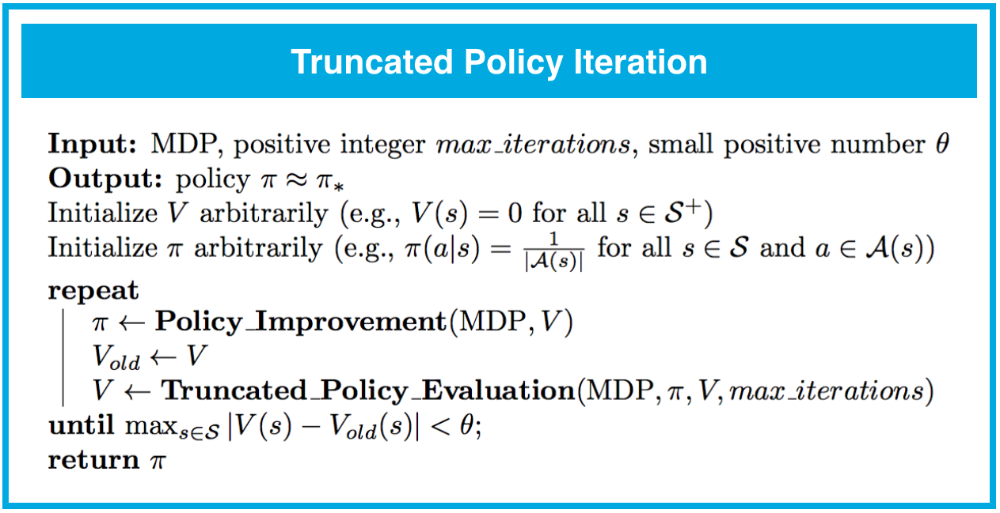

---


layout: post
title: 机器学习-强化学习-动态规划
description: 在这章，主要讲解了监督学习相关的技术。
Keywords: 机器学习、模型、评估指标
tagline: 
categories: [ML]
tags: [ML]

---


* 目录
 {:toc  }
# 


## 1、简介

<video controls="" preload="none" style="width:100%; height:100%; object-fit: fill"  src="../assets/media/uda-ml/qinghua/dongtaiguihua/1-t.mp4"></video>
在**动态规划**设置中，智能体完全了解表示环境特性的马尔可夫决策流程 (MDP)。（这比**强化学习**设置简单多了，在强化学习设置中，智能体一开始不知道环境如何决定状态和奖励，必须完全通过互动学习如何选择动作。）

这节课介绍了该[教科书](http://go.udacity.com/rl-textbook)的**第 4 章**（尤其是第 4.1-4.4 部分）的内容


## 2、迷你项目：动态规划 (OpenAI Gym-FrozenLakeEnv)

OpenAI Gym：FrozenLakeEnv


在这节课中，你将为我们讨论的所有算法编写你自己的 Python 实现。虽然你的实现将可以用于 OpenAI Gym 环境，但是你将使用 FrozenLake 环境测试你的代码。


[来源：](https://classroom.udacity.com/nanodegrees/nd009-cn-advanced/parts/a2386085-8101-47b6-84e0-7b61a76c2b82/modules/dffda80a-0d5b-460d-afbc-3e0ce20e867f/lessons/9cc18f72-766e-433e-a764-46338e09cf79/concepts/c0916676-e356-46df-9b22-cd63cc17e0a5#)http://eskipaper.com/images/frozen-lake-6.jpg


在 FrozenLake 环境中，智能体探索的是 4x4 网格世界。你可以打开相应的 [GitHub 文件](https://github.com/openai/gym/blob/master/gym/envs/toy_text/frozen_lake.py)并转到 `FrozenLakeEnv` 类的注释部分，详细了解该环境。澄清下，我们也摘录了该环境的说明，如下所示：

```text
    """
    冬天来了。你和朋友在公园里投掷飞盘，你一不小心将飞盘远远地扔到了湖中心。水几乎都结冰了，但是有几个融化的洞口。如果你踏入了其中一个洞口，将掉进冰冷的水中。现在全球的飞盘都处于紧缺状态，因此你必须在湖面上拿到飞碟。但是冰面很滑，因此你并不能一直朝着期望的方向行走。冰面用以下网格形式表示
        SFFF
        FHFH
        FFFH
        HFFG
    S：起始点，安全
    F：冰冻湖面，安全
    H：洞口，跌入湖中
    G：目标，拿到飞盘
    当你抵达目的地或跌入湖中，这一阶段结束。
    当你抵达目的地时，获得奖励 1，否则获得奖励 0。

    """"
```


## 动态规划设置


OpenAI Gym 中的环境以强化学习设置为依据。因此，OpenAI Gym 不允许轻松地访问马尔可夫决策流程 (MDP) 的底层一步动态特性。

为了使用动态规划设置的 FrozenLake 环境，我们首先需要下载包含 `FrozenLakeEnv` 类的[文件](https://github.com/openai/gym/blob/master/gym/envs/toy_text/frozen_lake.py)。然后，我们添加一行代码，以便将 MDP 的一步动态规划与智能体分享。

```python
# obtain one-step dynamics for dynamic programming setting
self.P = P
```

然后将新的 `FrozenLakeEnv` 类保存到 Python 文件 **frozenlake.py** 中，我们将使用该文件（而不是原始 OpenAI Gym 文件）创建该环境的实例。


## 你的工作区


你将在课堂内编写所有的实现代码，并使用和下图所示的界面完全一样的界面。你的工作区包含五个文件：

- **frozenlake.py** - 包含 `FrozenLakeEnv` 类
- **Dynamic_Programming-zh.ipynb** - 迷你项目 notebook，你将在其中编写所有的实现代码（*这是你**唯一**需要修改的文件！*）
- **Dynamic_Programming_Solution-zh.ipynb** - 迷你项目 notebook对应的讲师解决方案
- **check_test.py** - 包含单元测试，你将使用这些测试验证你的实现正确无误
- **plot_utils.py** - 包含可视化状态值函数的绘图函数

可以在下方找到 **Dynamic_Programming.ipynb** notebook。注意，它分成了好几个部分，需要你在课程的不同环节完成。

请暂时不要编写或执行任何代码。我们将在学完几个部分之后开始在工作区内编程！


为了熟读其他文件，你只需点击左上角的“jupyter”即可返回 notebook 信息中心。

## 3另一个网格世界示例

<video controls="" preload="none" style="width:100%; height:100%; object-fit: fill"  src="../assets/media/uda-ml/qinghua/dongtaiguihua/2-t.mp4"></video>
在这个简单的网格世界示例中，你通过肉眼观察也许就能轻松地确定最优策略。当然，解决现实中的马尔可夫决策流程 (MDP) 问题将会难得多！:)

为了避免使理论知识过于复杂，我们将使用这个简单的示例来介绍解决非常复杂的 MDP 问题用到的相同算法。


## 4、迭代方法（第 1 部分）

<video controls="" preload="none" style="width:100%; height:100%; object-fit: fill"  src="../assets/media/uda-ml/qinghua/dongtaiguihua/3-t.mp4"></video>
## 5、 迭代方法（第 2 部分）


在这一部分，我们将详细讲解上个视频中提到的一些概念。


## 关于贝尔曼期望方程的注释


在上个视频中，我们为每个环境状态推导了一个方程。例如，对于状态 s_1*s*1，我们发现：

v_\pi(s_1) = \frac{1}{2}(-1 + v_\pi(s_2)) + \frac{1}{2}(-3 + v_\pi(s_3))*v**π*(*s*1)=21(−1+*v**π*(*s*2))+21(−3+*v**π*(*s*3)).

我们提到，该方程直接来自 v_\pi*v**π* 的贝尔曼期望方程。

> v_\pi(s) = \text{} \mathbb{E}_\pi[R_{t+1} + \gamma v_\pi(S_{t+1}) | S_t=s] = \sum_{a \in \mathcal{A}(s)}\pi(a|s)\sum_{s' \in \mathcal{S}, r\in\mathcal{R}}p(s',r|s,a)(r + \gamma v_\pi(s'))*v**π*(*s*)=E*π*[*R**t*+1+*γ**v**π*(*S**t*+1)∣*S**t*=*s*]=∑*a*∈A(*s*)*π*(*a*∣*s*)∑*s*′∈S,*r*∈R*p*(*s*′,*r*∣*s*,*a*)(*r*+*γ**v**π*(*s*′))（**v_\pi\*v\**π\* 的贝尔曼期望方程**）

为了帮助理解，我们先看看根据贝尔曼期望方程，状态 s_1*s*1 的值是多少（我们只需代入 s1*s*1 替换公式中的 s*s* ）。

v_\pi(s_1) = \sum_{a \in \mathcal{A}(s_1)}\pi(a|s_1)\sum_{s' \in \mathcal{S}, r\in\mathcal{R}}p(s',r|s_1,a)(r + \gamma v_\pi(s'))*v**π*(*s*1)=∑*a*∈A(*s*1)*π*(*a*∣*s*1)∑*s*′∈S,*r*∈R*p*(*s*′,*r*∣*s*1,*a*)(*r*+*γ**v**π*(*s*′))

然后根据以下公式得出状态 s_1*s*1 的方程：

- \mathcal{A}(s_1)=\{ \text{down}, \text{right} \}A(*s*1)={down,right}（*在状态 s_1\*s*1 时，智能体只能执行两个潜在动作：向下或向右。）*
- \pi({down}|s_1) = \pi(\text{right}|s_1) = \frac{1}{2}*π*(*d**o**w**n*∣*s*1)=*π*(right∣*s*1)=21（*我们目前研究的策略是：智能体在状态 s_1\*s*1 时向下移动的概率是 50%，向右移动的概率是 50%。*）
- p(s_3,-3|s_1,\text{down}) = 1*p*(*s*3,−3∣*s*1,down)=1（以及 p(s',r|s_1,\text{down}) = 0*p*(*s*′,*r*∣*s*1,down)=0，前提是 s'\neq s_3*s*′≠*s*3 或 r\neq -3*r*≠−3）（*如果智能体在状态 s_1\*s*1 时选择向下移动，那么下个状态 100% 是 s_3\*s*3，智能体获得奖励 -3。*）
- p(s_2,-1|s_1,\text{right}) = 1*p*(*s*2,−1∣*s*1,right)=1（以及 p(s',r|s_1,\text{right}) = 0*p*(*s*′,*r*∣*s*1,right)=0，前提是 s'\neq s_2*s*′≠*s*2 或 r\neq -1*r*≠−1）（*如果智能体在状态 s_1\*s*1 时选择向右移动，那么下个状态 100% 是 s_2\*s*2，智能体获得奖励 -1。*）
- \gamma = 1*γ*=1（*在这个网格世界示例中，我们选择将折扣率设为 1。*）

如果你不太明白，请现在花时间代入值以推导出视频中的方程。然后，建议你为其他状态重复相同的流程。


## 关于求解方程组的注释


在视频中，我们提到你可以直接求解方程组：

v_\pi(s_1) = \frac{1}{2}(-1 + v_\pi(s_2)) + \frac{1}{2}(-3 + v_\pi(s_3))*v**π*(*s*1)=21(−1+*v**π*(*s*2))+21(−3+*v**π*(*s*3))

v_\pi(s_2) = \frac{1}{2}(-1 + v_\pi(s_1)) + \frac{1}{2}(5 + v_\pi(s_4))*v**π*(*s*2)=21(−1+*v**π*(*s*1))+21(5+*v**π*(*s*4))

v_\pi(s_3) = \frac{1}{2}(-1 + v_\pi(s_1)) + \frac{1}{2}(5 + v_\pi(s_4))*v**π*(*s*3)=21(−1+*v**π*(*s*1))+21(5+*v**π*(*s*4))

v_\pi(s_4) = 0*v**π*(*s*4)=0

因为 v_\pi(s_2)*v**π*(*s*2) 和 v_\pi(s_3)*v**π*(*s*3) 的方程一样，因此我们必须确保 v_\pi(s_2) = v_\pi(s_3)*v**π*(*s*2)=*v**π*(*s*3)。

因此，v_\pi(s_1)*v**π*(*s*1) 和 v_\pi(s_2)*v**π*(*s*2) 的方程可以更改为：

v_\pi(s_1) = \frac{1}{2}(-1 + v_\pi(s_2)) + \frac{1}{2}(-3 + v_\pi(s_2)) = -2 + v_\pi(s_2)*v**π*(*s*1)=21(−1+*v**π*(*s*2))+21(−3+*v**π*(*s*2))=−2+*v**π*(*s*2)

v_\pi(s_2) = \frac{1}{2}(-1 + v_\pi(s_1)) + \frac{1}{2}(5 + 0) = 2 + \frac{1}{2}v_\pi(s_1)*v**π*(*s*2)=21(−1+*v**π*(*s*1))+21(5+0)=2+21*v**π*(*s*1)

将最新的两个方程相结合，生成

v_\pi(s_1) = -2 + 2 + \frac{1}{2}v_\pi(s_1) = \frac{1}{2}v_\pi(s_1)*v**π*(*s*1)=−2+2+21*v**π*(*s*1)=21*v**π*(*s*1)，

表明 v_\pi(s_1)=0*v**π*(*s*1)=0。此外，v_\pi(s_3) = v_\pi(s_2) = 2 + \frac{1}{2}v_\pi(s_1) = 2 + 0 = 2*v**π*(*s*3)=*v**π*(*s*2)=2+21*v**π*(*s*1)=2+0=2。

因此，状态值函数可以通过以下方程组获得：           

v_\pi(s_1) = 0*v**π*(*s*1)=0

v_\pi(s_2) = 2*v**π*(*s*2)=2

v_\pi(s_3) = 2*v**π*(*s*3)=2

v_\pi(s_4) = 0*v**π*(*s*4)=0

**注意**。此示例表明我们**_可以_**_直接*求解 v_\pi\*v**π\* 的贝尔曼期望方程给出的方程组。但是，在现实中，尤其是对于大型马尔可夫决策流程 (MDP) 来说，我们将改用*迭代_方法。


## 6、练习：迭代方法


在这节课中到目前为止，我们讨论了智能体可以如何获得策略 \pi*π* 对应的状态值函数 v_\pi*v**π*。

在动态规划设置中，智能体完全了解马尔可夫决策流程 (MDP)。在这种情况下，可以使用 MDP 的一步动态 p(s',r|s,a)*p*(*s*′,*r*∣*s*,*a*) 获得 v_\pi*v**π* 的贝尔曼期望方程对应的方程组。

在网格世界示例中，等概率随机策略对应的方程组由以下方程获得：

v_\pi(s_1) = \frac{1}{2}(-1 + v_\pi(s_2)) + \frac{1}{2}(-3 + v_\pi(s_3))*v**π*(*s*1)=21(−1+*v**π*(*s*2))+21(−3+*v**π*(*s*3))

v_\pi(s_2) = \frac{1}{2}(-1 + v_\pi(s_1)) + \frac{1}{2}(5 + v_\pi(s_4))*v**π*(*s*2)=21(−1+*v**π*(*s*1))+21(5+*v**π*(*s*4))

v_\pi(s_3) = \frac{1}{2}(-1 + v_\pi(s_1)) + \frac{1}{2}(5 + v_\pi(s_4))*v**π*(*s*3)=21(−1+*v**π*(*s*1))+21(5+*v**π*(*s*4))

v_\pi(s_4) = 0*v**π*(*s*4)=0

为了获得状态值函数，我们只需求解该方程组。

虽然也许始终可以*直接*求解方程组，但是我们将改用*迭代*方法。


## 迭代方法


迭代方法先对每个状态的值进行初始猜测。尤其是，我们先假设每个状态的值为 0。

然后，循环访问状态空间并通过应用连续的更新方程修改状态值函数的估算结果。

注意，V*V* 表示状态值函数的最新猜测，更新方程为：

V(s_1) \leftarrow \frac{1}{2}(-1 + V(s_2)) + \frac{1}{2}(-3 + V(s_3))*V*(*s*1)←21(−1+*V*(*s*2))+21(−3+*V*(*s*3))

V(s_2) \leftarrow \frac{1}{2}(-1 + V(s_1)) + \frac{1}{2}(5)*V*(*s*2)←21(−1+*V*(*s*1))+21(5)

V(s_3) \leftarrow \frac{1}{2}(-1 + V(s_1)) + \frac{1}{2}(5)*V*(*s*3)←21(−1+*V*(*s*1))+21(5)


## 练习问题


假设状态值函数的最新猜测如下图所示。


](https://classroom.udacity.com/nanodegrees/nd009-cn-advanced/parts/a2386085-8101-47b6-84e0-7b61a76c2b82/modules/dffda80a-0d5b-460d-afbc-3e0ce20e867f/lessons/9cc18f72-766e-433e-a764-46338e09cf79/concepts/86e476df-41ac-4f78-9319-f6059fc8a4d7#)


目前，v_\pi(s_2)*v**π*(*s*2) 的估算结果由 V(s_2) = 1*V*(*s*2)=1 给出。

假设该算法的下一步是更新 V(s_2)*V*(*s*2)。

应用一次更新步骤后，V(s_2)*V*(*s*2) 的新值是多少？


### 练习题

选择相应的值。

- -1.5
- .5
- 0
- .5
- 1.5


## 7、迭代策略评估

<video controls="" preload="none" style="width:100%; height:100%; object-fit: fill"  src="../assets/media/uda-ml/qinghua/dongtaiguihua/4-t.mp4"></video>
## 8、实现


你可以在下方找到**迭代策略评估**的伪代码。


[](https://classroom.udacity.com/nanodegrees/nd009-cn-advanced/parts/a2386085-8101-47b6-84e0-7b61a76c2b82/modules/dffda80a-0d5b-460d-afbc-3e0ce20e867f/lessons/9cc18f72-766e-433e-a764-46338e09cf79/concepts/90db191c-be3f-42d8-ac98-11fe6ad8d1de#)


注意：只要对于每个状态 s\in\mathcal{S}*s*∈S，v_\pi(s)*v**π*(*s*) 是有限的，策略评估就保证会收敛于策略 \pi*π* 对应的状态值函数。对于有限的马尔可夫决策流程 (MDP)，只要满足以下条件之一，就保证会收敛：

- \gamma < 1*γ*<1，或
- 如果智能体以任何状态 s\in\mathcal{S}*s*∈S 开始，并且遵守 \pi*π*，就保证会最终达到终止状态。


请在下个部分完成 `Dynamic_Programming.ipynb` 的**第 0 部分：探索 FrozenLakeEnv** 和**第 1 部分：迭代策略评估**。请记得保存内容！

你可以查看 `Dynamic_Programming_Solution.ipynb` 的相应部分，检查你的答案是否正确。（*为了访问此文件，你只需点击左上角的“jupyter”即可返回 notebook 信息中心。*）


[‘要找到 `Dynamic_Programming_Solution.ipynb`，请返回 notebook 信息中心。’](https://classroom.udacity.com/nanodegrees/nd009-cn-advanced/parts/a2386085-8101-47b6-84e0-7b61a76c2b82/modules/dffda80a-0d5b-460d-afbc-3e0ce20e867f/lessons/9cc18f72-766e-433e-a764-46338e09cf79/concepts/90db191c-be3f-42d8-ac98-11fe6ad8d1de#)


#### (可选）关于收敛条件的其他注释


为了直观地了解收敛条件_为何_很合理，思考下两个条件都不满足的情形，因此：

- \gamma = 1*γ*=1，以及
- 具有状态 s\in\mathcal{S}*s*∈S，如果智能体从该状态开始，则遵守策略 \pi*π* 的话，它将始终不会遇到终止状态。

在这种情况下，

- 奖励没有折扣
- 某个阶段可能永远不会结束。

那么迭代策略评估可能不会收敛，这是因为状态值函数可能定义不合理！为此，注意在此情形下，计算状态值可能需要将无穷多的（预期）奖励相加，和可能不会[收敛](https://en.wikipedia.org/wiki/Convergent_series)。

我们来举一个具体的例子，假设某个 MDP：

- 具有两个状态 s_1*s*1 和 s_2*s*2，其中 s_2*s*2 是终止状态
- 具有一个动作 a*a*（_注意：只有一个动作的 MDP 还可以称之为[马尔可夫奖励流程 (MRP)](https://en.wikipedia.org/wiki/Markov_reward_model)。_）
- p(s_1,1|s_1, a) = 1*p*(*s*1,1∣*s*1,*a*)=1

在这种情况下，假设智能体的策略 \pi*π* 是仅“选择”可以执行的动作，因此 \pi(s_1) = a*π*(*s*1)=*a*。假设 \gamma = 1*γ*=1。根据一步动态特性，如果智能体从状态 s_1*s*1 开始，它将始终保持该状态，永远不会遇到终止状态 s_2*s*2。

在这种情况下，**v_\pi(s_1)\*v\**π\*(\*s\*1) 定义不合理。**为此，注意 v_\pi(s_1)*v**π*(*s*1) 是经历状态 s_1*s*1 之后的（预期）回报，并且

v_\pi(s_1) = 1 + 1 + 1 + 1 + ...*v**π*(*s*1)=1+1+1+1+...

[发散](https://en.wikipedia.org/wiki/Divergent_series)为正无穷。（请花时间消化这段内容，并明白如果在此示例中，其中一个条件满足了，那么 v_\pi(s_1)*v**π*(*s*1) 将定义合理。作为**可选**下一步，如果你想从数学角度满足这一条件，建议你复习[几何级数](https://en.wikipedia.org/wiki/Geometric_series)和[负二项分布](https://en.wikipedia.org/wiki/Negative_binomial_distribution)。）


## 9、迷你项目：动态规划（第 0 部分和第 1 部分）


## 10、动作值


在上一部分，你自己实现了迭代策略评估，以估算策略 \pi*π* 的状态值函数 v_\pi*v**π*。在此部分，你将使用视频中的简单网格世界练习将状态值函数 v_\pi*v**π* 转换为动作值函数 q_\pi*q**π*。


思考下我们用来表示迭代策略评估的小网格世界。等概率随机策略的**状态值函数**可视化结果如下。


现在花时间确认以下图片对应的是同一策略的**动作值函数**。


思考下 q_\pi(s_1, \text{right})*q**π*(*s*1,right) 这个示例。这个动作值的计算方式如下所示：

q_\pi(s_1, \text{right}) = -1 + v_\pi(s_2) = -1 + 2 = 1*q**π*(*s*1,right)=−1+*v**π*(*s*2)=−1+2=1，

我们可以将状态动作对的值 s_1, \text{right}*s*1,right 表示为以下两个量的和：(1)向右移动并进入状态 s_2*s*2 的即时奖励，以及 (2) 智能体从状态 s_2*s*2 开始并遵守该策略获得的累积奖励。

现在请使用状态值函数 v_\pi*v**π* 计算 q_\pi(s_1, \text{down})*q**π*(*s*1,down)、q_\pi(s_2, \text{left})*q**π*(*s*2,left)、q_\pi(s_2, \text{down})*q**π*(*s*2,down)、q_\pi(s_3, \text{up})*q**π*(*s*3,up) 以及 q_\pi(s_3, \text{right})*q**π*(*s*3,right)。


## 对于更加复杂的环境


在这个简单的网格世界示例中，环境是**确定性**环境。换句话说，智能体选择某个动作后，下个状态和奖励可以 100% 确定不是随机的。对于确定性环境，所有的 s', r, s, a*s*′,*r*,*s*,*a* 为 p(s',r|s,a) \in \{ 0,1 \}*p*(*s*′,*r*∣*s*,*a*)∈{0,1}。

> 在这种情况下，当智能体处在状态 s*s* 并采取动作 a*a* 时，下个状态 s'*s*′ 和奖励 r*r* 可以确切地预测，我们必须确保 q_\pi(s,a) = r + \gamma v_\pi(s')*q**π*(*s*,*a*)=*r*+*γ**v**π*(*s*′)。

通常，环境并非必须是确定性环境，可以是**随机性的**。这是迷你项目中的 `FrozenLake` 环境的默认行为；在这种情况下，智能体选择动作后，下个状态和奖励无法确切地预测，而是从[（条件性）概率分布](https://en.wikipedia.org/wiki/Conditional_probability_distribution) p(s',r|s,a)*p*(*s*′,*r*∣*s*,*a*)中随机抽取的。

> 在这种情况下，当智能体处在状态 s*s* 并采取动作 a*a* 时，每个潜在下个状态 s'*s*′ 的概率和奖励 r*r* 由 p(s',r|s,a)*p*(*s*′,*r*∣*s*,*a*) 确定。在这种情况下，我们必须确保 q_\pi(s,a) = \sum_{s'\in\mathcal{S}^+, r\in\mathcal{R}}p(s',r|s,a)(r+\gamma v_\pi(s'))*q**π*(*s*,*a*)=∑*s*′∈S+,*r*∈R*p*(*s*′,*r*∣*s*,*a*)(*r*+*γ**v**π*(*s*′))，我们计算和 r + \gamma v_\pi(s')*r*+*γ**v**π*(*s*′) 的[期望值](https://en.wikipedia.org/wiki/Expected_value)。

在接下来的几个部分，你将使用该方程为 `FrozenLake` 环境编写一个函数，并生成策略 \pi*π* 对应的动作值函数 q_\pi*q**π*。


## 11、实现


在下个部分，你将编写一个算法，该算法会接受状态值函数 v_\pi*v**π* 的估值 V*V*，以及 MDP p(s',r|s,a)*p*(*s*′,*r*∣*s*,*a*) 的一步动态特性并返回动作值函数 q_\pi*q**π* 的估值 Q*Q*。

为此，你需要使用在上一部分讨论的方程，该方程使用马尔可夫决策流程 (MDP) 的一步动态特性 p(s',r|s,a)*p*(*s*′,*r*∣*s*,*a*) 获得来自 v_\pi*v**π* 的 q_\pi*q**π*，即

q_\pi(s,a) = \sum_{s'\in\mathcal{S}^+, r\in\mathcal{R}}p(s',r|s,a)(r+\gamma v_\pi(s'))*q**π*(*s*,*a*)=∑*s*′∈S+,*r*∈R*p*(*s*′,*r*∣*s*,*a*)(*r*+*γ**v**π*(*s*′))

针对所有 s\in\mathcal{S}*s*∈S 和 a\in\mathcal{A}(s)*a*∈A(*s*)。

你可以在下方找到相关的伪代码。


请在下个部分完成 `Dynamic_Programming.ipynb` 中的**第 2 部分：从 v_\pi\*v\**π\* 获得 q_\pi\*q\**π\***。请记得保存内容！

你可以查看 `Dynamic_Programming_Solution.ipynb` 的相应部分，检查你的答案是否正确。


## 12、迷你项目：动态规划（第 2 部分）


## 13、策略改进

<video controls="" preload="none" style="width:100%; height:100%; object-fit: fill"  src="../assets/media/uda-ml/qinghua/dongtaiguihua/5-t.mp4"></video>
## 14、实现


在上一节课，你学到了以下知识：如果给定策略 \pi*π* 对应的动作值函数 q_\pi*q**π* 的估值 Q*Q*，可以构建一个改进（或对等）的策略 \pi'*π*′，其中 \pi'\geq\pi*π*′≥*π*。

对于每个状态 s\in\mathcal{S}*s*∈S，你只需选择最大化动作值函数估值的动作。换句话说，

\pi'(s) = \arg\max_{a\in\mathcal{A}(s)}Q(s,a)*π*′(*s*)=argmax*a*∈A(*s*)*Q*(*s*,*a*)，针对所有 s\in\mathcal{S}*s*∈S。

你可以在下方找到**策略改进**的完整伪代码。


如果对于某个状态 s\in\mathcal{S}*s*∈S，其 \arg\max_{a\in\mathcal{A}(s)}Q(s,a)argmax*a*∈A(*s*)*Q*(*s*,*a*) 不是唯一的，则可以灵活地构建改进策略 \pi'*π*′。

实际上，只要策略 \pi'*π*′ 对于每个 s\in\mathcal{S}*s*∈S 和 a\in\mathcal{A}(s)*a*∈A(*s*) 都满足：

\pi'(a|s) = 0*π*′(*a*∣*s*)=0 如果 a \notin \arg\max_{a'\in\mathcal{A}(s)}Q(s,a')*a*∉argmax*a*′∈A(*s*)*Q*(*s*,*a*′)，

它是改进策略。换句话说，（对于每个状态）任何策略只要为不会最大化动作值函数估值的动作分配概率 0，则对该状态来说就是改进策略。你可以在自己的实现中随意实验这一点！


请在下个部分完成 `Dynamic_Programming.ipynb` 的**第 3 部分：策略改进**。请记得保存内容！

你可以查看 `Dynamic_Programming_Solution.ipynb` 的相应部分，检查你的答案是否正确。


## 15、迷你项目：动态规划（第 3 部分）


## 16、策略迭代

<video controls="" preload="none" style="width:100%; height:100%; object-fit: fill"  src="../assets/media/uda-ml/qinghua/dongtaiguihua/6-t.mp4"></video>
## 17、实现：策略迭代

‘在上一部分，你学习了**策略迭代**，即一系列的策略评估和改进步骤。策略迭代肯定会用有限次数的迭代找到任何有限马尔可夫决策流程 (MDP) 的最优策略。你可以在下方找到伪代码。'


请在下一部分完成 `Dynamic_Programming.ipynb` 的**第 4 部分：策略迭代**。请记得保存内容！

你可以查看 `Dynamic_Programming_Solution.ipynb` 的相应部分，检查你的答案是否正确。


## 18、迷你项目：动态规划（第 4 部分）


## 19、截断策略迭代

<video controls="" preload="none" style="width:100%; height:100%; object-fit: fill"  src="../assets/media/uda-ml/qinghua/dongtaiguihua/7-t.mp4"></video>
## 20、实现


在上个部分，你学习了**截断策略迭代**。（迭代性）策略评估会根据需要应用很多次贝尔曼更新步骤，以实现收敛，而截断策略迭代仅对整个状态空间执行固定次数的评估。

你可以在下方找到伪代码。


我们可以将这个修订后的策略评估算法应用到类似于策略评估的算法中，称之为**截断策略迭代**。

你可以在下方找到伪代码。


你可能还注意到，截断策略迭代的停止条件与策略迭代的不同。在策略迭代中，当策略在一次策略改进步骤之后没有变化时，我们将终止循环。在截断策略迭代中，仅当值函数估值收敛时，我们才停止循环。

强烈建议你尝试两种停止条件，以便熟练掌握这些知识。但是，我们发现如果超参数 `max_iterations` 设得太小，则无法检查策略是否更改了。（为此，思考下以下情形：假设 `max_iterations` 设为很小的值。如果算法完全没有收敛于最优值函数 v_**v*∗ 或最优策略 \pi_**π*∗，可以想象，对值函数估值 V*V* 的更新可能会太小，导致相应的策略没有任何更新。）

请在下个部分完成 `Dynamic_Programming.ipynb` 的**第 5 部分：截断策略迭代**。请记得保存内容！

你可以查看 `Dynamic_Programming_Solution.ipynb` 的相应部分，检查你的答案是否正确。


## 21、迷你项目：动态规划（第 5 部分）


## 22、值迭代


<video controls="" preload="none" style="width:100%; height:100%; object-fit: fill"  src="../assets/media/uda-ml/qinghua/dongtaiguihua/8-t.mp4"></video>
# 23、实现：值迭代


在上个部分，你学习了**值迭代**。在此算法中，对状态空间的每次遍历都会进行策略评估和策略改进。值迭代肯定会找到任何有限 MDP 的最优策略 \pi_**π*∗。

你可以在下方找到伪代码。


注意，如果后续值函数估值之间的差值很小，则满足了停止条件。尤其是，如果对于每个状态，差值都小于 \theta*θ*，则循环终止。并且，如果我们希望最终值函数估值与最优值函数越接近，则需要将值 \theta*θ* 设得越小。

你可以在你的实现中将 \theta*θ* 设成各种值；注意，对于 FrozenLake 环境，`1e-8` 左右的值似乎很合适。

如果你想*详细了解*如何设置 \theta*θ* 的值，建议阅读[这篇论文](http://www.leemon.com/papers/1993wb2.pdf)，并重点看看 Theorem 3.2。他们的主要结果可以总结如下：

> 用 V^{\text{final}}*V*final 表示算法计算的最终值函数估值。然后可以发现 V^{\text{final}}*V*final 与最优值函数 v_**v*∗ 之间的差值最大为 \frac{2\theta\gamma}{1-\gamma}1−*γ*2*θ**γ*。换句话说，对于每个 s\in\mathcal{S}*s*∈S，

> \max_{s\in\mathcal{S}}|V^{\text{final}}(s) - v_*(s)| < \frac{2\theta\gamma}{1-\gamma}max*s*∈S∣*V*final(*s*)−*v*∗(*s*)∣<1−*γ*2*θ**γ*。


请在下个部分完成 `Dynamic_Programming.ipynb` 的**第 6 部分：值迭代**。请记得保存内容！

你可以查看 `Dynamic_Programming_Solution.ipynb` 的相应部分，检查你的答案是否正确。


## 24、迷你项目：动态规划（第 6 部分）


## 25、知识检验


恭喜！到现在为止，你已经编写了很多经典动态规划算法的实现代码。这并不是什么轻松的任务，你应该为自己感到自豪！

建议你多花些时间消化这些内容。将更多的精力投入到迷你项目中，并熟练掌握这些知识。然后阅读该[教科书](http://go.udacity.com/rl-textbook)的第 4 章节（尤其是第 4.1-4.4 部分），加深理解。

强烈建议你自己做笔记，并将你的笔记与下部分内容进行比较。下部分包含了这节课的主要内容摘要。

准备好后，回答以下问题，看看你是否记住了一些术语。


### 练习题

将每个算法与相应的描述进行配对。

*Checkmark* These are the correct matches.

### 描述

### 算法

通过不断评估和改进找到最优策略。

策略迭代

给定某个策略对应的值函数，提出更好（或对等）的策略。

策略改进

计算随机策略对应的值函数。

（迭代）策略评估

通过不断评估和改进找到最优策略（在遍历整个状态空间一次后停止评估步骤）。

值迭代


## 26、总结


网格世界中的第一个策略迭代步骤（Sutton 和 Barto，2017 年）


## 简介

- 在**动态规划**设置中，智能体完全了解 MDP（这比**强化学习**设置简单多了。在强化学习设置中，智能体一开始完全不了解环境如何确定状态和动作，必须完全通过互动来了解如何选择动作。）


### 迭代方法

- 为了获得策略 \pi*π* 对应的状态值函数 v_\pi*v**π*，我们只需求解 v_\pi*v**π* 的贝尔曼预期方程对应的方程组。
- 虽然可以通过分析方式求解方程组，但是我们将重点讲解迭代方法。


### 迭代策略评估

- **迭代策略评估**是在动态规划设置中用到的算法，用于估算策略 \pi*π* 对应的状态值函数 v_\pi*v**π*。在此方法中，我们将向值函数估值中应用贝尔曼更新，直到估值的变化几乎不易觉察。


### 动作值的估值

- 在动态规划设置中，可以使用以下方程从状态值函数 v_\pi*v**π* 快速获得动作值函数 q_\pi*q**π*：q_\pi(s,a) = \sum_{s'\in\mathcal{S}, r\in\mathcal{R}}p(s',r|s,a)(r+\gamma v_\pi(s'))*q**π*(*s*,*a*)=∑*s*′∈S,*r*∈R*p*(*s*′,*r*∣*s*,*a*)(*r*+*γ**v**π*(*s*′))。


### 策略改进

- **策略改进**对策略 \pi*π* 对应的动作值函数 v_\pi*v**π* 进行估算 V*V*，并返回改进（或对等）的策略 \pi'*π*′，其中 \pi'\geq\pi*π*′≥*π*。该算法首先构建动作值函数估值 Q*Q*。然后，对应每个状态 s\in\mathcal{S}*s*∈S，你只需选择最大化 Q(s,a)*Q*(*s*,*a*) 的动作 a*a*。换句话说，\pi'(s) = \arg\max_{a\in\mathcal{A}(s)}Q(s,a)*π*′(*s*)=argmax*a*∈A(*s*)*Q*(*s*,*a*)，针对所有 s\in\mathcal{S}*s*∈S。


### 策略迭代

- **策略迭代**是一种可以在动态规划设置中解决 MDP 的算法。它包含一系列的策略评估和改进步骤，肯定会收敛于最优策略（对应任意_有限_ MDP）。


### 截断策略迭代


- **截断策略迭代**是在动态规划设置中用来估算策略 \pi*π* 对应的状态值函数 v_\pi*v**π* 的算法。对于此方法，在对状态空间执行固定次数的遍历后，停止评估步骤。我们将评估步骤中的此方法称为**截断策略评估**。





### 值迭代

- **值迭代**是在动态规划设置中用来估算策略 \pi*π* 对应的状态值函数 v_\pi*v**π* 的算法。对于此方法，每次对状态空间进行遍历时，都同时进行策略评估和策略改进。


