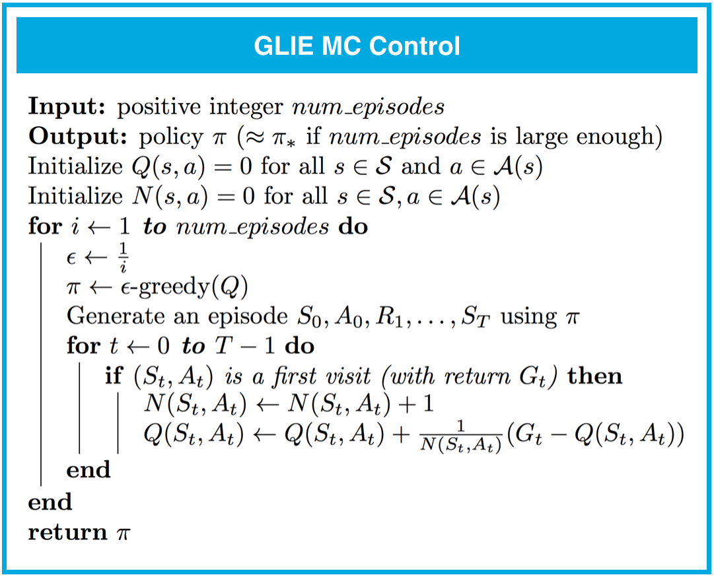

---


layout: post
title: 机器学习-强化学习-蒙特卡方法
description: 在这章，主要讲解了监督学习相关的技术。
Keywords: 机器学习、模型、评估指标
tagline: 
categories: [ML]
tags: [ML]

---


* 目录
 {:toc  }
# 


## 1、简介

<video controls="" preload="none" style="width:100%; height:100%; object-fit: fill"   src="../assets/media/uda-ml/qinghua/mengteka/1-t.mp4"></video>
## 2、迷你项目：蒙特卡洛方法 (OpenAI Gym-BlackjackEnv)

# OpenAI Gym：BlackjackEnv


在这节课，你将编写代码来指导智能体玩二十一点。


[来源：](https://classroom.udacity.com/nanodegrees/nd009-cn-advanced/parts/a2386085-8101-47b6-84e0-7b61a76c2b82/modules/dffda80a-0d5b-460d-afbc-3e0ce20e867f/lessons/4894b062-f2ed-4f31-95bc-f28a90f7acff/concepts/0efcbe12-d803-4021-9c37-f9935046fe46#)https://www.blackjackinfo.com/img/2-card-21.png


请在该[教科书](https://drive.google.com/file/d/1opPSz5AZ_kVa1uWOdOiveNiBFiEOHjkG/view)的第 5.1 个示例中详细了解二十一点游戏。

完成后，请查看相应的 [GitHub 文件](https://github.com/openai/gym/blob/master/gym/envs/toy_text/blackjack.py)，并阅读 BlackjackEnv 类的注释部分。（*虽然你**不**需要理解所有代码的原理，但是请阅读注释部分以了解环境的动态特性。*）为了进行阐释，我们还在下方摘录了环境说明：

```text
    """21点规则简介

    二十一点是一种扑克牌游戏，目标是尽量使手中牌的总点数达到 21 点，或是接近 21 点，但不能超过，然后与庄家的点数进行比较。人头牌（J、Q、K）的点数是 10。王牌可以是 11 点或 1 点，11 点时“可用”。这种游戏的整副牌是有限的（或者可以替换）。游戏开始时，每个玩家和庄家的一张牌朝上，另一张牌朝下。玩家可以请求更多的牌 (hit=1) 并决定何时停止请求牌(stick=0) 或者超过 21 点（爆牌）。玩家停止请求牌后，庄家翻开扣着的牌，并抽牌，直到所有点数之和是 17 点或大于 17 点。如果庄家爆牌，玩家获胜。

    如果玩家或庄家都没爆牌，结果（输赢或持平）由谁的点数更接近 21 点来确定。赢了的奖励是 +1，平局的奖励是 0，输了的奖励是 -1。

    包含以下三种状态：玩家的当前点数之和，庄家显示的一张牌（1-10，其中王牌是 1），以及玩家是否拥有可使用的王牌（0 或 1）。

    此规则对应于《强化学习引论》（作者：Sutton 和 Barto，1998 年）第 5.1 个示例中介绍的二十一点问题。
    http://incompleteideas.net/book/the-book.html 
    """
```

## 3、 MC 预测：状态值

<video controls="" preload="none" style="width:100%; height:100%; object-fit: fill"   src="../assets/media/uda-ml/qinghua/mengteka/2-t.mp4"></video>
## 4、实现

你可以在下方找到（首次经历）MC 预测（状态值）的伪代码。（*你可以选择实现首次经历或所有经历 MC 方法。在二十一点游戏中，首次经历和所有经历方法返回的结果一样。*）


如果你想详细了解首次经历和所有经历 MC 方法之间的区别，建议你阅读[此论文](http://www-anw.cs.umass.edu/legacy/pubs/1995_96/singh_s_ML96.pdf)的第 3 部分。结果在第 3.6 部分进行了总结。作者指出：

- 所有经历 MC 存在[偏差](https://en.wikipedia.org/wiki/Bias_of_an_estimator)，而首次经历 MC 不存在偏差（请参阅 Theorems 6 和 7）。
- 一开始，所有经历 MC 具有更低的[均方误差 (MSE)](https://en.wikipedia.org/wiki/Mean_squared_error)，但是随着经历更多的阶段，首次经历 MC 的均方误差更低（请参阅 Corollary 9a 和 10a，以及图 4）。

当每个状态的经历次数接近无穷大时，首次经历和所有经历方法都**保证会收敛于**真值函数。（*换句话说，只要智能体在每个状态获取足够的经验，值函数估值将非常接近真值。*）对于首次经历 MC，收敛性遵守[大数定律](https://en.wikipedia.org/wiki/Law_of_large_numbers)，详情请参阅该[教科书](http://go.udacity.com/rl-textbook)的第 5.1 部分。


请在下个部分完成 `Monte_Carlo.ipynb` 的**第 0 部分：探索 BlackjackEnv** 和**第 1 部分：MC 预测：状态值**。请记得保存内容！

你可以查看 `Monte_Carlo_Solution.ipynb` 的相应部分，检查你的解决方案是否正确。


## 5、迷你项目：蒙特卡洛方法（第 0 和 1 部分）


## 6、MC 预测：动作值

<video controls="" preload="none" style="width:100%; height:100%; object-fit: fill"   src="../assets/media/uda-ml/qinghua/mengteka/3-t.mp4"></video>
## 7、实现：MC 预测（动作值）

你可以在下方找到（首次经历）MC 预测（动作值）的伪代码。（*你可以选择实现首次经历或所有经历 MC 方法。在二十一点游戏中，首次经历和所有经历方法返回的结果一样。*）


当每个状态动作对的经历次数接近无穷大时，首次经历和所有经历方法都**保证会收敛于**真值函数。（*换句话说，只要智能体在每个状态动作对获取足够的经验，值函数估值将非常接近真值。*）

我们不会使用 MC 预测估算确定性策略对应的动作值；这是因为很多状态动作对_从未*经历过（因为确定性策略在每个状态始终选择*相同的_动作）。因此为了收敛，我们仅估算在每个状态中每个动作被选中的概率非零的策略对应的动作值函数。


请在下个部分完成 `Monte_Carlo.ipynb` 的**第 2 部分：MC 预测：动作值**。请记得保存内容！

你可以查看 `Monte_Carlo_Solution.ipynb` 的相应部分，检查你的解决方案是否正确。


## 9、广义策略迭代

<video controls="" preload="none" style="width:100%; height:100%; object-fit: fill"   src="../assets/media/uda-ml/qinghua/mengteka/4-t.mp4"></video>
## 10、MC 控制：增量均值

<video controls="" preload="none" style="width:100%; height:100%; object-fit: fill"   src="../assets/media/uda-ml/qinghua/mengteka/5-t.mp4"></video>
## 11、 练习：增量均值


在上个视频中，我们学习了一种算法，该算法可以不断估算一系列数字 (x_1, x_2, \ldots, x_n)(*x*1,*x*2,…,*x**n*) 的均值。该算法按顺序查看每个数字，并连续地更新均值 \mu*μ*。


请使用伪代码完成下面的 `running_mean` 函数。你的函数应该接受一系列数字 `x` 作为输入。它应该返回一个 `mean_values` 列表，其中 `mean_values[k]` 是 `x[:k+1]` 的均值。

**注意**：请仔细检查索引！此处，x_k*x**k* 对应的是 `x[k-1]`（因此，x_1*x*1 = `x[0]`，x_2*x*2 = `x[1]`，等等）。

请点击**[测试答案]**按钮检查你的代码是否正确。准备好转到下个部分后，点击**[提交答案]**。


<video controls="" preload="none" style="width:100%; height:100%; object-fit: fill"   src="../assets/media/uda-ml/qinghua/mengteka/6-t.mp4"></video>
## 12、MC 控制：策略评估

<video controls="" preload="none" style="width:100%; height:100%; object-fit: fill"   src="../assets/media/uda-ml/qinghua/mengteka/7-t.mp4"></video>
## 13、MC 控制：策略改进

<video controls="" preload="none" style="width:100%; height:100%; object-fit: fill"   src="../assets/media/uda-ml/qinghua/mengteka/8-t.mp4"></video>


## 14、练习：Epsilon 贪婪策略


在上个部分，你学习了 \epsilon*ϵ* 贪婪策略。

为了构建一个相对于当前动作值函数估值 Q*Q* 为 \epsilon*ϵ* 贪婪策略的策略 \pi*π*，我们只需设置


[](https://classroom.udacity.com/nanodegrees/nd009-cn-advanced/parts/a2386085-8101-47b6-84e0-7b61a76c2b82/modules/dffda80a-0d5b-460d-afbc-3e0ce20e867f/lessons/4894b062-f2ed-4f31-95bc-f28a90f7acff/concepts/945c310b-493e-4d9c-8f16-1f3d3b892cbb#)


针对每个 s\in\mathcal{S}*s*∈S 和 a\in\mathcal{A}(s)*a*∈A(*s*)。注意，\epsilon*ϵ* 必须始终是 0-1（含）之间的值（即 \epsilon \in [0,1]*ϵ*∈[0,1]）。

你可以将遵守 \epsilon*ϵ* 贪婪策略的智能体看做始终可以操控硬币方向（可能不公平），正面朝上的概率是 \epsilon*ϵ*。观察状态后，智能体就会抛掷该硬币。

- 如果硬币背面朝上（因此概率为 1-\epsilon1−*ϵ*），智能体选择贪婪动作。
- 如果硬币正面朝上（因此概率为 \epsilon*ϵ*），智能体从一组潜在（非贪婪**和**贪婪）动作中*均匀地*随机选择一个动作。

在这道练习中，你将回答几个问题以检验你的知识理解情况。


### 习题 1/4

以下哪个 ε 值会生成一个保证**始终**会选择贪婪动作的 Epsilon 贪婪策略？请选中所有适用项。

- (1) epsilon = 0
- (2) epsilon = 0.3
- (3) epsilon = 0.5
- (4) epsilon = 1
- (5) 所有 ε 值都不满足该要求。


### 习题 2/4

以下哪个 ε 值会生成一个保证**始终**会选择非贪婪动作的 Epsilon 贪婪策略？请选中所有适用项。

- (1) epsilon = 0
- (2) epsilon = 0.3
- (3) epsilon = 0.5
- (4) epsilon = 1
- (5) 所有 ε 值都不满足该要求。


### 习题 3/4

以下哪个 ε 值等同于等概率随机策略（在每个状态，每个动作被选中的概率是一样的）的 Epsilon 贪婪策略？

- (1) epsilon = 0
- (2) epsilon = 0.3
- (3) epsilon = 0.5
- (4) epsilon = 1
- (5) 所有 ε 值都不满足该要求。


### 习题 4/4

以下哪个 ε 值会生成一个满足以下条件的 Epsilon 贪婪策略：智能体_可能*会选择贪婪动作，但是*可能_会选择非贪婪动作？换句话说，如何确保智能体选择每个可选（贪婪和非贪婪）动作的概率非零？

- (1) epsilon = 0
- (2) epsilon = 0.3
- (3) epsilon = 0.5
- (4) epsilon = 1
- (5) 所有 ε 值都不满足该要求。


下一项


## 15、探索与利用


[](https://classroom.udacity.com/nanodegrees/nd009-cn-advanced/parts/a2386085-8101-47b6-84e0-7b61a76c2b82/modules/dffda80a-0d5b-460d-afbc-3e0ce20e867f/lessons/4894b062-f2ed-4f31-95bc-f28a90f7acff/concepts/30151e2d-760b-455e-9321-c7a8bc69a4c1#)


[探索与利用困境（来源：](https://classroom.udacity.com/nanodegrees/nd009-cn-advanced/parts/a2386085-8101-47b6-84e0-7b61a76c2b82/modules/dffda80a-0d5b-460d-afbc-3e0ce20e867f/lessons/4894b062-f2ed-4f31-95bc-f28a90f7acff/concepts/30151e2d-760b-455e-9321-c7a8bc69a4c1#)http://slides.com/ericmoura/deck-2/embed）


## 处理 OpenAI Gym 中的环境


在很多情况下，我们都希望强化学习智能体学习尽快最大化奖励。在很多 OpenAI Gym 环境中都是这种情况。

例如，对于 [FrozenLake-v0](https://gym.openai.com/envs/FrozenLake-v0/) 环境，智能体在连续尝试 100 多次后评价奖励为 0.78，则问题得到解决。


[](https://classroom.udacity.com/nanodegrees/nd009-cn-advanced/parts/a2386085-8101-47b6-84e0-7b61a76c2b82/modules/dffda80a-0d5b-460d-afbc-3e0ce20e867f/lessons/4894b062-f2ed-4f31-95bc-f28a90f7acff/concepts/30151e2d-760b-455e-9321-c7a8bc69a4c1#)


[FrozenLake-v0](https://gym.openai.com/envs/FrozenLake-v0/) 环境的算法解决方案根据找到解决方案所需的阶段次数排名。


[](https://classroom.udacity.com/nanodegrees/nd009-cn-advanced/parts/a2386085-8101-47b6-84e0-7b61a76c2b82/modules/dffda80a-0d5b-460d-afbc-3e0ce20e867f/lessons/4894b062-f2ed-4f31-95bc-f28a90f7acff/concepts/30151e2d-760b-455e-9321-c7a8bc69a4c1#)


[Taxi-v1](https://gym.openai.com/envs/Taxi-v1/)、[Cartpole-v1](https://gym.openai.com/envs/CartPole-v1/) 和 [MountainCar-v0](https://gym.openai.com/envs/MountainCar-v0/)（以及很多其他环境）的解决方案也根据找到解决方案所需的阶段次数排名。为此，有必要设计一个尽快学习最优策略 \pi_**π*∗ 的算法。


## 探索-利用困境


注意，智能体一开始不知道环境的一步动态特性。为了最大化回报，智能体必须通过互动了解环境。

在每个时间步，当智能体选择一个动作时，它都根据以前与环境的互动经验做出决策。并且，为了尽量减少求解 OpenAI Gym 中的环境所需的阶段次数，我们的第一个想法是设计一种策略，其中智能体始终选择它认为（根据过去的经验）将最大化回报的动作。因此，智能体可以遵守对动作值函数估算来说很贪婪的策略。我们在上个视频（**MC 控制：策略改进**）中讨论过此方法，发现它可以轻松地收敛于次最优策略。

为了了解为何是这种情况，注意在早期阶段，智能体所了解的信息很有限（可能有缺陷）。因此很有可能智能体_估计*非贪婪的动作实际上比*估计_贪婪的动作更好。

因此，成功的强化学习智能体不能在每个时间步都采取贪婪的动作（*即它不能始终**利用**自己的经验）；为了发现最优策略，它必须不断改进所有状态动作对的估算回报（*换句话说，它必须继续通过经历每个状态动作对**探索**各种可能性）。但是，智能体应该始终*保持一定的贪婪性*，从而_尽快_最大化回报。这就引出了 \epsilon*ϵ* 贪婪策略。

我们将需要平衡这两个竞争性条件的情况称为**探索-利用困境**。解决该困境的一个潜在方法是在构建 \epsilon*ϵ* 贪婪策略时逐步修改 \epsilon*ϵ* 的值。


## 设置 \epsilon*ϵ* 的值


合理的做法是智能体一开始与环境互动时，倾向于**探索**环境，而不是**利用**已有的经验。毕竟当智能体对环境的动态特性相对知之甚少时，应该怀疑自己的有限知识并**探索**环境，或者尝试各种最大化回报的策略。因此，最佳起始策略是等概率随机策略，因为它在每个状态探索所有潜在动作的概率是相同的。你在上个练习中发现，\epsilon = 1*ϵ*=1 会生成一个等同于等概率随机策略的 \epsilon*ϵ* 贪婪策略。

在后续时间步，合理的做法是倾向于**利用**已有的经验，而不是**探索**环境，策略在动作值函数估算方面越来越贪婪。毕竟智能体与环境的互动次数越多，它对估算动作值函数的信任就越高。你在上个练习中发现，\epsilon = 0*ϵ*=0 会生成贪婪策略（或者非常倾向于利用已有的经验而不是探索环境的策略）。

幸运的是，此策略（一开始倾向于探索环境而不是利用已有的经验，然后逐渐倾向于利用已有的经验而不是探索环境）可以证明是最优策略。


## 有限状态下的无限探索贪婪算法 (GLIE)


为了保证 MC 控制会收敛于最优策略 \pi_**π*∗，我们需要确保满足两个条件。我们将这些条件称之为**有限状态下的无限探索贪婪算法 (GLIE)**。尤其是，如果：

- 每个状态动作对 s, a*s*,*a*（针对所有 s\in\mathcal{S}*s*∈S 和 a\in\mathcal{A}(s)*a*∈A(*s*)）被经历无限次
- 策略收敛相对于动作值函数估算 Q*Q* 来说贪婪的策略。

然后，MC 控制保证会收敛于最优策略（在有限状态下运行无穷个阶段）。这些条件确保：

- 智能体继续在所有时间步进行探索
- 智能体逐渐倾向于利用已有的经验（而不是探索环境）。

满足这些条件的一种方式是在指定 \epsilon*ϵ* 贪婪策略时，修改 \epsilon*ϵ* 的值。尤其是，使 \epsilon_i*ϵ**i* 对应于第 i*i* 个时间步。然后在以下情况下，这两个条件都会满足：

- 对于所有时间步 i*i*，\epsilon_i > 0*ϵ**i*>0
- 当时间步 i*i* 接近无穷大时，\epsilon_i*ϵ**i* 减小到 0（即 \lim_{i\to\infty} \epsilon_i = 0lim*i*→∞*ϵ**i*=0）。

例如，为了确保收敛于最优策略，我们可以设 \epsilon_i = \frac{1}{i}*ϵ**i*=*i*1。（建议你验证对于所有 i*i* 和 \lim_{i\to\infty} \epsilon_i = 0lim*i*→∞*ϵ**i*=0，\epsilon_i > 0*ϵ**i*>0。）


## 16、实现：MC 控制：GLIE


你可以在下方找到 GLIE MC 控制（首次经历）的伪代码。（*你可以选择实现首次经历或所有经历 MC 方法。在二十一点游戏中，首次经历和所有经历方法返回的结果一样。*）


[](https://classroom.udacity.com/nanodegrees/nd009-cn-advanced/parts/a2386085-8101-47b6-84e0-7b61a76c2b82/modules/dffda80a-0d5b-460d-afbc-3e0ce20e867f/lessons/4894b062-f2ed-4f31-95bc-f28a90f7acff/concepts/896132f3-35d0-4b90-8d08-1add9a6638dc#)


请在下个部分完成 `Monte_Carlo.ipynb` 的**第 3 部分：MC 控制：GLIE**。请记得保存内容！

你可以查看 `Monte_Carlo_Solution.ipynb` 的相应部分，检查你的解决方案是否正确。


## 18、19、MC 控制：常量 α（第 2 部分）

# MC 控制：常量 α


在之前的练习（**练习：增量均值**）中，你完成了一种算法，该算法可以不断估算一系列数字 (x_1, x_2, \ldots, x_n)(*x*1,*x*2,…,*x**n*) 的均值。`running_mean` 会接受一系列数字 `x` 作为输入并返回一个 `mean_values` 列表，其中 `mean_values[k]` 是 `x[:k+1]` 的均值。


[](https://classroom.udacity.com/nanodegrees/nd009-cn-advanced/parts/a2386085-8101-47b6-84e0-7b61a76c2b82/modules/dffda80a-0d5b-460d-afbc-3e0ce20e867f/lessons/4894b062-f2ed-4f31-95bc-f28a90f7acff/concepts/eba180f2-e5f0-4370-b322-8202829e2348#)


当我们在下个部分（**MC 控制：策略评估**）针对蒙特卡洛控制调整该算法时，序列 (x_1, x_2, \ldots, x_n)(*x*1,*x*2,…,*x**n*) 对应的是经历_相同_状态动作对后获得的回报。

但是，（_相同*状态动作对）的抽样回报可能对应于很多*不同的_策略。因为控制算法是由一系列的评估和改进步骤组成，在每个互动阶段后，策略被改进。尤其是，我们提到后续时间步抽取的回报很可能对应的策略更优化。

因此，有必要修改策略评估步骤并改为使用常量步长，我们在上个视频（**MC 控制：常量 α（第 1 部分）**）中表示为 \alpha*α*。这样会确保智能体在估算动作值时主要考虑最近抽样的回报，并逐渐忘记很久之前的回报。

你可以在下方找到类似的伪代码（对一系列 (x_1, x_2, \ldots, x_n)(*x*1,*x*2,…,*x**n*) 采取*逐渐忘记的*的均值）。


[](https://classroom.udacity.com/nanodegrees/nd009-cn-advanced/parts/a2386085-8101-47b6-84e0-7b61a76c2b82/modules/dffda80a-0d5b-460d-afbc-3e0ce20e867f/lessons/4894b062-f2ed-4f31-95bc-f28a90f7acff/concepts/eba180f2-e5f0-4370-b322-8202829e2348#)


此更改已在下面的 `forgetful_mean` 函数中实现。该函数接受一系列的数字 `x` 和步长 `alpha` 作为输入。返回一个列表 `mean_values`，其中 `mean_values[i]` 是第 (`i+1`) 个估算的状态动作值。

`print_results` 函数会分析 `running_mean` 和 `forgetful_mean` 函数之间的差值。它向两个函数传入相同的 `x` 值并在 `forgetful_mean` 函数中测试 `alpha` 的多个值。

请花时间熟悉下面的代码。然后，点击**[测试答案]**按钮以执行 `print_results` 函数。如果你想运行更多的测试以加深理解的话，可以随意更改 `x` 和 `alpha_values` 的值。


```python
import numpy as np

# This is the sequence (corresponding to successively sampled returns). 
# Feel free to change it!
x = np.hstack((np.ones(10), 10*np.ones(10)))

# These are the different step sizes alpha that we will test.  
# Feel free to change it!
alpha_values = np.arange(0,.3,.01)+.01

#########################################################
# Please do not change any of the code below this line. #
#########################################################

def running_mean(x):
    mu = 0
    mean_values = []
    for k in np.arange(0, len(x)):
        mu = mu + (1.0/(k+1))*(x[k] - mu)
        mean_values.append(mu)
    return mean_values
    
def forgetful_mean(x, alpha):
    mu = 0
    mean_values = []
    for k in np.arange(0, len(x)):
        mu = mu + alpha*(x[k] - mu)
        mean_values.append(mu)
    return mean_values

def print_results():
    """
    prints the mean of the sequence "x" (as calculated by the
    running_mean function), along with analogous results for each value of alpha 
    in "alpha_values" (as calculated by the forgetful_mean function).
    """
    print('The running_mean function returns:', running_mean(x)[-1])
    print('The forgetful_mean function returns:')
    for alpha in alpha_values:
        print(np.round(forgetful_mean(x, alpha)[-1],4), \
        '(alpha={})'.format(np.round(alpha,2)))

```


## 设置 \alpha*α* 的值

注意，`forgetful_mean` 函数与常量 \alpha*α* MC 控制中的**评估**步骤紧密相连。你可以在下方找到相关的伪代码。


[](https://classroom.udacity.com/nanodegrees/nd009-cn-advanced/parts/a2386085-8101-47b6-84e0-7b61a76c2b82/modules/dffda80a-0d5b-460d-afbc-3e0ce20e867f/lessons/4894b062-f2ed-4f31-95bc-f28a90f7acff/concepts/eba180f2-e5f0-4370-b322-8202829e2348#)


在继续学习下个部分之前，请使用上述代码环境验证在实现常量 \alpha*α* MC 控制时如何设置 \alpha*α* 的值。

- 你应该始终将 \alpha*α* 的值设为大于 0 并小于等于 1 之间的数字。
  - 如果 \alpha=0*α*=0，则智能体始终不会更新动作值函数估算。
  - 如果 \alpha = 1*α*=1，则每个状态动作对的最终值估算始终等于智能体（访问该对后）最后体验的回报。
- 如果 \alpha*α* 的值更小，则促使智能体在计算动作值函数估值时考虑更长的回报历史记录。增加 \alpha*α* 的值确保智能体更侧重于最近抽取的回报。

注意，还可以通过稍微如下所示地改写更新步骤验证上述规律：

Q(S_t,A_t) \leftarrow (1-\alpha)Q(S_t,A_t) + \alpha G_t*Q*(*S**t*,*A**t*)←(1−*α*)*Q*(*S**t*,*A**t*)+*α**G**t*

现在更明显的是，\alpha*α* 会控制信任最近的回报 G_t*G**t*（而不是通过考虑所有以前的回报得出的估值 Q(S_t,A_t)*Q*(*S**t*,*A**t*)）的程度。

**重要事项**：在实现常量 \alpha*α* MC 控制时，必须尽量不要将 \alpha*α* 的值设为太接近 1。因为非常大的值可能会导致算法无法收敛于最优策略 \pi_**π*∗。但是，也尽量不要将 \alpha*α* 的值设得太小，因为可能会导致智能体的学习速度太慢。在你的实现中，\alpha*α* 的最佳值将很大程度上取决于你的环境，最好通过试错法得出最佳值。


## 20、实现


你可以在下方找到（首次经历）常量 \alpha*α* MC 控制的伪代码。（*你可以选择实现首次经历或所有经历 MC 方法。在二十一点游戏中，首次经历和所有经历方法返回的结果一样。*）


请在下个部分完成 `Monte_Carlo.ipynb` 的**第 4 部分：MC 控制：常量 α**。请记得保存内容！

你可以查看 `Monte_Carlo_Solution.ipynb` 的相应部分，检查你的解决方案是否正确。


## 22、总结


# 总结


二十一点游戏中的最优策略和状态值函数（Sutton 和 Barto，2017 年）

## MC 预测：状态值

- 解决**预测问题**的算法会确定策略 \pi*π* 对应的值函数 v_\pi*v**π*（或 q_\pi*q**π*）。

- 通过与环境互动评估策略

   

  \pi*π*

   

  的方法分为两大类别：

  - **在线策略**方法使智能体与环境互动时遵守的策略 \pi*π* 与要评估（或改进）的策略相同。
  - **离线策略**方法使智能体与环境互动时遵守的策略 b*b*（其中 b\neq\pi*b*≠*π*）与要评估（或改进）的策略不同。

- 状态 s\in\mathcal{S}*s*∈S 在某个阶段中的每次出现称为 **s\*s\* 的一次经历**。

- 有两种类型的蒙特卡洛 (MC) 预测方法（用于估算

   

  v_\pi*v**π*

  ）：

  - **首次经历 MC** 将 v_\pi(s)*v**π*(*s*) 估算为仅在 s*s* 首次经历之后的平均回报（即忽略与后续经历相关的回报）。
  - **所有经历 MC** 将 v_\pi(s)*v**π*(*s*) 估算为 s*s* 所有经历之后的平均回报。


## MC 预测：动作值

- 状态动作对 s,a*s*,*a* (s\in\mathcal{S},a\in\mathcal{A}*s*∈S,*a*∈A) 在某个阶段中的每次出现称为 **s,a\*s\*,\*a\* 的一次经历**。

- 有两种类型的蒙特卡洛 (MC) 预测方法（用于估算

   

  q_\pi*q**π*

  ）：

  - **首次经历 MC** 将 q_\pi(s,a)*q**π*(*s*,*a*) 估算为仅在 s,a*s*,*a* 首次经历之后的平均回报（即忽略与后续经历相关的回报）。
  - **所有经历 MC** 将 q_\pi(s,a)*q**π*(*s*,*a*) 估算为 s,a*s*,*a* 所有经历之后的平均回报。


## 广义策略迭代

- 旨在解决**控制问题**的算法会通过与环境互动确定最优策略 \pi_**π*∗。
- **广义策略迭代 (GPI)** 是指通过交替地进行策略评估和和改进步骤搜索最优策略的广义方法。我们在这门课程中讲解的所有强化学习方法都可以归类为 GPI。


## MC 控制：增量均值

- （在此部分，我们推出了一个算法，该算法可以不断得出一系列数字的平均值。）


## MC 控制：策略评估

- （在此部分，我们修改了策略评估步骤，在每个互动阶段结束后更新值函数。）


## MC 控制：策略改进

- 如果对于每个状态 s\in\mathcal{S}*s*∈S，它保证会选择满足 a = \arg\max_{a\in\mathcal{A}(s)}Q(s,a)*a*=argmax*a*∈A(*s*)*Q*(*s*,*a*) 的动作 a\in\mathcal{A}(s)*a*∈A(*s*)，则策略相对于动作值函数估值 Q*Q* 来说是贪婪策略。（通常将所选动作称之为**贪婪动作**。）

- 如果对于每个状态

   

  s\in\mathcal{S}*s*∈S

  ，策略相对于动作值函数估值

   

  Q*Q*

   

  是

   

  \epsilon*ϵ* 贪婪

  策略。

  - 概率为 1-\epsilon1−*ϵ* 时，智能体选择贪婪动作，以及
  - 概率为 \epsilon*ϵ* 时，智能体随机（均匀地）选择一个动作。


## 探索与利用

- 所有强化学习智能体都面临**探索-利用困境**，即智能体必须在根据当前信息采取最优动作（**利用**）和需要获取信息以做出更好的判断（**探索**）之间找到平衡。

- 为了使 MC 控制收敛于最优策略，必须满足

  有限状态下的无限探索贪婪算法 (GLIE)

   

  条件：

  - 所有状态动作对 s, a*s*,*a*（对于所有 s\in\mathcal{S}*s*∈S 和 a\in\mathcal{A}(s)*a*∈A(*s*)）被经历无穷次，以及
  - 策略收敛于相对于动作值函数估值 Q*Q* 来说是贪婪策略的策略。





## MC 控制：常量 α

- （在此部分，我们为**常量 \alpha\*α\* MC 控制**推出了一个算法，该算法使用了常量步长 \alpha*α*。）
- 步长参数 \alpha*α* 必须满足 0 < \alpha \leq 10<*α*≤1。\alpha*α* 值越大，学习速度越快，但是如果 \alpha*α* 的值过大，可能会导致 MC 控制无法收敛于 \pi_**π*∗。


