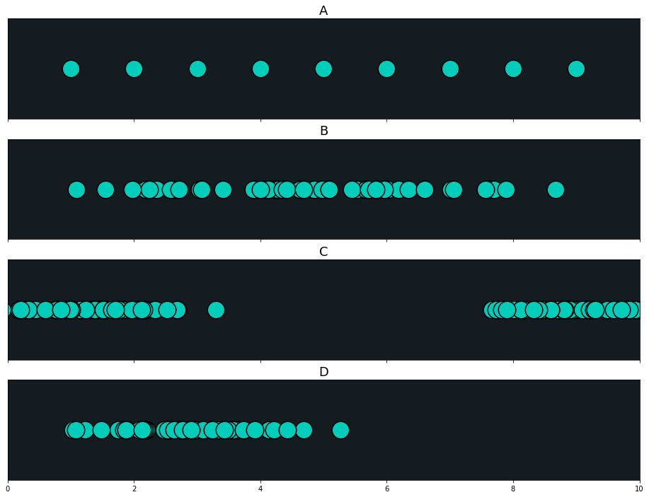
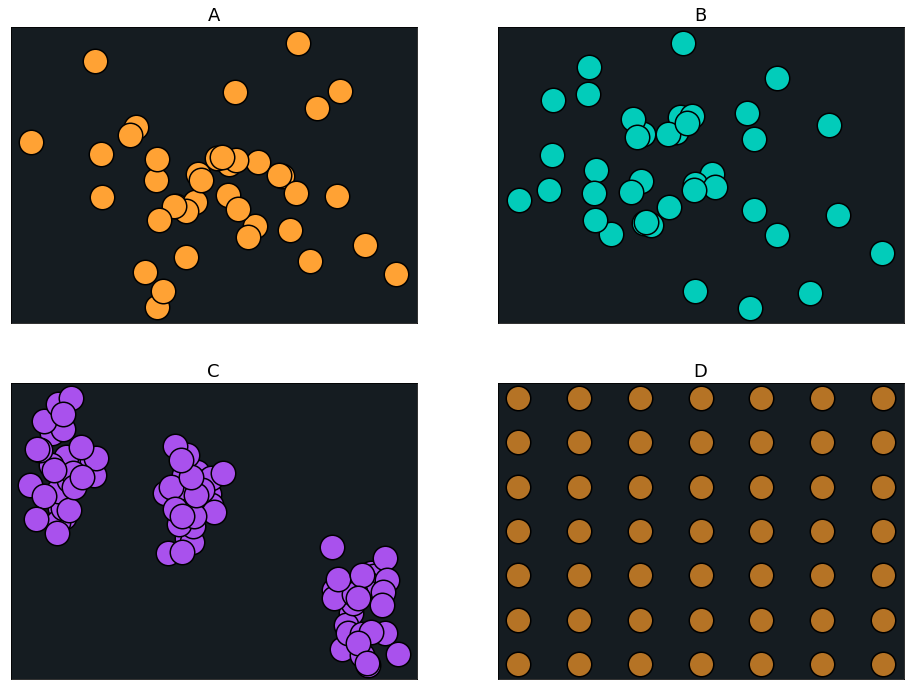
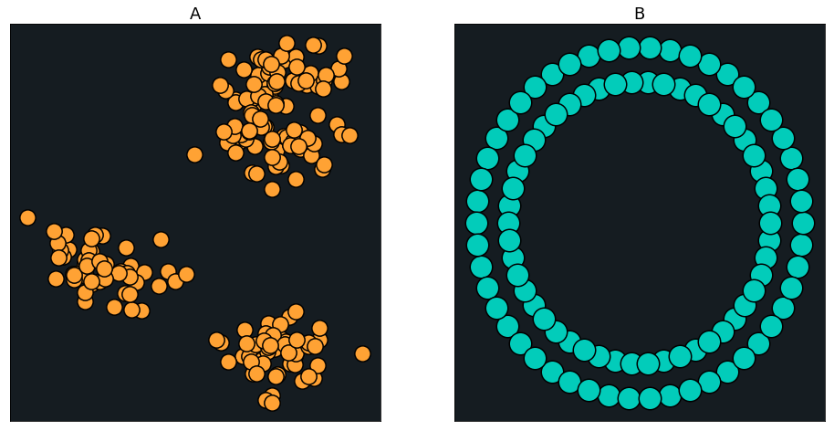
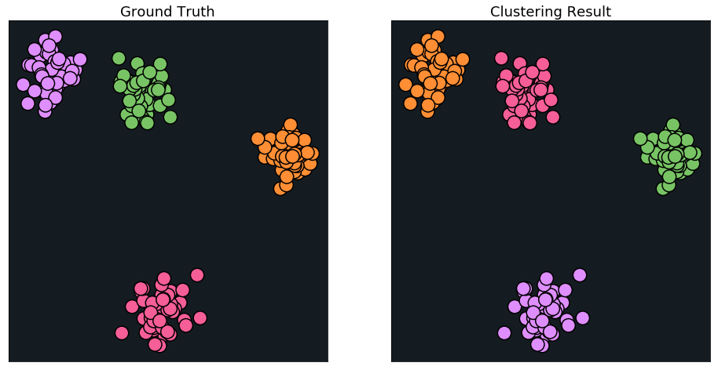

---

layout: post
title: 机器学习-非监督学习-高斯混合模型与聚类验证
description: 在这章，主要讲解了监督学习相关的技术。
Keywords: 机器学习、模型、评估指标
tagline: 
categories: [ML]
tags: [ML]

---

* 目录
 {:toc  }
# 

## 1、简介

<video controls="" preload="none" style="width:100%; height:100%; object-fit: fill"   src="../assets/media/uda-ml/fjd/gs/1-t.mp4"></video>
## 2、高斯混合模型 (GMM) 聚类

<video controls="" preload="none" style="width:100%; height:100%; object-fit: fill"   src="../assets/media/uda-ml/fjd/gs/2-t.mp4"></video>
## 3、一维高斯分布

<video controls="" preload="none" style="width:100%; height:100%; object-fit: fill"   src="../assets/media/uda-ml/fjd/gs/3-t.mp4"></video>
## 4、一维高斯混合模型 (GMM) 聚类

<video controls="" preload="none" style="width:100%; height:100%; object-fit: fill"   src="../assets/media/uda-ml/fjd/gs/4-t.mp4"></video>
## 5、二维高斯分布

<video controls="" preload="none" style="width:100%; height:100%; object-fit: fill"   src="../assets/media/uda-ml/fjd/gs/5-t.mp4"></video>
## 6、二维高斯混合模型

<video controls="" preload="none" style="width:100%; height:100%; object-fit: fill"   src="../assets/media/uda-ml/fjd/gs/6-t.mp4"></video>
## 7、练习：高斯混合

### 习题 1/3

上图中的哪些数据集是可以被视为大致遵循高斯分布的呢（而不是多个高斯混合）？

- A
- B
- C
- D

](https://classroom.udacity.com/nanodegrees/nd009-cn-advanced/parts/635eb098-3c27-4f56-b9ff-45e26ddd2d31/modules/11dfb4a3-14fe-47df-825a-ff66cc09bd42/lessons/75058ed7-ed1e-46b5-9aa2-3fe11da0d136/concepts/b1c31143-50b7-47a2-9154-0d4ffeb7b11c#)

### 习题 2/3

上图中哪些数据集可以被视为大致遵循二维高斯分布（而不是多个高斯混合）？

- A
- B
- C
- D

](https://classroom.udacity.com/nanodegrees/nd009-cn-advanced/parts/635eb098-3c27-4f56-b9ff-45e26ddd2d31/modules/11dfb4a3-14fe-47df-825a-ff66cc09bd42/lessons/75058ed7-ed1e-46b5-9aa2-3fe11da0d136/concepts/b1c31143-50b7-47a2-9154-0d4ffeb7b11c#)

### 习题 3/3

上图中的哪个数据集可以被视为多个高斯分布的混合？

- A
- B

## 8、期望最大化算法概述

<video controls="" preload="none" style="width:100%; height:100%; object-fit: fill"   src="../assets/media/uda-ml/fjd/gs/7-t.mp4"></video>
## 9、期望最大化 - 第一部分

<video controls="" preload="none" style="width:100%; height:100%; object-fit: fill"   src="../assets/media/uda-ml/fjd/gs/8-t.mp4"></video>
## 10、期望最大化 - 第二部分

<video controls="" preload="none" style="width:100%; height:100%; object-fit: fill"   src="../assets/media/uda-ml/fjd/gs/9-t.mp4"></video>
## 11、期望最大化示例

<video controls="" preload="none" style="width:100%; height:100%; object-fit: fill"   src="../assets/media/uda-ml/fjd/gs/10-t.mp4"></video>
## 12、期望最大化

判断题：我们在期望最大化算法的第一步中如何初始化高斯参数并不重要，它总是会收敛到最佳值。

错误

## 13、GMM 实现

<video controls="" preload="none" style="width:100%; height:100%; object-fit: fill"   src="../assets/media/uda-ml/fjd/gs/11-t.mp4"></video>
## 14、GMM 示例与应用

<video controls="" preload="none" style="width:100%; height:100%; object-fit: fill"   src="../assets/media/uda-ml/fjd/gs/12-t.mp4"></video>
Paper: [Nonparametric discovery of human routines from sensor data](http://citeseerx.ist.psu.edu/viewdoc/download?doi=10.1.1.681.3152&rep=rep1&type=pdf) [PDf]

Paper: [Application of the Gaussian mixture model in pulsar astronomy](https://arxiv.org/abs/1205.6221) [PDF]

Paper: [Speaker Verification Using Adapted Gaussian Mixture Models](http://citeseerx.ist.psu.edu/viewdoc/download?doi=10.1.1.117.338&rep=rep1&type=pdf) [PDF]

Paper: [Adaptive background mixture models for real-time tracking](http://www.ai.mit.edu/projects/vsam/Publications/stauffer_cvpr98_track.pdf) [PDF]

Video: https://www.youtube.com/watch?v=lLt9H6RFO6A

（以上部分内容在国内网络可能无法打开）

## 15、聚类分析过程

<video controls="" preload="none" style="width:100%; height:100%; object-fit: fill"   src="../assets/media/uda-ml/fjd/gs/13-t.mp4"></video>
## 16、聚类验证

<video controls="" preload="none" style="width:100%; height:100%; object-fit: fill"   src="../assets/media/uda-ml/fjd/gs/14-t.mp4"></video>
## 17、外部评价指标

<video controls="" preload="none" style="width:100%; height:100%; object-fit: fill"   src="../assets/media/uda-ml/fjd/gs/15-t.mp4"></video>
## 18、练习：调整兰德系数 (Adjusted Rand Index)

### 练习题

假设我们在左边有标记的数据集，并且聚类算法导致了在右边的聚类。 你预计调整兰德系数在这种情况下是多少？

- -1
- 0.5
- 1

## 19、内部评价指标

<video controls="" preload="none" style="width:100%; height:100%; object-fit: fill"   src="../assets/media/uda-ml/fjd/gs/16-t.mp4"></video>

[基于密度的聚类验证](https://s3.cn-north-1.amazonaws.com.cn/static-documents/nd101/MLND+documents/10.1.1.707.9034.pdf) (PDF)

## 20、轮廓系数

### 练习题

判断题：我们可以计算每个点、聚类以及整个数据集的轮廓系数。

- 正确
- 错误

下一项